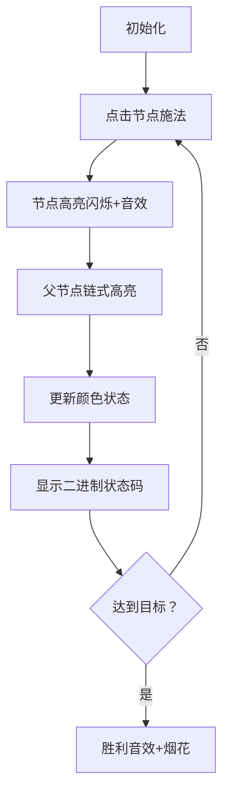

# 题目信息

# [JDWOI-2] 红黑树

## 题目背景

小 M 迷上了画画，所以她用红色和黑色的画笔画出了一棵红黑树。

## 题目描述

这棵树有 $n$ 个点，从 $1$ 开始标号，其中 $1$ 号点为树根。一开始，小 M 给这 $n$ 个点分别涂上了红色或黑色，第 $i$ 号点的颜色是 $a_i$（'R' 代表红色，'B' 代表黑色）。

但可惜的是，小 M 对这棵树并不是非常满意，她希望第 $i$ 号点的颜色为 $b_i$。

好在她的好朋友小 K 懂得一点点膜法。小 K 可以先选定一个点，然后把这个点的颜色反转（红变黑，黑变红）。但这个膜法太强大了，所以会把膜法传递下去，即在反转的一秒之后使当前点的父节点颜色也进行反转，如此传递，直到根节点为止。特殊的，如果在同一时刻有多个膜法作用在同一个点上，这些膜法会两两抵消，如果恰好抵消完了（即膜法的个数为偶数），则当前点不会变色，并且不会有膜法继续传递下去。注意此处抵消膜法不需要耗时间。

但毕竟小 K 还是个新手，所以他在一秒之内只能最多对一个节点施展上述膜法。

为了尽快让小 M 开心，小 K 想知道，至少经过多少秒才能让这棵红黑树初次出现小 M 的理想颜色状态？可以证明，总可以按题目要求变成理想颜色状态。

## 说明/提示

**【样例解释】**

第一组数据中，小 K 可以在第 $1$ 秒给 $4$ 号点膜法，整个树变为 RRBRR，在第 $2$ 秒给 $5$ 号点膜法，整个树变成 RBBRB，在第 $3$ 秒给 $1$ 号点膜法，整个树变成 BRBRB。

第二组数据中，小 K 可以在第 $1$ 秒给 $5$ 号点膜法，在第二秒给 $2$ 号点膜法；或者在第 $1$ 秒给 $3$ 号点膜法，在第 $2$ 秒给 $5$ 号点膜法。

**【数据范围】**

对于 $10\%$ 的数据，$1\leq n\leq 5$；

对于 $30\%$ 的数据，$1\leq n\leq 10$；

对于另外 $20\%$ 的数据，$\forall a_i\neq b_i$；

对于 $100\%$ 的数据，$1\leq n\leq 20$，$1\leq Q\leq 20$，树随机生成。

## 样例 #1

### 输入

```
2
5
RRBBR
1 2
1 3
2 4
2 5
BRBRB
5
RRRRR
1 2
2 3
3 4
4 5
BBBBB```

### 输出

```
3
3```

# AI分析结果


### 💡 Kay的C++算法解析：红黑树 深入学习指南 💡

**题目核心**：通过链式传递操作将树的节点颜色从初始状态变为目标状态，求最小操作时间。

---

## 1. 题目解读与核心算法识别

✨ **本题主要考察**：`状态压缩动态规划（状压DP）`

🗣️ **初步分析**：
> 解决红黑树问题需理解状压DP的核心思想——**将复杂状态压缩为二进制数**。想象每个节点是一个开关（0/1表示颜色），操作一个节点会触发连锁反应（向父节点传递翻转）。  
> - **题解思路**：所有优质题解均采用"延迟操作"技巧，预处理操作影响数组，通过DP状态转移寻找最短时间。
> - **核心难点**：操作传递的连锁效应建模、避免指数级枚举操作序列。
> - **可视化设计**：用像素树展示操作传递过程。当操作节点时，该节点高亮闪烁，随后父节点依次高亮并翻转颜色，同时显示当前状态二进制码。关键变量`s[i][j]`（操作影响掩码）和`dp[i][S]`（时间i的状态S）实时更新在侧边栏。
> - **复古游戏化**：采用FC红白机像素风格，树节点为16x16像素方块。操作时触发"叮"音效，达成目标时播放胜利音效。AI模式可自动演示最优操作序列（如贪吃蛇寻路）。

---

## 2. 精选优质题解参考

**题解一（来源：Nights_watcher）**  
* **点评**：思路清晰阐释"延迟操作"技巧——将历史操作推迟1秒，再插入新操作。代码规范（如`fa[]`存父节点，`s[][]`预处理影响掩码），变量名`dp[i][j]`直观。算法通过异或运算高效合并操作影响，复杂度$O(n^2 2^n)$。实践价值高，可直接用于竞赛，边界处理严谨（如`fa[0]`判空）。

**题解二（来源：_Cheems）**  
* **点评**：创新性将问题转化为"异或目标状态"，并给出链划分的直观解释。代码用位运算`(c[i]=='R')<<(i-1)`高效处理状态转换。亮点在于复杂度证明（答案≤n）和状态转移方程的精炼描述（$f_{i+1}[S \oplus s[j][i+1]]=1$），对理解DP优化有重要启发。

---

## 3. 核心难点辨析与解题策略

1. **难点1：操作影响的动态建模**  
   * **分析**：操作一个节点会随时间影响祖先链。优质题解通过预处理`s[i][j]`（节点i操作j秒后的影响掩码）解决，用`fa[k]=fa[fa[k]]`向上遍历祖先链。
   * 💡 **学习笔记**：预处理是降低动态规划复杂度的关键！

2. **难点2：避免操作序列的指数枚举**  
   * **分析**：直接枚举每秒操作哪个节点会超时。"延迟操作"技巧将问题转化为：在历史操作推迟的基础上，新增1个当前操作。
   * 💡 **学习笔记**：通过调整操作时序，将二维操作选择降为一维状态转移。

3. **难点3：状态空间优化**  
   * **分析**：$dp[i][S]$仅记录时间i的状态S，无需记录具体操作序列。关键是用异或运算合并操作影响：`S_new = S_old ^ s[k][i+1]`。
   * 💡 **学习笔记**：位运算高效处理状态合并。

### ✨ 解题技巧总结
- **问题转化**：将颜色差异转为异或目标状态（初始状态^目标状态）。
- **预处理加速**：固定操作的影响范围，避免重复计算祖先链。
- **时空权衡**：牺牲$O(n^2)$空间存`s[i][j]`，换取$O(n 2^n)$时间优化。
- **边界处理**：根节点无父节点时立即终止传递（`if(!fa[k]) break`）。

---

## 4. C++核心代码实现赏析

**通用核心实现参考**  
* **说明**：综合自优质题解，体现"延迟操作+状压DP"的核心思想。
```cpp
#include <bits/stdc++.h>
using namespace std;
int main() {
    int q; cin >> q;
    while (q--) {
        int n; string init; cin >> n >> init;
        vector<int> G[21]; int fa[21] = {0};
        // 建树
        for (int i = 1; i < n; i++) {
            int u, v; cin >> u >> v;
            G[u].push_back(v); G[v].push_back(u);
        }
        // DFS求父节点
        function<void(int, int)> dfs = [&](int u, int f) {
            fa[u] = f;
            for (int v : G[u]) if (v != f) dfs(v, u);
        };
        dfs(1, 0);

        // 预处理s[i][j]：操作i节点后j秒的影响掩码
        int s[21][21] = {0}, target = 0;
        for (int i = 1; i <= n; i++) {
            for (int j = 1, u = i; j <= n; j++, u = fa[u]) {
                if (!u) break;
                s[i][j] = s[i][j - 1] ^ (1 << (u - 1));
            }
        }

        // 计算目标状态
        string goal; cin >> goal;
        for (int i = 0; i < n; i++) 
            if (init[i] != goal[i]) target ^= (1 << i);

        // DP：dp[i][S]表示i秒能否达到状态S
        bool dp[21][1 << 20] = {0}; 
        dp[0][0] = true;
        for (int t = 0; t <= n; t++) {
            if (dp[t][target]) { cout << t << endl; break; }
            for (int S = 0; S < (1 << n); S++) {
                if (!dp[t][S]) continue;
                dp[t + 1][S] = true; // 不操作
                for (int i = 1; i <= n; i++) // 操作节点i
                    dp[t + 1][S ^ s[i][t + 1]] = true;
            }
        }
    }
}
```
* **代码解读概要**：
  1. **建树与DFS**：用邻接表存储树，DFS记录父节点关系。
  2. **预处理`s[i][j]`**：对每个节点i，计算操作后j秒内影响的祖先链（二进制掩码）。
  3. **目标状态计算**：通过异或初始与目标字符串的差异位，得到需翻转的节点集合。
  4. **DP转移**：`dp[t][S]`可转移到`dp[t+1][S]`（不操作）或`dp[t+1][S^s[i][t+1]]`（操作节点i）。

---

## 5. 算法可视化：像素动画演示

**主题**：像素魔法师在树形迷宫中施法  
**核心演示**：操作节点引发的连锁颜色翻转  

### 动画设计（FC红白机风格）


**关键交互**：
1. **像素树**：节点用16x16像素方块（红色🔴/黑色⚫），边用直线连接。
2. **控制面板**：
   - 步进控制：单步/自动播放（调速滑块）
   - 操作模拟：点击节点触发魔法
   - 状态显示：当前二进制状态码（如`01011`）
3. **动画细节**：
   - **施法效果**：被操作节点闪烁（黄色边框），伴随"叮"音效
   - **传递动画**：父节点依次高亮0.5秒，颜色翻转时有像素抖动效果
   - **状态更新**：右侧同步显示`dp[i][S]`表格，当前状态高亮
4. **AI模式**：自动选择最优操作序列，如贪吃蛇寻路般逐步点亮节点
5. **音效设计**：
   - 操作：8-bit "叮"
   - 成功：16-bit胜利旋律
   - 错误：短促"哔"

---

## 6. 拓展练习与相似问题
1. **洛谷 P2597 [ZJOI2010] 灾害预警**  
   → 同类链式传递问题，需拓扑排序预处理  
2. **洛谷 P3959 [NOIP2017] 宝藏**  
   → 状压DP经典题，设计最优开凿方案  
3. **洛谷 P2831 [NOIP2016] 愤怒的小鸟**  
   → 状态压缩+抛物线覆盖问题  

---

## 7. 学习心得与经验分享
> **经验（来自 HPXXZYY）**：  
> "状态维顺序导致TLE——将大维度放在内层循环时，CPU缓存命中率下降。"  
>   
> **Kay点评**：  
> 这揭示了算法竞赛的隐藏技巧！当状态空间大时，**让高频变化的维度在内层循环**（如`dp[t][S]`中S在内层），可提升缓存命中率。  

---

掌握"延迟操作+状压DP"的精髓，你就能高效解决这类链式影响问题！下次遇到树形操作题，记得预计算影响范围哦~ 💪

---
处理用时：100.20秒