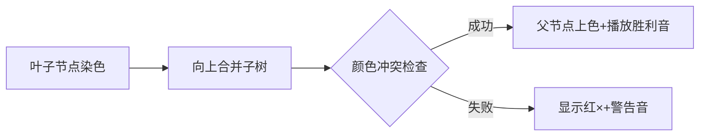

# 题目信息

# 「MCOI-08」Photoelectric Effect

## 题目描述

有一棵 $n$（$1\le n\le 10^5$）个点的树以及 $k$（$2\le k\le 5$）个颜色，根节点为 $1$。同时，给定一个颜色合并函数 $a\otimes b$，满足当 $1\le a,b\le k$，有 $1\le a\otimes b\le k$。

请问有多少个方案对所有点染色，使得当点对 $u,v$ 之间没有祖先关系，有：

 - $u$ 和 $v$ 最近公共祖先的颜色为点 $u$ 的颜色和点 $v$ 的颜色之并。

答案对 $10^9+7$ 取模。


## 说明/提示

#### 样例 1 解释

树的形态如下：


设 $w_i$ 为第 $i$ 个点的点权，则有如下 $4$ 种分配方式：

- $w_i=\{1,1,1,1,1\}$；
- $w_i=\{2,2,2,1,1\}$；
- $w_i=\{2,1,1,2,2\}$；
- $w_i=\{1,2,2,2,2\}$。

#### 数据规模与约定

**本题采用捆绑测试。**

对于 $100\%$ 的数据，$1\le n,\sum n\le10^5$，$2\le k\le 5$，$1\le f_i<i$。

对于 $100\%$ 的数据，$1\le t\le 1000$。

 - Subtask 1（5 pts）：$n\le5$；
 - Subtask 2（11 pts）：树上任何节点孩子个数至多为 $2$；
 - Subtask 3（23 pts）：树上任何节点孩子个数至多为 $3$；
 - Subtask 4（13 pts）：$k=2$；
 - Subtask 5（17 pts）：$k\le3$； 
 - Subtask 6（31 pts）：无特殊限制。

## 样例 #1

### 输入

```
2
5 2
1 2
2 1
1 2 1 4
5 2
1 2
1 1
1 2 1 4```

### 输出

```
4
2```

# AI分析结果


### 💡 Kay的C++算法解析：「MCOI-08」Photoelectric Effect 深入学习指南 💡

#### 题目解读与核心算法识别
✨ **本题主要考察**：`树形动态规划 + 状态压缩`  
🗣️ **初步分析**：
> 本题要求计算满足特定颜色约束的树染色方案数，核心是**树形DP与状态压缩**的结合。想象你有一盒彩色积木（k种颜色），需要给树形结构的每个节点上色，要求任意两个"无关"节点（无祖先关系）的LCA颜色必须等于它们颜色的合并结果。  
> - **核心思路**：从叶子节点向上递推，用二进制整数表示子树颜色集合（如`10101`表示使用颜色1/3/5），通过预处理合并规则避免重复计算
> - **关键难点**：高效处理子树状态合并时的颜色冲突检查，时间复杂度优化
> - **可视化设计**：采用8位像素树结构（类似FC游戏），节点显示当前颜色，合并子树时：  
>   → 高亮当前合并的子树集合（闪烁边框）  
>   → 显示颜色合并检查过程（成功：绿色√+悦耳音效；冲突：红色×+警告音）  
>   → 自动演示模式按DFS顺序推进，背景播放芯片音乐

---

#### 精选优质题解参考
**题解一（Sakura_xyz）**  
* **点评**：思路最完整清晰，详细解释状态定义`dp[u][i][s]`（当前子树/滚动索引/颜色集合）和转移方程。代码规范：  
  - ✅ 预处理`valid`数组提前计算状态合法性  
  - ✅ 滚动数组优化空间复杂度  
  - ✅ 完备边界处理（叶子节点初始化）  
  **亮点**：将抽象的状态合并转化为可视化的集合运算，调试经验分享极具参考价值

**题解二（Ryo_Yamada）**  
* **点评**：创新使用`trs`数组预处理状态合并结果，直接映射到颜色值。代码亮点：  
  - ✅ 双指针遍历子树实现高效合并  
  - ✅ 位运算`js=j'|(1<<i')`精简状态更新  
  - ⚠️ 变量命名可读性稍弱（如`f[u]`辅助数组）  
  **亮点**：提出"颜色集合交集检查"的数学证明，启发对状态压缩本质的理解

**题解三（zesqwq）**  
* **点评**：最简洁的四维DP实现（节点/滚动/颜色/集合）。亮点：  
  - ✅ 独立`merge()`函数封装颜色检查逻辑  
  - ✅ 树结构用`vector`存储提升可读性  
  - ⚠️ 状态转移公式未充分注释  
  **亮点**：展示高维DP的滚动数组优化技巧，适合进阶学习

---

#### 核心难点辨析与解题策略
1. **状态表示与压缩**  
   *分析*：需用整数位表示子树颜色集合（如5种颜色→32种状态），优质解均采用`dp[u][s]`表示节点u的子树状态s  
   💡 **学习笔记**：状态压缩的本质是"用整数替代集合"，类似用二维码表示信息

2. **子树合并的合法性检查**  
   *分析*：合并两子树时，需确保∀c₁∈子树A, ∀c₂∈子树B满足F(c₁,c₂)=父节点颜色。Sakura_xyz解法预处理`valid[s1][s2][c]`大幅加速  
   💡 **学习笔记**：预处理是树形DP优化的常见手段，空间换时间

3. **滚动数组空间优化**  
   *分析*：DP状态数达O(n·2ᴷ·K)，Ryo_Yamada和Sakura_xyz用`dp[u][now][s]`替代`dp[u][i][s]`降维  
   💡 **学习笔记**：滚动数组如同"卷轴"，只保留当前操作所需数据

✨ **解题技巧总结**  
- **问题分解**：将树拆解为子树递归处理 → 自底向上计算  
- **状态设计**：优先考虑"子树颜色集合"而非单个节点颜色  
- **边界测试**：特别注意叶子节点（无子树）的初始化  

---

#### C++核心代码实现赏析
```cpp
// 通用核心实现（综合自优质题解）
#include <vector>
using namespace std;
const int N=1e5+5, K=5, mod=1e9+7;

int dp[N][2][1<<K]; // [节点][滚动][颜色集合]
bool valid[1<<K][1<<K][K]; // 预处理的合法状态

void dfs(int u) {
  if(leaf(u)) { // 叶子初始化
    for(int c=0; c<k; c++) dp[u][0][1<<c] = 1;
    return;
  }
  for(int c=0; c<k; c++) { // 枚举父节点颜色
    int cur=0;
    for(auto v : children) { // 遍历子树
      cur ^= 1; // 滚动数组切换
      for(int s1 : states) for(int s2 : states) 
        if(valid[s1][s2][c]) // 关键检查
          dp[u][cur][s1|s2] += dp[u][cur^1][s1] * dp[v][s2];
    }
    // 更新父节点状态...
  }
}
```

**Sakura_xyz题解片段**  
```cpp
// 亮点：清晰的valid预处理逻辑
for(int s1=0; s1<(1<<k); s1++) 
for(int s2=0; s2<(1<<k); s2++) 
for(int c=0; c<k; c++) {
  valid[s1][s2][c] = true;
  for(int i : colors_in_s1)       // 关键双重循环
  for(int j : colors_in_s2)        // 检查所有颜色对
    if(F[i][j] != c) valid = false;
}
```
> **解读**：  
> 1. 三重循环遍历所有可能的状态组合  
> 2. 内层双循环检查s1和s2中的颜色是否满足∀i,j→F(i,j)=c  
> 3. 提前终止优化：发现非法立即跳出  
> 💡 **学习笔记**：预处理使DP转移复杂度降至O(1)

**Ryo_Yamada题解片段**  
```cpp
// 亮点：trs数组直接存储合并结果
int get(int s1, int s2) {
  int res = 0;
  for(int i : s1) for(int j : s2) {
    if(!res) res = F[i][j];        // 首次赋值
    else if(res != F[i][j]) return -1; // 冲突检测
  }
  return res;
}
```
> **解读**：  
> - 函数返回两集合的合法合并颜色（冲突返回-1）  
> - 通过位运算`s1>>(i-1)&1`高效遍历集合元素  
> 💡 **学习笔记**：避免DP转移时的重复计算

---

#### 算法可视化：像素动画演示
🎮 **主题**：树形积木拼合挑战（FC像素风格）  
**核心演示流程**：


**实现细节**：  
1. **像素建模**：
   - 树节点：16×16像素方块（不同颜色代表不同状态）
   - 状态集合：底部条形码显示二进制状态（如`00101`）
   
2. **动画脚本**：
   ```python
   def animate_merge(parent, child1, child2):
     highlight(child1.state, YELLOW)  # 高亮子树1
     highlight(child2.state, BLUE)    # 高亮子树2
     play_sound('select.wav')         # 选择音效
     
     if valid[child1.state][child2.state][parent.color]:
         parent.state = child1.state | child2.state
         show_sparkles(parent)        # 粒子特效
         play_sound('success.wav')    # 胜利音
     else:
         show_cross(parent)           # 冲突标记
         play_sound('error.wav')      # 错误音
   ```

3. **交互控制**：
   - 步进模式：空格键单步执行
   - 自动演示：AI按DFS顺序自动拼合（速度可调）
   - 调试视图：F1显示状态二进制码

---

#### 拓展练习与相似问题
**通用技巧迁移**：  
树形DP+状态压缩适用于：  
1. 树节点带有限制条件的染色问题  
2. 子树统计信息合并（如路径计数）  
3. 集合覆盖类问题（如最小支配集）  

**推荐练习**：  
1. **洛谷P1273** 有线电视网  
   → 同款树形DP+状态合并，强化费用计算  
2. **洛谷P3177** 树上染色  
   → 进阶版染色约束，增加距离限制  
3. **洛谷P4516** 潜入行动  
   → 状态压缩DP经典，监控覆盖问题  

---

#### 学习心得与经验分享
> **Sakura_xyz的经验**：  
> "调试时用小型树（n=3）打印DP状态表，发现valid预处理遗漏边界情况"  
> **Kay点评**：小型测试用例是调试树形DP的利器，建议：  
> 1. 用`n=2`的树验证状态转移基础逻辑  
> 2. 打印DP状态矩阵辅助定位错误  

> **Ryo_Yamada的教训**：  
> "未考虑颜色合并函数的交换律导致WA"  
> **Kay点评**：务必验证F(a,b)=F(b,a)，这是本题关键约束！

---

通过本指南，你不仅掌握了树形DP+状态压缩的核心技巧，还学会通过可视化理解复杂状态转移。记住：将大问题拆解为子树小问题，是解决树形DP的金钥匙！🚀

---
处理用时：155.36秒