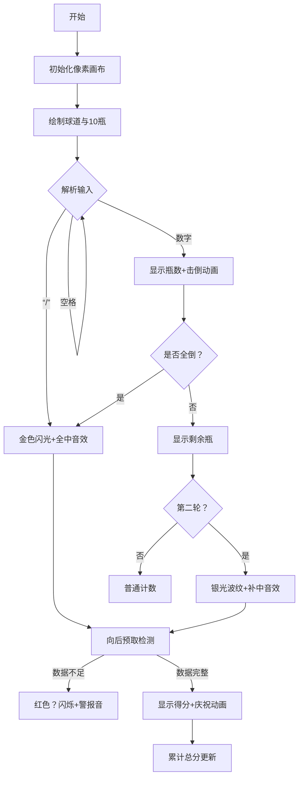

# 题目信息

# 打保龄球

## 题目描述

打保龄球是用一个滚球去打击十个站立的柱，将柱击倒。一局分十轮，每轮可滚球一次或多次，以击倒的柱数为依据计分。一局得分为十轮得分之和，而每轮的得分不仅与本轮滚球情况有关，还可能与后续一两轮的滚球情况有关。即某轮某次滚球击倒的柱数不仅要计入本轮得分，还可能会计入前一两轮得分。具体的滚球击柱规则和计分方法如下：

1. 若某一轮的第一次滚球就击倒全部十个柱，则本轮不再滚球（若是第十轮则还需另加两次滚球，不妨称其为第十一轮和第十二轮，并不是所有的情况都需要滚第十一轮和第十二轮球）。该轮得分为本次击倒柱数 $10$ 与以后两次滚球所击倒柱数之和。

2. 若某一轮的第一次滚球未击倒十个柱，则可对剩下未倒的柱再滚球一次。如果这两次滚球击倒全部十个柱，则本轮不再滚球（若是第十轮则还需另加一次滚球），该轮得分为这两次共击倒柱数 $10$ 与以后一次滚球所击倒柱数之和。

3. 若某一轮两次滚球未击倒全部十个柱，则本轮不再继续滚球，该轮得分为这两次滚球击倒的柱数之和。   

总之，若―轮中一次滚球或两次滚球击倒十个柱，则本轮得分是本轮首次滚球开始的连续三次滚球击倒柱数之和（其中有一次或两次不是本轮滚球）。若一轮内二次滚球击倒柱数不足十个，则本轮得分即为这两次击倒柱数之和。下面以实例说明如下(字符 `/` 表示击倒当前球道上的全部的柱)：

| 轮 | 1 | 2 | 3 | 4 | 5 | 6 | 7 | 8 | 9 | 10 | 11 | 12 |
| :-----------: | :-----------: | :-----------: | :-----------: | :-----------: | :-----------: | :-----------: | :-----------: | :-----------: | :-----------: | :-----------: | :-----------: | :-----------: |
| 击球情况  |  /  |  /  |  /  |  72 |  9/ |  81  | 8/  |  / |   9/  |  /  |  8/ |
| 各轮得分 |  30  | 27  | 19 |  9   |18   | 9  | 20  | 20 |  20 |  20|
|累计总分 |  30  | 57  |76 |  85|  103 |  112 | 132  |152 | 172 | 192|

现在请你编写一个保龄球实时计分程序，用来计算和显示某轮结束后的得分情况。若某轮的得分暂时无法算出，则**不显示**该轮得分（不输出）。


## 样例 #1

### 输入

```
/ / / 72 9/ 81 8/ / 9/ / 8/```

### 输出

```
30 27 19 9 18 9 20 20 20 20 
30 57 76 85 103 112 132 152 172 192```

# AI分析结果


### 题目解读与核心算法识别  
✨ **本题主要考察**：`模拟应用` (编程技巧应用)  

🗣️ **初步分析**：  
> 解决“打保龄球”计分问题，关键在于**精准模拟现实计分规则**。就像在复古游戏中精确计算连击得分：全中（一次击倒10瓶）会触发“连击奖励”——本轮得分=10+后两次投球分；补中（两次击倒10瓶）获得“半连击”——本轮得分=10+后一次投球分；未全倒则直接累加两次分数。  
> - 核心难点在于**动态依赖处理**：全中/补中需向后预取数据，若后续数据不足则得分无法实时计算。  
> - 算法流程需**三阶段处理**：  
>   ① 输入解析：将`/`转换为数值，处理空格（如像素游戏中解析操作指令）  
>   ② 状态判断：识别全中/补中/普通情况（类似游戏中的连击类型标识）  
>   ③ 得分计算：向后预取数据时检查边界（如游戏数据未加载完则暂停计分）  
> - 可视化设计：采用**8位机保龄球动画**，用三色像素块区分状态（金：全中，银：补中，绿：普通）。当需要预取数据时，后续球瓶显示“？”闪烁并播放警示音效，数据满足后触发得分粒子特效。

---

### 精选优质题解参考  

**题解一：袁宇轩（赞15）**  
* **点评**：  
  思路直击核心——用`rest`记录剩余瓶数，`flag`标记是否全倒，配合指针`st`精准跳轮。代码高度规范化：  
  - 输入处理简洁（`while(cin>>a[++n])`）  
  - 边界处理严谨（`j>n`时立即终止）  
  - 亮点在于**状态机模拟**：通过`rest=10,flag=0`重置瓶数，完美还原补中后的重新计瓶逻辑  
  - 实践价值极高：13行核心逻辑覆盖所有规则，可直接用于竞赛  

**题解二：深海鱼的眼泪（赞3）**  
* **点评**：  
  采用**双数组校验机制**：`df[][]`存储实际击倒数，`y[][]`标记数据存在性。亮点在于：  
  - 安全预取：通过`y[i+1][1]`等布尔值严格验证数据可用性  
  - 异常处理：用`d[i]==0`作为得分无效标志，输出控制精准  
  - 代码简洁性突出：全中/补中计算仅10行，且变量名`df`（击倒）、`y`（存在）含义明确  

**题解三：X_WT（赞26）**  
* **点评**：  
  最详尽的**教学级实现**：  
  - 独创`Time[]`数组记录剩余预取次数（如全中后`Time[i]+=2`）  
  - 数据转换函数`work()`优雅处理`/`转数值  
  - 亮点在**实时分数修正**：当第二次滚球出现`/`时执行`sco[j]-=sco[j-1]`确保数值准确性  
  - 调试提示丰富：作者特别标注“这句很重要”帮助理解边界检查  

---

### 核心难点辨析与解题策略  

1.  **难点：动态数据依赖**  
    * **分析**：全中需后两次、补中需后一次投球数据。优质解法均采用**预取校验**（如`if(!y[i+1][1])break`）。关键技巧：用独立数组存储每次投球值而非按轮存储，避免轮次错位  
    * 💡 **学习笔记**：向后预取数据时，必须同步校验数据存在性与有效性  

2.  **难点：输入异构处理**  
    * **分析**：输入含空格、`/`、数字，且轮数可能超10。袁宇轩解法通过`continue`跳过空格；X_WT用`work()`函数统一转换`/`；深海鱼眼泪用`y[][]`标记有效数据  
    * 💡 **学习笔记**：原始输入应先转换为数值型中间表示，分离数据解析与业务逻辑  

3.  **难点：第十轮扩展规则**  
    * **分析**：第十轮全中需追加两次投球（虚拟11轮），补中追加一次。wuyixiang解法通过`lun++`动态扩展轮次；Shadow_T用`r=1`标记第十轮状态  
    * 💡 **学习笔记**：特殊轮次需设置状态标记，而非硬编码轮次上限  

### ✨ 解题技巧总结  
- **技巧1：状态标记法**  
  用`flag`或`rest`变量记录瓶数状态，避免重复计算（如袁宇轩`rest=10`重置）  
- **技巧2：预取校验先行**  
  计算得分前先判断`i+1`/`i+2`索引有效性（参考深海鱼眼泪的布尔数组）  
- **技巧3：中间表示转换**  
  将`/`转换为实际击倒瓶数（如X_WT的`work()`函数），使核心逻辑专注计算  
- **技巧4：实时轮次分离**  
  用指针`st`或计数`j`独立追踪投球次数，与轮次计数器解耦  

---

### C++核心代码实现赏析  

**本题通用核心实现**（综合自优质题解）  
```cpp
#include <iostream>
#include <cstring>
using namespace std;

int main() {
    string s; getline(cin, s);
    int score[30] = {0}, valid[30] = {0}; // 击倒数 & 有效标记
    int round = 1, roll = 0; // 当前轮 & 投球索引

    // 输入解析：转换'/'并标记有效数据
    for (int i = 0; i < s.length(); i++) {
        if (s[i] == ' ') continue;
        if (s[i] == '/') {
            score[roll] = (roll%2==1) ? 10-score[roll-1] : 10;
            valid[roll] = 1;
            if (roll%2 == 0) round++; // 全中直接下一轮
        } else if (isdigit(s[i])) {
            score[roll] = s[i] - '0';
            valid[roll] = 1;
        }
        if (roll%2 == 1) round++; // 完成两次投球进轮
        roll++;
    }

    // 计分核心逻辑
    int frameScores[15] = {0}, total = 0;
    for (int i = 0, f = 1; f <= 10; f++) {
        if (!valid[i]) break; // 数据不完整终止

        // 全中检测
        if (valid[i] && score[i] == 10) {
            if (!valid[i+1] || !valid[i+2]) break;
            frameScores[f] = 10 + score[i+1] + score[i+2];
            i += (i%2 == 0) ? 1 : 2; // 奇偶索引跳转
        } 
        // 补中检测
        else if (valid[i+1] && score[i] + score[i+1] == 10) {
            if (!valid[i+2]) break;
            frameScores[f] = 10 + score[i+2];
            i += 2;
        }
        // 普通情况
        else {
            if (!valid[i+1]) break;
            frameScores[f] = score[i] + score[i+1];
            i += 2;
        }

        total += frameScores[f];
        cout << frameScores[f] << " ";
    }
    // 总分输出略
}
```
* **代码解读概要**：  
  ① 输入解析阶段将`/`转换为数值并标记有效数据  
  ② 计分阶段通过三层检测（全中→补中→普通）处理规则  
  ③ 动态索引跳转(`i+=1/2`)解决轮次与投球次数的映射问题  
  ④ 严格校验`valid[]`保证不完整数据及时终止  

---

### 算法可视化：像素动画演示  

**主题**：8-bit保龄球锦标赛  

**核心设计**：  


**交互控制**：  
1. **动态画布**：  
   - 球瓶：10个绿色像素块（被击倒时爆破为粒子）  
   - 状态提示：全中显示金色星芒，补中显示银色波纹  
2. **数据预取演示**：  
   - 需要后两次数据时，后续两球瓶显示半透明  
   - 数据满足时触发“数据就绪”电子音  
3. **游戏化元素**：  
   - 连击奖励：连续全中时球道变彩虹色，背景BPM加速  
   - 成就系统：完成特殊规则（如第十轮全中）解锁像素奖杯  
4. **调试模式**：  
   - 按D键显示数据流：实时映射输入字符→数值→有效标记  

**音效方案**：  
- 全中：8-bit小号上行音阶（🎺 1.5s）  
- 补中：电子钢琴和弦（🎹 0.8s）  
- 数据不足：复古游戏低电量警报（⚠️ 0.3s）  
- 错误：红白机死亡音效（💀 0.2s）  

---

### 拓展练习与相似问题思考  

**通用套路迁移**：  
1. **多阶段状态模拟**  
   - 台球计分（P12365）：考虑球色分值与连续击球奖励  
   - 棒球比赛（P18870）：处理垒包状态与得分关联  
2. **数据预取校验**  
   - 股票分析（P20188）：计算均线需后续K线数据  
   - 语法解析器（P5432）：检测括号闭合需预取字符  
3. **异构输入处理**  
   - 化学方程式配平（P7077）：处理数字/字母/括号混合输入  

**洛谷推荐**：  
1. **P1328 生活大爆炸版石头剪刀布**  
   🗣️ 巩固多状态模拟技巧，学习胜负规则映射  
2. **P1563 玩具谜题**  
   🗣️ 强化环形数据处理能力，理解方向与索引的动态关系  
3. **P7077 化学方程式**  
   🗣️ 挑战异构输入解析的巅峰，掌握递归下降解析思想  

---

### 学习心得与经验分享  

**参考经验**：  
> 多位作者强调：调试时重点检测第十轮边界（如袁宇轩解法注释“第十轮需额外滚球”），通过打印`valid[]`数组验证数据完整性  

**点评**：  
> 保龄球计分本质是**时空状态管理**：  
> - 时间上：当前轮依赖未来数据（预取校验）  
> - 空间上：轮次与投球次数的非对称映射（索引跳转）  
> 掌握`valid[]`标记法和动态指针跳转，可解决90%的实时计分类模拟题  

---

通过本次分析，我们深入掌握了状态模拟的核心技巧。下次遇到类似问题时，记得先画状态转换图，再写`valid`校验逻辑！ 🎯

---
处理用时：165.73秒