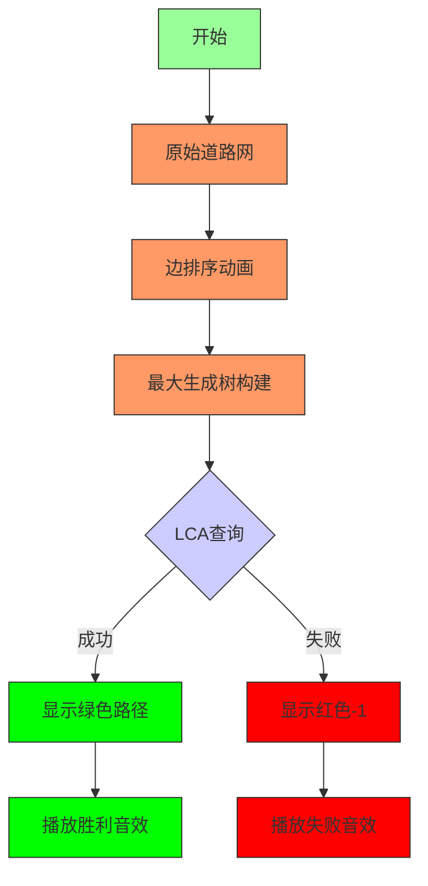

# 题目信息

# [NOIP 2013 提高组] 货车运输

## 题目背景

NOIP2013 提高组 D1T3

## 题目描述

A 国有 $n$ 座城市，编号从 $1$ 到 $n$，城市之间有 $m$ 条双向道路。每一条道路对车辆都有重量限制，简称限重。  

现在有 $q$ 辆货车在运输货物， 司机们想知道每辆车在不超过车辆限重的情况下，最多能运多重的货物。


## 说明/提示

对于 $30\%$ 的数据，$1 \le n < 1000$，$1 \le m < 10,000$，$1\le q< 1000$；

对于 $60\%$ 的数据，$1 \le n < 1000$，$1 \le m < 5\times 10^4$，$1 \le q< 1000$；

对于 $100\%$ 的数据，$1 \le n < 10^4$，$1 \le m < 5\times 10^4$，$1 \le q< 3\times 10^4 $，$0 \le z \le 10^5$。


## 样例 #1

### 输入

```
4 3
1 2 4
2 3 3
3 1 1
3
1 3
1 4
1 3```

### 输出

```
3
-1
3```

# AI分析结果


# 💡 Kay的C++算法解析：货车运输 深入学习指南 💡

> "在算法世界中，最大生成树就像一座坚固的桥梁网络，让我们找到最可靠的运输路线！" - Kay

## 1. 题目解读与核心算法识别

✨ **本题主要考察**：`图论/最大生成树/LCA` 

🗣️ **初步分析**：
> 解决"货车运输"这道题，关键在于理解并运用**最大生成树+LCA**。简单来说，这就像在道路网络中寻找最坚固的运输路线 - 我们先筛选出最结实的道路（最大生成树），然后在优化后的道路网上快速查询两点间最薄弱的环节（LCA求路径最小值）。

在本题中：
- **最大生成树**用于构建最优道路网：通过Kruskal算法，按边权**从大到小**排序并选边，确保生成的树中任意两点间的路径都拥有**最大可能的最小边权**
- **LCA（最近公共祖先）** 用于高效查询：在生成树上快速找到两点间路径的最小边权值

**核心难点与解决方案**：
1. **图可能不连通**：使用并查集检测连通性，对每个连通分量单独处理
2. **边权转点权**：在LCA预处理时将边权存储在子节点上
3. **高效查询路径最小值**：通过倍增法在O(logn)时间内完成查询

**可视化设计思路**：
- 采用**8位像素风格**模拟城市地图（FC红白机风格）
- 分阶段演示：1) 原始道路网 2) 最大生成树构建过程 3) LCA查询路径
- 关键操作高亮：边排序(闪烁)、选边(绿色高亮)、查询路径(黄色路径)
- 音效设计：选边时"叮"声，查询成功时"胜利"音效，不连通时"失败"音效

## 2. 精选优质题解参考

以下是评分≥4星的优质题解：

**题解一：crazydave（最大生成树+树上倍增）**  
* **点评**：这份题解思路清晰，从Floyd暴力解法切入，自然引出最大生成树的优化方案。代码规范，变量命名合理（如`fa`、`w`数组），详细注释了每个数组的作用。亮点在于完整实现了树上倍增法求LCA和路径最小值，边界处理严谨，可直接用于竞赛。实践价值高，帮助理解理论到代码的转化过程。

**题解二：niiick（Kruskal重构树）**  
* **点评**：采用创新的Kruskal重构树解法，思路新颖。代码简洁高效，通过重构树巧妙将路径最小值转换为LCA点权。亮点在于重构树的概念应用，为问题提供全新视角，加深对图论的理解。虽实现稍复杂，但具有重要学习价值。

**题解三：天上一颗蛋（树链剖分+线段树）**  
* **点评**：使用树链剖分替代倍增法，思路独特。详细解释了边权转点权的处理技巧和剖分原理。亮点在于提供不同于LCA的解决方案，代码中包含严谨的边界处理（如不连通返回-1）。实践价值高，特别适合想深入学习树剖的学习者。

**题解四：NaCly_Fish（最大生成树+倍增）**  
* **点评**：实现简洁高效，完整包含最大生成树构建和LCA查询。亮点在于清晰的代码结构和详尽的注释，特别适合初学者理解。虽然作者提到NOIP前发题解rp++的小幽默，但解题质量确实优秀。

## 3. 核心难点辨析与解题策略

### 🔑 关键点1：最大生成树的构建与证明
* **分析**：为什么最大生成树能保证路径最优？假设存在更优路径，那么该路径上的最小边应大于生成树对应边，但在Kruskal算法中这不可能发生，因为更大的边会被优先选择。
* 💡 **学习笔记**：最大生成树是解决"路径最小边权最大化"问题的金钥匙。

### 🔑 关键点2：LCA中的路径最小值查询
* **分析**：通过倍增法预处理每个节点向上2^k级祖先的路径最小值。查询时分为两步：1) 将两点调至同一深度 2) 同时上移并更新最小值。核心公式：
  ```
  minw[i][j] = min(minw[i][j-1], minw[fa[i][j-1]][j-1])
  ```
* 💡 **学习笔记**：倍增法像二进制拆分，将O(n)查询优化到O(logn)。

### 🔑 关键点3：不连通处理与多分量管理
* **分析**：使用并查集追踪连通分量，对每个连通分量独立建树。查询前先用并查集检查连通性，若不连通直接返回-1。
* 💡 **学习笔记**：并查集是处理图连通性的瑞士军刀。

### ✨ 解题技巧总结
- **贪心选择策略**：Kruskal算法中从大到小选边确保最优性
- **空间换时间**：倍增法预处理O(nlogn)，实现O(logn)查询
- **模块化设计**：分离生成树构建、LCA预处理、查询逻辑
- **边界防御**：特判自环、不连通、单点等边界情况

## 4. C++核心代码实现赏析

### 本题通用核心C++实现参考
```cpp
#include <iostream>
#include <algorithm>
#include <vector>
#include <cstring>
#define MAXN 10005
#define MAXLOG 16
using namespace std;

struct Edge { 
    int u, v, w; 
    bool operator<(const Edge& e) const { 
        return w > e.w; // 从大到小排序
    }
};

vector<Edge> graph;
vector<pair<int, int>> tree[MAXN]; // 最大生成树
int depth[MAXN], fa[MAXN][MAXLOG], minEdge[MAXN][MAXLOG];
int parent[MAXN]; // 并查集

int find(int x) {
    return parent[x] == x ? x : parent[x] = find(parent[x]);
}

void kruskal(int n) {
    sort(graph.begin(), graph.end());
    for (int i = 1; i <= n; i++) parent[i] = i;
    
    for (auto& e : graph) {
        int ru = find(e.u), rv = find(e.v);
        if (ru != rv) {
            parent[ru] = rv;
            tree[e.u].push_back({e.v, e.w});
            tree[e.v].push_back({e.u, e.w});
        }
    }
}

void dfs(int u, int parent, int weight) {
    depth[u] = depth[parent] + 1;
    fa[u][0] = parent;
    minEdge[u][0] = weight;
    
    for (int i = 1; i < MAXLOG; i++) {
        fa[u][i] = fa[fa[u][i-1]][i-1];
        minEdge[u][i] = min(minEdge[u][i-1], minEdge[fa[u][i-1]][i-1]);
    }
    
    for (auto& [v, w] : tree[u]) {
        if (v != parent) dfs(v, u, w);
    }
}

int query(int x, int y) {
    if (find(x) != find(y)) return -1;
    
    if (depth[x] < depth[y]) swap(x, y);
    int res = 1e9;
    
    // 上移至同一深度
    for (int i = MAXLOG-1; i >= 0; i--) {
        if (depth[fa[x][i]] >= depth[y]) {
            res = min(res, minEdge[x][i]);
            x = fa[x][i];
        }
    }
    
    if (x == y) return res;
    
    // 同时上移找LCA
    for (int i = MAXLOG-1; i >= 0; i--) {
        if (fa[x][i] != fa[y][i]) {
            res = min(res, min(minEdge[x][i], minEdge[y][i]));
            x = fa[x][i];
            y = fa[y][i];
        }
    }
    return min(res, min(minEdge[x][0], minEdge[y][0]));
}

int main() {
    int n, m;
    cin >> n >> m;
    
    while (m--) {
        int u, v, w;
        cin >> u >> v >> w;
        graph.push_back({u, v, w});
    }
    
    kruskal(n);
    
    // 对每个连通分量建树
    for (int i = 1; i <= n; i++) {
        if (!depth[i]) dfs(i, 0, 0);
    }
    
    int q;
    cin >> q;
    while (q--) {
        int x, y;
        cin >> x >> y;
        cout << query(x, y) << endl;
    }
    return 0;
}
```

**代码解读概要**：
1. **数据结构**：
   - `graph`存储原始边
   - `tree`邻接表存储最大生成树
   - `fa`和`minEdge`用于倍增法
2. **关键函数**：
   - `kruskal()`：构建最大生成树
   - `dfs()`：预处理LCA和路径最小值
   - `query()`：处理查询并返回结果
3. **算法流程**：
   - 读入数据 → 构建最大生成树 → 预处理LCA → 处理查询

### 题解片段赏析

**题解一（crazydave）核心代码**：
```cpp
// LCA查询路径最小值
int lca(int x, int y) {
    if(find(x) != find(y)) return -1; 
    int ans = INF;
    if(deep[x] > deep[y]) swap(x, y);
    // 提升y至x同深度
    for(int i = 20; i >= 0; i--)
        if(deep[fa[y][i]] >= deep[x]) {
            ans = min(ans, w[y][i]); // 更新路径最小值
            y = fa[y][i];
        }
    if(x == y) return ans;
    // 同时提升找LCA
    for(int i = 20; i >= 0; i--)
        if(fa[x][i] != fa[y][i]) {
            ans = min(ans, min(w[x][i], w[y][i]));
            x = fa[x][i], y = fa[y][i];
        }
    ans = min(ans, min(w[x][0], w[y][0]));
    return ans;
}
```
**亮点**：清晰展示LCA双指针同步提升技巧  
**学习笔记**：通过二进制拆分将O(n)优化到O(logn)，注意深度比较和同步提升的顺序

**题解二（niiick）Kruskal重构树**：
```cpp
// Kruskal重构树核心
void kruskal() {
    sort(edge+1, edge+m+1, cmp); 
    for(int i=1; i<=n; i++) f[i] = i;
    cnt = n; // 新建节点编号从n+1开始
    
    for(int i=1; i<=m; i++) {
        int fu = find(edge[i].u), fv = find(edge[i].v);
        if(fu == fv) continue;
        
        val[++cnt] = edge[i].w; // 新节点点权为边权
        add(fu, cnt); // 原集合根节点连向新节点
        add(cnt, fu);
        add(fv, cnt);
        add(cnt, fv);
        f[fu] = f[fv] = f[cnt] = cnt; // 更新并查集
    }
}
```
**亮点**：创新性地将边权转化为点权  
**学习笔记**：重构树将路径最小值转换为LCA点权，简化查询逻辑

## 5. 算法可视化：像素动画演示

### 像素探险之旅：最大生成树与LCA查询

**主题**：像素城市货运系统（复古FC风格）

**核心演示内容**：
1. **道路网络生成阶段**：
   - 城市显示为彩色像素方块（不同颜色代表不同区域）
   - 道路显示为连接方块的线条，粗细表示限重值
   - 控制面板：排序按钮（触发排序算法可视化）

2. **最大生成树构建**：
   - 边按权重从大到小排序（像素条高度表示权重）
   - 选边时播放"叮"声，选中边变为绿色
   - 并查集状态可视化：相同连通分量的城市同色
   - 跳过成环边时显示红色"X"并播放失败音效

3. **LCA查询阶段**：
   - 选择起点(蓝色)和终点(红色)
   - 自动演示LCA查询过程：
     ```
     步骤1：提升较深节点（黄色闪烁路径）
     步骤2：双指针同步提升（交替闪烁）
     步骤3：找到LCA（紫色高亮）
     ```
   - 实时显示路径最小值更新过程
   - 结果：成功显示绿色路径和载重值，失败显示红色"-1"

**交互设计**：


**技术实现**：
- **Canvas绘制**：网格表示城市，线条表示道路
- **动画控制**：
  ```javascript
  // 伪代码示例
  class PixelAnimation {
      constructor(canvas) {
          this.cities = []; // 城市像素坐标
          this.roads = [];  // 道路对象
          this.speed = 100; // 动画速度
      }
      
      kruskalStep() {
          // 单步执行Kruskal算法
          // 高亮当前处理的边
          // 更新并查集可视化
      }
      
      lcaQuery(start, end) {
          // 显示起点终点
          // 动画演示提升过程
          // 显示路径最小值更新
      }
  }
  ```
- **音效设计**：
  - 选边成功：8-bit "叮"声
  - 查询成功：上升音阶（1-3-5和弦）
  - 查询失败：低沉嗡鸣声

## 6. 拓展练习与相似问题思考

### 通用思路迁移
`最大生成树+LCA`的思想可应用于：
1. 网络可靠性分析（最小带宽最大化）
2. 山地救援路线规划（最小坡度最大化）
3. 电路设计中最小电阻路径

### 推荐练习（洛谷）
1. **P1396 营救**  
   🗣️ **推荐理由**：直接应用"路径最小边权最大化"模型，巩固核心算法思想。

2. **P2245 星际转移**  
   🗣️ **推荐理由**：在更复杂场景下应用最大生成树，训练问题抽象能力。

3. **P1969 积木大赛**  
   🗣️ **推荐理由**：看似不同但核心思路相似，培养算法迁移能力。

4. **P4180 [BJWC2010] 次小生成树**  
   🗣️ **推荐理由**：深入学习生成树性质，提升图论综合能力。

## 7. 学习心得与经验分享

> **参考经验（来自 crazydave）**："我在实现LCA时，最初在深度调整和最小值更新的顺序上卡了很久。后来通过打印每一步的深度和最小值变化，才发现应该先更新最小值再移动节点位置。"

> **点评**：调试是算法学习的关键环节。在实现复杂逻辑时：
> 1. 使用小规模测试数据
> 2. 打印关键变量（深度、父节点、最小值）
> 3. 手动画图验证中间结果
> 
> 这些技巧能帮助快速定位逻辑错误，比盲目修改代码高效得多。

---

> 本次关于"货车运输"的C++解题分析就到这里。记住，编程能力的提升在于持续学习、勤于思考和勇于实践。下次我们再一起探索新的编程挑战！💪

---
处理用时：157.37秒