# 题目信息

# 花园

## 题目描述

小 L 有一座环形花园，沿花园的顺时针方向，他把各个花圃编号为 $1 \sim n$。花园 $1$ 和 $n$ 是相邻的。

他的环形花园每天都会换一个新花样，但他的花园都不外乎一个规则：任意相邻 $m$ 个花圃中都只有不超过 $k$ 个 C 形的花圃，其余花圃均为 P 形的花圃。

例如，若 $n=10$ , $m=5$ , $k=3$ ，则

- `CCPCPPPPCC` 是一种不符合规则的花圃。
- `CCPPPPCPCP` 是一种符合规则的花圃。

请帮小 L 求出符合规则的花园种数对 $10^9+7$ 取模的结果。

## 说明/提示

#### 数据规模与约定

- 对于 $40\%$ 的数据，保证 $n \le 20$。
- 对于 $60\%$ 的数据，保证 $m=2$。
- 对于 $80\%$ 的数据，保证 $n \le 10^5$；
- 对于 $100\%$ 的数据，保证 $2 \leq n \le 10^{15}$，$2 \leq m \leq \min(n, 5)$，$1 \leq k \lt m$。

## 样例 #1

### 输入

```
10 5 3
```

### 输出

```
458```

## 样例 #2

### 输入

```
6 2 1
```

### 输出

```
18```

# AI分析结果


### 💡 Kay的C++算法解析：花园 深入学习指南 💡

**引言**  
今天我们来分析环形花园排列问题。这道题考察状态压缩和矩阵快速幂的应用，帮助大家掌握高效处理环形约束和指数级数据规模的技巧。

---

### 1. 题目解读与核心算法识别  
✨ **本题主要考察**：`状态压缩 + 矩阵快速幂`  

🗣️ **初步分析**：  
> 解决环形花园问题的核心在于**状态压缩**和**矩阵加速**。想象花园是一个旋转的像素风摩天轮🎡，每个座舱（花圃）用0/1表示（P/C）。我们需要保证任意连续m个座舱中，C型座舱不超过k个。  

**核心流程**：  
1. 将连续m个花圃的状态压缩为二进制数（如`CCPP`→`1100`）  
2. 构建状态转移矩阵：从状态`i`移除最左侧花圃，右侧添加0/1生成新状态`j`  
3. 用矩阵快速幂加速递推，时间复杂度优化至`O((2^m)^3 log n)`  
4. 可视化设计：复古像素网格展示状态转移（黄色=C，绿色=P），高亮当前操作位，添加音效（"叮"→添加花圃，"胜利"→完成转移）

---

### 2. 精选优质题解参考  
**题解一：五更琉璃（评分：★★★★★）**  
* **点评**：  
  思路直击要害——用二进制压缩m位状态，转移矩阵构造清晰（`i→i>>1`和`i→(i>>1)|(1<<m-1)`）。代码规范：  
  - 使用`__builtin_popcount`高效统计1的数量  
  - 矩阵类封装完整（乘法、快速幂）  
  - 环形处理巧妙（对角线求和）  
  亮点：将复杂问题转化为矩阵幂运算，复杂度`O(8^m log n)`完美适配`n≤1e15`

**题解二：litble（评分：★★★★☆）**  
* **点评**：  
  采用DFS预处理合法状态转移，增强可读性。亮点：  
  - 用`bin[]`数组显式处理位运算  
  - 状态转移解释透彻（"j右移一位在左边添0/1"）  
  改进点：矩阵乘法未封装成类，循环边界`0~lim`比`0~2^m-1`更优

**题解三：vectorwyx（评分：★★★★☆）**  
* **点评**：  
  突出教学价值——用"dp三要素"（状态/转移/初始化）拆解问题。亮点：  
  - 详细对比链式vs环形处理差异  
  - 矩阵方向说明明确（`T[i][j]=从j转移到i`）  
  - 变量命名规范（`stateCount`替代`t`）  
  实践提示：建议用`countBits`替代`__builtin_popcount`增强可移植性

---

### 3. 核心难点辨析与解题策略  
1. **状态压缩的抽象（⭐️⭐️⭐️）**  
   - *分析*：将花圃排列映射为二进制数时，需确保每个状态`i`的`popcount(i)≤k`  
   - *策略*：预处理所有合法状态（`0≤i<2^m`），用位运算高效验证  
   - 💡 **学习笔记**：状态压缩本质是问题特征的数学抽象

2. **环形结构的处理（⭐️⭐️⭐️）**  
   - *分析*：普通DP会断裂首尾连接，需保证结束状态=初始状态  
   - *策略*：计算转移矩阵`M^n`后，求所有合法状态`s`的`M^n[s][s]`之和  
   - 💡 **学习笔记**：对角线元素和=循环路径数

3. **矩阵快速幂的构造（⭐️⭐️⭐️）**  
   - *分析*：转移方程`dp[i]=Z * dp[i-1]`是标准矩阵乘法形式  
   - *策略*：  
     - 矩阵大小`2^m × 2^m`  
     - `Z[j][i]=1`当且仅当`i`可通过添加0/1转移到`j`  
   - 💡 **学习笔记**：矩阵幂化递推是处理指数级规模的利器

**✨ 解题技巧总结**  
- **特征压缩**：将连续约束转化为二进制状态  
- **转移分解**：状态转移=移除旧元素+添加新元素  
- **环形转换**：初始/结束状态相同↔对角线求和  
- **矩阵加速**：`O(n)→O(log n)`的关键跃迁  

---

### 4. C++核心代码实现赏析  
**通用核心实现**  
```cpp
#include <iostream>
#include <cstring>
using namespace std;
typedef long long ll;

const int MOD = 1e9+7;
int m, k;
ll n;

struct Matrix {
    int n, a[32][32]; // 最大状态数 2^5=32
    Matrix() { memset(a, 0, sizeof a); }
    
    Matrix operator*(const Matrix& other) const {
        Matrix res;
        for(int i=0; i<n; i++)
        for(int j=0; j<n; j++)
        for(int k=0; k<n; k++)
            res.a[i][j] = (res.a[i][j] + (ll)a[i][k]*other.a[k][j] % MOD) % MOD;
        return res;
    }
};

Matrix qpow(Matrix base, ll exp) {
    Matrix res;
    res.n = base.n;
    for(int i=0; i<res.n; i++) res.a[i][i] = 1; // 单位矩阵
    
    while(exp) {
        if(exp & 1) res = res * base;
        base = base * base;
        exp >>= 1;
    }
    return res;
}

int countBits(int x) { // 统计1的个数
    int cnt = 0;
    while(x) cnt++, x &= x-1;
    return cnt;
}

int main() {
    cin >> n >> m >> k;
    int stateCount = 1 << m; // 状态总数 2^m
    Matrix trans;
    trans.n = stateCount;

    // 构建转移矩阵：trans[j][i]表示状态i->j的转移
    for(int i=0; i<stateCount; i++) {
        if(countBits(i) > k) continue; // 跳过非法状态
        
        int j1 = i >> 1;          // 右边添加0
        int j2 = j1 | (1<<(m-1)); // 右边添加1
        
        trans.a[j1][i] = 1;
        if(countBits(j2) <= k) 
            trans.a[j2][i] = 1;
    }

    Matrix res = qpow(trans, n);
    ll ans = 0;
    for(int i=0; i<stateCount; i++)
        if(countBits(i) <= k)
            ans = (ans + res.a[i][i]) % MOD; // 累加对角线元素
    
    cout << ans;
}
```

**代码解读概要**：  
1. **状态压缩**：`stateCount=1<<m`生成所有可能状态  
2. **转移矩阵**：对每个状态`i`，计算添加0/1后的新状态`j1/j2`  
3. **矩阵加速**：`qpow`函数通过二分幂快速计算`trans^n`  
4. **环形处理**：对角线求和保证首尾状态一致  

---

### 5. 算法可视化：像素动画演示  
**主题**：`像素花园风车`（8-bit风格）  

**核心演示流程**：  

```mermaid
graph LR
    A[初始化] --> B[状态压缩]
    B --> C[转移矩阵]
    C --> D[矩阵幂运算]
    D --> E[对角线求和]
```


**动画帧设计**：  
1. **初始化场景**：  
   - 环形花园像素图（32×32网格）  
   - 控制面板：暂停/步进/调速滑块（复古游戏手柄样式）  

2. **状态转移演示**：  
   - 当前状态高亮：红色边框标记`i`（如`1100`）  
   - 添加新花圃：  
     - 添加0：右侧弹出绿色P（音效"滴"）  
     - 添加1：右侧弹出黄色C（音效"叮"）  
   - 非法转移：闪烁警告（音效"嘟"）  

3. **矩阵乘法过程**：  
   - 矩阵元素按行x列点亮（流水灯效果）  
   - 当前计算位置：十字高亮（行蓝光，列橙光）  

4. **快速幂分解**：  
   - 指数二进制分解：比特位跳动（如13=1101₂）  
   - 分治过程：矩阵分裂→计算→合并（像素粒子动画）  

**复古元素**：  
- 背景音乐：FC游戏《超级玛丽》地下关BGM  
- 通关奖励：每完成2^k次方计算，风车旋转一档  

---

### 6. 拓展练习与相似问题  
**通用技巧迁移**：  
状态压缩+矩阵加速适用于：  
1. 环形约束下的路径统计  
2. 带约束的递推序列计数  
3. 图论中长度N的路径问题  

**洛谷推荐**：  
1. **P2109** [NOI2014] 随机数生成器  
   - 🗣️ 巩固矩阵递推的经典应用  
2. **P2233** [HNOI2002] 公交车路线  
   - 🗣️ 环形路线+状态转移的简化版  
3. **P4159** [SCOI2009] 迷路  
   - 🗣️ 带权状态转移的进阶训练  

---

### 7. 学习心得与经验分享  
> **来自五更琉璃的调试经验**：  
> “矩阵方向调试了3小时——原以为`trans[i][j]`表示`i→j`，实际应是`j→i`” 

**Kay总结**：  
1. 矩阵乘法前先验证`2×2`小样例  
2. 环形处理本质是路径首尾相接  
3. `__builtin_popcount`需注意跨平台问题  

---  
保持探索的热情，算法世界就像像素花园，每一行代码都是播种，每一次AC都是收获！🚀

---
处理用时：211.98秒