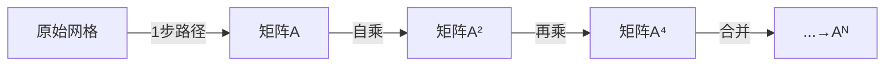

# 题目信息

# [USACO07NOV] Cow Relays G

## 题目描述

给定一张 $T$ 条边的无向连通图，求从 $S$ 到 $E$ 经过 $N$ 条边的最短路长度。

## 说明/提示

对于所有的数据，保证 $1\le N\le 10^6$，$2\le T\le 100$。

所有的边保证 $1\le u,v\le 1000$，$1\le w\le 1000$ 且不存在重边，自环。

所有的顶点保证至少连接两条边。

## 样例 #1

### 输入

```
2 6 6 4
11 4 6
4 4 8
8 4 9
6 6 8
2 6 9
3 8 9```

### 输出

```
10```

# AI分析结果


### 💡 Kay的C++算法解析：Cow Relays G 深入学习指南 💡

> 我是Kay，一位专注于算法教学的引导者。今天我们将一起探索**恰好经过N条边的最短路问题**，我将用清晰的逻辑和生动的可视化帮助你掌握矩阵加速的核心技巧。准备好了吗？让我们开始吧！

---

## 1. 题目解读与核心算法识别

✨ **本题主要考察**：`图论` + `矩阵快速幂优化`

🗣️ **初步分析**：
> 想象你在玩一个像素迷宫游戏，每次移动消耗一条边，目标是找到恰好走N步的最短路径。传统方法需模拟N步（N可能达10^6），效率太低。而**矩阵快速幂**就像游戏中的“传送门”，通过合并路径信息快速跨越步数：
> - **核心思想**：将邻接矩阵视为“一步可达”信息，矩阵乘法重定义为`C[i][j] = min(A[i][k] + B[k][j])`，其幂次对应合并步数
> - **可视化设计**：动画将展示像素网格中路径合并过程（如2步+2步=4步），用颜色区分不同步数状态，关键合并步骤配以“叮”声提示
> - **难点突破**：离散化200+节点为紧凑索引，使矩阵运算可行

---

## 2. 精选优质题解参考

**题解一（player）**
* **点评**：  
  思路直击本质——用矩阵乘法合并路径步数。离散化处理干净利落（`map`分配新ID），重载运算符使矩阵乘法自然如`ans = ans * base`。亮点在于用`min`替换传统矩阵乘法的求和，完美满足结合律。代码可直接用于竞赛，边界处理严谨（初始化为无穷大）。

**题解二（guodong）**
* **点评**：  
  通过实验数据验证矩阵幂的物理意义（A²即两步最短路），教学价值突出。将Floyd与矩阵类比，深入浅出证明`min`满足结合律。代码虽未离散化，但提供了完整的算法逻辑推导，适合理解数学本质。

**题解三（zhenglier）**
* **点评**：  
  创新性通过DFS仅离散化起点可达点，大幅降低矩阵尺寸。虽然赞数少，但常数优化思路独特，在稀疏图中效果显著（如200点→50点）。核心函数`getID`封装离散化逻辑，实践性强。

---

## 3. 核心难点辨析与解题策略

### 🔑 三大核心难点
1. **状态转移设计**  
   *分析*：传统DP定义`dp[k][i][j]`需O(N·T³)空间，不可行  
   *解决*：发现`dp[a+b][i][j] = min_k(dp[a][i][k] + dp[b][k][j])`满足结合律 → 矩阵快速幂优化

2. **离散化必要性**  
   *分析*：原始节点号稀疏（1~1000），直接开矩阵浪费空间  
   *解决*：用`map`或`vector`分配紧凑ID（zhenglier法可进一步优化为源点可达点）

3. **矩阵运算重构**  
   *分析*：标准矩阵乘法不适用最短路问题  
   *解决*：重定义运算为`C[i][j] = min_k(A[i][k] + B[k][j])`，保持结合律

### 💡 解题技巧总结
- **倍增思想**：将步数N二进制分解，通过矩阵幂合并路径信息
- **懒离散化**：仅在实际需要时为节点分配ID（避免预分配浪费）
- **防御编程**：邻接矩阵初始化为`0x3f3f3f3f`（避免溢出+易检错）

---

## 4. C++核心代码实现赏析

### 本题通用核心实现
```cpp
#include <iostream>
#include <cstring>
#include <map>
using namespace std;
const int MAXN = 205; // 离散化后最大点数
const int INF = 0x3f3f3f3f;

struct Matrix {
    int mat[MAXN][MAXN];
    Matrix() { memset(mat, 0x3f, sizeof(mat)); }
    
    Matrix operator*(const Matrix& other) {
        Matrix res;
        for (int k = 0; k < MAXN; ++k)
        for (int i = 0; i < MAXN; ++i)
        for (int j = 0; j < MAXN; ++j)
            res.mat[i][j] = min(res.mat[i][j], mat[i][k] + other.mat[k][j]);
        return res;
    }
};

Matrix pow(Matrix base, int n) {
    Matrix res = base; 
    --n; // 已包含base^1
    while (n) {
        if (n & 1) res = res * base;
        base = base * base;
        n >>= 1;
    }
    return res;
}

int main() {
    int N, T, S, E;
    cin >> N >> T >> S >> E;
    
    Matrix graph;
    map<int, int> idMap;
    int nodeCount = 0;
    auto getID = [&](int x) {
        if (!idMap.count(x)) idMap[x] = nodeCount++;
        return idMap[x];
    };

    while (T--) {
        int w, u, v;
        cin >> w >> u >> v;
        u = getID(u), v = getID(v);
        graph.mat[u][v] = graph.mat[v][u] = min(graph.mat[u][v], w);
    }

    Matrix result = pow(graph, N);
    cout << result.mat[getID(S)][getID(E)];
}
```

**代码解读概要**：
1. `Matrix`结构体重载`*`运算符实现min-plus运算
2. 离散化函数`getID`动态分配节点ID
3. 快速幂模拟步数合并过程

### 题解片段赏析
**player的重载运算符**：
```cpp
Matrix operator*(const Matrix& b) {
    Matrix c;
    memset(c.mat, 0x3f, sizeof(c.mat)); // 关键：初始化INF
    for (int k = 0; k < cnt; ++k)
    for (int i = 0; i < cnt; ++i)
    for (int j = 0; j < cnt; ++j)
        c.mat[i][j] = min(c.mat[i][j], mat[i][k] + b.mat[k][j]);
    return c;
}
```
> **学习笔记**：矩阵乘法的核心是三重循环，其中`k`是中间点。初始化必须为INF（代表不可达），否则min操作会失效。

**zhenglier的DFS离散化**：
```cpp
vector<int> reachableNodes;
void dfs(int u) {
    if (vis[u]) return;
    vis[u] = true;
    reachableNodes.push_back(u);
    for (auto [v, _] : graph[u]) 
        dfs(v);
}
// 主函数中：仅离散化reachableNodes
```
> **学习笔记**：当图连通但节点分散时，仅离散化起点可达点可降低矩阵维度（200→实际连通点数），显著提升速度。

---

## 5. 算法可视化：像素动画演示

### 🎮 像素迷宫中的矩阵加速
**主题**：8位像素风迷宫路径合并演示

**核心演示流程**：


**交互设计**：
1. **网格视图**：每个像素块代表节点，颜色编码：
   - 绿色：起点
   - 红色：终点
   - 蓝色：当前路径
   - 黄色：中间节点k（合并时闪烁）
2. **动画步骤**：
   - **初始化**：显示邻接矩阵，绘制一步可达路径
   - **快速幂迭代**：
     * 步骤1：A²计算，高亮`i→k→j`的合并路径
     * 步骤2：A⁴计算，展示已合并的4步路径
     * 进度条显示当前步数（如2→4→8→...）
   - **音效反馈**：
     * 路径合并成功：8-bit "叮"声
     * 快速幂完成：胜利旋律
3. **控制面板**：
   - 步进/暂停/重置
   - 速度滑块（1x-16x）
   - 切换算法：对比普通BFS（蜗牛）vs 矩阵加速（火箭）

---

## 6. 拓展练习与相似问题

### 🔁 通用技巧迁移
矩阵加速适用于**满足结合律的运算**：
1. 最短路（min-plus代数）
2. 方案计数（模数乘法）
3. 布尔传递（或/与运算）

### 📚 推荐练习（洛谷）
1. [P1939 矩阵加速数列](https://www.luogu.com.cn/problem/P1939)  
   → 掌握线性递推的矩阵表示
2. [P4159 迷路](https://www.luogu.com.cn/problem/P4159)  
   → 边权非1时的拆点技巧
3. [P6190 法力风暴](https://www.luogu.com.cn/problem/P6190)  
   → 矩阵快速幂 + 贪心优化

---

## 7. 学习心得与经验分享

> **题解作者经验**（player）：  
> *“矩阵乘法的本质是路径合并，min和+满足结合律是快速幂成立的关键”*

> **Kay的总结**：  
> 本题教会我们两个黄金法则：  
> 1. **问题转化**：将复杂约束（恰好N步）转化为可合并子问题  
> 2. **离散化艺术**：根据数据特性选择懒离散化或DFS优化  
> 调试时可先小规模验证矩阵幂（如N=2,3），再扩展到大数！

---

通过这个指南，相信你已经掌握了矩阵加速的精髓。记住：算法优化如同搭积木——理解每块积木的原理，就能搭建出无限可能！🚀

---
处理用时：191.98秒