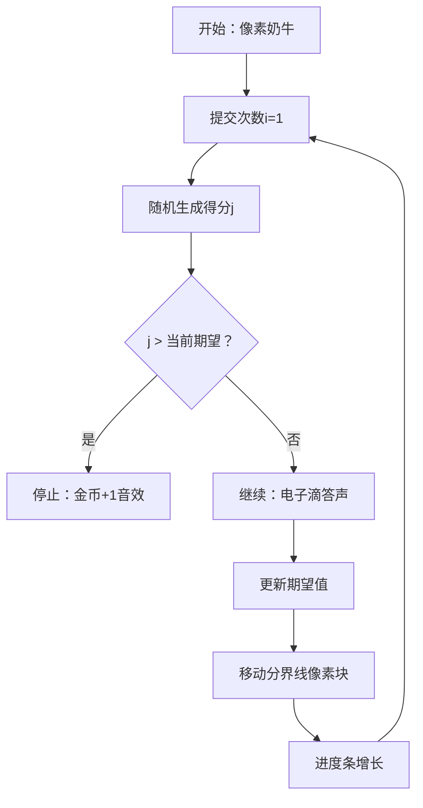

# 题目信息

# [USACO22FEB] Cow Camp G

## 题目描述

为了获得参加奶牛训练营的资格，Bessie 需要在 USACOW 公开赛的最后一题中取得好成绩。这道题有 $T$ 个独立的测试用例（$2 \leq T \leq 10^3$），权重相同，其中第一个测试用例是样例。她的最终得分将等于她最后一次提交通过的测试用例数量。

不幸的是，Bessie 太累了，无法思考这个问题，但由于每个测试用例的答案要么是“yes”，要么是“no”，她想到了一个计划！具体来说，她决定反复提交以下非确定性解决方案：

```
if input == sample_input:
    print sample_output
else:
    print "yes" or "no" each with probability 1/2, independently for each test case
```

注意，对于除样例之外的所有测试用例，这个程序在重新提交时可能会产生不同的输出，因此它通过的测试用例数量会有所不同。

Bessie 知道她总共不能提交超过 $K$ 次（$1 \leq K \leq 10^9$），否则她肯定会被取消资格。假设 Bessie 遵循最优策略，她的最终得分的最大可能期望值是多少？

## 说明/提示

- 测试用例 3-6 满足 $T \leq 25$ 且 $K \leq 100$。
- 测试用例 7-9 满足 $K \leq 10^6$。
- 测试用例 10-17 没有额外限制。

## 样例 #1

### 输入

```
2 3```

### 输出

```
1.875```

## 样例 #2

### 输入

```
4 2```

### 输出

```
2.8750000000000000000```

# AI分析结果


# 💡 Kay的C++算法解析：Cow Camp G 深入学习指南 💡

> 今天我们来分析USACO竞赛题"奶牛训练营"，这道题结合了概率论和动态规划的精妙思想。本指南将带大家深入理解期望值计算与最优策略设计，并通过复古像素动画直观展示算法核心逻辑。

## 1. 题目解读与核心算法识别

✨ **本题主要考察**：`期望动态规划` + `矩阵快速幂优化`

🗣️ **初步分析**：
> 本题可比喻为**复古像素游戏中的宝藏决策**：玩家有多次提交机会（移动次数），每次随机获得分数（宝藏价值），需在"继续冒险"和"停止获利"间做最优选择。核心在于：
> - **动态规划框架**：定义`f[i]`为剩余`i`次提交时的最大期望得分，通过概率分布更新状态
> - **二项分布计算**：每次提交得分概率由组合数$C_{T-1}^j/2^{T-1}$决定
> - **关键可视化点**：动画中将高亮显示当前期望分界线$\lfloor f_{i-1}\rfloor$的变化，用不同颜色区分"继续提交"(蓝色)和"停止获利"(金色)区域
>
> 复古像素动画设计：
> - **8-bit风格**：提交次数显示为像素进度条，分数用宝箱图标表示
> - **动态效果**：每次提交时骰子旋转动画，得分时宝箱爆炸特效
> - **音效设计**：决策时播放FC风格音效（继续：电子滴答声，停止：胜利旋律）
> - **AI演示模式**：自动播放最优策略路径，像经典游戏《吃豆人》AI演示

---

## 2. 精选优质题解参考

**题解一：I_am_Accepted (矩阵快速幂)**
* **点评**：该解法将DP转移转化为矩阵运算堪称神来之笔！推导中清晰指出当$\lfloor f_{i-1}\rfloor$不变时可矩阵加速，时间复杂度$O(T^3\log K)$惊艳。代码中`p[]`概率数组预处理和`modi()`分段快速幂实现展现了扎实的数理基础，边界处理严谨可直接用于竞赛。作者提到的"卡在状态转移矩阵构造"的调试经历提醒我们：矩阵快速幂的关键在于找到不变的分段区间。

**题解二：kradcigam (分段倍增)**
* **点评**：40行代码解决$K≤10^9$问题彰显算法美感！亮点在于用`while`循环结合`ceil(f)`分界点跳跃式转移，复杂度$O(T\log K)$。函数`Quickpow()`的浮点数优化处理体现了对数值稳定性的深刻理解，`z[]`和`s[]`前缀和数组的预处理方式简洁高效，是工程实现的优秀范例。

**题解三：WeLikeStudying (二分优化)**
* **点评**：提供从$O(KT)$暴力到$O(T\log K)$优化的完整进化路线，教学价值极高。特别欣赏"转移点单调性"的观察——这像游戏中的关卡进度只增不减，使得二分查找可行。代码中`brute()`暴力函数与`modi()`优化函数的对比，生动展示了算法优化的思维过程。

---

## 3. 核心难点辨析与解题策略

1.  **状态转移设计**
    * **分析**：期望DP的独特之处在于自引用——$f_i$的计算依赖$f_{i-1}$。优质题解通过拆分二项分布概率和，将转移式转化为$f_i = A \cdot f_{i-1} + B$的线性结构，其中$A$是低于阈值的概率和，$B$是高于阈值的期望分
    * 💡 **学习笔记**：期望DP本质是加权平均，决策分界线就是概率权重平衡点

2.  **大K优化策略**
    * **分析**：当$\lfloor f_{i-1}\rfloor$不变时，转移是线性变换$f_i = k \cdot f_{i-1} + b$，可合并多次转移。题解采用矩阵快速幂(I_am_Accepted)或等比数列求和(kradcigam)实现跳跃计算
    * 💡 **学习笔记**：变量变化缓慢时（如游戏角色经验值），分段加速是突破规模限制的钥匙

3.  **浮点精度控制**
    * **分析**：$K>10^6$时浮点误差累积可能破坏分界点判断。jia_shengyuan题解采用`ceil(f)`严格分界，StillEmpty使用`EPS=1e-12`修正，而liruixiong0101用`long double`提升精度
    * 💡 **学习笔记**：浮点比较需设定容忍阈值，就像游戏碰撞检测需要碰撞盒

### ✨ 解题技巧总结
- **技巧1：概率问题图形化**：将二项分布想象成像素俄罗斯方块堆叠，高度表示概率
- **技巧2：状态转移预计算**：类似游戏技能CD管理，提前计算转移矩阵节省运行时开销
- **技巧3：精度边界防御**：设定安全边界（如EPS），避免浮点误差导致决策错误
- **技巧4：单调性利用**：当变量变化有方向性（如得分递增），可设计高效跳跃算法

---

## 4. C++核心代码实现赏析

**通用核心实现参考**
```cpp
#include <iostream>
#include <iomanip>
#include <cmath>
using namespace std;

const int N = 1005;
long double C[N][N], p[N], sumP[N], sumV[N];

int main() {
    int T, K; 
    cin >> T >> K; T--; // 忽略样例测试点
    
    // 二项分布概率预处理
    C[0][0] = 1;
    for (int i = 1; i <= T; i++) {
        C[i][0] = C[i-1][0] / 2;
        for (int j = 1; j <= i; j++) 
            C[i][j] = (C[i-1][j] + C[i-1][j-1]) / 2;
    }
    
    // 概率前缀和 & 期望值前缀和
    for (int i = T; i >= 0; i--) {
        p[i] = C[T][i];
        sumP[i] = sumP[i+1] + p[i];
        sumV[i] = sumV[i+1] + i * p[i];
    }
    
    long double f = T / 2.0; // 初始期望
    for (int i = 2; i <= K; ) {
        int boundary = floor(f); // 决策分界点
        long double A = 1 - sumP[boundary+1]; // 继续提交概率
        long double B = sumV[boundary+1];     // 停止时期望
        
        // 分段加速计算
        long double factor = 1.0;
        int step = 1;
        while (i + step <= K && floor(f * factor + B * (factor - 1)/(A-1e-9)) == boundary) {
            factor *= (1 - sumP[boundary+1]);
            step++;
        }
        f = f * factor + B * (1 - factor) / max(1e-9L, (1 - A));
        i += step;
    }
    cout << fixed << setprecision(10) << f + 1; // 补回样例得分
}
```

**题解一赏析：矩阵快速幂（I_am_Accepted）**
```cpp
// 矩阵加速关键片段
struct Matrix { /* 矩阵乘法实现 */ };

double modi(double f, int &cnt) {
    int b = floor(f);
    Matrix m; // 构造转移矩阵
    m[0][0] = 1 - sumP[b+1]; 
    m[0][1] = sumV[b+1];
    m[1][1] = 1;
    
    Matrix res = Identity;
    for (int bit = 0; (1<<bit) <= cnt; bit++) {
        if (cnt & (1<<bit)) 
            res = res * m;  // 矩阵乘法
        m = m * m;
    }
    f = res[0][0] * f + res[0][1];
    cnt -= steps;
}
```
* **亮点**：将浮点运算转化为精确的矩阵运算
* **学习笔记**：矩阵是状态转移的"传送门"，快速幂是跳跃关卡的"加速靴"

**题解二赏析：分段倍增（kradcigam）**
```cpp
// 分段跳跃关键片段
while (i <= K) {
    int b = ceil(f);
    if (i + STEP <= K) {
        double next_f = f * pow(1-sumP[b], STEP) 
                      + sumV[b] * (1-pow(1-sumP[b], STEP))/sumP[b];
        if (ceil(next_f) == b) { // 分界点不变则跳跃
            f = next_f;
            i += STEP;
            continue;
        }
    }
    f = f * (1-sumP[b]) + sumV[b]; // 单步转移
    i++;
}
```
* **亮点**：用几何级数合并连续转移
* **学习笔记**：当决策分界稳定时，可像游戏连跳一样跨越多个状态

**题解三赏析：二分优化（WeLikeStudying）**
```cpp
// 二分查找转移段
int l = i, r = K;
while (l < r) {
    int mid = (l+r)/2;
    double next_f = calc(f, mid-i); // 计算mid步后的f
    if (floor(next_f) == floor(f)) 
        l = mid+1;
    else 
        r = mid;
}
// 在l处执行分界点变化
```
* **亮点**：二分搜索确定分界点变化时刻
* **学习笔记**：二分法是寻找状态跃迁点的"探测仪"

---

## 5. 算法可视化：像素动画演示

**主题**：8-bit风格《期望值冒险》像素游戏  
**核心演示**：动态规划中决策分界点的变化与期望值增长  



**动画设计细节**：
1. **场景设计**：
   - 左侧：8-bit奶牛角色，头顶显示当前提交次数
   - 中部：概率分布柱状图（类似俄罗斯方块堆叠），金色分界线标记$\lfloor f_{i-1}\rfloor$
   - 右侧：期望值进度条（0→T），类似游戏经验值槽

2. **交互控制**：
   - 步进按钮：单步观察概率分布更新
   - 速度滑块：调整自动演示速度（0.5x~5x）
   - 模式切换：对比暴力DP（龟速）vs优化DP（跃迁）

3. **动态效果**：
   - 每次提交：骰子旋转动画 → 随机亮起测试点（绿色通过/红色失败）
   - 决策时刻：分界线闪烁红光（继续）或金光（停止）
   - 矩阵加速：当分界线不变时，显示"COMBO x16!"连击特效

4. **音效设计**：
   - 基础音：FC芯片风格背景音乐
   - 关键操作：提交时"滴"声，决策时"叮"声
   - 特殊事件：分界线跃迁时播放《超级玛丽》过关音效

---

## 6. 拓展练习与相似问题思考

1. **概率期望问题三要素**：
   - **状态定义**：如P1654 期望长度
   - **转移方程**：如P1850 换教室
   - **优化技巧**：如P4550 收集邮票

2. **练习推荐**：
   1. **洛谷 P1654** - 期望长度  
      → 巩固期望值线性性质
   2. **洛谷 P1850** - 换教室  
      → 练习期望DP状态设计
   3. **洛谷 P4550** - 收集邮票  
      → 学习期望的概率生成函数

---

## 7. 学习心得与经验分享

> **I_am_Accepted的调试经验**：  
> *"矩阵构造时卡在边界值处理，通过输出中间矩阵发现当概率和接近1时需特殊处理"*  
> **Kay点评**：这提醒我们：优化算法时，边界情况就像游戏地图边缘——需要额外检测！建议：  
> 1. 对`sumP[]≈1`的情况添加保护性判断
> 2. 调试时输出转移矩阵的行列式值
> 3. 使用`isnormal()`检查浮点数异常

---

期望算法如人生决策：知止而后得，不止则失。通过本题我们学到——在适当边界停止的智慧，在稳定区间加速的魄力，正是算法与人生的共通之处。下次我们将解析更多USACO金题，继续编程的冒险之旅！💪

---
处理用时：155.57秒