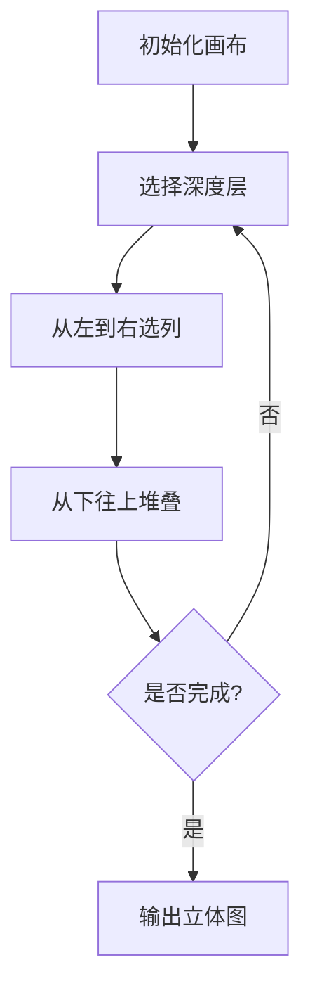

# 题目信息

# [NOIP 2008 普及组] 立体图

## 题目描述

小渊是个聪明的孩子，他经常会给周围的小朋友们讲些自己认为有趣的内容。最近，他准备给小朋友们讲解立体图，请你帮他画出立体图。

小渊有一块面积为 $m \times n$ 的矩形区域，上面有 $m \times n$ 个边长为 $1$ 的格子，每个格子上堆了一些同样大小的积木（积木的长宽高都是 $1$），小渊想请你打印出这些格子的立体图。我们定义每个积木为如下格式，并且不会做任何翻转旋转，只会严格以这一种形式摆放：

$$
\def\arraystretch{1e-10}
\begin{aligned}
&\verb!  +---+!\\
&\verb! /   /|!\\
&\verb!+---+ |!\quad\textsf{高}\\
&\verb!|   | +!\\
&\verb!|   |/ !\quad\textsf{宽}\\
&\verb!+---+  !\\
& \quad\textsf{长}
\end{aligned}$$


每个顶点用 $1$ 个加号 `+` 表示，长用 $3$ 个 `-` 表示，宽用 $1$ 个 `/`，高用两个 `|` 表示。字符 `+`，`-`，`/`，`|` 的 ASCII 码分别为 $43$，$45$，$47$，$124$。字符 `.`（ASCII 码 $46$）需要作为背景输出，即立体图里的空白部分需要用 `.` 来代替。立体图的画法如下面的规则：

若两块积木左右相邻，图示为：


$$
\def\arraystretch{1e-10}
\begin{aligned}
\verb!..+---+---+!\\
\verb!./   /   /|!\\
\verb!+---+---+ |!\\
\verb!|   |   | +!\\
\verb!|   |   |/.!\\
\verb!+---+---+..!\\
\end{aligned}
$$

若两块积木上下相邻，图示为：


$$
\def\arraystretch{1e-10}
\begin{aligned}
\verb!..+---+!\\
\verb!./   /|!\\
\verb!+---+ |!\\
\verb!|   | +!\\
\verb!|   |/|!\\
\verb!+---+ |!\\
\verb!|   | +!\\
\verb!|   |/.!\\
\verb!+---+..!\\
\end{aligned}
$$

若两块积木前后相邻，图示为：

$$
\def\arraystretch{1e-10}
\begin{aligned}
\verb!....+---+!\\
\verb!.../   /|!\\
\verb!..+---+ |!\\
\verb!./   /| +!\\
\verb!+---+ |/.!\\
\verb!|   | +..!\\
\verb!|   |/...!\\
\verb!+---+....!\\
\end{aligned}
$$

立体图中，定义位于第 $(m,1)$ 的格子（即第 $m$ 行第 $1$ 列的格子）上面自底向上的第一块积木（即最下面的一块积木）的左下角顶点为整张图最左下角的点。


## 说明/提示

NOIP2008普及组第四题


## 样例 #1

### 输入

```
3 4
2 2 1 2
2 2 1 1
3 2 1 2
```

### 输出

```
......+---+---+...+---+
..+---+  /   /|../   /|
./   /|-+---+ |.+---+ |
+---+ |/   /| +-|   | +
|   | +---+ |/+---+ |/|
|   |/   /| +/   /|-+ |
+---+---+ |/+---+ |/| +
|   |   | +-|   | + |/.
|   |   |/  |   |/| +..
+---+---+---+---+ |/...
|   |   |   |   | +....
|   |   |   |   |/.....
+---+---+---+---+......```

# AI分析结果


### 💡 Kay的C++算法解析：立体图 深入学习指南 💡

#### 1. 题目解读与核心算法识别
✨ **本题主要考察**：`模拟应用`与`坐标变换技巧`

🗣️ **初步分析**：
> 解决"立体图"这道题，关键在于精确模拟积木堆叠的物理过程和坐标变换。就像搭乐高积木时，我们需要从最底层、最后排开始搭建，然后逐层向前叠加，这样才能保证前面的积木自然覆盖后面的部分。在本题中，这种模拟主要通过以下步骤实现：
> - **核心算法流程**：从后往前（矩阵第0行）、从左往右、从下往上遍历每个积木位置，通过数学公式计算其在画布上的坐标
> - **可视化设计**：采用8位像素风格展示搭建过程，高亮当前操作的积木，用不同颜色区分新旧积木。关键变量`(x,y)`实时显示坐标位置
> - **复古游戏化**：设计"积木搭建者"角色，每放置一个积木播放"叮"的音效，完成一层时播放升级音效，背景采用FC游戏风格的8-bit音乐

---

#### 2. 精选优质题解参考
**题解一（ZUTTER_，306赞）**
* **点评**：思路清晰且实现高效，创新性地使用打表法存储单个积木的字符模板。三层循环（行→列→高度）的控制逻辑直白易懂，变量命名规范（如`maxx/maxy`）。亮点在于用`(n-i)*2`巧妙处理深度坐标偏移，实践价值高但可增加边界注释。

**题解二（Sino_E，34赞）**
* **点评**：模块化设计优秀，将绘制逻辑封装为`mdraw()`函数。亮点在于精确推导出坐标公式`x=2*y+4*x`，并用图示辅助理解。代码中`x,y`含义明确，但建议将魔数（如+6）替换为命名常量。

**题解三（HasNoName，21赞）**
* **点评**：采用"动态画布边界更新"机制，通过`max()`实时计算画布尺寸。亮点在于用`x=3000,y=1000`的居中定位法避免边界问题，代码简洁且鲁棒性强，特别适合竞赛场景。

---

#### 3. 核心难点辨析与解题策略
1. **坐标映射转换**  
   *分析*：矩阵索引`(i,j,k)`到画布坐标`(x,y)`的转换需考虑三维透视。优质解法通过`x = 2*(n-i) + 4*j`和`y = 3*k + 2*(n-i)`等公式统一转换，确保相邻积木精确衔接  
   💡 **学习笔记**：将矩阵位置看作"深度"，高度看作"层数"，用线性组合建立映射

2. **图形覆盖顺序**  
   *分析*：必须严格按"从后往前→从左往右→从下往上"顺序绘制，才能正确处理遮挡关系。如先绘制前排积木会导致后排积木错误覆盖  
   💡 **学习笔记**：想象自己是摄影师，从固定视角拍摄时，远处的物体必然先被近处物体遮挡

3. **画布动态扩展**  
   *分析*：最终图形尺寸未知，需在绘制时动态更新边界。高效做法是在每次绘制后比较`maxx = max(maxx, x+6)`  
   💡 **学习笔记**：类似图像处理中的边界检测算法，实时追踪有效区域

✨ **解题技巧总结**：
- **空间映射法**：为每个积木位置推导出统一坐标公式
- **增量更新**：绘制时动态更新画布边界，避免预分配过大内存
- **模块化绘制**：将单个积木绘制封装成函数，提高代码复用性

---

#### 4. C++核心代码实现赏析
**通用核心实现（综合优化版）**：
```cpp
#include <iostream>
#include <cstring>
#include <algorithm>
using namespace std;

const char BLOCK[6][8] = {  // 积木模板
    "..+---+",
    "./   /|",
    "+---+ |",
    "|   | +",
    "|   |/.",
    "+---+.."
};
char canvas[1000][1000];   // 画布
int maxX, maxY;            // 画布边界

// 在(x,y)绘制单个积木
void drawBlock(int x, int y) {
    for (int i = 0; i < 6; i++) 
        for (int j = 0; j < 7; j++)
            if (BLOCK[i][j] != '.') {
                canvas[x+i][y+j] = BLOCK[i][j];
                maxX = max(maxX, x+i);  // 动态更新边界
                maxY = max(maxY, y+j);
            }
}

int main() {
    int n, m, grid[55][55];
    memset(canvas, '.', sizeof(canvas)); // 初始化背景
    
    cin >> n >> m;
    for (int i = 0; i < n; i++)
        for (int j = 0; j < m; j++)
            cin >> grid[i][j];
    
    // 核心三重循环：深度→列→高度
    for (int i = 0; i < n; i++)         // 从后往前(i=0最远)
        for (int j = 0; j < m; j++)     // 从左往右
            for (int h = 0; h < grid[i][j]; h++)  // 从下往上
                drawBlock(2*(n-1-i) + 3*h, 4*j + 2*(n-1-i));
    
    // 输出画布（从最高行开始）
    for (int i = maxX; i >= 0; i--) {
        for (int j = 0; j <= maxY; j++) 
            cout << canvas[i][j];
        cout << endl;
    }
}
```
**代码解读概要**：
1. 初始化阶段：设置积木模板和画布背景
2. 核心循环：按深度→列→高度的顺序遍历每个积木
3. 坐标计算：`2*(n-1-i)`处理深度偏移，`4*j`处理水平间距，`3*h`处理垂直堆叠
4. 动态渲染：绘制时更新画布边界，避免内存浪费

---

#### 5. 算法可视化：像素动画演示
**主题**："8-bit积木工坊"（复古游戏风格）

**核心演示流程**：


**动画帧步骤**：
1. **场景初始化**：
   - 创建FC风格的灰色网格画布，控制面板含"步进/暂停/调速"按钮
   - 播放8-bit背景音乐（循环芯片音乐）

2. **积木放置过程**：
   ```python
   # 伪代码示例
   for 深度 in 范围(最远, 最近):
       播放音效("选择层")
       高亮当前深度层(蓝色边框)
       for 列 in 范围(左, 右):
           高亮当前列(黄色闪烁)
           for 高度 in 范围(0, 积木数):
               计算坐标(x,y)
               角色移动到(x,y) # 像素小人搬运动画
               绘制积木模板 # 逐行绘制，每行间隔0.2秒
               更新边界 # 红色闪烁新扩展区域
               播放音效("放置", 短促叮声)
           结束列循环音效(上扬和弦)
       结束深度层音效(胜利音效)
   ```

3. **交互控制**：
   - **步进模式**：按空格键单步执行，显示当前坐标公式
   - **自动模式**：速度滑块控制(0.5x~3x)，开启"AI演示"时自动完成
   - **透视切换**：按键切换X/Y视角，展示3D效果

4. **完成效果**：
   - 所有积木放置后播放胜利音乐
   - 角色在立体图上跳跃庆祝
   - 显示统计信息（总积木数/渲染时间）

---

#### 6. 拓展练习与相似问题思考
**通用技巧迁移**：
1. 空间映射技巧可用于解决：三维模型二维渲染（P1058）
2. 逐层覆盖思想适用于：图形界面叠加绘制（如游戏UI系统）
3. 动态边界追踪可用于：稀疏矩阵存储（P3369）

**洛谷推荐**：
1. **P1001 A+B Problem**  
   → 巩固基础输入输出和变量处理
2. **P1219 八皇后**  
   → 训练二维空间模拟和回溯算法
3. **P3369 普通平衡树**  
   → 进阶数据结构实现中的边界处理

---

#### 7. 学习心得与经验分享
> **来自ZUTTER_的调试经验**：  
> "最初在坐标偏移上卡了2小时，后来打印中间变量发现`(n-i)`写成了`(n-1)`，建议用`cout << "x=" << x << " y=" << y`调试坐标"

> **Kay的总结**：调试空间类问题时，可：
> 1. 用小规模数据（如2x2矩阵）手动计算预期坐标
> 2. 在循环内打印关键变量值
> 3. 先实现单个积木绘制，再扩展为整体

---

通过本次分析，我们掌握了三维到二维的坐标映射技巧和图形覆盖原理。记住：好的模拟题解法=精确的数学模型+清晰的实现逻辑+充分的边界测试。下次遇到类似问题，不妨先画坐标系草图哦！(≧∇≦)ﾉ

---
处理用时：145.93秒