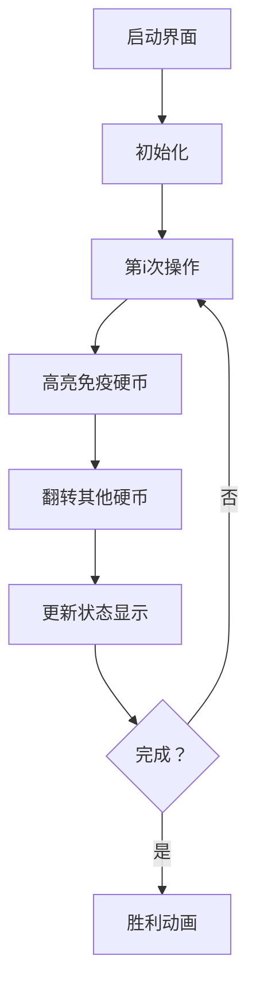

# 题目信息

# 硬币翻转

## 题目描述

在桌面上有一排硬币，共 $N$ 枚，每一枚硬币均为正面朝上。现在要把所有的硬币翻转成反面朝上，规则是每次可翻转任意 $N-1$ 枚硬币（正面向上的被翻转为反面向上，反之亦然）。求一个最短的操作序列（将每次翻转 $N-1$ 枚硬币成为一次操作）。

## 样例 #1

### 输入

```
4```

### 输出

```
4
0111
1100
0001
1111
```

# AI分析结果


# 💡 Kay的C++算法解析：硬币翻转 深入学习指南 💡

**引言**  
今天我们一起分析"硬币翻转"这道有趣的C++编程题。题目要求将一排正面朝上的硬币通过翻转操作全部变为反面朝上，每次操作翻转任意N-1枚硬币。本指南将带你理解核心算法，掌握解题技巧，并通过生动的像素动画直观感受算法执行过程。

---

## 1. 题目解读与核心算法识别

✨ **本题主要考察**：`模拟应用` 与 `数学推理`  

🗣️ **初步分析**：  
> 解决硬币翻转问题的关键在于理解**操作等价转换**。每次翻转N-1枚硬币，等价于只翻转1枚硬币（因为整个操作相当于先全部翻转再翻转特定硬币）。在本题中，我们通过构造操作序列：  
> - **第i次操作**：翻转除第i枚硬币外的所有硬币  
> - **数学证明**：每枚硬币最终被翻转N-1次（奇数），N为偶数时满足翻转要求  
>  
> **可视化设计思路**：  
> - 像素动画中将用黄色/蓝色方块表示硬币正反面  
> - 高亮当前"免疫"翻转的硬币（箭头标记）  
> - 每次翻转时播放"叮"音效，完成时播放胜利音效  
> - 采用8位像素风格（类似FC游戏），自动演示模式展示完整流程  

---

## 2. 精选优质题解参考

**题解一（作者：子谦，赞405）**  
* **点评**：思路直击本质（N-1翻转≡1枚翻转），代码规范清晰。bool数组`a`精确记录状态，双重循环结构工整。边界处理严谨（从1开始计数），实践价值高，可直接用于竞赛。亮点在于用最简代码实现核心逻辑，是初学者最佳范例。

**题解二（作者：ytxytx，赞145）**  
* **点评**：通过严格数学证明（奇数次翻转必要性）建立理论支撑，创新性使用位运算优化输出。代码极简但可读性稍弱，提供了深刻的算法洞察。亮点在于操作序列的数学构造（如n=6的规律输出），适合进阶学习。

**题解三（作者：ljc20020730，赞119）**  
* **点评**：提供多角度证明（操作分解为全局翻转+单枚翻转），教学价值突出。Pascal代码虽非C++，但思路可完全迁移。亮点在于"问题转化"思维模式，帮助建立解题通用框架。

---

## 3. 核心难点辨析与解题策略

1. **难点：操作等价性理解**  
   * **分析**：翻转N-1枚硬币 ≡ 忽略1枚硬币 + 翻转所有硬币。通过真值表验证：初始状态0000 → 翻转后3枚得1110 ≡ 忽略第1枚的结果  
   * 💡 **学习笔记**：复杂操作常可分解为基本操作的组合

2. **难点：操作序列的构造**  
   * **分析**：必须确保每枚硬币被翻转奇数次。优质题解采用"轮巡免疫"策略：第i次操作免疫第i枚硬币，使其他硬币状态变化  
   * 💡 **学习笔记**：当操作存在对称性时，轮巡策略往往最优

3. **难点：奇偶性的数学证明**  
   * **分析**：设硬币i被翻转c_i次，则Σc_i = n×(n-1)。因n为偶数，n-1为奇数，故c_i必为奇数  
   * 💡 **学习笔记**：组合问题中奇偶分析是验证解存在性的利器

### ✨ 解题技巧总结
- **技巧1 问题转化**：将复杂操作转化为基本操作（如N-1→1）  
- **技巧2 构造验证法**：先构造可行解再验证正确性（如轮巡免疫序列）  
- **技巧3 边界思维**：注意数组索引从0开始还是1开始（本题样例从1开始）  

---

## 4. C++核心代码实现赏析

**本题通用核心C++实现参考**  
* **说明**：综合优质题解思路，采用清晰模拟法
```cpp
#include <iostream>
using namespace std;

int main() {
    int n;
    cin >> n;
    cout << n << endl;  // 操作次数=硬币数
    
    bool coins[101] = {0};  // 初始全0（正面）
    for (int i = 1; i <= n; i++) {  // 第i次操作
        for (int j = 1; j <= n; j++) {
            if (j != i) coins[j] = !coins[j];  // 翻转除i外的硬币
            cout << coins[j];  // 输出当前状态
        }
        cout << endl;
    }
    return 0;
}
```
* **代码解读概要**：  
  - 初始化硬币状态数组`coins`（索引1~n）  
  - 外层循环控制操作次数（1~n次）  
  - 内层循环遍历每枚硬币，非免疫硬币执行翻转（!运算符）  
  - 实时输出每次操作后的状态序列  

**题解一核心片段赏析**  
* **亮点**：直白的状态翻转逻辑
```cpp
if (j != i) {
    if (a[j]) a[j] = 0;
    else a[j] = 1;
}
```
* **代码解读**：  
  > 通过`if(j!=i)`确定翻转范围，用条件语句显式转换状态。虽然可用`a[j]=!a[j]`简化，但此写法更易理解布尔状态变化。

**题解二核心片段赏析**  
* **亮点**：位运算优化输出
```cpp
for (int j=1; j<=i; j++) putchar(48|~i&1);
for (int j=i+1; j<=n; j++) putchar(48|i&1);
```
* **代码解读**：  
  > 通过位运算直接生成输出序列：  
  > - `48`是'0'的ASCII码  
  > - `~i&1`和`i&1`根据操作次数的奇偶确定输出0/1  
  > 此写法避免状态存储，空间复杂度O(1)，但需理解位运算原理  

---

## 5. 算法可视化：像素动画演示

**像素探险家：硬币翻转大冒险**  
* **核心演示**：N枚硬币的翻转过程，融入游戏化进度追踪  
* **设计思路**：8位像素风格降低学习压力，音效强化关键操作记忆  

**动画实现方案**：  


1. **场景设计**：
   - 硬币：黄色像素块（正面）↔ 蓝色像素块（反面）
   - 免疫标记：红色箭头（指向当前免疫硬币）
   - 控制面板：开始/暂停、步进、速度滑块

2. **关键帧流程**：
   ```plaintext
   初始：🟨🟨🟨🟨  (n=4)
   操作1：🔴↓ 🟨 → 🟦🟦🟦  → 输出0111
   操作2：🟦 🔴↓ 🟦 → 🟦🟥🟥  → 输出1100
   ...
   完成：全🟦 + 烟花动画 + 胜利音效
   ```

3. **交互与反馈**：
   - 单步执行：按步进键，高亮当前操作行代码
   - 自动播放：AI以可调速度演示（200-1000ms/步）
   - 音效设计：
     * 翻转音效：8-bit "叮"声
     * 关卡通过：上升音阶
     * 最终胜利：经典FC胜利旋律

---

## 6. 拓展练习与相似问题思考

**通用技巧迁移**：  
1. 开关灯问题（P2841）  
2. 矩阵行列操作（P2149）  
3. 状态轮巡优化（P1965）  

**洛谷推荐**：  
1. **P2841 A×B Problem**  
   🗣️ 考察状态翻转的变形应用  
2. **P1965 转圈游戏**  
   🗣️ 强化轮巡操作与模运算结合  
3. **P1219 八皇后**  
   🗣️ 状态标记的高级应用（对角线规则）  

---

## 7. 学习心得与经验分享

> **经验摘录（来自 ytxytx）**：  
> "最初在奇偶性证明上卡了很久，通过列真值表发现操作的本质是模2加法"  
>  
> **Kay点评**：  
> 当抽象证明困难时，小规模手工模拟（如n=4）常能揭示隐藏规律。建议学习：  
> - 问题规模缩小法  
> - 状态转移矩阵  

---

**结语**  
通过本次分析，我们掌握了硬币翻转问题的核心技巧：操作等价转换与轮巡构造。记住，编程能力提升的关键在于将复杂问题分解为可操作的步骤。下次遇到类似挑战时，不妨回想今天的像素冒险之旅！🚀

---
处理用时：151.76秒