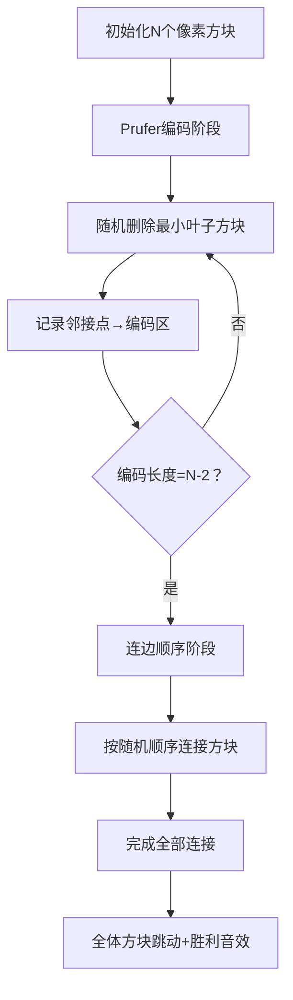

# 题目信息

# 小猴打架

## 题目描述

一开始森林里面有 $N$ 只互不相识的小猴子，它们经常打架，但打架的双方都必须不是好朋友。每次打完架后，打架的双方以及它们的好朋友就会互相认识，成为好朋友。经过 $N-1$ 次打架之后，整个森林的小猴都会成为好朋友。   
现在的问题是，总共有多少种不同的打架过程。   
比如当 $N=3$ 时，就有 $\{1-2,1-3\}\{1-2,2-3\}\{1-3,1-2\}\{1-3,2-3\}\{2-3,1-2\}\{2-3,1-3\}$ 六种不同的打架过程。 


## 说明/提示

$50\%$ 的数据 $N\le 10^3$。  
$100\%$ 的数据 $N\le10^6$。 

## 样例 #1

### 输入

```
4```

### 输出

```
96```

# AI分析结果


### 💡 Kay的C++算法解析：小猴打架 深入学习指南 💡

**引言**  
今天我们一起分析“小猴打架”这道C++编程题。本指南将帮助大家梳理题目思路，理解核心算法，并掌握解题技巧。题目核心是计算N只猴子通过N-1次打架最终全部成为好朋友的不同过程数，本质是带标号无根生成树的计数问题。

---

## 1. 题目解读与核心算法识别

✨ **本题主要考察**：`图论（生成树计数）`  
🗣️ **初步分析**：  
> 解决本题的关键在于运用**Cayley定理**。想象每个猴子是像素游戏中的角色，打架过程就像用像素方块搭建一棵树——每次打架（连接方块）都会扩大好友圈。Cayley定理告诉我们，N个节点的带标号无根树有$N^{N-2}$种形态（如同$N-2$位的密码锁）。  
> - **核心流程**：  
>   1. 计算树的形态数：$N^{N-2}$  
>   2. 计算边的连接顺序：$(N-1)!$  
> - **可视化设计**：  
>   采用8位像素风格，猴子显示为彩色像素方块。动画分两阶段：  
>   - **树形态生成**：展示Prufer编码过程（删除最小叶子节点时方块闪烁+“叮”音效）  
>   - **连边顺序**：用不同颜色线条动态连接方块，伴随“连接”音效，最后全体方块跳动庆祝+胜利音效  

---

## 2. 精选优质题解参考

**题解一（作者：da32s1da）**  
* **点评**：直接应用Cayley定理，代码简洁高效（9行）。亮点在于清晰分离树的形态计算（$N^{N-2}$）和连边顺序（$(N-1)!$），变量名`ans`和取模操作规范，边界处理严谨（循环次数精确）。实践价值高，可直接用于竞赛。  

**题解二（作者：ghj1222）**  
* **点评**：通过矩阵树定理推导$N^{N-2}$，数学证明详尽。亮点在于用初等变换将基尔霍夫矩阵化为上三角阵（对角线乘积即生成树数），展示了算法背后的数学原理。代码中`ans`累乘时同步处理阶乘，体现了空间优化思维。  

**题解三（作者：DPair）**  
* **点评**：用Prufer编码直观解释Cayley定理。亮点在于强调“树形态与编码一一对应”的核心思想（编码长度$N-2$，每位有$N$种选择），并给出编码与树的相互转换步骤。代码循环边界清晰，取模操作规范。  

---

## 3. 核心难点辨析与解题策略

1.  **关键点1：理解生成树计数原理**  
    * **分析**：难点在于将打架过程抽象为图论模型。优质题解均指向Cayley定理：$N$个节点的无根树形态数=$N^{N-2}$。关键变量是节点数$N$和取模常量。  
    * 💡 **学习笔记**：生成树计数是图论基石，Cayley定理适用于带标号完全图。  

2.  **关键点2：处理动态连边顺序**  
    * **分析**：每种树形态有$(N-1)!$种连边顺序（打架次序）。题解通过分离计算（先算$N^{N-2}$再乘阶乘）避免逻辑耦合。  
    * 💡 **学习笔记**：排列组合与图论结合时，先固定结构再考虑顺序。  

3.  **关键点3：大数运算与取模优化**  
    * **分析**：$N≤10^6$需用取模避免溢出。所有题解采用累乘时同步取模（`ans=(ans*n)%mod`），而非最后取模，这是竞赛代码的关键技巧。  
    * 💡 **学习笔记**：乘积累积时步步取模，避免long long溢出。  

### ✨ 解题技巧总结  
- **技巧A：模型转化**（将社交关系抽象为图，打架过程视为建树）  
- **技巧B：定理应用**（直接调用Cayley定理避免复杂推导）  
- **技巧C：分步计算**（先算形态数再算排列数，逻辑清晰）  
- **技巧D：同步取模**（大数运算中每步乘法后取模）  

---

## 4. C++核心代码实现赏析

**本题通用核心C++实现参考**  
* **说明**：综合优质题解的最简实现，包含形态计算与顺序处理。  
* **完整核心代码**：  
  ```cpp
  #include <cstdio>
  const int mod = 9999991;
  int main() {
      long long n, ans = 1;
      scanf("%lld", &n);
      for (int i = 1; i <= n - 2; ++i) 
          ans = ans * n % mod;       // 计算N^(N-2)
      for (int i = 1; i <= n - 1; ++i)
          ans = ans * i % mod;       // 乘以(N-1)!
      printf("%lld", ans);
      return 0;
  }
  ```
* **代码解读概要**：  
  > 代码分为三块：  
  > 1. **输入**：读取猴子数量$N$  
  > 2. **形态计算**：第一个循环累乘$N^{N-2}$  
  > 3. **顺序处理**：第二个循环累乘$(N-1)!$  
  > 4. **输出**：打印取模后结果  

**题解一核心片段赏析**  
* **亮点**：最简实现，变量命名直接体现数学公式。  
* **核心代码**：  
  ```cpp
  for(int i=1;i<=n-2;i++) ans=(ans*n)%mod;  // 形态计算
  for(int i=1;i<=n-1;i++) ans=(ans*i)%mod; // 顺序处理
  ```
* **代码解读**：  
  > 第一循环：`i`从1到$N-2$，每次将`ans`乘以$N$并取模 → 实现$N^{N-2}$  
  > 第二循环：`i`从1到$N-1$，每次乘以`i` → 实现$(N-1)!$  
  > **为何循环边界是$n-2$？** 因Cayley定理要求$N-2$次乘法。  
* 💡 **学习笔记**：循环边界需严格匹配数学公式指数。  

**题解二核心片段赏析**  
* **亮点**：合并循环优化，但可读性稍降。  
* **核心代码**：  
  ```cpp
  for (int i = 1; i <= n - 2; i++)
      ans = ans * n % mod * (i + 1) % mod; 
  ```
* **代码解读**：  
  > 单循环同时计算$N^{N-2}$和$(N-1)!$：  
  > - `ans*n%mod`：累积形态计算  
  > - `*(i+1)%mod`：`i+1`从2开始累积到$N-1$ → 等效阶乘  
  > **注意**：节省一个循环但增加理解成本，需权衡可读性与效率。  

---

## 5. 算法可视化：像素动画演示

**主题**：`像素猴群建树大冒险`  
**核心演示**：Prufer编码生成与连边顺序动态展示  

### 设计思路
> 采用FC红白机像素风格（16色调色板），将抽象算法转化为猴子互动游戏：  
> - **像素元素**：猴子=彩色方块，树边=发光线条  
> - **音效**：删除节点→“叮”，成功连边→“咔嚓”，完成→胜利音乐  

### 动画步骤


### 交互控制
- **面板功能**：开始/暂停、单步执行、速度滑块  
- **AI演示模式**：自动展示Prufer编码（如贪吃蛇AI路径探索）  
- **关卡设计**：  
  - 关卡1：生成Prufer编码（目标：正确删除$N-2$个节点）  
  - 关卡2：连接所有边（目标：按随机顺序完成$N-1$条边）  

---

## 6. 拓展练习与相似问题思考

**通用技巧迁移**  
> 生成树计数可用于：社交网络关系演化、电路布线方案、化学分子结构计数  

**洛谷推荐**  
1. **P4981 父子**  
   🗣️ *推荐理由*：直接应用Cayley定理，巩固$N^{N-2}$的编码实现。  
2. **P2290 [HNOI2004] 树的计数**  
   🗣️ *推荐理由*：拓展到度数限制的生成树计数，需用Prufer编码变形。  
3. **P4208 [JSOI2008] 最小生成树计数**  
   🗣️ *推荐理由*：结合最小生成树性质，训练矩阵树定理进阶应用。  

---

## 7. 学习心得与经验分享

> **参考经验（来自ghj1222）**：  
> *“我在矩阵初等变换卡了很久，后来动手画3阶矩阵才理解变换步骤。”*  
>   
> **点评**：线性代数知识是高级图论的基础，建议：  
> 1. 对抽象证明，用$N=3$手动演算  
> 2. 调试时输出中间矩阵（如5x5矩阵）  
> 3. 结合可视化工具观察行列式变化  

---

**结语**  
本次分析揭示了生成树计数问题的核心框架：Cayley定理提供形态数，排列数决定构建顺序。记住“树形态→边顺序”的分步计算思维，并善用可视化工具理解抽象算法。继续挑战推荐题目吧！💪

---
处理用时：113.09秒