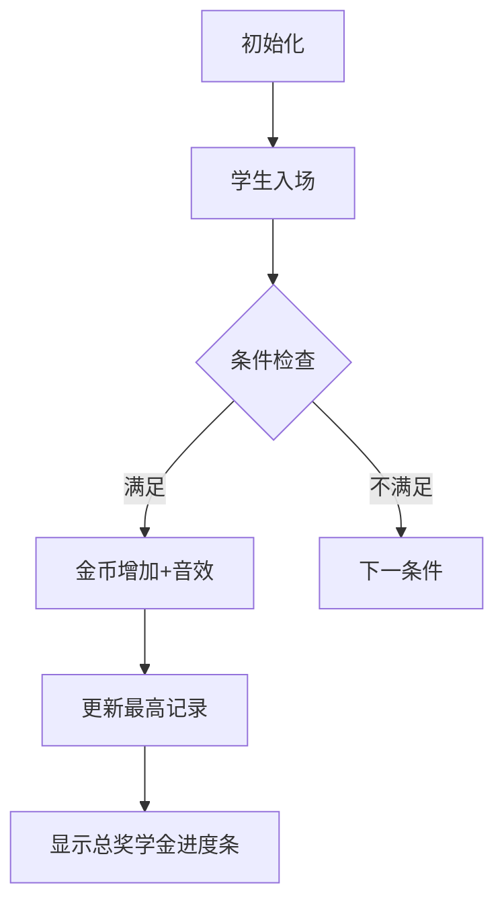

# 题目信息

# [NOIP 2005 提高组] 谁拿了最多奖学金

## 题目描述

某校的惯例是在每学期的期末考试之后发放奖学金。发放的奖学金共有五种，获取的条件各自不同：

1. 院士奖学金，每人 $8000$ 元，期末平均成绩高于 $80$ 分（$>80$），并且在本学期内发表 $1$ 篇或 $1$ 篇以上论文的学生均可获得；
2. 五四奖学金，每人 $4000$ 元，期末平均成绩高于 $85$ 分（$>85$），并且班级评议成绩高于 $80$ 分（$>80$）的学生均可获得；
3. 成绩优秀奖，每人 $2000$ 元，期末平均成绩高于 $90$ 分（$>90$）的学生均可获得；
4. 西部奖学金，每人 $1000$ 元，期末平均成绩高于 $85$ 分（$>85$）的西部省份学生均可获得；
5. 班级贡献奖，每人 $850$ 元，班级评议成绩高于 $80$ 分（$>80$）的学生干部均可获得；

只要符合条件就可以得奖，每项奖学金的获奖人数没有限制，每名学生也可以同时获得多项奖学金。例如姚林的期末平均成绩是 $87$ 分，班级评议成绩 $82$ 分，同时他还是一位学生干部，那么他可以同时获得五四奖学金和班级贡献奖，奖金总数是 $4850$ 元。

现在给出若干学生的相关数据，请计算哪些同学获得的奖金总数最高（假设总有同学能满足获得奖学金的条件）。

## 说明/提示

**【数据范围】**

对于 $100\%$ 的数据，满足 $1 \le  N \le  100$。

**【题目来源】**

NOIP 2005 提高组第一题

## 样例 #1

### 输入

```
4
YaoLin 87 82 Y N 0
ChenRuiyi 88 78 N Y 1
LiXin 92 88 N N 0
ZhangQin 83 87 Y N 1
```

### 输出

```
ChenRuiyi
9000
28700
```

# AI分析结果


```markdown
# 💡 Kay的C++算法解析：谁拿了最多奖学金 深入学习指南 💡

## 1. 题目解读与核心算法识别

✨ **本题主要考察**：`编程技巧应用`（模拟与条件判断）

🗣️ **初步分析**：
> 解决本题就像在像素游戏中收集金币——每位学生根据不同条件获得不同颜色的金币（奖学金）。关键在于：
> - **精准实现多条件判断**：五种奖学金条件需独立判断（非互斥）
> - **实时数据维护**：输入时即时计算奖学金并更新最高记录
> - **输入顺序处理**：奖学金相同时取最早输入的学生
> 
> **可视化设计思路**：
> - 用不同颜色像素块代表奖学金类型（如金色=院士）
> - 动画高亮当前检查的条件（如期末成绩>85）
> - 实时更新学生头顶的金币计数和总奖学金进度条
> - 复古音效：条件满足时"叮"声，刷新最高记录时"升级"音效

---

## 2. 精选优质题解参考

**题解一 (作者：qhr2023)**
* **点评**：思路创新性地用逻辑表达式直接计算奖学金，将5个条件压缩为5行代码，极大提升代码简洁性（如`(a>80&&e)*8000`）。变量命名简洁但含义明确（`sum`表当前学生奖学金，`mx`表最大值），虽未用结构体但处理高效，特别适合竞赛快速编码。

**题解二 (作者：xyw1212)**
* **点评**：采用结构体规范存储学生数据，逐步判断奖学金条件，代码可读性极强。亮点在于详细注释每个奖学金条件对应的代码段，边界处理严谨（如明确>80不含等于），是初学者学习代码结构化的优秀范例。

**题解三 (作者：hanyu0722)**
* **点评**：在循环中直接维护最高奖学金记录，避免排序开销。代码精简高效（仅1个循环），实践价值突出。作者特别强调"奖金可叠加"的注意点，提醒用多个`if`而非`if-else`，极具调试参考价值。

---

## 3. 核心难点辨析与解题策略

1.  **多条件独立判断**
    * **分析**：五种奖学金非互斥（如可同时获院士和五四），必须用独立`if`判断。优质题解均采用并列条件（非`else if`）
    * 💡 **学习笔记**：条件独立时，`if`链比`switch`更灵活

2.  **输入顺序处理**
    * **分析**：当最高奖学金并列时，需返回最早输入的学生。qhr2023在循环中遇到`sum>mx`才更新，天然保留最早输入；其他解法通过记录学生ID实现
    * 💡 **学习笔记**：打擂台法天然满足"最早出现"要求

3.  **实时计算优化**
    * **分析**：在输入循环中即时计算奖学金，避免二次遍历。hanyu0722在循环内维护`mx`和`sum`，空间复杂度优化至O(1)
    * 💡 **学习笔记**：边读边算是处理流式数据的核心技巧

### ✨ 解题技巧总结
- **技巧A 逻辑表达式妙用**：将布尔值转为整数参与计算（如`(条件)*奖金`），大幅简化代码
- **技巧B 结构体封装**：多属性数据用结构体组织（如xyw1212解法），增强可扩展性
- **技巧C 打擂台法**：实时维护最大值及相关信息，避免冗余存储

---

## 4. C++核心代码实现赏析

**本题通用核心C++实现参考**
* **说明**：综合优质题解思路，采用结构体存储+打擂台法
* **完整核心代码**：
```cpp
#include <iostream>
#include <string>
using namespace std;

struct Student {
    string name;
    int examScore;  // 期末成绩
    int classScore; // 班级评议
    char isLeader;  // 是否干部
    char isWestern; // 是否西部
    int papers;     // 论文数
    int scholarship = 0; // 奖学金总额
};

int main() {
    int n, total = 0, maxScholarship = 0;
    string topStudent;
    cin >> n;

    for (int i = 0; i < n; i++) {
        Student s;
        cin >> s.name >> s.examScore >> s.classScore 
            >> s.isLeader >> s.isWestern >> s.papers;
        
        // 五种奖学金独立判断
        if (s.examScore > 80 && s.papers >= 1) s.scholarship += 8000;
        if (s.examScore > 85 && s.classScore > 80) s.scholarship += 4000;
        if (s.examScore > 90) s.scholarship += 2000;
        if (s.examScore > 85 && s.isWestern == 'Y') s.scholarship += 1000;
        if (s.classScore > 80 && s.isLeader == 'Y') s.scholarship += 850;
        
        total += s.scholarship;
        // 打擂台更新最高记录（天然保留最早输入）
        if (s.scholarship > maxScholarship) {
            maxScholarship = s.scholarship;
            topStudent = s.name;
        }
    }
    
    cout << topStudent << endl
         << maxScholarship << endl
         << total;
    return 0;
}
```
* **代码解读概要**：
  > 1. 用`Student`结构体封装学生属性
  > 2. 循环中即时计算奖学金并更新最大值
  > 3. 五个独立`if`处理奖学金条件
  > 4. 输出最高奖学金学生和总额

---

**题解一核心片段赏析**
* **亮点**：逻辑表达式直接计算奖学金
* **核心代码**：
```cpp
sum=(a>80&&e)*8000+
    (a>85&&b>80)*4000+
    (a>90)*2000+
    (a>85&&d=='Y')*1000+
    (b>80&&c=='Y')*850;
```
* **代码解读**：
  > 将布尔条件转为0/1整数：  
  > `(a>80&&e)` → 满足时为1，否则为0  
  > 乘以对应奖金值实现条件计算  
  > **学习笔记**：利用C++隐式类型转换简化代码

**题解二核心片段赏析**
* **亮点**：结构体封装与模块化判断
* **核心代码**：
```cpp
if(stu[i].grade>80&&stu[i].thesis>0) stu[i].money+=8000;
if(stu[i].grade>85&&stu[i].class_evaluation>80) stu[i].money+=4000;
...
```
* **代码解读**：
  > 1. 通过`stu[i]`访问结构体成员  
  > 2. 每个条件独立判断并累加  
  > **学习笔记**：结构体使多属性数据管理更清晰

**题解三核心片段赏析**
* **亮点**：循环内实时维护最高记录
* **核心代码**：
```cpp
if (money>mx){
    mx=money;
    s=name; // 直接记录姓名
}
```
* **代码解读**：
  > 1. `money>mx`时更新`mx`和姓名  
  > 2. 省去存储全部学生数据的开销  
  > **学习笔记**：打擂台法优化空间复杂度

-----

## 5. 算法可视化：像素动画演示

* **主题**："奖学金大冒险"（8位像素风）
* **演示内容**：学生像素角色依次进入画面，头顶显示属性值，系统自动检测奖学金条件并累加金币

### 关键帧设计


### 交互设计
1. **角色设计**：
   - 学生：像素小人（不同发型区分）
   - 奖学金：五种颜色金币（金/银/蓝/绿/铜）

2. **动态效果**：
   - 条件检测时高亮对应属性（如>85分时分数变红）
   - 满足条件时金币飞入头顶计数槽
   - 刷新最高记录时角色头顶显示皇冠

3. **音效系统**：
   - 条件满足：清脆"叮"声（不同音调区分奖学金类型）
   - 刷新记录：小号胜利音效
   - 背景音乐：8-bit风格循环BGM

4. **控制面板**：
   - 速度滑块：调节检测速度
   - 单步执行：手动触发条件检查
   - 角色档案：点击学生查看详细条件判断

> **设计目的**：通过游戏化反馈强化条件判断逻辑的记忆点，金币视觉化展示奖学金叠加机制

-----

## 6. 拓展练习与相似问题思考

* **通用技巧迁移**：多条件独立判断模型还可用于：
  1. 电商满减规则计算
  2. 游戏成就系统解锁判定
  3. 保险理赔条件审核

* **洛谷推荐**：
  1. **P1085 [NOIP 2004 普及组] 不高兴的**  
     🗣️ 同属多条件判断，巩固分支结构基础
  2. **P1909 [NOIP 2016 普及] 买铅笔**  
     🗣️ 训练多重约束条件下的最优解选择
  3. **P5015 [NOIP 2018] 标题统计**  
     🗣️ 强化字符条件判断的实战应用

-----

## 7. 学习心得与经验分享

> **来自题解作者的调试经验**：  
> "最初用else if导致漏算多项奖学金，后改为独立if解决"  
> —— hanyu0722

**Kay的总结**：  
多条件非互斥问题中，`if`链是比`switch`或`else if`更安全的选择。调试时可打印中间变量验证每个条件的触发状态。

-----

> 通过本次分析，相信大家对多条件模拟问题有了更深入的理解。记住：好代码像像素画——简洁的色块组合也能创造精美作品！下次见！🎮
```

---
处理用时：120.73秒