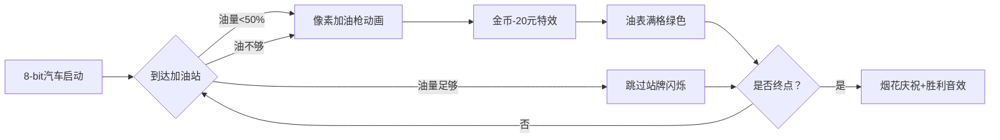

# 题目信息

# 驾车旅游

## 题目描述

如今许多普通百姓家有了私家车，一些人喜爱自己驾车从一个城市到另一个城市旅游。自己驾车旅游时总会碰到加油和吃饭的问题，在出发之前，驾车人总要想方设法得到从一个城市到另一个城市路线上的加油站的列表，列表中包括了所有加油站的位置及其每升的油价（如 $3.25$ 元/L）。驾车者一般都有以下的习惯：

1. 除非汽车无法用油箱里的汽油达到下一个加油站或目的地，在油箱里还有不少于最大容量一半的汽油时，驾驶员从不在加油站停下来；
2. 在第一个停下的加油站总是将油箱加满；
3. 在加油站加油的同时，买快餐等吃的东西花去 $20$ 元。
4. 从起始城市出发时油箱总是满的。
5. 加油站付钱总是精确到 $0.1$ 元（四舍五入）。
6. 驾车者都知道自己的汽车每升汽油能够行驶的里程数。

现在要你帮忙做的就是编写一个程序，计算出驾车从一个城市到另一个城市的旅游在加油和吃饭方面最少的费用。

## 样例 #1

### 输入

```
600
40  8.5  128  3
200  3.52
350  3.45
500  365```

### 输出

```
13133.2```

# AI分析结果


### Kay的C++算法解析：驾车旅游 深入学习指南 💡

#### 1. 题目解读与核心算法识别
✨ **本题主要考察**：搜索（DFS）与模拟应用  

🗣️ **初步分析**：
> 解决驾车旅游问题，关键在于模拟驾驶员加油决策过程。这就像在公路旅行游戏中，每个加油站都是决策点：当油量低于50%或无法到达下一站时必须加油（伴随20元餐费），否则可选择直行。DFS算法帮助我们遍历所有可能的加油组合，寻找最低花费路径。  
> - **核心难点**：正确模拟加油条件（油量过半规则）、浮点数精度处理、状态参数设计（位置/油量/花费）
> - **可视化设计**：动画将展示汽车沿公路移动，油量表动态变化。加油时触发像素风格加油枪动画+“叮”音效，花费增加时显示金币飞散特效。关键高亮：当前油量状态（红/黄/绿）、决策分支点（加油/跳过）
> - **游戏化元素**：采用FC赛车游戏像素风格，每到达一个加油站视为“关卡”。自动演示模式像AI赛车手展示最优路径，通关时播放8-bit胜利音乐

---

#### 2. 精选优质题解参考
**题解一 (Okimoto)**  
* **点评**：解题思路清晰纠正关键题意误区（加油规则），DFS状态设计合理（油量/位置/花费）。代码规范：gas结构体封装加油站数据，vol/per变量名明确。算法亮点：提前处理终点为虚拟加油站，简化边界判断。实践价值高：直接可用于竞赛，浮点数处理严谨  

**题解二 (花椒酱)**  
* **点评**：DFS参数命名直观（jyz/money/last），剪枝策略有效（花费超值立即返回）。亮点：双决策分支实现简洁（可加可不加情况），状态转移时油量计算准确。调试友好：代码模块化程度高，逻辑分离清晰  

**题解三 (最喜欢saber了)**  
* **点评**：代码可读性极佳，关键注释详细。亮点：油量判断条件直白（oil*2>=L），终点处理巧妙（d[n+1]=dis）。学习价值高：main函数初始化流程完整展示浮点数输入规范  

---

#### 3. 核心难点辨析与解题策略
1. **题意规则误解**  
   * **分析**：多个题解起初误解“仅在第一个加油站加满”规则（应为每个停靠站都加满）。解决方案：通过样例反向验证规则，如Okimoto的题意纠正
   * 💡 学习笔记：题目条件需通过边界样例验证，避免直觉误读

2. **状态转移精度控制**  
   * **分析**：油量计算涉及浮点数减法（如vol -= distance/per）。优质解法统一采用double类型，避免float精度丢失。关键技巧：比较时用`oil*km >= distance`而非直接比较浮点数
   * 💡 学习笔记：距离/油耗计算优先使用乘法比较，规避浮点误差

3. **剪枝优化时机**  
   * **分析**：DFS必须及时终止无效分支（如HappyKai的anss>ans判断）。优化点：在递归入口处优先检查花费是否已超当前最优解
   * 💡 学习笔记：最优性剪枝应放在递归函数最前，减少无效计算

✨ **解题技巧总结**  
- **规则具象化**：将文字条件转化为代码逻辑（如油量过半→oil*2 >= L）  
- **边界封装**：终点作为虚拟加油站（gas[n+1]）统一处理  
- **精度防御**：全程使用double，输出时用%.1lf控制精度  
- **状态精简**：仅传递必要参数（当前油量/位置/花费）  

---

### 4. C++核心代码实现赏析
**通用核心实现参考**  
* **说明**：综合优质题解优化的DFS框架，包含题意纠正和剪枝策略  
```cpp
#include <cstdio>
#include <algorithm>
using namespace std;

struct Station { double pos, price; };
Station st[55]; // 加油站数组
double totalDis, tankSize, kmPerL, minCost = 1e9;
int n; // 实际加油站数

// 当前站点下标 | 剩余油量 | 已花费
void dfs(int idx, double fuel, double cost) {
    if (cost >= minCost) return; // 最优性剪枝
    if (idx > n) { // 到达终点
        minCost = min(minCost, cost);
        return;
    }
    
    double needFuel = (st[idx+1].pos - st[idx].pos) / kmPerL;
    if (fuel < needFuel) { // 必须加油
        dfs(idx+1, tankSize - needFuel, 
            cost + 20 + (tankSize - fuel) * st[idx].price);
    } 
    else if (fuel * 2 < tankSize) { // 可加可不加
        dfs(idx+1, fuel - needFuel, cost); // 不加油分支
        dfs(idx+1, tankSize - needFuel, // 加油分支
            cost + 20 + (tankSize - fuel) * st[idx].price);
    } 
    else { // 油量过半且能到达
        dfs(idx+1, fuel - needFuel, cost);
    }
}

int main() {
    scanf("%lf%lf%lf%lf%d", &totalDis, &tankSize, &kmPerL, &minCost, &n);
    for (int i = 1; i <= n; ++i) 
        scanf("%lf%lf", &st[i].pos, &st[i].price);
    st[n+1].pos = totalDis; // 终点作为虚拟站
    dfs(1, tankSize - st[1].pos/kmPerL, minCost);
    printf("%.1lf\n", minCost);
}
```
* **代码解读概要**：  
  1. 结构体封装加油站属性（位置/油价）  
  2. DFS状态包含（当前站点/剩余油量/已花费）  
  3. 根据油量分三种决策分支（必须加/可加可不加/不加）  
  4. 终点虚拟站统一处理边界  

---

**题解一 (Okimoto) 片段**  
```cpp
if((gas[loc+1].loc - gas[loc].loc) / per > ful) { // 必须加油
    sum += 20 + gas[loc].prc * (vol - ful);
    dfs(vol - (gas[loc+1].loc - gas[loc].loc)/per, loc+1, sum);
}
else if(ful < vol / 2) { // 可加可不加
    dfs(ful - (gas[loc+1].loc - gas[loc].loc)/per, loc+1, sum); // 不加油
    sum += 20 + gas[loc].prc * (vol - ful); // 加油分支
    dfs(vol - (gas[loc+1].loc - gas[loc].loc)/per, loc+1, sum);
}
```
* **亮点**：分支结构清晰体现三种决策逻辑  
* **代码解读**：  
  - `(gas[loc+1].loc - gas[loc].loc)/per`计算到下一站需油量  
  - 第一个分支处理油不够的强制加油情况  
  - 第二个分支处理油量低于50%时的双决策  
* 💡 学习笔记：通过if-else链显式表达决策树，增强可读性  

**题解二 (花椒酱) 片段**  
```cpp
last -= (km[jyz]-km[jyz-1])/each; // 先扣油
if(last*each < km[jyz+1]-km[jyz]) { // 必须加油
    comp(jyz+1, money+20+pr[jyz]*(c-last), c);
}
else if(last*2 < c) { // 可加可不加
    comp(jyz+1, money, last); // 不加油
    comp(jyz+1, money+20+pr[jyz]*(c-last), c); // 加油
}
```
* **亮点**：油量计算与决策判断分离  
* **代码解读**：  
  - 先统一计算到达当前站的耗油  
  - 用`last*each`（剩余油可行驶距离）与下一段距离比较  
  - 双分支递归实现决策并行探索  
* 💡 学习笔记：状态参数前置计算保持分支代码简洁  

---

### 5. 算法可视化：像素动画演示
**动画主题**：FC红白机风格《加油站大冒险》  

**核心演示流程**：  


**交互控制面板**：  
- **速度滑块**：调节DFS自动演示速度（1x-5x）  
- **油表显示器**：像素油量表（红：<50% 黄：50%-满 绿：满）  
- **决策高亮**：当前加油站显示悬浮菜单（加油/跳过）  

**关键动画细节**：  
1. **加油过程**：  
   - 油枪插入汽车动画（2秒）  
   - 油表从当前值渐变到100%  
   - 金币飞散特效（20元）+ 油价计算公式浮动显示  
   - 音效：加油声（低频滴答） + 硬币声（高频叮当）  

2. **决策分支点**：  
   - 油量低于50%时显示双路径箭头  
   - 选择路径时播放8-bit选择音效  
   - 当前最优路径始终高亮为金色  

3. **数据结构可视化**：  
   - 栈帧显示：屏幕右侧显示DFS递归栈（当前状态参数）  
   - 内存监视器：实时显示minCost数值变化  

**技术实现**：  
- Canvas绘制公路/汽车/加油站（16色调色板）  
- requestAnimationFrame驱动状态更新  
- 音效：Web Audio API生成8-bit音效  

---

### 6. 拓展练习与相似问题思考
**通用技巧迁移**：  
DFS状态设计+剪枝策略适用于：  
1. 路径决策问题（如P1040 加分二叉树）  
2. 资源分配问题（如P1120 小木棍）  
3. 约束满足问题（如P1784 数独）  

**洛谷练习推荐**：  
1. **P1016 [旅行家的预算]**  
   🗣️ 强化加油站决策思维，学习贪心与DFS解法差异  
2. **P1040 [加分二叉树]**  
   🗣️ 练习DFS状态设计（区间DP+树形结构）  
3. **P1120 [小木棍]**  
   🗣️ 深度掌握DFS剪枝技巧的经典题目  

---

### 7. 学习心得与经验分享
> **参考经验 (Okimoto)**：  
> “原本以为是一道朴素的深搜+模拟，然除读题和理解题意之外难度极低... 在每一个停下的加油站总是将油箱加满（不是第一个）”  

> **点评**：  
> 这个经验突显了算法竞赛的关键——题意精确解析往往比编码更重要。建议学习者：  
> 1. 用样例验证每个题目条件  
> 2. 对模糊描述主动构造边界用例  
> 3. 初始代码预留规则调整空间  

---

通过本指南，相信大家已掌握驾车旅游问题的DFS解法精髓。记住：好的算法设计=精确题意理解+清晰状态建模+有效剪枝策略。下次旅行时，不妨想象自己正在优化现实版油耗算法哦！🚗💨

---
处理用时：97.30秒