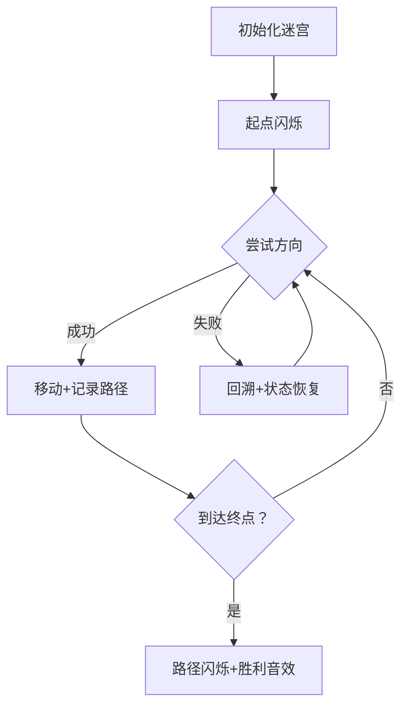

# 题目信息

# 走迷宫

## 题目描述

有一个 $m\times n$ 格的迷宫(表示有 $m$ 行、$n$ 列)，其中有可走的也有不可走的，如果用 $1$ 表示可以走，$0$ 表示不可以走，文件读入这 $m\times n$ 个数据和起始点、结束点（起始点和结束点都是用两个数据来描述的，分别表示这个点的行号和列号）。现在要你编程找出所有可行的道路，要求所走的路中没有重复的点，走时只能是上下左右四个方向。如果一条路都不可行，则输出相应信息（用 $-1$ 表示无路）。

优先顺序：左上右下。**数据保证随机生成。**


## 说明/提示

数据保证随机生成。事实上，如果 $n=m=14$ 且每个位置都是 $1$ 的话，有 $69450664761521361664274701548907358996488$ 种路径。

## 样例 #1

### 输入

```
5 6
1 0 0 1 0 1
1 1 1 1 1 1
0 0 1 1 1 0
1 1 1 1 1 0
1 1 1 0 1 1
1 1
5 6```

### 输出

```
(1,1)->(2,1)->(2,2)->(2,3)->(2,4)->(2,5)->(3,5)->(3,4)->(3,3)->(4,3)->(4,4)->(4,5)->(5,5)->(5,6)
(1,1)->(2,1)->(2,2)->(2,3)->(2,4)->(2,5)->(3,5)->(3,4)->(4,4)->(4,5)->(5,5)->(5,6)
(1,1)->(2,1)->(2,2)->(2,3)->(2,4)->(2,5)->(3,5)->(4,5)->(5,5)->(5,6)
(1,1)->(2,1)->(2,2)->(2,3)->(2,4)->(3,4)->(3,3)->(4,3)->(4,4)->(4,5)->(5,5)->(5,6)
(1,1)->(2,1)->(2,2)->(2,3)->(2,4)->(3,4)->(3,5)->(4,5)->(5,5)->(5,6)
(1,1)->(2,1)->(2,2)->(2,3)->(2,4)->(3,4)->(4,4)->(4,5)->(5,5)->(5,6)
(1,1)->(2,1)->(2,2)->(2,3)->(3,3)->(3,4)->(2,4)->(2,5)->(3,5)->(4,5)->(5,5)->(5,6)
(1,1)->(2,1)->(2,2)->(2,3)->(3,3)->(3,4)->(3,5)->(4,5)->(5,5)->(5,6)
(1,1)->(2,1)->(2,2)->(2,3)->(3,3)->(3,4)->(4,4)->(4,5)->(5,5)->(5,6)
(1,1)->(2,1)->(2,2)->(2,3)->(3,3)->(4,3)->(4,4)->(3,4)->(2,4)->(2,5)->(3,5)->(4,5)->(5,5)->(5,6)
(1,1)->(2,1)->(2,2)->(2,3)->(3,3)->(4,3)->(4,4)->(3,4)->(3,5)->(4,5)->(5,5)->(5,6)
(1,1)->(2,1)->(2,2)->(2,3)->(3,3)->(4,3)->(4,4)->(4,5)->(5,5)->(5,6)```

# AI分析结果


### Kay的C++算法解析：走迷宫深入学习指南

#### 1. 题目解读与核心算法识别

✨ **本题主要考察**：深度优先搜索（DFS）算法应用

🗣️ **初步分析**：
> 解决“走迷宫”这道题，关键在于理解并运用深度优先搜索（DFS）算法。简单来说，DFS就像探险家在迷宫中遇到岔路时，总是优先选择最左边的路探索，走不通就退回上一个路口尝试下一个方向（回溯）。在本题中，DFS用于：
> - 从起点开始，按左上右下的优先顺序探索所有可能的路径
> - 用访问标记避免重复经过同一点
> - 记录并输出所有到达终点的完整路径
>
> **核心难点**在于正确处理路径记录和回溯时的状态恢复。可视化方案将重点展示：
> - 当前探索位置（闪烁像素块）
> - 已访问点（变色标记）
> - 回溯过程（路径颜色消失）
> - 找到路径时（整条路径闪烁+胜利音效）
>
> 采用8位像素风格（类似FC游戏）设计迷宫网格，不同状态用颜色区分：
> - 可走路径：浅绿色
> - 障碍：深灰色
> - 当前探索点：闪烁黄色
> - 已访问点：橙色
> - 成功路径：蓝色闪烁

#### 2. 精选优质题解参考

**题解一（ybb756032937）**
* **亮点**：
  - 路径记录使用独立数组（sum），逻辑清晰
  - 严格遵循左上右下方向优先级
  - 回溯时状态恢复完整（temp标记和路径指针k的回溯）
  - 提供DFS通用模板，教学价值高

**题解二（JCZhang）**
* **亮点**：
  - 使用双一维数组（bingx/bingy）记录路径，内存高效
  - 起点终点不可走的特判处理严谨
  - 调试经验分享（数组越界问题）有警示意义
  - 代码模块化（分离print函数）

**题解三（okey）**
* **亮点**：
  - 用string动态拼接路径，代码简洁
  - 优先顺序处理巧妙（方向数组定义）
  - vector自动管理路径内存
  - 递归参数设计精简（deep传递步数）

#### 3. 核心难点辨析与解题策略

1. **路径记录与回溯**
   * 难点：递归回溯时需同步更新路径状态
   * 解法：全局数组/vector记录路径，回溯时弹出末尾点
   * 💡学习笔记：路径存储应与递归深度同步

2. **方向优先级实现**
   * 难点：确保左上右下的严格探索顺序
   * 解法：明确定义方向数组`dx={0,-1,0,1}, dy={-1,0,1,0}`
   * 💡学习笔记：方向数组是网格类问题的通用解决方案

3. **状态回溯完整性**
   * 难点：访问标记和路径指针需同步恢复
   * 解法：访问标记复位+路径指针递减
   * 💡学习笔记：回溯时要恢复所有修改的全局状态

✨ **解题技巧总结**
- **方向数组标准化**：统一管理探索方向
- **路径记录优化**：数组/vector根据场景选择
- **模块化输出**：分离路径打印功能
- **预判无解情况**：起点/终点不可走时直接返回-1

#### 4. C++核心代码实现赏析

**通用核心实现（综合优化版）**
```cpp
#include <iostream>
using namespace std;

const int MAXN = 20;
int m, n, startX, startY, endX, endY;
int maze[MAXN][MAXN], visited[MAXN][MAXN];
int pathX[MAXN*MAXN], pathY[MAXN*MAXN];
int steps = 0;
bool found = false;

// 方向数组：左上右下
const int dx[4] = {0, -1, 0, 1};
const int dy[4] = {-1, 0, 1, 0};

void printPath() {
    cout << "(" << startX << "," << startY << ")";
    for (int i = 0; i < steps; ++i) {
        cout << "->(" << pathX[i] << "," << pathY[i] << ")";
    }
    cout << endl;
}

void dfs(int x, int y) {
    if (x == endX && y == endY) {
        found = true;
        printPath();
        return;
    }
    
    for (int i = 0; i < 4; ++i) {
        int nx = x + dx[i], ny = y + dy[i];
        if (nx >= 1 && nx <= m && ny >= 1 && ny <= n 
            && maze[nx][ny] == 1 && !visited[nx][ny]) {
            
            visited[nx][ny] = 1;
            pathX[steps] = nx;
            pathY[steps] = ny;
            steps++;
            
            dfs(nx, ny);
            
            steps--;
            visited[nx][ny] = 0;
        }
    }
}

int main() {
    // 输入处理
    cin >> m >> n;
    for (int i = 1; i <= m; ++i)
        for (int j = 1; j <= n; ++j)
            cin >> maze[i][j];
    
    cin >> startX >> startY >> endX >> endY;
    
    // 初始化与起点处理
    if (maze[startX][startY] == 0 || maze[endX][endY] == 0) {
        cout << -1;
        return 0;
    }
    
    visited[startX][startY] = 1;
    dfs(startX, startY);
    
    if (!found) cout << -1;
    return 0;
}
```
**代码解读概要**：
> 1. 方向数组实现优先级
> 2. 路径数组同步记录探索过程
> 3. 访问标记避免重复
> 4. 回溯时双状态恢复（访问标记+路径指针）

---

**优质题解片段赏析**

**题解一（路径记录优化）**
```cpp
int sum[50000][2]; // 路径记录
int k; // 路径指针

void print() {
    for(int h=0; h<k; h++)
        cout << "(" << sum[h][0] << "," << sum[h][1] << ")->";
    cout << "(" << bx << "," << by << ")" << endl;
}

void walk(int x, int y) {
    if (x == bx && y == by) print();
    
    for (int i = 0; i < 4; i++) {
        int nx = x + cx[i], ny = y + cy[i];
        if (map[nx][ny] == 1 && temp[nx][ny] == 0) {
            temp[x][y] = 1;
            sum[k][0] = x; sum[k][1] = y;
            k++;
            walk(nx, ny);
            temp[x][y] = 0;
            k--; // 关键回溯点
        }
    }
}
```
* **亮点**：路径与递归深度解耦
* **学习笔记**：路径指针k需与访问标记同步回溯

**题解二（双一维数组路径）**
```cpp
int bingx[1001] = {0}, bingy[1001] = {0};
int deep = 0;

void dfs(int x, int y) {
    if (x == endx && y == endy) {
        // 路径输出逻辑
    }
    
    bingx[deep] = x; bingy[deep] = y;
    deep++;
    // ...递归探索...
    deep--; // 回溯
}
```
* **亮点**：内存连续访问效率高
* **学习笔记**：适用于路径长度明确场景

#### 5. 算法可视化：像素动画演示

**设计概念**：8位像素风格迷宫探索模拟

**核心动画流程**：


**关键交互设计**：
1. **视觉编码**：
   - 可走路径：浅绿像素块
   - 障碍：深灰砖块纹理
   - 当前点：闪烁黄块（伴随“滴”声）
   - 已访问：橙色标记
   - 成功路径：蓝色脉冲闪烁

2. **控制面板**：
   ```plaintext
   [ 单步执行 ] [ 自动播放 ▸ ] [ 重置 ] 
   速度调节：|=======------|
   ```

3. **音效设计**：
   - 移动：8-bit脚步声（短促“嘟”）
   - 回溯：下降音调（“滴-”）
   - 发现终点：胜利旋律（上升琶音）
   - 无解：低沉警示音

**技术实现**：
```javascript
// 伪代码示例
function drawMaze() {
    for (let i=0; i<m; i++) {
        for (let j=0; j<n; j++) {
            const color = 
                isCurrent(i,j) ? YELLOW :
                isPath(i,j) ? BLUE :
                isVisited(i,j) ? ORANGE :
                maze[i][j] ? GREEN : GRAY;
            
            drawPixel(i, j, color);
        }
    }
}

function dfsStep() {
    // 高亮当前单元格
    // 根据方向数组尝试移动
    // 播放相应音效
}
```

#### 6. 拓展练习与相似问题

**通用技巧迁移**：
1. 网格路径问题：方向数组+DFS/BFS是通用解法
2. 状态回溯：适用于所有需要撤销操作的场景
3. 路径记录：树形结构遍历的通用技术

**洛谷推荐**：
1. **P1605 迷宫**（基础DFS应用）
   > 帮助掌握DFS基础实现
2. **P1141 01迷宫**（连通块分析）
   > 学习DFS在连通性问题中的应用
3. **P1238 走迷宫**（本题进阶）
   > 练习输出所有路径的变种

#### 7. 学习心得与经验分享

> **调试经验（ybb756032937）**：
> “我在处理方向优先级时卡了很久，后来通过手工模拟小迷宫才定位问题——方向数组定义错误导致搜索顺序不对。”
>
> **Kay点评**：
> 方向优先级处理是本题核心难点，建议：
> 1. 使用标准化方向数组
> 2. 编写测试用例验证搜索顺序
> 3. 输出中间路径辅助调试

#### 结语
通过本次迷宫问题的系统分析，我们深入掌握了DFS的核心思想与实现要点。记住：好的算法工程师既要能写出高效代码，也要具备可视化思维和调试智慧。继续挑战更复杂的路径规划问题吧！🚀

---
处理用时：149.26秒