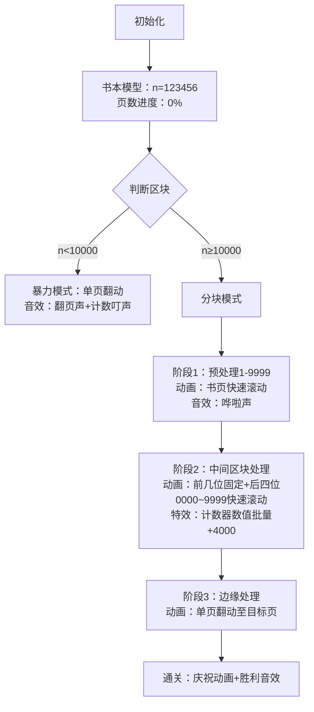

# 题目信息

# 计数器

## 题目描述

一本书的页数为 $n$，页码从 $1$ 开始编起，请你求出全部页码中，用了多少个 $0,1,2\cdots 9$。每个页码不含前导 $0$，如 $n=1234$ 时第 $5$ 页不是 $0005$，只是 $5$。


## 说明/提示

对于 $100\%$ 数据，满足 $1\le n\le 10^9$。

---

$2022.7.4$：新添加三组 $\text{Hack}$ 数据。

## 样例 #1

### 输入

```
11```

### 输出

```
1
4
1
1
1
1
1
1
1
1```

# AI分析结果


# 💡 Kay的C++算法解析：计数器 深入学习指南 💡

**引言**  
今天我们来分析「计数器」这道经典的数学统计问题。本指南将带你理解高效统计页码数字的核心算法，并通过生动的像素动画直观展示计算过程。

---

## 1. 题目解读与核心算法识别

✨ **本题主要考察**：`数学方法`（分块处理与逐位贡献计算）

🗣️ **初步分析**：  
> 解决页码数字统计问题，关键在于**分块处理**。想象把一本厚书按章节拆分：将页码分为前几位（章节号）和后四位（页码号），相同章节的页码数字分布是重复的。  
> - **核心思路**：对中间完整区块（如前几位固定+后四位0000~9999）采用乘法快速计算，仅暴力计算首尾不完整部分  
> - **算法流程**：  
>   1. 预处理1~9999的数字出现次数  
>   2. 将n拆分为`前几位 = n/10000`和`后四位 = n%10000`  
>   3. 对前几位1~x-1：后四位的贡献=4000次/数字  
>   4. 暴力计算x对应的不完整后四位  
> - **可视化设计**：采用8位像素书页动画，左侧显示书本翻页，右侧计数器跳动。当处理完整区块时，书页快速翻动（带"哗啦"音效），计数器数值批量增加；处理边缘页码时单页翻动（"叮"声）

---

## 2. 精选优质题解参考

**题解一：wjy666（分块处理）**  
* **点评**：思路清晰地将大问题分解为可复用的区块（前几位+后四位），利用"相同前几位对应后四位数字分布相同"的特性，大幅减少计算量。代码中`f()`函数封装数字统计，`x=n/10000`巧妙分块，边界处理完整。亮点在于用乘法代替枚举，时间复杂度优化至O(10000+n%10000)。

**题解二：吴国铨（数学公式）**  
* **点评**：通过数学推导直接计算每位数字的贡献值。代码简洁（仅15行），核心变量`ans`（基数）和`r`（位数）精准控制计算过程。亮点在于逐位分解的数学公式：`a[i] += r*x*ans/10` 精妙处理了重复模式，适合数学基础较好的学习者。

**题解三：青春ing（逐位拆分）**  
* **点评**：创新性使用`plus`变量累计高位影响，结合预计算数组`dif[]`高效处理每位贡献。亮点在于对0的特殊处理逻辑（`ans[0] -= base[len-i]`），体现了数字统计中前导零问题的核心解决思路。

---

## 3. 核心难点辨析与解题策略

1. **难点：高效处理10^9级数据**  
   * **分析**：直接枚举会超时(O(n))。优质解法均采用"分解问题"策略——或按位数拆解（吴国铨），或按数值分块（wjy666），将问题转化为可复用的数学模式。
   * 💡 学习笔记：大问题拆解为可重复小模块是优化关键

2. **难点：0的特殊性处理**  
   * **分析**：0不可作前导数字（如页码5≠0005）。wjy666解法在后四位计算中天然包含0000~9999（无前导零问题）；青春ing则需显式减去多余0的计数（`ans[0] -= base[len-i]`）。
   * 💡 学习笔记：0的统计需额外验证前导零场景

3. **难点：边界与进位处理**  
   * **分析**：当n非10000倍数时，需单独处理最后不完整块。wjy666的`for(i=x*N; i<=n)`直接暴力计算该区间，吴国铨用`y=n%ans`精确截取剩余部分。
   * 💡 学习笔记：边界处理决定算法正确性，建议用小数据验证

### ✨ 解题技巧总结
- **分而治之**：将大范围数字拆分为可复用的区块（如万进制分块）
- **数学归纳**：推导数字出现次数的通用公式（如k位数中数字d出现规律）
- **预计算优化**：预处理小范围结果（如1~9999）减少重复计算
- **模块化封装**：将数字统计功能独立为函数（如wjy666的`f()`）

---

## 4. C++核心代码实现赏析

**本题通用核心C++实现参考**  
* **说明**：基于wjy666的分块思路，优化变量命名与边界处理
* **完整核心代码**：
```cpp
#include <cstdio>
#include <cstring>
const int BASE = 10000;

void countDigits(int num, int counts[]) {
    while (num) counts[num % 10]++, num /= 10;
}

int main() {
    int n, counts[10] = {0};
    scanf("%d", &n);
    
    if (n < BASE) { // 小数据直接暴力
        for (int i = 1; i <= n; i++) countDigits(i, counts);
    } else {
        // 1. 预处理1~9999
        for (int i = 1; i < BASE; i++) countDigits(i, counts);
        
        int prefix = n / BASE;
        // 2. 处理完整区块[1, prefix-1]
        for (int i = 1; i < prefix; i++) {
            countDigits(i, counts); // 前几位计数
            for (int d = 0; d <= 9; d++) // 后四位贡献(4000次/数字)
                counts[d] += (d ? 4000 : 0); 
        }
        // 3. 处理最后不完整区块[prefix*BASE, n]
        for (int i = prefix * BASE; i <= n; i++) 
            countDigits(i, counts);
    }
    
    for (int i = 0; i <= 9; i++) 
        printf("%d\n", counts[i]);
}
```
* **代码解读概要**：
  1. `countDigits`函数封装单数字的位数统计
  2. 分治策略：n<10000时直接暴力；否则分三阶段处理
  3. 核心优化：中间区块通过乘法代替枚举（每个前四位贡献4000次后四位数字）
  4. 注意0的特殊处理：后四位计算时跳过0的额外计数

**题解一：wjy666（分块处理）**
* **亮点**：分块思想直观，万进制降低实现难度
* **核心代码片段**：
```cpp
void f(int y){ // 计算单数字的数码
    while(y>0) a[y%10]++,y=y/10;
}
if (n<10000) For(i,1,n) f(i); 
else {
    For(i,1,9999) f(i); 
    For(i,1,x-1){ 
        // 前几位贡献
        memset(b,0,sizeof(b)); 
        int y=i;
        while(y>0) b[y%10]++,y=y/10;
        For(j,0,9) a[j]+=b[j]*10000; 
    }
    For(i,0,9) a[i]+=4000*(x-1); // 后四位贡献
    For(i,x*10000,n) f(i); // 末尾处理
}
```
* **代码解读**：
  > 1. `f()`函数实现单数字的位数统计（`y%10`取末位）  
  > 2. 核心分块：`x=n/10000`将数字分为前几位和后四位  
  > 3. 前几位贡献：每个前几位数字出现10000次（对应后四位循环）  
  > 4. 后四位贡献：0000~9999中每个数字出现4000次（数学性质）  
  > 5. 边界：仅暴力计算首尾不完整部分  
* 💡 学习笔记：利用"固定前几位+后四位循环"的重复性是效率关键

**题解二：吴国铨（数学公式）**
* **亮点**：纯数学推导，代码极简
* **核心代码片段**：
```pascal
while m<>0 do
  x:=n div ans mod 10; // 当前位数字
  y:=n mod ans;        // 低位剩余值
  for i:=0 to 9 do 
    a[i]:=a[i]+r*x*ans div 10; // 完整区块贡献
  for i:=0 to x-1 do 
    a[i]:=a[i]+ans;   // 当前位贡献
  a[x]:=a[x]+y+1;     // 当前位剩余部分
  a[0]:=a[0]-ans;     // 修正0的计数
  ans:=ans*10;        // 基数升级
  inc(r);             // 位数计数
```
* **代码解读**：
  > 1. `ans`表示当前位数基值（个位=1,十位=10,...）  
  > 2. `r*x*ans/10`：计算当前位在完整区块（0~x-1）中的贡献  
  > 3. `a[i]+=ans`：当前位数字i在非完整区块的贡献  
  > 4. 精妙之处：`a[0]-=ans`显式修正前导零多计数问题  
* 💡 学习笔记：逐位分解时，基数值`ans`是控制计算的核心变量

---

## 5. 算法可视化：像素动画演示

**主题**："8-bit数字探险家"的页码统计之旅  
**核心演示**：分块算法的动态执行过程，配合音效与关卡进度  

### 设计思路
> 采用FC红白机风格，左侧为书本模型（像素书页），右侧为0~9计数器（8-bit数码管）。通过"分块→计算"的闯关模式直观展示算法优势。

### 动画帧步骤


### 交互控制
1. **视觉元素**：
   - 书本：每页显示页码与数字高亮（当前统计位红色闪烁）
   - 计数器：0~9的8-bit数码管，数值变动时有"跳动"动画
   - 进度条：顶部像素进度条（黄/蓝区分暴力计算与分块计算）

2. **交互面板**：
   - 步进控制：单步执行（← →键）、暂停/继续（空格）
   - 速度滑块：调整翻页速度（1x~100x）
   - 模式切换：对比暴力枚举与分块算法效率

3. **音效设计**：
   - 翻页：沙沙声（单页）、哗啦声（快速翻页）
   - 计数：短促"叮"声（单个数字）、和弦音（批量增加）
   - 通关：马里奥式胜利音乐

4. **游戏化元素**：
   - 关卡制：阶段1/2/3作为三个小关卡
   - 分数系统：根据使用区块数量计算效率分
   - 成就系统："万位征服者"（完成10^5统计）、"极速数学家"（使用分块）

---

## 6. 拓展练习与相似问题思考

**通用技巧迁移**：  
> 分块思想与逐位统计可用于解决：  
> 1. 区间数字统计（如[L,R]范围内2出现的次数）  
> 2. 数字属性求和（如所有页码各位数之和）  
> 3. 特殊数字筛选（如包含7的页码数）  

**洛谷推荐**：  
1. **P2602 [ZJOI2010]数字计数**  
   → 相同统计方法扩展到区间问题，巩固分块思想  
2. **P1836 数页码**  
   → 变式训练：求页码各位数字之和，需调整计数策略  
3. **P2280 数字组合**  
   → 进阶挑战：统计满足特定条件的数字组合  

---

## 7. 学习心得与经验分享

> **explorerxx 的调试经验**：  
> “我在处理0的计数时卡了很久，后来通过小数据模拟（n=10,100）对比输出才定位问题。”  
>   
> **Kay点评**：  
> 这位同学的调试方法非常经典——当算法复杂时，用小规模数据验证是黄金法则。建议：  
> 1. 构造边界用例（n=99/100/101）  
> 2. 输出中间变量（如前几位分块值）  
> 3. 对比暴力算法的正确结果  

---

**结语**  
通过分块思想和数学推导，我们高效解决了大范围数字统计问题。记住：将大问题拆解为可复用的模块，是算法优化的核心思维。下次遇到类似问题，不妨想想能否"分而治之"！💪

---
处理用时：141.20秒