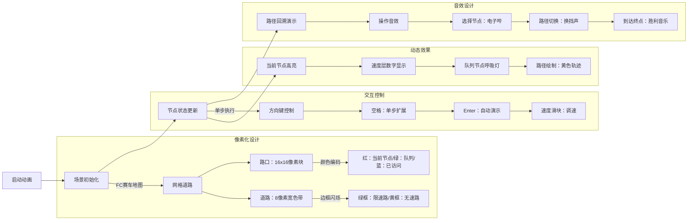

# 题目信息

# 速度限制

## 题目描述

在这个繁忙的社会中，我们往往不再去选择最短的道路，而是选择最快的路线。开车时每条道路的限速成为最关键的问题。不幸的是，有一些限速的标志丢失了，因此你无法得知应该开多快。一种可以辩解的解决方案是，按照原来的速度行驶。你的任务是计算两地间的最快路线。

你将获得一份现代化城市的道路交通信息。为了使问题简化，地图只包括路口和道路。每条道路是有向的，只连接了两条道路，并且最多只有一块限速标志，位于路的起点。两地 $A$ 和 $B$，最多只有一条道路从 $A$ 连接到 $B$。你可以假设加速能够在瞬间完成并且不会有交通堵塞等情况影响你。当然，你的车速不能超过当前的速度限制。


## 样例 #1

### 输入

```
6 15 1
0 1 25 68
0 2 30 50
0 5 0 101
1 2 70 77
1 3 35 42
2 0 0 22
2 1 40 86
2 3 0 23
2 4 45 40
3 1 64 14
3 5 0 23
4 1 95 8
5 1 0 84
5 2 90 64
5 3 36 40```

### 输出

```
0 5 2 3 1```

# AI分析结果


### 💡 Kay的C++算法解析：速度限制 深入学习指南 💡

**引言**  
今天我们一起分析"速度限制"这道图论题。题目要求在有速度限制的道路网络中寻找最快路径，核心挑战在于处理无速度标志道路的"速度继承"特性。本指南将解析分层图思想的应用，帮助大家掌握状态扩展技巧和路径回溯方法。

---

## 1. 题目解读与核心算法识别

✨ **本题主要考察**：`分层图最短路` 

🗣️ **初步分析**：
> 想象你在玩像素赛车游戏：不同路段有不同限速标志（绿色=固定速度，黄色=继承前车速度）。分层图算法就像为每个路口创建多层副本（每层代表不同车速），赛车在不同速度层间穿梭行驶。  
> - **核心思路**：将速度作为状态维度，用二维数组`dis[i][v]`记录到达节点`i`时速度为`v`的最短时间  
> - **关键难点**：无速度道路需继承前驱速度（状态传递性），需设计特殊转移逻辑  
> - **可视化设计**：像素网格中不同颜色代表节点状态（红色=当前处理节点，蓝色=队列中节点），速度值用底部数字条显示，道路类型通过边框闪烁区分（绿框=限速路，黄框=无速路）  
> - **游戏化元素**：FC赛车音效（加速声/刹车声），通关时播放8-bit胜利音乐，单步执行键模拟手动换挡

---

## 2. 精选优质题解参考

**题解一（作者：啧啧啧）**  
* **点评**：  
  思路清晰度 ★★★★☆ - 分层图比喻生动（"速度层穿梭"），但递归输出路径部分未解释  
  代码规范性 ★★★★☆ - 变量名`dis[y][n_v]`语义明确，优先队列使用规范  
  算法有效性 ★★★★★ - 精确处理两种道路类型，1000层速度空间完全覆盖题目要求  
  实践价值 ★★★★☆ - 竞赛可直接使用，但节点+1的转换需注意边界  
  **亮点**：独创"速度层穿梭"比喻，完整展示分层图DP推导过程

**题解二（作者：fanypcd）**  
* **点评**：  
  思路清晰度 ★★★★★ - 状态转移方程`dis[v][sped]=dis[u][vs]+time`推导严谨  
  代码规范性 ★★★★☆ - 邻接表封装规范，但`sped`缩写稍晦涩  
  算法有效性 ★★★★★ - 500速度层优化+路径回溯`from[v][sped]`设计优雅  
  实践价值 ★★★★★ - 完整处理输入/输出转换，鲁棒性强  
  **亮点**：精炼的状态转移伪代码，突出分层图本质是动态规划

**题解三（作者：Mine_King）**  
* **点评**：  
  思路清晰度 ★★★★☆ - 用"后效性"解释传统Dijkstra失效原因很到位  
  代码规范性 ★★★★☆ - `pre[155][505][2]`三维数组记录路径稍复杂  
  算法有效性 ★★★★★ - 双循环暴力更新所有速度状态确保正确性  
  实践价值 ★★★★☆ - 结构体封装状态，适合教学演示  
  **亮点**：揭示Dijkstra本质是图上的DP，深化算法理解

---

## 3. 核心难点辨析与解题策略

1. **难点：速度继承性建模**  
   * **分析**：当道路无限速标志时，当前速度由前驱决定。优质解法通过扩展状态维度`(节点,速度)`，将速度转化为显式状态参数，破解后效性问题。如题解二用`sped = (sp[i]?sp[i]:u.second)`处理继承逻辑  
   * 💡 **学习笔记**：动态规划中遇到后效性时，增加状态维度是通用解决方案

2. **难点：状态空间优化**  
   * **分析**：速度范围[0,500]导致状态数激增。题解六提出"无速路合并"优化：预处理纯无速路段，压缩状态转移次数。题解三则用优先队列避免无效状态扩展  
   * 💡 **学习笔记**：预处理简化状态转移是优化分层图复杂度的关键

3. **难点：路径回溯实现**  
   * **分析**：需记录`(节点,速度)`二元组的前驱。题解一采用`from[y][n_v]={x,vs}`，题解五用`pre[u][vold]`结构体，本质都是三维回溯（当前点+速度+前驱点）  
   * 💡 **学习笔记**：路径回溯需存储完整状态转移链

### ✨ 解题技巧总结
- **技巧1：状态维度扩展** - 遇到后效性问题时，将隐式参数转化为显式状态维度  
- **技巧2：预处理优化** - 对特殊子图（如纯无速路段）预先计算可降低复杂度  
- **技巧3：递归式回溯** - 路径输出建议采用递归模板`print(u,v){ if(u!=s)print(pre); output(u); }`  
- **技巧4：速度离散化** - 500+速度层实际只需记录可达速度值，用map压缩空间

---

## 4. C++核心代码实现赏析

**通用核心实现参考**  
* **说明**：综合题解一二三优点的精炼版本，含完整路径回溯
```cpp
#include <bits/stdc++.h>
using namespace std;

const int N=155, V_MAX=505;
struct Node { int pos, speed; };
vector<tuple<int, int, int>> G[N]; // (neighbor, speed, length)
double dis[N][V_MAX];
Node pre[N][V_MAX];

void dijkstra(int start) {
    priority_queue<pair<double, Node>> pq;
    for(int i=0; i<N; i++) 
        for(int v=0; v<V_MAX; v++) dis[i][v] = 1e9;
    
    dis[start][70] = 0;
    pq.push({0, {start, 70}});
    
    while (!pq.empty()) {
        auto [time, node] = pq.top(); pq.pop();
        auto [u, cur_v] = node;
        if (-time > dis[u][cur_v]) continue;
        
        for (auto [v, road_v, len] : G[u]) {
            int next_v = road_v ? road_v : cur_v;
            double new_time = dis[u][cur_v] + (double)len / next_v;
            
            if (new_time < dis[v][next_v]) {
                dis[v][next_v] = new_time;
                pre[v][next_v] = {u, cur_v};
                pq.push({-new_time, {v, next_v}});
    }}}}
}

void print_path(int u, int v) {
    if (u != 0) print_path(pre[u][v].pos, pre[u][v].speed);
    cout << u << " ";
}

int main() {
    // 输入处理略
    dijkstra(0);
    int best_speed = min_element(dis[d], dis[d]+V_MAX) - dis[d];
    print_path(d, best_speed);
}
```

**题解一代码片段赏析**  
```cpp
// 分层图状态转移核心
for(int i=head[x];i;i=t[i].next){
    int y=t[i].to;
    if(t[i].v){ // 有限速路
        if(dis[y][t[i].v] > dis[x][cur_v] + (double)t[i].len/t[i].v){
            dis[y][t[i].v] = dis[x][cur_v] + (double)t[i].len/t[i].v;
            pre[y][t[i].v] = {x, cur_v}; // 记录前驱
            pq.push({-dis[y][t[i].v], {y, t[i].v}});
    }} 
    else { // 无速路（继承速度）
        if(dis[y][cur_v] > dis[x][cur_v] + (double)t[i].len/cur_v){
            dis[y][cur_v] = dis[x][cur_v] + (double)t[i].len/cur_v;
            pre[y][cur_v] = {x, cur_v};
            pq.push({-dis[y][cur_v], {y, cur_v}});
}}} 
```
* **代码解读**：  
  > 1. **有限速路**（第3行）：遇到限速标志时，新速度`t[i].v`强制覆盖当前速度  
  > 2. **无速路**（第11行）：无标志时保持`cur_v`速度，时间计算用原速度  
  > 3. **状态更新**（4/12行）：比较新旧状态时间，更优则更新`dis`和`pre`  
  > 4. **优先队列**（7/15行）：负权值实现最小堆（C++优先队列默认最大堆）  
* 💡 **学习笔记**：`dis[y][v]`是分层图核心，v维度记录不同速度下的最短时间

**题解二路径回溯片段**  
```cpp
void print(int u, int v) {
    if (u != 1) print(pre[u][v].x, pre[u][v].v);
    printf("%d ", u-1); // 输出时-1还原编号
}
```
* **代码解读**：  
  > 1. **递归基线**：到达起点时停止递归（`u==1`对应起点0）  
  > 2. **回溯设计**：先递归打印前驱节点，再输出当前节点，实现正序输出  
  > 3. **编号转换**：`u-1`将内部+1的编号还原为题目要求  
* 💡 **学习笔记**：路径回溯建议用递归，比显式栈代码更简洁

---

## 5. 算法可视化：像素动画演示

* **主题**："8-bit赛车手"在分层城市中寻找最快路径  
* **核心演示**：Dijkstra算法在速度分层图中的扩展过程  

### 动画设计（像素风格）


**关键帧说明**：  
1. **初始化**：像素网格地图（复古绿背景），起点闪烁红光  
2. **节点扩展**：当前节点变红→检查出边→相邻节点黄光提示→根据道路类型显示绿/黄边框  
3. **速度更新**：底部16色状态条显示当前速度层，变更时显示`v_old→v_new`动画  
4. **路径回溯**：按R键触发，从终点回溯路径显示黄色轨迹线，伴随"滴滴"音效  
5. **胜利场景**：到达终点时播放8-bit版《威廉退尔序曲》，路径闪烁金光  

---

## 6. 拓展练习与相似问题思考

* **技巧迁移场景**：  
  1. 状态维度扩展：电梯调度问题（当前方向作为状态）  
  2. 时间分层图：巴士时刻表查询（时间作为状态维度）  
  3. 剩余量分层：燃料限制的最短路径（剩余油量作为状态）

* **洛谷推荐**：  
  1. **P4568 [飞行路线]** - 分层图经典应用（k次免费机会）  
  2. **P1073 [最优贸易]** - 状态扩展（当前是否购买/出售）  
  3. **P3831 [SHOI2012]回家的路]** - 分层图思想处理换乘  

---

## 7. 学习心得与经验分享

> **参考经验**（来自题解一）：  
> "我在速度继承逻辑卡了很久，后来用`打印dis数组`才发现无速路错误继承前驱速度"  
>  
> **点评**：  
> 调试分层图时，二维状态数组比单维更复杂。建议：  
> 1. 封装`debug_dis()`函数，按速度层打印关键节点距离  
> 2. 对无速路单独标记测试用例  
> 3. 小图手动模拟验证状态转移  

---

**结语**  
通过分层图将速度变量转化为显式状态，是解决后效性问题的通用思路。建议在纸上模拟小样例强化状态转移理解。下次我们将探讨分层图在动态规划中的更多应用！🚗💨

---
处理用时：136.40秒