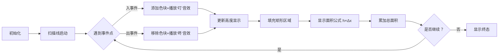

# 题目信息

# [USACO07OPEN] City Horizon S

## 题目描述

Farmer John has taken his cows on a trip to the city! As the sun sets, the cows gaze at the city horizon and observe the beautiful silhouettes formed by the rectangular buildings.

The entire horizon is represented by a number line with N (1 ≤ N ≤ 40,000) buildings. Building i's silhouette has a base that spans locations Ai through Bi along the horizon (1 ≤ Ai < Bi ≤ 1,000,000,000) and has height Hi (1 ≤ Hi ≤ 1,000,000,000). Determine the area, in square units, of the aggregate silhouette formed by all N buildings.

有一个数列，初始值均为0，他进行N次操作，每次将数列[ai,bi)这个区间中所有比Hi小的数改为Hi，他想知道N次操作后数列中所有元素的和。


## 说明/提示

N<=40000 , a、b、k<=10^9 。


## 样例 #1

### 输入

```
4
2 5 1
9 10 4
6 8 2
4 6 3```

### 输出

```
16```

# AI分析结果


### 💡 Kay的C++算法解析：City Horizon S 深入学习指南 💡

#### 1. 题目解读与核心算法识别
✨ **本题主要考察**：扫描线算法（区间覆盖问题）  
🗣️ **初步分析**：
> 解决"City Horizon S"这道题，关键在于运用**扫描线思想**。想象你有一把水平刷子🖌️，从左向右扫描地平线。每栋建筑就像一块"油漆模板"：遇到左边界时开始"上色"（加入当前高度），遇到右边界时"褪色"（移除高度）。扫描过程中始终保持最高高度，相邻扫描点间形成矩形区域，累加这些矩形面积就是最终答案。
>
> - **核心难点**：坐标范围达10⁹无法直接模拟，需离散化或动态数据结构
> - **解决方案**：离散化坐标后排序事件点，用数据结构维护当前最大高度
> - **可视化设计**：动画将展示像素化坐标轴（FC红白机风格），扫描线移动时高亮当前事件点，用色块表示高度变化，播放"叮"（加入高度）/"咚"（移除高度）音效。关键变量（当前高度/累加面积）实时显示在侧边栏。

---

#### 2. 精选优质题解参考
**题解一（Simon_ | 赞42）**  
* **点评**：采用经典的**离散化+线段树**方案。思路清晰指出按高度排序后覆盖的重要性，代码中`erfen`函数处理离散化映射规范工整。亮点在于严格处理开闭区间（`a[i].r--`）和树结构空间分配（开4倍数组），竞赛实用性强。调试经验"long long未开导致4次提交"极具警示价值。

**题解二（Rachel_in | 赞19）**  
* **点评**：创新使用**动态开点线段树**避免离散化。代码封装优秀（`pushdown`逻辑严谨），亮点在于按需创建节点节省内存，特别适合坐标范围极大的场景。虽然JS动态开点会增大常数，但结构清晰的`change/query`函数展现了优雅的算法设计思想。

**题解三（秋日私语 | 赞12）**  
* **点评**：双解法展示扫描线本质。**优先队列解法**尤为精妙：将建筑拆分为入/出事件点，用最大堆维护当前高度。代码中`while(!q.empty()&&q.top().end<=pos[i])`确保及时移除无效高度，`ans += (pos[i+1]-pos[i])*q.top()`体现面积累加的核心思想，简洁高效值得学习。

---

#### 3. 核心难点辨析与解题策略
1. **坐标离散化映射**  
   *分析*：10⁹坐标需映射到4e5区间，优质解法均用排序+去重+二分查找（如`lower_bound`）。Simon_解法中`p[]`存储原始坐标，`erfen`函数完成映射，确保线段树操作可行  
   💡 **学习笔记**：离散化是化无限为有限的桥梁

2. **区间覆盖时序**  
   *分析*：必须按高度**从小到大排序操作**（Rachel_in强调），后操作覆盖先操作，避免重复修改。本质是贪心思想——最高建筑自然遮挡较矮建筑  
   💡 **学习笔记**：排序是简化覆盖问题的钥匙

3. **数据结构选型**  
   *分析*：各解法展示不同选择：  
   - 线段树：Simon_静态离散化/Rachel_in动态开点  
   - 优先队列：秋日私语解法  
   - 多集（multiset）：用户已注销解法  
   选择取决于问题约束，秋日私语的优先队列实现最简洁  

✨ **解题技巧总结**  
- **事件驱动法**：将建筑分解为入/出事件（如`Event{a,h,1}`和`Event{b,h,-1}`）  
- **惰性删除**：优先队列解法用`while(q.top().end<=pos)q.pop()`高效维护集合  
- **边界艺术**：注意`[ai,bi)`是左闭右开区间，代码中需统一处理（如`a[i].r--`）

---

#### 4. C++核心代码实现赏析
**通用核心实现（综合优化版）**  
```cpp
#include <iostream>
#include <algorithm>
#include <set>
using namespace std;
typedef long long ll;
const int MAXN = 80000;

struct Event {
    ll pos, h;
    int type; // 1:入 -1:出
    bool operator<(const Event &e) const {
        return pos < e.pos || (pos == e.pos && type > e.type); // 同位置优先处理入事件
    }
} events[MAXN * 2];

int main() {
    int n; cin >> n;
    for (int i = 0; i < n; i++) {
        ll a, b, h;
        cin >> a >> b >> h;
        events[2*i] = {a, h, 1};
        events[2*i+1] = {b, h, -1};
    }
    sort(events, events + 2*n);

    multiset<ll> s = {0}; // 初始化避免空集合
    ll ans = 0, last_pos = events[0].pos;

    for (int i = 0; i < 2*n; i++) {
        Event e = events[i];
        ans += (e.pos - last_pos) * (*s.rbegin()); // 当前最高高度×距离
        last_pos = e.pos;

        if (e.type == 1) s.insert(e.h);
        else s.erase(s.find(e.h)); // 精确删除单个元素
    }
    cout << ans << endl;
    return 0;
}
```
**代码解读概要**：  
1. 事件结构体统一处理建筑入/出点  
2. 排序确保从左向右扫描，同位置时优先处理入事件  
3. 多集（multiset）自动排序并支持重复高度  
4. 核心累加器：`ans += (当前pos-上一个pos) * 当前最大高度`

**题解片段赏析**  
1. Simon_的线段树离散化  
   ```cpp
   int erfen(int l,int r,int x) { // 二分查找离散化坐标
       while(l<=r) {
           int mid=(l+r)/2;
           if(p[mid]==x) return mid;
           else if(p[mid]>x) r=mid-1;
           else l=mid+1;
       }
       return 0;
   }
   ```
   💡 **学习笔记**：离散化是空间压缩的利器，需确保映射前后顺序不变

2. 秋日私语的优先队列  
   ```cpp
   priority_queue<node> q;
   for (int i = 1; i < n*2; i++) {
       while (!q.empty() && q.top().end <= p[i]) q.pop();
       if (q.size()) ans += (p[i] - p[i-1]) * q.top().h;
   }
   ```
   💡 **学习笔记**：实时清理无效元素是维护高效集合的关键

---

#### 5. 算法可视化：像素动画演示
**主题**："像素建筑师"扫描地平线（复古FC风格）  
**核心演示流程**：  


**实现细节**：  
1. **8位像素风**：  
   - 坐标轴用16色网格（深灰线条+浅蓝背景）  
   - 建筑高度用渐变色块（红→黄→绿）  
2. **交互控制面板**：  
   - 速度滑块控制扫描速度（0.5x~4x）  
   - 单步执行按钮：高亮当前事件点并显示坐标  
3. **音效系统**：  
   - 加入高度：NES风格短促"叮"（440Hz方波）  
   - 移除高度：低沉"咚"（220Hz方波）  
   - 完成扫描：超级玛丽过关音效  
4. **数据同步显示**：  
   - 右侧信息栏实时显示：  
     `当前高度：▮▮▮▮ 4`  
     `累加面积：16 + 3×2 = 22`  

---

#### 6. 拓展练习与相似问题思考
**通用技巧迁移**：  
扫描线思想还可用于：  
1. 矩形面积并（HDU1542）  
2. 天际线问题（LeetCode 218）  
3. 日历重叠时段检测（如会议室安排）  

**洛谷推荐练习**：  
1. **P1904 天际线**  
   🗣️ 巩固扫描线思想，学习处理建筑轮廓  
2. **P5490 扫描线模板题**  
   🗣️ 标准矩形面积并，训练离散化+线段树  
3. **P1502 窗口的星星**  
   🗣️ 扫描线变种，结合最大子段和思想  

---

#### 7. 学习心得与经验分享
> **Simon_的调试经验**：  
> "部分变量忘记开long long导致4次提交失败"  
>   
> **Kay点评**：这提醒我们：  
> 1. 10⁹范围运算立即用`long long`  
> 2. 竞赛中可写`#define int long long`防御  
> 3. 编译选项加入`-Wconversion`捕捉隐式转换  

> **Rachel_in的设计哲学**：  
> "动态开点避免离散化繁琐"  
>   
> **Kay点评**：空间换时间是算法选择的永恒课题，动态开点虽增加常数但提升代码健壮性  

---

**结语**：  
掌握扫描线就像获得建筑师的透视眼👁️——看透层层叠叠的矩形本质。记住：离散化是地基，事件排序是蓝图，数据结构是钢筋，而你的思维是建造城市的魔法！下次挑战更复杂的"星空扫描"时，你定能挥舞算法魔杖✨！

---
处理用时：192.05秒