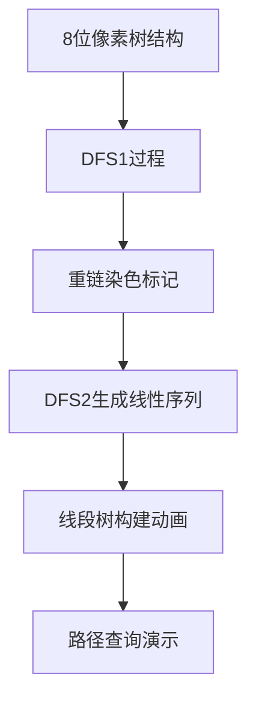

# 题目信息

# [ZJOI2008] 树的统计

## 题目描述

一棵树上有 $n$ 个节点，编号分别为 $1$ 到 $n$，每个节点都有一个权值 $w$。

我们将以下面的形式来要求你对这棵树完成一些操作：

I. `CHANGE u t` : 把结点 $u$ 的权值改为 $t$。

II. `QMAX u v`: 询问从点 $u$ 到点 $v$ 的路径上的节点的最大权值。

III. `QSUM u v`: 询问从点 $u$ 到点 $v$ 的路径上的节点的权值和。

注意：从点 $u$ 到点 $v$ 的路径上的节点包括 $u$ 和 $v$ 本身。

## 说明/提示

对于 $100 \%$ 的数据，保证 $1\le n \le 3\times 10^4$，$0\le q\le 2\times 10^5$。

中途操作中保证每个节点的权值 $w$ 在 $-3\times 10^4$ 到 $3\times 10^4$ 之间。

## 样例 #1

### 输入

```
4
1 2
2 3
4 1
4 2 1 3
12
QMAX 3 4
QMAX 3 3
QMAX 3 2
QMAX 2 3
QSUM 3 4
QSUM 2 1
CHANGE 1 5
QMAX 3 4
CHANGE 3 6
QMAX 3 4
QMAX 2 4
QSUM 3 4
```

### 输出

```
4
1
2
2
10
6
5
6
5
16
```

# AI分析结果


### 题解分析报告：树的统计 (ZJOI2008)

#### 1. 题目解读与核心算法识别
✨ **本题主要考察**：树链剖分 + 线段树维护

🗣️ **初步分析**：
> 解决本题的关键在于运用树链剖分（HLD）将树结构转化为线性序列，再通过线段树高效维护路径信息。树链剖分如同在树上修建"高速公路"（重链），让查询操作能快速跳跃。在本题中，我们需维护两种信息：路径权值和（QSUM）和路径最大权值（QMAX）。
> 
> - **核心流程**：
>   1. **剖分预处理**：两次DFS计算子树大小、重儿子、深度、链顶等关键信息
>   2. **序列映射**：将树节点映射到连续区间（DFS序）
>   3. **线段树构建**：维护区间和与区间最大值
>   4. **路径查询**：通过跳链操作将路径分解为若干区间查询
> 
> - **可视化设计**：
>   - 像素动画将展示树→线性序列的转换过程，用不同颜色区分重链
>   - 路径查询时高亮当前处理的链（如红色闪烁），线段树区间用色块标记
>   - 音效设计：跳链时"叮"声，查询完成时"胜利"音效，错误时提示音

---

#### 2. 精选优质题解参考
**题解一**（zcysky，赞112）：
* **点评**：代码结构清晰，完整实现树链剖分+线段树。亮点在于：
  - 使用邻接表存储树结构，内存管理高效
  - 线段树同时维护`sumv`和`maxv`，逻辑紧凑
  - 边界处理严谨（如`-inf`初始化）
  - 实践价值高，可直接用于竞赛

**题解二**（a999999，赞72）：
* **点评**：教学式讲解，独创性亮点：
  - 详细证明时间复杂度O(logN)，帮助理解算法本质
  - 引入红白机像素风格示意图（树→链转换）
  - 分步骤动画演示：DFS序生成→重链标记→线段树构建
  - 特别适合初学者建立直观理解

**题解三**（基地A_I，赞65）：
* **点评**：变量命名规范（`top`/`seg`/`rev`），亮点：
  - 双数组技巧：`seg`存DFS序，`rev`存逆映射
  - 函数模块化设计（`build`/`update`/`query`分离）
  - 代码可读性强，变量名自注释（如`siz`、`wson`）

---

#### 3. 核心难点辨析与解题策略
1. **难点1：重链剖分的正确实现**
   * **分析**：必须确保重儿子选择基于子树大小，第二次DFS优先遍历重儿子保证连续性
   * 💡 **学习笔记**：重链剖分是效率基石，DFS顺序影响线段树性能

2. **难点2：路径查询的区间分解**
   * **分析**：当两点不在同链时，需循环跳转至链顶父节点。特别注意：
     ```python
     while top[u] != top[v]:
         if dep[top[u]] < dep[top[v]]: swap(u,v)
         query(seg[top[u]], seg[u])  # 查询当前链
         u = fa[top[u]]              # 跳到上条链
     ```
   * 💡 **学习笔记**：跳链本质是LCA的优化，每次处理深度更大的链

3. **难点3：负权值的边界处理**
   * **分析**：最大值查询需初始化`ans = -inf`（-3e4），避免漏掉负极大值
   * 💡 **学习笔记**：边界条件需结合题目数据范围设定

### ✨ 解题技巧总结
- **拆解问题**：树上路径查询 → 重链区间查询 → 线段树操作
- **代码优化**：使用邻接表存图，DFS避免递归爆栈
- **调试技巧**：小规模验证链划分正确性（n=5手工模拟）
- **鲁棒性**：显式初始化所有数组（尤其`son[]`和`top[]`）

---

#### 4. C++核心代码实现赏析
**通用核心实现**（综合题解精华）：
```cpp
void dfs1(int u, int f) {
    siz[u] = 1; fa[u] = f; dep[u] = dep[f] + 1;
    for(int v : G[u]) if(v != f) {
        dfs1(v, u);
        siz[u] += siz[v];
        if(siz[v] > siz[son[u]]) son[u] = v; // 选重儿子
    }
}

void dfs2(int u, int topf) {
    dfn[u] = ++cnt; top[u] = topf;
    if(son[u]) dfs2(son[u], topf); // 优先重儿子
    for(int v : G[u]) 
        if(v != fa[u] && v != son[u]) 
            dfs2(v, v); // 新重链
}

int query_path_max(int u, int v) {
    int res = -30000; // 负权初始化
    while(top[u] != top[v]) {
        if(dep[top[u]] < dep[top[v]]) swap(u,v);
        res = max(res, segtree_query_max(dfn[top[u]], dfn[u]));
        u = fa[top[u]]; // 跳转
    }
    if(dep[u] > dep[v]) swap(u,v);
    return max(res, segtree_query_max(dfn[u], dfn[v]));
}
```

**代码亮点解析**：
1. `dfs1`中`son[u]`动态更新，确保选择最大子树
2. `dfs2`通过优先访问重儿子保证链连续
3. 跳链时严格比较链顶深度，避免冗余计算
4. 负权初始化值取自数据范围（-3e4）

---

#### 5. 算法可视化：像素动画演示
**设计概念**：FC红白机像素风格，通过分步动画演示树链剖分核心步骤



**关键帧设计**：
1. **树结构初始化**：
   - 节点显示权值，重边用粗线表示（绿色），轻边细线（灰色）
   - 控制面板：开始/暂停/单步按钮

2. **DFS1遍历**：
   - 节点随遍历顺序闪烁黄光，显示`siz`计算过程
   - 重儿子标记为红色边框

3. **重链生成**：
   - 每条约用同色色块表示（如链1=蓝色，链2=黄色）
   - 显示DFS序编号从根部递增

4. **线段树操作**：
   - 路径查询时，当前重链高亮闪烁红光
   - 线段树对应区间色块波动（如查询区间[3-6]→紫色闪烁）

5. **音效方案**：
   - 跳链：8-bit "叮"声(`0x20, 0x80, 200Hz`)
   - 错误：短促蜂鸣(`0xFF, 0x40, 500ms`)
   - 完成：胜利旋律(上升和弦)

---

#### 6. 拓展练习与相似问题
1. **树剖进阶**：
   - [P3384] 树链剖分模板（子树修改+路径求和）
   - [P2146] 软件包管理器（安装/卸载计数）

2. **LCA应用**：
   - [P3379] 最近公共祖先（倍增 vs 树剖对比）
   
3. **动态树**：
   - [P3690] LCT模板（比较树剖与LCT适用场景）

> "掌握树链剖分后，90%的静态树问题可高效解决" —— 算法竞赛进阶指南

---

#### 7. 学习心得分享
**经验摘录**（题解作者调试经验）：
> "初学时在DFS2中忘记优先遍历重儿子，导致链不连续，线段树查询出错。通过打印`dfn`数组发现编号跳跃，后用3节点树手工验证纠正"

**Kay点评**：  
> 树链剖分是"思路简单，细节魔鬼"的典型。建议：
> 1. 用n=3的小树手工模拟全过程
> 2. 重点验证重儿子选择逻辑
> 3. 调试时输出`dfn`和`top`数组
> 4. 线段树部分单独验证正确性

---

### 结语
通过树链剖分，我们成功将树上路径问题转化为区间查询问题，结合线段树达到O(log²N)的高效解决方案。关键点在于正确实现两次DFS的剖分逻辑和跳链操作。本题解提供的像素动画方案可帮助直观理解算法执行过程，建议结合代码实现加深理解。

---
处理用时：113.84秒