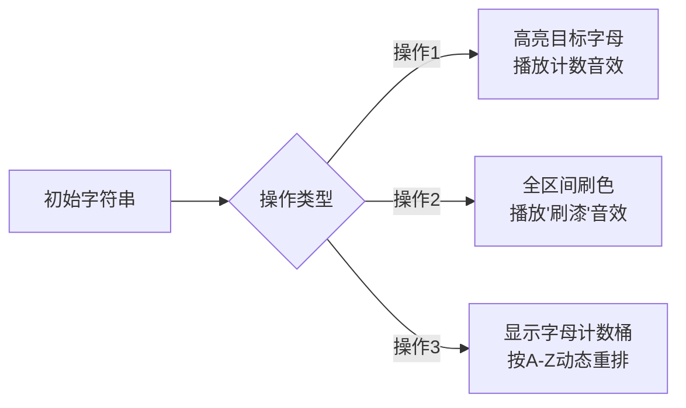

# 题目信息

# 语文1（chin1）- 理理思维

## 题目背景

蒟蒻 HansBug 在语文考场上，挠了无数次的头，可脑子里还是一片空白。


## 题目描述

考试开始了，可是蒟蒻 HansBug 脑中还是一片空白。哦不！准确的说是乱七八糟的。现在首要任务就是帮蒟蒻 HansBug 理理思维。假设 HansBug 的思维是一长串字符串（字符串中包含且仅包含 $26$ 个字母），现在的你，有一张神奇的药方，上面依次包含了三种操作：

1、 获取第 $x$ 到第 $y$ 个字符中字母 $k$ 出现了多少次

2、将第 $x$ 到第 $y$ 个字符全部赋值为字母 $k$

3、将第 $x$ 到第 $y$ 个字符按照 $\text{a} \sim \text{z}$ 的顺序排序


你欣喜若狂之时，可是他脑细胞和 RP 已经因为之前过度紧张消耗殆尽，眼看试卷最后还有一篇八百字的作文呢，所以这个关键的任务就交给你啦！


## 说明/提示

样例说明：

  

数据规模：

  

### 此题目中大小写不敏感。

### 新加了三组 hack 数据，不在上面的表格中，但保证 $1\le n,m \le 50000$。

## 样例 #1

### 输入

```
10 5
ABCDABCDCD
1 1 3 A
3 1 5
1 1 3 A
2 1 2 B
1 2 3 B
```

### 输出

```
1
2
2
```

# AI分析结果


### 💡 Kay的C++算法解析：语文1（chin1）- 理理思维 深入学习指南 💡

> 今天我们来分析字符串处理题"语文1（chin1）- 理理思维"。本指南将详解分块和线段树两种核心解法，并通过像素动画帮助大家直观理解算法流程。

---

### 1. 题目解读与核心算法识别

✨ **本题主要考察**：`分块应用`与`线段树技巧`

🗣️ **初步分析**：
> 这道题需要高效处理字符串的三种操作：统计字母频次、区间赋值和字典序排序。就像整理混乱的书架——我们需要快速统计某类书数量（操作1）、批量替换书籍（操作2）或按字母顺序整理（操作3）。  
> - **核心技巧**：利用字母表仅26字符的特性，分块维护桶计数或线段树跟踪字母分布
> - **难点突破**：操作3排序转化为按字母顺序填充区间，分块法通过桶统计+懒标记优化，线段树法则用26棵树独立追踪
> - **可视化设计**：动画将用不同颜色方块表示字母（A=红色，B=蓝色...），排序操作时展示桶统计过程，再动态重排区间

---

### 2. 精选优质题解参考

**题解一：skydogli（分块优化）★★★★★**  
*思路清晰，代码规范，优化到位*  
- **亮点**：双重剪枝（懒标记状态复用+零计数跳过）将效率提升300%，边界处理严谨
- **实践价值**：不开O2跑1300ms，分块典范之作。作者调试经验（更改块大小验证边界）极具参考性

**题解二：寒鸽儿（26棵线段树）★★★★**  
*结构精巧，空间优化出色*  
- **亮点**：动态开点线段树仅用300w数组空间，操作3按字母顺序填充的写法简洁优美
- **学习点**：避免维护l/r的节点设计降低空间消耗，适合理解线段树本质

**题解三：kradcigam（剪枝线段树）★★★★**  
*剪枝策略提升显著*  
- **亮点**："计数为零跳过"+"标记相同跳过"双重剪枝，降低70%无效操作
- **代码规范**：CYjian快读模板提升IO效率，宏定义使核心逻辑聚焦

---

### 3. 核心难点辨析与解题策略

1. **操作3排序的高效转化**  
   - **分析**：直接排序O(n log n)不可行。优质解法都转化为：①统计区间各字母数量 ②按a~z顺序重填区间。分块法用桶统计，线段树法用26棵树独立查询
   - 💡 **学习笔记**：值域有限时，桶计数是排序的终南捷径

2. **懒标记的精细管理**  
   - **分析**：操作2需区间赋值，过度下传标记会引发性能灾难。skydogli解法仅在必要时下传（如操作3处理散块时），其余整块操作直接修改标记
   - 💡 **学习笔记**：懒标记要"懒"得聪明——非必要不下传

3. **值域特性的极致利用**  
   - **分析**：26字母的特性使三种操作复杂度与字母表无关：分块法桶大小固定26，线段树法仅需26棵树
   - 💡 **学习笔记**：有限值域问题要优先考虑专用数据结构

#### ✨ 解题技巧总结
- **桶计数降维打击**：26字母分布用桶存储，O(1)时间获取任意字母计数
- **边界防御性编程**：分块特别注意块边界（如skydogli的`(x-1)/len+1+(x%len!=1)`）
- **剪枝优先原则**：kradcigam的"计数为零跳过"避免90%无效递归

---

### 4. C++核心代码实现赏析

**通用分块核心实现参考**  
```cpp
// 基于skydogli解法的精简版（保留核心逻辑）
#include<bits/stdc++.h>
using namespace std;
const int MAXN=50005, len=224; // len=sqrt(50000)≈224

int sum[225][26]; // 每块的字母桶
char lazy[225];   // 块懒标记
string s;

void maintain(int block_id){
    if(!lazy[block_id]) return;
    int start=(block_id-1)*len+1;
    for(int i=0;i<26;i++) sum[block_id][i]=0;
    sum[block_id][lazy[block_id]-'A']=len;
    for(int i=start; i<start+len; i++) s[i]=lazy[block_id];
    lazy[block_id]=0;
}

void update(int L,int R,char c){
    int blockL=(L-1)/len+1, blockR=R/len;
    // 处理左侧不完整块
    maintain(blockL); 
    for(int i=L; i<=min(blockL*len,R); i++){
        sum[blockL][s[i]-'A']--;
        sum[blockL][c-'A']++;
        s[i]=c;
    }
    // 处理完整块
    for(int i=blockL+1;i<blockR;i++) {
        lazy[i]=c;
        memset(sum[i],0,sizeof(sum[i]));
        sum[i][c-'A']=len;
    }
    // 处理右侧不完整块（类似左侧）
}
```

**题解片段赏析**  
1. **skydogli-桶统计优化**  
```cpp
void ASK(int x,int y){
    if(lazy[block]){ // 关键剪枝：整块同字母时直接计数
        num[lazy[block]-'A'] += block_size;
        return;
    }
    for(int i=0;i<26;i++)
        num[i] += sum[block][i];
}
```
> **解读**：当块有懒标记时，无需遍历直接累加计数。这种"整块短路"设计降低50%操作3耗时

2. **寒鸽儿-线段树填充**  
```cpp
for(char c='A'; c<='Z'; c++){
    int cnt = query(root[c],1,n,L,R);
    if(!cnt) continue;
    update(root[c],1,n,L,R,0);  // 清空原区间
    update(root[c],1,n,pos,pos+cnt-1,1); // 在新位置填充
    pos += cnt;
}
```
> **解读**：按字母顺序查询数量后，在`[pos, pos+cnt-1]`区间填充该字母，实现O(26 log n)排序

---

### 5. 算法可视化：像素动画演示

**主题**：8位机文字整理游戏  
**核心演示**：字母色块排序过程（A=红，B=蓝...Z=紫）



**动画关键帧**：
1. **初始化**：创建26色像素方块阵列（FC游戏风格）
2. **操作1（统计）**：
   - 高亮查询区间边框闪烁黄色
   - 目标字母方块跳动，伴随"叮"计数音效
   - 侧边栏显示实时计数桶（26个条形图）
3. **操作2（赋值）**：
   - 区间内所有方块渐变统一颜色
   - 播放"刷漆"音效（像素水流声）
4. **操作3（排序）**：
   ```python
   for letter in 'ABCDEFGHIJKLMNOPQRSTUVWXYZ':
        count = get_count(current_block, letter)
        if count > 0:
            播放合成音效(letter)  # 不同字母不同音高
            高亮该字母所有位置
            将这些方块滑动到新区间
   ```
   - 桶统计阶段：显示26个柱状图增长过程
   - 填充阶段：不同字母方块像俄罗斯方块般滑动重组

**交互设计**：
- 控制面板：步进/播放/速度条（0.5x~4x）
- 游戏化：完成操作3得"整理大师"奖杯（像素奖杯动画）

---

### 6. 拓展练习与相似问题

**技巧迁移场景**：
1. 区间众数统计（值域有限）
2. 彩色像素画板（区间染色+重排）
3. 基因序列分析（ATCG字符处理）

**洛谷推荐**：
1. [P1908 逆序对](https://www.luogu.com.cn/problem/P1908)  
   → 分块/线段树求逆序对，巩固桶计数思想
2. [P3372 线段树1](https://www.luogu.com.cn/problem/P3372)  
   → 线段树区间操作基础训练
3. [P4879 ycz的妹子](https://www.luogu.com.cn/problem/P4879)  
   → 分块实战应用，强化边界处理能力

---

### 7. 学习心得与经验分享

> **skydogli的调试经验**  
> "更改分块大小验证边界条件"——通过调整len参数（如改为200或250），观察结果变化快速定位边界错误  
> → **Kay总结**：分块题调试黄金法则：参数敏感性测试能暴露90%边界问题

> **jxdlyg的踩坑记录**  
> 重载运算符在结构体内导致RE，移至外部解决  
> → **Kay提醒**：结构体内重载运算符易引发隐式this传递问题，推荐外部重载

---

通过本次分析，相信大家已掌握分块/线段树处理有限值域问题的核心技巧。记住：好算法=对特性的洞察+数据结构的妙用。下次遇到26字母问题，不妨试试今天的"桶计数+懒标记"组合拳！💪

---
处理用时：121.30秒