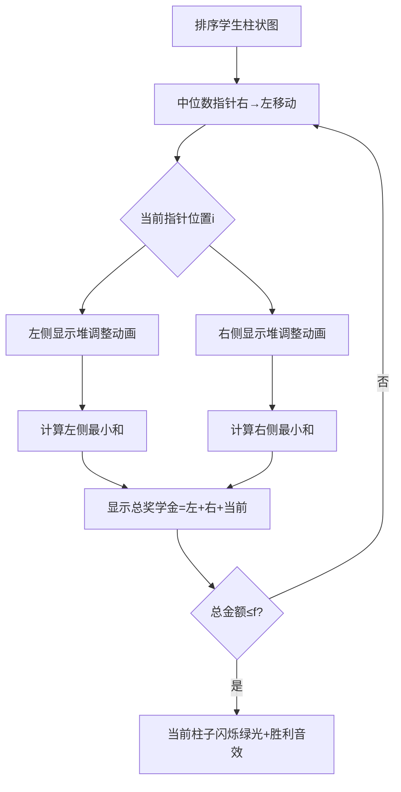

# 题目信息

# [TJOI2013] 奖学金

## 题目背景

小张最近发表了一篇论文，有一个神秘人物要给小张学院发奖学金。

## 题目描述

小张学院有 $c$ 名学生，第 $i$ 名学生的成绩为 $a_i$，要获得的奖学金金额为 $b_i$。  
要从这 $c$ 名学生中挑出 $n$ 名学生发奖学金。这个神秘人物爱好奇特，他希望得到奖学金的同学的**成绩**的**中位数**尽可能大，但同时，他们的**奖学金总额**不能超过 $f$。


## 说明/提示

### 样例 1 解释

选择成绩为 $5$，$35$，$50$ 的三名同学，奖金总额为 $18 + 30 + 21 = 69$。

### 数据规模与约定

- 对于 $30\%$ 的数据，保证 $n \leq 10^3$，$c \leq 2 \times 10^3$。
- 对于 $100\%$ 的数据，保证 $3 \leq n  \leq 10^5$，$n \leq c \leq 2 \times 10^5$，$0 \leq f \leq 2\times 10^9$，$0 \leq a_i \leq 2 \times 10^9$，$0 \leq b_i \leq 10^5$。

## 样例 #1

### 输入

```
3 5 70
30 25
50 21
20 20
5 18
35 30
```

### 输出

```
35```

## 样例 #2

### 输入

```
5 6 9
4 0
4 1
6 3
8 0
10 4
10 5
```

### 输出

```
6```

# AI分析结果


# 💡 Kay的C++算法解析：[TJOI2013] 奖学金 深入学习指南 💡

## 1. 题目解读与核心算法识别

✨ **本题主要考察**：贪心算法 + 优先队列应用

🗣️ **初步分析**：
> 解决这道题目的关键在于**枚举中位数**并**高效计算两侧最小奖学金和**。想象你在组建一支队伍，中位数代表队伍的核心水平（越高越好），但每个队员的奖学金是雇佣成本。策略是：
> - 先按成绩排序（便于定位中位数）
> - 用大根堆动态维护两侧最小奖学金和
> - 从高到低枚举中位数，快速验证可行性
> 
> **可视化设计思路**：
> - 像素风格：学生成绩用不同高度的柱子表示（类似马里奥的管道），奖学金显示为柱顶金币数
> - 动画流程：像素小人（中位数指针）从右向左移动，两侧弹出奖学金最小的队员（堆顶高亮）
> - 关键交互：当总奖学金≤f时柱子发光，伴随胜利音效；堆调整时显示元素进出动画
> - 控制面板：单步执行/自动播放（调速滑块）、重置按钮

---

## 2. 精选优质题解参考

**题解一（来源：ycyaw）**
* **点评**：思路清晰直白，代码规范易读。通过正反两次扫描预处理前后缀最小和，巧妙利用大根堆动态维护当前最小k个值。变量命名合理（`f[i]/g[i]`），边界处理严谨（`i`范围控制）。亮点在于**堆替换逻辑简洁高效**（比较堆顶与新元素），实践价值高，可直接用于竞赛。

**题解二（来源：胖头鱼学员）**
* **点评**：解题框架与题解一相似，但增加了题目背景解析。代码结构工整，使用两个独立函数处理前后缀，模块化思想突出。虽然空间使用稍多（两个数组），但**逻辑分离更清晰**，便于理解堆的维护过程。调试友好性强，适合初学者学习。

**题解三（来源：yezi—————）**
* **点评**：同样采用堆解法，但通过单次循环完成前后缀处理（而非独立函数）。代码简洁但稍显紧凑，变量名略短（如`qzh`）。亮点在于**预处理数组复用**和**从大到小枚举中位数时及时退出**的优化，体现算法效率意识。

---

## 3. 核心难点辨析与解题策略

1.  **难点一：快速计算前k小和**
    * **分析**：当枚举中位数位置i时，需要获取左侧i-1个学生中奖学金最小的k个和（k=(n-1)/2）。直接排序会超时O(n² log n)。优质题解均用**大根堆**维护：堆顶是当前选中的最大奖学金，遇到更小的元素时替换堆顶。
    * 💡 **学习笔记**：大根堆是动态求前k小值的利器，保持堆大小≤k是关键。

2.  **难点二：中位数枚举范围控制**
    * **分析**：中位数i必须满足左侧≥k人、右侧≥k人，即i∈[k+1, c-k]。若忽略该限制（如从1开始枚举），会导致数组越界或逻辑错误。
    * 💡 **学习笔记**：排序后有效中位数范围是[k+1, c-k]，枚举顺序应从大到小以尽早找到最优解。

3.  **难点三：堆更新与和保持同步**
    * **分析**：当新元素比堆顶小时，需弹出堆顶并压入新元素，同时更新当前和。若未同步更新（如仅调整堆结构），会导致求和错误。
    * 💡 **学习笔记**：每次堆操作后立即更新sum = sum - heap.top() + new_val。

### ✨ 解题技巧总结
- **技巧1：排序预处理** — 按成绩排序将中位数枚举转化为线性扫描
- **技巧2：堆贪心** — 大根堆维护当前最小k个值，O(1)获取最大值
- **技巧3：前后缀分离** — 独立计算左右两侧和避免状态干扰
- **技巧4：降序枚举优化** — 从高成绩向低枚举，首个可行解即最优解

---

## 4. C++核心代码实现赏析

**本题通用核心C++实现参考**
* **说明**：综合自优质题解，使用优先队列实现O(n log n)解法
* **完整核心代码**：
```cpp
#include <iostream>
#include <algorithm>
#include <queue>
using namespace std;
const int MAXN = 200005;

struct Student {
    int grade, money;
} arr[MAXN];
int n, c, f;
int preSum[MAXN], sufSum[MAXN]; // 前/后缀最小和

int main() {
    cin >> n >> c >> f;
    n /= 2; // k = (n-1)/2 简化计算
    for (int i = 1; i <= c; i++)
        cin >> arr[i].grade >> arr[i].money;
    
    sort(arr + 1, arr + 1 + c, [](auto& a, auto& b) {
        return a.grade < b.grade; // 按成绩升序
    });

    // 左侧最小和预处理
    priority_queue<int> leftHeap;
    int sum = 0;
    for (int i = 1; i <= c; i++) {
        if (i <= n) { // 前n个直接加入
            leftHeap.push(arr[i].money);
            sum += arr[i].money;
        } else if (arr[i].money < leftHeap.top()) {
            sum = sum - leftHeap.top() + arr[i].money;
            leftHeap.pop();
            leftHeap.push(arr[i].money);
        }
        preSum[i] = (i > n) ? sum : 1e9; // 无效位置设大值
    }

    // 右侧最小和预处理（同理）
    priority_queue<int> rightHeap;
    sum = 0;
    for (int i = c; i >= 1; i--) {
        if (i >= c - n + 1) {
            rightHeap.push(arr[i].money);
            sum += arr[i].money;
        } else if (arr[i].money < rightHeap.top()) {
            sum = sum - rightHeap.top() + arr[i].money;
            rightHeap.pop();
            rightHeap.push(arr[i].money);
        }
        sufSum[i] = (i <= c - n) ? sum : 1e9;
    }

    // 从高成绩向低枚举中位数
    for (int i = c - n; i >= n + 1; i--) {
        if (preSum[i-1] + sufSum[i+1] + arr[i].money <= f) {
            cout << arr[i].grade;
            return 0;
        }
    }
    cout << -1;
    return 0;
}
```
* **代码解读概要**：
  1. 输入后按成绩升序排序
  2. 正扫计算前缀和：用大根堆维护前i个的最小n个奖学金和
  3. 逆扫计算后缀和：同理处理右侧
  4. 从高成绩向低枚举中位数，检查两侧和+当前奖学金≤f

---

## 5. 算法可视化：像素动画演示

**动画演示主题**：像素探险家寻找最优中位数

**核心演示流程**：


**实现细节**：
1. **像素风格**：8-bit游戏画风，学生成绩映射为柱子高度（0-200px），奖学金用柱顶金币数图标表示
2. **堆可视化**：左右两侧各显示一个堆容器，新元素加入时从底部弹出动画，替换堆顶时显示交换动画
3. **控制面板**：
   - 速度滑块：控制中位数指针移动速度（1x-5x）
   - 单步执行：按步查看堆调整过程
   - 重置按钮：重新开始演示
4. **音效设计**：
   - 指针移动：电子滴答声
   - 堆调整：金币碰撞声
   - 成功匹配：8-bit胜利旋律

---

## 6. 拓展练习与相似问题思考

**通用思路迁移**：
1. **动态前k小和**：适用于需快速查询流数据中前k小值的场景（如实时统计）
2. **中位数最值问题**：当问题约束围绕中位数时，排序+枚举是通用套路
3. **堆的灵活应用**：大根堆求前k小，小根堆求前k大

**洛谷题目推荐**：
1. [P1801 黑匣子](https://www.luogu.com.cn/problem/P1801)  
   → 练习动态维护第k小值，巩固堆应用
2. [P1168 中位数](https://www.luogu.com.cn/problem/P1168)  
   → 掌握动态中位数求法，强化数据结构选择
3. [P1090 合并果子](https://www.luogu.com.cn/problem/P1090)  
   → 基础堆贪心，理解哈夫曼树思想

---

## 7. 学习心得与经验分享

**参考经验**：
> 渡墨残殇（主席树解法）：*"调试时发现叶子节点未乘k，导致相同奖学金值计算错误——看似简单的边界却卡了两天"*

**点评**：
- 数据结构实现需特别注意**叶子节点处理**和**重复值计算**
- 遇到WA时优先验证边界：空数据、全相同值、极值边界
- 对拍工具（生成随机数据）可快速定位特殊数据错误

---

本次解析希望帮助大家掌握**堆在动态维护前k小值**的核心技巧。记住：编程能力提升源于持续思考与刻意练习。下次挑战见！💪

---
处理用时：117.59秒