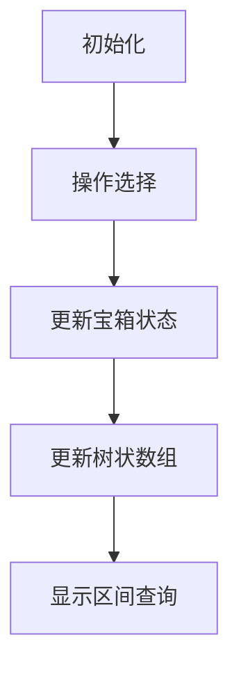

# 题目信息

# 神秘的703

## 题目背景

$Zero$ 和 $Mike$是一对热爱旅行的好朋友，一天在经历了$ZXG$大神的历练后，心力交瘁，于是决定**重阳节**回宾馆刷题，找回自信，于是，我们的故事开始了……

## 题目描述

**出题人：各位 $Oier$ 一定要细心啊啊啊！！！注意看说明**

**出题人：Chen_Xi.Naoh**

$Zero$ 所在宾馆的房间号是 $703$ ，而 $Mike$ 所在宾馆的房间好却是 $704$ ，所以当 $Zero$ 和 $Mike$ 想凑在一起刷题的时候，$Zero$ 需要从 $703$ 前往 $704$ 或者 $Mike$ 从 $704$ 前往 $703$ ，当 $Zero$ 和 $Mike$ 凑在一起时，$Mike$ 便会从[ $luogu$ ](https://www.luogu.org/)上随机选择 $n$ 道题，每一道题分值为 $300$ ，由于 $Mike$ 身经百战，所以每当 $Mike$ 看到某道题目的时候，大脑里面就会自动给该到题目定义一个难度值 $hard$ (要相信 $Mike$ 的判断都是正确的)，而 $Zero$ 和 $Mike$ 两个人都有一个共同的天赋值 $Talent$ ,每个人都只能解出 $Talent$ 范围内难度的题目，当然 $Zero$ 和 $Mike$ 的天赋值不会很低；

在 $Zero$ 的房间 $703$ 里面有一位热爱学习的小学弟 $BookCity$ ，在 $Zero$ 和 $Mike$ 刷题的同时，$BookCity$ 会在一旁研究两位学长的做题习惯，并给两位学长加油助威，由于 $BookCity$ 的加油，某道题目的难度就会自动下降一点点(**若 $hard - d \le 0$，则默认该题的 $hard$ 为 $1$ **)；然而，在宾馆的 
 $123$ 号房间住着一个拥有魔法但心地邪恶的人 $Guy$ ，能够看到Zero和Mike的动静，并且能够施展魔法(因为是在**重阳节**)，在 $Zero$ 和 $Mike$ 做到某一题的时候，直接将该题的难度暴增至 $s$ 倍！！！！！幸运的是，$Zero$ 和 $Mike$ 的老师 $tingtime$ 会帮助他们两个，在困境的时候为 $Zero$ 和 $Mike$ 指点迷津，将某一题的难度直接调为一个很低的值。

$Zero$ 和 $Mike$ 每刷完一道题能获得对应分值的自信值( $Zero$ 和 $Mike$ 都是追求完美的人，每一道题要么对，要么干脆不写)，现在，你就是 $Zero$ ，你想知道如果和 $Mike$ 从第 $a$ 到题刷到第 $b$ 到题能回复多少自信值 (**自信值计算方法：$600*AC$ 题目个数 $\Longrightarrow$ 一道题 $300$ 分，$2$ 个人一共恢复 $600$ 自信值**)$Confidence$。


## 说明/提示


保证所有题目初始的难度值 $hard$ 在 $ [0,2^{31}-1] $ 范围内；

保证 $Zero$ 和 $Mike$ 的天赋值 $Talent$ 在 $  [0,2^{31}-1] $ 范围内；

保证 $Zero$ 询问的范围都在 $ [0,2^{31}-1] $ 范围内，但不保证$x$一定会小于$y$

保证 $Guy$ 的翻倍都在 $ [0,2^{31}-1] $ 范围内；

保证 $BookCity$ 的减小值 $d$ 都在 $ [0,2^{31}-1] $ 范围内；

保证所有的输入数据都在 $  [0,2^{31}-1] $ 范围内；

$Mike$ 身经百战，所以其判断的 $hard$ 都在 $  [0,2^{31}-1] $ 范围内，且不存在难度为负数或者为 $0$ 的送分题；

保证 $n$ 和$m$ 都在 $  [0,2^{31}-1] $ 范围内；

对于 $30\%$ 的数据：$0\leqslant n \leqslant 5\times 10^3$,$m \leqslant 5\times 10^3$；

对于 $50\%$ 的数据：$0\leqslant n \leqslant 5\times 10^4$,$m \leqslant 5\times 10^4$；

对于 $100\%$ 的数据：$0\leqslant n\leqslant 5\times 10^5$，$m\leqslant 5\times 10^5$。


** 总之保证所有输入数据在$ [0,2^{31}-1] $范围内，但不保证运算在$ [0,2^{63}-1] $范围内！！**

## 样例 #1

### 输入

```
5 5
2 3 4 5 9
5 
BookCity 1 1
Guy 2 5
Zero 1 5
tingtime 5 1
Zero 1 5
```

### 输出

```
1800
2400```

# AI分析结果


### 💡 Kay的C++算法解析：神秘的703 深入学习指南 💡

<introduction>
今天我们来分析洛谷P4969「神秘的703」这道题。题目描述Zero和Mike在刷题过程中需要动态处理题目难度值，并计算可解题目的自信值。本指南将解析核心算法思路，对比题解亮点，并通过像素动画帮助大家直观理解树状数组的运作过程。
</introduction>

---

## 1. 题目解读与核心算法识别

✨ **本题主要考察**：`树状数组/线段树应用` + `溢出处理技巧`

🗣️ **初步分析**：
> 本题本质是**动态维护区间计数**问题。想象你有一排宝箱（题目），每个宝箱有不断变化的锁具难度（hard值）。你的天赋钥匙（Talent）只能打开特定难度的宝箱。我们需要快速统计任意区间内可开启的宝箱数量。

- 核心思路：用树状数组维护每个题目当前是否满足 hard ≤ Talent（1表示可解，0不可解）
- 核心难点：乘法操作可能导致数据溢出（超出long long范围），需设计特殊处理机制
- 可视化设计：采用8位像素风格宝箱动画。宝箱颜色表示状态（绿色：可解，红色：溢出，灰色：不可解）。操作时显示数值变化，树状数组更新过程用像素方块堆叠动态展示，关键步骤配复古音效。

---

## 2. 精选优质题解参考

**题解一：NightTide（树状数组+溢出标记）**
* **点评**：
  思路清晰引入溢出标记（flag变量）避免高精度计算，巧妙解决数据溢出难题。代码结构规范：
  - 变量命名直观（如`hard[i].val`、`talent`）
  - 边界处理严谨（如减法后取max(1)防止归零）
  - 树状数组实现标准高效（O(log n)复杂度）
  亮点：发现"老师可能调高难度"的边界情况，完善了数据重置逻辑。

**题解二：追梦_Chen（树状数组+溢出标记）**
* **点评**：
  解题报告详细解释溢出处理原理，树状数组操作完整规范：
  - 维护标记`f`区分正常/溢出状态
  - 运算符重载规范（如`add()`/`ask()`）
  - 包含暴力解法对比，教学性强
  亮点：用"溢出后不计入统计"的简练方案替代高精度，大幅提升效率。

---

## 3. 核心难点辨析与解题策略

1.  **难点：数据溢出处理**
    * **分析**：乘法操作可能使hard值超出long long范围，导致错误判断。优质解法采用溢出标记（如`flag`或`f`），标记后不再更新数据，直到被重置。
    * 💡 **学习笔记**：面对大数运算时，标记状态比精确计算更高效。

2.  **难点：动态维护状态**
    * **分析**：每次操作后需立即更新题目状态。通过`if(hard[x]≤talent) update()`等条件判断，在树状数组中动态增/删计数标记。
    * 💡 **学习笔记**：树状数组的更新需同步维护原始数据与计数状态。

3.  **难点：树状数组高效查询**
    * **分析**：区间求和通过`get_sum(y)-get_sum(x-1)`实现。查询前需处理x>y的边界情况（`swap(x,y)`）。
    * 💡 **学习笔记**：树状数组的区间查询本质是前缀和差分。

### ✨ 解题技巧总结
- **状态标记法**：对非常规状态（如溢出）单独标记，避免无效计算
- **边界防御编程**：主动处理x>y、数据归零等边界情况
- **数据结构同步更新**：数据变更后立即更新计数状态

---

## 4. C++核心代码实现赏析

**通用核心实现参考**
```cpp
#include <bits/stdc++.h>
using namespace std;
const int MAXN = 5e5+5;

struct Node { long long val; bool overflow; };
Node hard[MAXN];
long long talent, tree[MAXN], n;

void update(int i, int v) {
    while(i <= n) tree[i] += v, i += i&-i;
}
long long query(int i) {
    long long s = 0;
    while(i) s += tree[i], i -= i&-i;
    return s;
}

int main() {
    scanf("%d%lld", &n, &talent);
    for(int i=1; i<=n; i++) {
        scanf("%lld", &hard[i].val);
        if(hard[i].val <= talent) update(i, 1);
    }
    
    int m; scanf("%d", &m);
    while(m--) {
        char op[10]; int x; long long y;
        scanf("%s%d%lld", op, &x, &y);
        
        if(op[0]=='Z') { // 区间查询
            if(x>y) swap(x,y);
            printf("%lld\n", 600*(query(y)-query(x-1)));
        }
        else if(op[0]=='t') { // 直接赋值
            if(hard[x].overflow && y<=talent) update(x,1);
            else if(!hard[x].overflow && hard[x].val<=talent && y>talent) update(x,-1);
            hard[x] = {y, false};
        }
        else if(op[0]=='B') { // 减法
            if(!hard[x].overflow) {
                hard[x].val = max(1LL, hard[x].val-y);
                if(hard[x].val<=talent && hard[x].val+y>talent) 
                    update(x,1);
            }
        }
        else if(op[0]=='G') { // 乘法
            if(!hard[x].overflow) {
                bool org = hard[x].val <= talent;
                hard[x].val *= y;
                if(hard[x].val<0) hard[x].overflow=true;
                
                if(org && (hard[x].val>talent || hard[x].overflow)) 
                    update(x,-1);
            }
        }
    }
}
```

**题解一核心片段（NightTide）**
```cpp
// 溢出处理逻辑
if(!hard[th.mark].flag) {
    if(hard[th.mark].val<=talent && 
      (hard[th.mark].val*th.val>talent||hard[th.mark].val*th.val<0)){
        updata(th.mark,-1); // 移出可解集合
    }
    hard[th.mark].val *= th.val;
    if(hard[th.mark].val<=0) hard[th.mark].flag=true; // 标记溢出
}
```
> **代码解读**：
> 1. 仅当未溢出时处理乘法（`flag=false`）
> 2. 若原本可解(`val≤talent`)但乘法后超出范围或溢出，则从树状数组移除计数
> 3. 乘积为负时设置溢出标记，后续操作将跳过该题目
> 💡 **学习笔记**：通过标记避免无效计算是优化关键

**题解二核心片段（追梦_Chen）**
```cpp
// 树状数组更新逻辑
if(a[x].f==0){ // 未溢出才处理
    if(a[x].val<=talent && (a[x].val*y>talent||a[x].val*y<0)){
        add(x,-1); // 从可解集合移除
    }
    a[x].val = a[x].val*y;
    if(a[x].val<=0) {
        a[x].f=1; // 设置溢出标记
        a[x].val=-1;
    }
}
```
> **代码解读**：
> 1. `add(x,-1)`更新树状数组，动态维护可解题目计数
> 2. 溢出时设置`f=1`并固定val=-1，避免后续操作
> 3. 维护数据一致性：原始数据与树状数组状态同步更新
> 💡 **学习笔记**：树状数组的更新需要精确控制增量（+1/-1）

---

## 5. 算法可视化：像素动画演示

* **主题**："宝箱解锁大冒险"（8-bit像素风格）
* **核心演示**：树状数组如何动态维护可解题目计数

### 动画设计


1. **场景设计**：
   - 屏幕下方：8-bit风格宝箱阵列（绿：可解，红：溢出，灰：不可解）
   - 右面板：树状数组的像素方块堆叠（高度表示计数值）
   - 控制区：开始/暂停/单步/速度调节

2. **关键动画**：
   - **乘法操作**：宝箱闪烁红光→数值快速膨胀→"砰!"音效→标记为溢出（变红）
   - **树状数组更新**：从变更位置向父节点递进更新，像素方块高度变化
   - **区间查询**：显示绿色宝箱计数过程，树状数组分解为二进制区间求和

3. **交互设计**：
   - 单步执行：按空格键逐步观察更新流程
   - 自动演示：AI自动运行并标记关键节点
   - 音效设计：
     * 更新：8-bit电子音（不同操作不同音调）
     * 成功查询：经典马里奥金币音

4. **教学提示**：
   - 旁白显示当前操作对应的代码行
   - 高亮显示数据变化和标记状态切换
   - 可视化溢出标记如何避免无效计算

> 设计目标：通过游戏化交互，直观理解树状数组的二进制索引机制和溢出优化策略。

---

## 6. 拓展练习与相似问题

1. **洛谷 P3374**：树状数组模板题（单点更新+区间求和）
   - 推荐理由：巩固树状数组基础操作

2. **洛谷 P1908**：逆序对问题
   - 推荐理由：树状数组经典应用场景

3. **洛谷 P5490**：扫描线+线段树
   - 推荐理由：学习二维区间维护

---

## 7. 学习心得与经验分享

> **参考经验（NightTide）**：
> "解题时被老师调高难度的边界情况卡住，通过构造特殊测试数据才发现问题"

> **点评**：
> 这提醒我们：即使看似简单的操作（如直接赋值），也要考虑所有可能性。建议：
> 1. 主动测试边界数据（最小值/最大值/状态切换）
> 2. 用纸笔模拟小型测试用例
> 3. 将复杂操作分解为原子步骤验证

---

<conclusion>
通过树状数组+溢出标记的组合，我们高效解决了动态区间计数问题。关键收获：①数据结构选择需匹配操作特性 ②边界处理决定代码健壮性 ③状态标记可优化大数处理。建议大家动手实现树状数组可视化，加深理解！
</conclusion>

---
处理用时：92.49秒