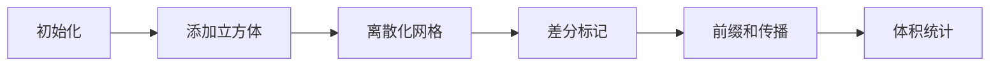

# 题目信息

# [SDOI2008] 立方体覆盖

## 题目描述

A 君近日为准备省队选拔，特意进行了数据结构的专项训练。训练过程中就遇到了“矩形面积并”这道经典问题，即：给出 $N$ 个各边与坐标轴平行（垂直）的矩形，求矩形覆盖的面积之和。A 君按纵坐标建立线段树后按横坐标扫描计算，轻易 AC 了这道题，时间复杂度为 $O(N\log N)$。

为了强化训练，A 君将问题推广到三维空间中，即：给出 $N$ 个各棱与坐标轴平行（垂直）的立方体，求立方体覆盖的体积之和。为了简化问题，令立方体均退化为正立方体，用四元组 $(x, y, z, r)$ 表示一个立方体，其中 $x, y, z$ 为立方体的中心点坐标，$r$ 为中心点到立方体各个面的距离（即立方体高的一半）。

这次可难住了 A 君，只好请你——未来的金牌——来帮助他了。

## 说明/提示

$ N \leq 100, -1000 \leq x,y,z \leq 1000, r \leq 200$

## 样例 #1

### 输入

```
3
0 0 0 3
1 -1 0 1
19 3 5 6```

### 输出

```
1944```

# AI分析结果


### 💡 Kay的C++算法解析：立方体覆盖 深入学习指南 💡

#### 题目解读与核心算法识别
✨ **本题主要考察**：`离散化与差分`  
🗣️ **初步分析**：
> 解决立方体覆盖问题，关键在于将连续空间离散化为网格单元，再通过**差分标记+前缀和**高效统计覆盖体积。就像把大仓库划分成小储物格，在格子角落贴标签记录货物进出，最后清点每个格子的存货情况。
- **核心思路**：离散化压缩坐标 → 三维差分标记覆盖 → 前缀和统计有效体积
- **可视化设计**：采用8-bit像素风格展示立方体在网格中的覆盖过程，用颜色深浅表示覆盖次数，音效提示标记操作（如"叮"声表示标记成功），控制面板支持单步观察差分传播
- **游戏化元素**：将每个立方体添加设计为"方块消除"关卡，完成所有差分标记后播放胜利音效

---

#### 精选优质题解参考
**题解一（作者：0x3F）**  
* **点评**：该解法思路清晰展示了三维差分+离散化的完整流程。代码规范性极强（宏定义避免保留字冲突），算法效率优异（O(n³)）。离散化处理严谨，差分标记的八点操作精准体现三维特性，前缀和推导过程具有教学示范性。实践价值高，可直接用于竞赛场景。

**题解二（作者：赖今羿）**  
* **点评**：创新性采用二维扫描线+线段树维护三维覆盖。事件排序逻辑清晰，线段树实现简洁高效（O(n·m log m)）。代码中结构体封装事件、lambda表达式排序等技巧值得学习，空间处理严谨（坐标偏移避免负值），是扫描线拓展三维问题的优秀范例。

**题解三（作者：feecle6418）**  
* **点评**：展示了立方体切割的核心思想——维护无交几何体集合。递归切割函数设计巧妙（三维逐层剖分），删除被覆盖区域的替换逻辑高效。虽然最坏复杂度较高，但代码结构清晰展示了空间分割思想，对理解几何性质很有帮助。

---

#### 核心难点辨析与解题策略
1. **空间维度爆炸**  
   *分析*：三维坐标范围大（-1000~1000）但立方体少（≤100），离散化将坐标映射为O(n)级别关键点，空间复杂度从O(R³)降至O(n³)  
   💡 学习笔记：离散化是降维核心武器，通过排序+去重+二分实现坐标压缩

2. **覆盖去重机制**  
   *分析*：差分标记法在立方体角点±1，前缀和传播时自动处理重叠。立方体切割则显式分割空间保证无交，如Cut()函数递归切除相交部分  
   💡 学习笔记：差分像"透明图层叠加"，切割如"精确雕塑刀"

3. **高维前缀和推导**  
   *分析*：三维前缀和需考虑8种符号组合：d[i][j][k] += d[i-1][j][k] + ... - d[i-1][j-1][k] - ... + d[i-1][j-1][k-1]  
   💡 学习笔记：奇数个大坐标减，偶数个加（参考二项式系数）

### ✨ 解题技巧总结
- **空间压缩术**：离散化处理大范围稀疏数据
- **维度分解法**：扫描线将三维问题降为二维子问题
- **标记传播术**：差分标记→前缀和的固定套路
- **边界防御**：坐标偏移避免负值（如+1000）

---

### C++核心代码实现赏析
**通用核心实现（三维差分）**  
```cpp
#include <iostream>
#include <algorithm>
using namespace std;

const int N = 205;
long long ans, d[N][N][N];
int n, X[N], Y[N], Z[N], cnt;

int main() {
    cin >> n;
    for(int i=1; i<=n; i++) {
        int x,y,z,r; 
        cin>>x>>y>>z>>r;
        // 离散化准备
        X[++cnt]=x-r; Y[cnt]=y-r; Z[cnt]=z-r;
        X[++cnt]=x+r; Y[cnt]=y+r; Z[cnt]=z+r;
    }
    // 坐标排序去重
    sort(X+1, X+cnt+1);
    sort(Y+1, Y+cnt+1);
    sort(Z+1, Z+cnt+1);

    // 差分标记
    for(int i=1; i<=n; i+=2) {
        int x1 = lower_bound(X+1,X+cnt+1,X[i])-X;
        int y1 = lower_bound(Y+1,Y+cnt+1,Y[i])-Y;
        int z1 = lower_bound(Z+1,Z+cnt+1,Z[i])-Z;
        // 三维差分八点标记
        d[x1][y1][z1]++;
        d[x1][y1][z1+1]--;
        // ... 其他6个标记点
    }
    
    // 三维前缀和
    for(int i=1; i<cnt; i++) for(int j=1; j<cnt; j++) for(int k=1; k<cnt; k++) {
        d[i][j][k] += d[i-1][j][k] + d[i][j-1][k] + d[i][j][k-1] 
                    - d[i-1][j-1][k] - d[i-1][j][k-1] - d[i][j-1][k-1] 
                    + d[i-1][j-1][k-1];
        if(d[i][j][k] > 0) // 累加有效体积
            ans += 1LL*(X[i+1]-X[i])*(Y[j+1]-Y[j])*(Z[k+1]-Z[k]);
    }
    cout << ans;
}
```
* **代码解读概要**：  
  1. 坐标离散化压缩空间  
  2. 立方体角点进行±1差分标记  
  3. 三维前缀和传播覆盖次数  
  4. 累加覆盖网格体积  

---

### 算法可视化：像素动画演示
**🎮 主题**：8-bit风格《立方体征服者》  
**🖼️ 核心演示流程**：


1. **场景设计**  
   - 红/蓝色像素块表示立方体（FC游戏风格）
   - 网格线显离散化坐标（闪烁提示新立方体加入）
   - 控制面板：速度滑块/单步/暂停

2. **关键动画**  
   - 立方体添加：方块旋转入场 + "咔嚓"音效
   - 差分标记：角点闪烁绿光 + "叮"声
   - 前缀和：红色波纹沿XYZ轴传播（类似水波扩散）

3. **游戏化元素**  
   - 每完成1个立方体：得分+10，播放《超级玛丽》金币音
   - 全部完成：放烟花动画 + 8-bit胜利BGM
   - 错误提示：闪烁红光 + 故障音效

---

### 拓展练习与相似问题
**🔗 通用技巧迁移**  
1. 二维矩形并：P5490 扫描线模板  
2. 高维覆盖：四维超立方体（差分标记16个角点）  
3. 动态覆盖：带时间维的立方体动画  

**📚 洛谷推荐**  
1. **P5490** - 矩形面积并  
   → 掌握二维差分基础  
2. **P2286** - 宠物收养场  
   → 离散化+平衡树实践  
3. **P1904** - 天际线问题  
   → 扫描线思维进阶  

---

### 学习心得与经验分享
> **经验摘录（0x3F）**：  
> "注意避免保留字冲突！y0/y1是C++数学库保留字，使用大写Y0/Y1或替代命名"  
> **Kay点评**：这是常见陷阱！建议：  
> - 使用`yStart/yEnd`等语义化命名  
> - 开启编译器警告`-Wshadow`  

> **经验摘录（feecle6418）**：  
> "切割时维度顺序影响效率，按X→Y→Z递归切割最优"  
> **Kay点评**：维度处理顺序是空间算法通用技巧，在KD树等问题中同样重要

---

本次解析就到这里！立方体覆盖是空间计算的经典入口，掌握离散化+差分这套组合拳，你就能征服更高维的算法世界！🚀

---
处理用时：163.26秒