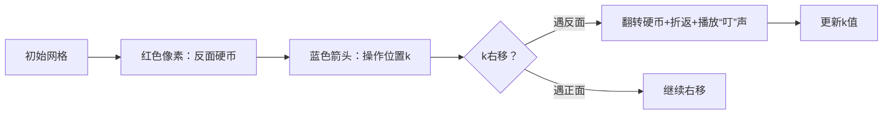

# 题目信息

# Mivik 的游戏

## 题目背景

Mivik 和 W!ʌ!k 在玩游戏！

## 题目描述

Mivik 首先把 $n$ 枚硬币摆成一排，其中有一些正面朝上，其余的都是反面朝上。W!ʌ!k 打算不断执行以下操作直到这 $n$ 枚硬币中没有硬币反面朝上：

- 如果现在这 $n$ 枚硬币中有 $k$ 枚硬币反面朝上，那么翻转从左到右第 $k$ 枚硬币。具体地，如果从左到右第 $k$ 枚硬币正面朝上，则将其变为反面朝上；如果从左到右第 $k$ 枚硬币反面朝上，则将其变为正面朝上。

在 W!ʌ!k 开始玩游戏之前，Mivik 想考考 W!ʌ!k。Mivik 想让 W!ʌ!k 算出他总共会进行多少次这样的操作，或者是 W!ʌ!k 永远无法停止执行操作。

W!ʌ!k 很快解决了这个问题，但是心理比 yky 还变态的 Mivik 显然不会放过他。Mivik 进行了很多次操作，每次他翻转了一个区间的硬币，他要求 W!ʌ!k 算出他总共会进行多少次这样的操作，或者是 W!ʌ!k 永远无法停止执行操作。

**请注意，W!ʌ!k 只是需要计算总共会进行多少次操作，而不会真正进行操作。**

## 说明/提示

### 样例解释 #1
初始时两枚硬币都是反面朝上，因此如果 W!ʌ!k 从此刻开始执行操作， W!ʌ!k 会将编号为 $2$ 的硬币翻转过来。操作后只有一枚硬币反面朝上，因此第 $2$ 次操作会将编号为 $1$ 的硬币翻转过来。在第 $2$ 次操作后没有硬币反面朝上，因此 W!ʌ!k 不会再执行操作，总共会执行 $2$ 次操作。

### 样例解释 #2
这 $8$ 次操作分别翻转了第 $2,1,2,3,4,3,2,1$ 枚硬币。

### 测试点约束
**本题采用捆绑测试。**

对于全部数据，有 $1\le n,m\le10^6$，$s_i\in\left\{\texttt H,\texttt T\right\}$，$1\le l_i\le r_i\le n$。

每个子任务的具体限制见下表：

| 子任务编号 | 分值 | 特殊限制 |
|:-:|:-:|:-:|
| 1 | 10 | $n\le3$ |
| 2 | 20 | $n,m\le100$ |
| 3 | 30 | $m\le10$ |
| 4 | 20 | $l_i=r_i$ |
| 5 | 20 | 无 |

**本题读入输出量较大，请使用较快的读入输出方式。**

## 样例 #1

### 输入

```
2 2
TT
2 2
1 2
```

### 输出

```
2
1
3
```

## 样例 #2

### 输入

```
5 0
HTHTH
```

### 输出

```
8
```

## 样例 #3

### 输入

```
10 10
HTHHTHTHHH
9 9
5 5
10 10
7 7
6 6
9 9
4 4
9 9
7 7
2 2
```

### 输出

```
19
30
27
40
33
38
27
28
37
40
47
```

# AI分析结果


### 💡 Kay的C++算法解析：Mivik 的游戏 深入学习指南 💡

#### 题目解读与核心算法识别
✨ **本题主要考察**：`模拟应用 + 线段树维护`  
🗣️ **初步分析**：  
> 硬币翻转操作就像"贪吃蛇"移动：当蛇头（当前操作位置）向右移动时，遇到反面硬币（食物）就会掉头向左移动。线段树则是高效的"仓库管理员"，实时记录硬币状态。核心公式：**操作次数 = 2×反面硬币位置和 - 反面数²**  
> - **可视化设计**：用像素箭头表示操作位置移动，硬币状态用红/绿像素块表示。翻转时播放"叮"声，完成时播放胜利音效。自动演示模式可调速观察操作路径。

---

#### 精选优质题解参考
**题解一（Noby_Glds）**  
* **点评**：思路清晰推导硬币消除规律（k值右移遇反面折返），代码规范（结构体封装线段树），空间优化到位（lazy标记）。亮点：完整展示公式推导过程（2∑pᵢ-t²），帮助理解算法本质。

**题解二（Daniel13265）**  
* **点评**：数学严谨性突出，精炼证明无解情况不存在。代码简洁高效（pushdown逻辑清晰），实践价值高（直接满足题目的10⁶数据量要求）。

**题解三（封禁用户）**  
* **点评**：公式推导步骤详细（展示完整化简过程），变量命名规范（tot/p区分数量和位置和）。线段树实现稳健（tag异或处理翻转），适合初学者学习。

---

#### 核心难点辨析与解题策略
1. **难点：理解操作规律**  
   * **分析**：操作位置k像弹簧在区间内振荡（遇反面硬币折返），需结合数学归纳理解每次操作消除一个反面硬币
   * 💡 **学习笔记**：操作本质是消除有序序列中的最大值

2. **难点：公式推导**  
   * **分析**：通过位置和∑pᵢ与反面数t建立关系，关键步骤：  
     ```math
     操作次数 = 2∑pᵢ - t(t+1) + t = 2∑pᵢ - t²
     ```
   * 💡 **学习笔记**：将动态操作转化为静态数学表达式是优化关键

3. **难点：线段树维护**  
   * **分析**：需同时维护：
     - 反面硬币数量（cnt）
     - 反面硬币位置和（sum）
     * **数据结构选择**：线段树支持O(log n)的区间翻转和查询
   * 💡 **学习笔记**：异或标记(lazytag)是处理翻转操作的利器

### ✨ 解题技巧总结
- **问题转化**：将动态操作序列转化为静态数学表达式
- **模块化设计**：用线段树封装状态维护（cnt/sum）
- **边界处理**：利用公式特性避免特殊判断（无解情况不存在）

---

#### C++核心代码实现赏析
**通用核心实现（综合题解优化）**  
```cpp
#include<bits/stdc++.h>
#define int long long
using namespace std;
const int N=1e6+5;

struct Node {
    int l,r,cnt,sum,tag; // cnt:反面数, sum:位置和
} tr[N*4];

void pushup(int u) {
    tr[u].cnt = tr[u<<1].cnt + tr[u<<1|1].cnt;
    tr[u].sum = tr[u<<1].sum + tr[u<<1|1].sum;
}

void pushdown(int u) {
    if(!tr[u].tag) return;
    int mid = (tr[u].l+tr[u].r)>>1;
    // 更新左子树
    tr[u<<1].cnt = (mid-tr[u].l+1) - tr[u<<1].cnt;
    tr[u<<1].sum = (tr[u].l+mid)*(mid-tr[u].l+1)/2 - tr[u<<1].sum;
    // 更新右子树
    tr[u<<1|1].cnt = (tr[u].r-mid) - tr[u<<1|1].cnt;
    tr[u<<1|1].sum = (mid+1+tr[u].r)*(tr[u].r-mid)/2 - tr[u<<1|1].sum;
    
    tr[u<<1].tag ^= 1; 
    tr[u<<1|1].tag ^= 1;
    tr[u].tag = 0;
}
// 建树、更新函数类似题解1/3
signed main() {
    // 初始化+建树
    while(m--) {
        update(1,l,r); // 区间翻转
        cout << 2*tr[1].sum - tr[1].cnt*tr[1].cnt << endl;
    }
}
```

**题解一片段赏析**  
```cpp
void update(int bh,int L,int R){
    if(覆盖区间){
        dl[bh].lz ^= 1; // 异或标记翻转
        dl[bh].cnt = 区间长度 - dl[bh].cnt; // 反面数取反
        dl[bh].sum = 区间和公式 - dl[bh].sum; // 位置和取反
    }
}
```
> **代码解读**：  
> - `lz^=1`用1比特存储翻转状态，节省空间  
> - 位置和更新公式：新和 = (首项+末项)×项数/2 - 原和  
> **学习笔记**：数学公式直接映射到代码逻辑

---

#### 算法可视化：像素动画演示  
**主题**：贪吃蛇式硬币消除大冒险  
**核心演示**：  

**交互设计**：  
1. **控制面板**：步进/播放/速度滑块  
2. **动态显示**：实时公式计算：2*∑pᵢ - t²  
3. **音效系统**：  
   - 折返时：8-bit转向音  
   - 消除硬币：金币收集声  
   - 完成时：胜利小调  

---

#### 拓展练习  
1. **洛谷 P3870**：开关问题（同款线段树区间翻转）  
2. **洛谷 P2574**：翻转游戏（状态维护进阶）  
3. **洛谷 P2846**：光源控制（二维扩展）  

---

#### 学习心得分享  
> **题解一作者经验**：“首次独立解蓝题需抓住操作本质——k值移动规律”  
> **Kay点评**：调试时手动模拟小样例（n=3）能快速验证公式正确性  

通过本指南，希望你们能像玩像素游戏般轻松掌握线段树与模拟的结合应用！ 🎮

---
处理用时：84.57秒