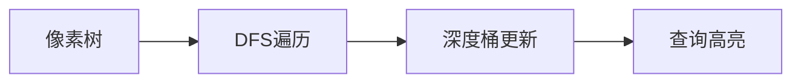

# 题目信息

# 「CGOI-1」收税

## 题目背景

~~签到题~~

由于举办选丑大赛消耗了太多钱财，ac 决定派出 Push_Y 去收税。

## 题目描述

丑国由 $n$ 座城市组成，编号 $1$ 的为首都。这 $n$ 座城市由 $n-1$ 条长度为 $1$ 的双向道路连接。从编号为 $x$ 的城市出发，往**远离**首都的方向（即往儿子节点走），距离不超过 $h$ 的就是这座城市要收税的范围。

第 $i$ 座城市将要上缴 $a_i$ **元**的所得税。但由于收税官 Push_Y 很喜欢异或，因此每座城市最终上缴的所得税将是在其收税范围内每座城市**应缴税额**的异或和。

Push_Y 将向你提出 $m$ 个询问，他将问你城市 $x$ 在收税距离为 $h$ 时将收到多少**千元**的所得税。

**简化版题意：**

给定一棵 $n$ 个点的树，根节点为 $1$ 号点，第 $i$ 个点的点权为 $a_i$，$dep_u$ 表示 $u$ 点的深度，根节点的深度为 $1$，$q$ 次询问，每次给定两个整数 $x,h$，表示询问 $\bigoplus_{u\in son(x)\land dep_u-dep_x\le h}a_i$ 除以 $1000$ 后的值。

其中 $\bigoplus_{i=1}^ni$ 表示 $1\operatorname{xor} 2\operatorname{xor}\cdots\operatorname{xor} n$。

此处 $\land$ 是“且”，$\operatorname{xor}$ 是异或。

## 说明/提示

对于 $30\%$ 的数据，$1\le n,m\le 10^3$。

对于 $70\%$ 的数据，$1\le n,m\le5 \times 10^4$。其中有 $20\%$ 的数据是链。

对于 $100\%$ 的数据，$1\le n,m\le 10^6$，$1 \le a_i \le 10^9$，$1\le x \le n$，$0 \le h \le n$。

## 样例 #1

### 输入

```
6 3
604 545 402 378 25 13
1 2 2 3 3
1 2
3 0
2 4```

### 输出

```
0.149
0.402
0.733```

## 样例 #2

### 输入

```
6 3
6 5 4 3 2 1
1 2 2 3 3
1 2
3 0
2 4```

### 输出

```
0.004
0.004
0.001```

# AI分析结果


# 💡 Kay的C++算法解析：「CGOI-1」收税 深入学习指南 💡

**引言**  
今天我们来分析洛谷「CGOI-1」收税这道树形结构问题。本指南将帮助你理解DFS序的核心应用，掌握主席树和树状数组离线两种高效解法，并通过像素动画直观感受算法执行过程。

---

## 1. 题目解读与核心算法识别

✨ **本题主要考察**：`DFS序应用` + `可持久化数据结构/树状数组离线`

🗣️ **初步分析**：  
> 解决本题如同在像素迷宫中分层探索宝藏。核心是将树形结构通过DFS序"拍平"成线性序列，再用高效数据结构维护深度维度信息。  
> - **主席树解法**：沿DFS序建立"时间版本"，每个版本维护深度权值异或和，查询时通过版本差分获取子树信息  
> - **树状数组离线**：DFS过程中动态维护深度桶，利用异或自反性实现"差分查询"  
> - **可视化设计**：将树转化为8-bit网格地图，DFS遍历时当前节点闪烁红光，数据结构更新时播放"嘀"声。查询时高亮目标深度区间，成功时触发胜利音效并显示异或结果  

---

## 2. 精选优质题解参考

**题解一：主席树解法（作者：lenlen）**  
* **点评**：思路清晰展现DFS序与主席树的经典组合。代码中`re[]`数组巧妙衔接原编号与DFS序，`insert`函数规范实现可持久化。亮点在于严格遵循"DFS序版本化"思想，查询时通过`ed[x]`和`dfn[x]-1`两个版本差分高效获取子树异或和。空间复杂度O(n log n)在可接受范围。

**题解二：树状数组离线（作者：LEE114514）**  
* **点评**：创新性利用异或自反性实现高效离线查询。代码简洁有力，仅用单树状数组维护深度桶。亮点在于DFS回溯时通过两次查询的异或直接获得结果，省去主席树版本管理开销。链式前向星存储查询大幅优化常数，空间复杂度O(n)更优。

**题解三：树状数组进阶（作者：☯☯枫☯☯）**  
* **点评**：提供树状数组与桶两种实现，展现算法优化路径。核心函数`query`严谨处理深度边界，`vector`差分设计直观体现"未处理/已处理"状态对比。亮点在于强调异或运算的差分性质，并给出O(n)桶解法实现极致优化。

---

## 3. 核心难点辨析与解题策略

1.  **树形结构线性化**  
    * **分析**：DFS序将子树转换为连续区间[dfn[x], ed[x]]。主席树解法在DFS序上建树，树状数组离线法则直接利用DFS过程动态维护。
    * 💡 **学习笔记**：DFS序是处理子树查询的基石

2.  **深度维度维护**  
    * **分析**：主席树通过可持久化维护历史深度状态；树状数组离线在DFS过程中动态更新深度桶。两者都需处理深度边界`min(dep_x+h, max_depth)`。
    * 💡 **学习笔记**：深度是树形问题的"第二维度"

3.  **异或差分技巧**  
    * **分析**：利用a⊕a=0性质，树状数组解法在DFS开始/结束两次查询异或抵消非子树信息；主席树通过版本差分实现子树隔离。
    * 💡 **学习笔记**：异或的自反性是高效差分的核心

### ✨ 解题技巧总结
- **技巧1：双重维度映射**  
  将树节点映射到(DFS序, 深度)二维平面
- **技巧2：运算性质利用**  
  巧用异或自反性替代传统加减差分
- **技巧3：离线思维**  
  预处理查询路径，避免实时计算开销
- **技巧4：边界防御**  
  严格限制`dep_x+h ≤ max_depth`防越界

---

## 4. C++核心代码实现赏析

**通用核心实现（树状数组离线法）**  
```cpp
const int N=1e6+5;
vector<pair<int,int>> Q[N]; // 离线查询存储
int tr[N], ans[N], dep[N];

void dfs(int u) {
    for(auto [h,id] : Q[u])  // 存储未处理时状态
        ans[id] = query(dep[u]+h);
    
    update(dep[u], a[u]);    // 更新当前节点
    
    for(int v : G[u]) dfs(v); // 递归子树
    
    for(auto [h,id] : Q[u])  // 异或差分得结果
        ans[id] ^= query(dep[u]+h);
}
```

**题解一核心（主席树差分）**  
```cpp
// 建树：DFS序版本化
for(int i=1; i<=n; i++) 
    root[i]=insert(root[i-1],1,maxd,dep[re[i]],a[re[i]]);

// 查询：版本差分
int res = ask(root[ed[x]], root[dfn[x]-1], 1, maxd, dep[x], dep[x]+h);
```

**题解二核心（树状数组离线）**  
```cpp
void dfs(int u) {
    for(int i=qhead[u];i;i=Q[i].next) 
        ans[i] = qry(dep[u] + Q[i].h); // 查询初始状态
    
    upd(dep[u], a[u]); // 树状数组更新
    
    for(int v : son[u]) dfs(v); // 遍历子树
    
    for(int i=qhead[u];i;i=Q[i].next) 
        ans[i] ^= qry(dep[u] + Q[i].h); // 异或差分
}
```

---

## 5. 算法可视化：像素动画演示

**主题**：《税务探险家》8-bit风算法模拟  
**核心演示**：DFS遍历树结构 + 深度桶动态更新



**动画帧设计**：
1. **场景构建**  
   - 16色像素树：根节点金色，叶节点绿色，当前节点红色闪烁
   - 右侧深度桶：柱状图实时显示各深度异或值
   - 底部控制台：步进/暂停/速度滑块

2. **DFS遍历演示**  
   - 当前节点闪烁红光，发出"嘀"声
   - DFS路径显示蓝色轨迹，经过节点变灰色
   - 深度桶对应柱状图更新，播放数据更新音效

3. **查询高亮**  
   - 输入(x,h)时：x节点放大脉冲，深度区间[dep_x, dep_x+h]黄框高亮
   - 结果显示：异或值像素数字跳动，成功时播放胜利音效

4. **游戏化元素**  
   - 每完成子树遍历获得金币+1
   - 连续正确查询触发连击特效
   - 背景音乐：8-bit循环芯片音乐

---

## 6. 拓展练习与相似问题

**技巧迁移**：
1. 区间统计问题：`DFS序+数据结构`组合
2. 历史版本查询：可持久化数据结构应用
3. 离线处理优化：降低空间复杂度

**推荐练习**：
1. **洛谷P1972**  
  树状数组离线求区间不同数个数
2. **洛谷P3834**  
  主席树求区间第k小模板
3. **洛谷P3302**  
  树上可持久化线段树进阶

---

## 7. 学习心得与经验分享

> **来自lenlen的调试经验**：  
> "最后一个点993ms卡常惊险通过，提醒我们：  
> 1. 10^6数据规模必须优化读入  
> 2. 主席树空间预估要留足余量"

> **Kay的总结**：  
> 树形问题三件套——DFS序转化、维度维护、运算特性利用。  
> 异或的自反性在本题发挥关键作用，类似技巧可迁移至其他位运算问题。

---

**结语**  
通过本次分析，我们掌握了树形问题的核心解法与优化技巧。记住：将复杂问题分解为（DFS序+数据结构）的组合，往往能化繁为简。下次挑战再见！💪

---
处理用时：110.41秒