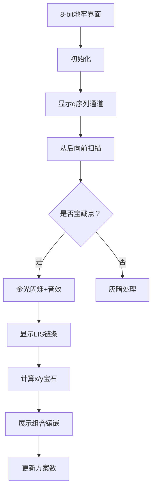

# 题目信息

# 「DTOI-5」进行一个排的重 (Maximum Version)

## 题目背景

**本题与 Minimum Version 的区别是所求最值和数据范围不同。**

小 L 热衷于重排数列使之规整。

## 题目描述

小 L 有一个长为 $n$ 的序列 $a$，其中每一项 $a_i$ 都是一个 pair $(p_i, q_i)$。

为了让 $a$ 看起来规整一些，他钦定 $p, q$ 分别均为长为 $n$ 的排列。

为了对 $a$ 的规整程度进行量化计算，他给出了一个权值函数 $f(a) = \displaystyle\sum_{i = 1}^n ([p_i > \max_{j = 1}^{i - 1} p_j] + [q_i > \max_{j = 1}^{i - 1} q_j])$。**注意 $i = 1$ 时两个方括号都能取到值，因为我们认为 $\displaystyle\max_{j = 1}^0 p_j = \displaystyle\max_{j = 1}^0 q_j = -\infty$。**

为了让 $a$ 看起来更加规整，他决定分别以某种方式重排 $a$ 得到 $a'$ 使得 $f(a')$ 最大。**注意重排时必须将 $a'_i = (p'_i, q'_i)$ 视为整体。**

他希望你求出 $f(a')_{\max}$ 的值，以及分别有多少个 $a'$ 可以取到 $f(a')_{\max}$。

由于方案数可能很大，你只需要求出结果对 $998244353$ 取模的值。

## 说明/提示

**【数据范围】**

$$
\def\or{\operatorname{or}}
%\def\arrayscretch{1.5}
\def\arraystretch{1.5}
\begin{array}{|c|c|c|}\hline
\textbf{Subtask}&n\le &\textbf{Points}\cr\hline
\sf1&10&10 \operatorname{pts}\cr\hline
\sf2&50&20 \operatorname{pts}\cr\hline
\sf3&500&20 \operatorname{pts}\cr\hline
\sf4&2\times 10^3&20 \operatorname{pts}\cr\hline
\sf5&/&30 \operatorname{pts}\cr\hline
\end{array}
$$
对于 $100\%$ 的数据，$1 \leq n \leq 10^4$，$1 \leq p_i, q_i \leq n$，保证 $p, q$ 均为**排列**。

## 样例 #1

### 输入

```
5
1 5 2 4 3
1 4 2 5 3```

### 输出

```
9 2```

# AI分析结果


# 💡 Kay的C++算法解析：「DTOI-5」进行一个排的重 (Maximum Version) 深入学习指南 💡

## 1. 题目解读与核心算法识别

✨ **本题主要考察**：`动态规划` 与 `组合数学`  
🗣️ **初步分析**：
> 这道题可以想象成整理两列数字卡片(p列和q列)，每次移动整张卡片时，我们统计「新卡片是否比前面所有卡片都大」的次数。最大得分 = p列完全升序时的基础分(n) + q列最长递增子序列(LIS)的长度。

- **核心思路**：固定p列升序排列后，问题转化为求q序列的LIS长度和方案数
- **可视化设计**：用像素方块表示q序列元素，LIS元素高亮为金色，组合计数时用不同颜色区分插入类型（红色表示必须按顺序插入的元素，蓝色表示自由插入的元素）
- **复古游戏化**：设计为「宝藏猎人」主题，LIS链条像藏宝路线，组合计数环节采用「宝石镶嵌」动画，配合8-bit音效（选择元素时"叮"，错误时"噗"，成功时胜利旋律）

---

## 2. 精选优质题解参考

**题解一 (来源：Leasier)**  
* **点评**：这份题解思路清晰，将问题分解为求最大值和方案数两个关键部分。通过固定p升序排列的巧思，将二维问题降为一维的LIS问题。代码结构规范，使用排序、DP、组合数学和前缀和等技术，边界处理严谨（n+1哨兵技巧）。亮点在于将复杂的方案计数转化为组合数学问题，并通过动态规划高效求解。

---

## 3. 核心难点辨析与解题策略

1.  **维度降维转化**  
    * **分析**：如何将二维问题转化为一维？优质题解通过固定p升序排列，使p贡献达到最大值n，问题简化为q序列的LIS问题
    * 💡 **学习笔记**：复杂问题中，固定一个维度往往能打开突破口

2.  **LIS方案计数**  
    * **分析**：从后往前DP时，需计算「当前元素与LIS下一元素之间」的插入方案数。通过组合数C(x+y,x)计算插入方式，其中x是必须按顺序插入的元素，y是自由插入的元素
    * 💡 **学习笔记**：DP+组合数学是计数问题的黄金搭档

3.  **复杂度优化**  
    * **分析**：暴力实现组合计数会达O(n³)，需用二维前缀和预处理。题解中sum数组高效计算区域元素数量，将复杂度优化到O(n²)
    * 💡 **学习笔记**：前缀和是优化区域统计问题的利器

### ✨ 解题技巧总结
- **技巧1 维度简化**：多维问题优先尝试降维
- **技巧2 组合思维**：方案计数考虑组合数学分解
- **技巧3 逆向DP**：从终点倒推的DP往往更简洁
- **技巧4 哨兵技巧**：边界条件用虚拟哨兵处理

---

## 4. C++核心代码实现赏析

**本题通用核心C++实现参考**  
* **说明**：综合题解思路，展示清晰完整的LIS+组合计数实现
* **完整核心代码**：
```cpp
#include <iostream>
#include <algorithm>
using namespace std;

typedef long long ll;
const int mod = 998244353;
const int N = 10007;

int dp1[N]; // 以i结尾的LIS长度
ll dp2[N];  // 从i开始的方案数
ll fac[N], inv_fac[N];
pair<int, int> pr[N]; // 存储(p,q)

ll quick_pow(ll x, ll p) {
    ll res = 1;
    while (p) {
        if (p & 1) res = res * x % mod;
        x = x * x % mod;
        p >>= 1;
    }
    return res;
}

void init(int n) {
    fac[0] = 1;
    for (int i = 1; i <= n; i++) 
        fac[i] = fac[i-1] * i % mod;
    inv_fac[n] = quick_pow(fac[n], mod-2);
    for (int i = n-1; i >= 0; i--)
        inv_fac[i] = inv_fac[i+1] * (i+1) % mod;
}

ll comb(int n, int m) {
    if (n < 0 || m < 0 || n < m) return 0;
    return fac[n] * inv_fac[m] % mod * inv_fac[n-m] % mod;
}

int main() {
    int n; cin >> n;
    init(n);
    
    // 输入并排序
    for (int i = 1; i <= n; i++) cin >> pr[i].first;
    for (int i = 1; i <= n; i++) cin >> pr[i].second;
    sort(pr+1, pr+n+1);
    
    // 求LIS长度 (dp1)
    pr[n+1] = {n+1, n+1}; // 设置哨兵
    for (int i = 1; i <= n+1; i++) {
        dp1[i] = 1;
        for (int j = 1; j < i; j++) 
            if (pr[j].second < pr[i].second) 
                dp1[i] = max(dp1[i], dp1[j]+1);
    }
    
    // 方案数DP (dp2)
    dp2[n+1] = 1;
    for (int i = n; i >= 1; i--) {
        dp2[i] = 0;
        for (int j = i+1; j <= n+1; j++) {
            if (pr[j].second <= pr[i].second) continue;
            if (dp1[j] != dp1[i]+1) continue;
                
            int x = 0, y = 0;
            // 统计区域元素（实际需用前缀和优化）
            for (int k = 1; k < i; k++)
                if (pr[k].second > pr[i].second && pr[k].second < pr[j].second) 
                    x++;
            for (int k = i+1; k < j; k++)
                if (pr[k].second < pr[i].second) 
                    y++;
                    
            dp2[i] = (dp2[i] + dp2[j] * comb(x+y, x)) % mod;
        }
    }
    
    cout << dp1[n+1] + n - 1 << " " << dp2[1] << endl;
    return 0;
}
```
* **代码解读概要**：
  > 1. 初始化阶乘和组合数工具
  > 2. 按p升序排序后设置哨兵
  > 3. 第一重DP求LIS长度
  > 4. 第二重DP逆向计算方案数，组合数处理插入方案
  > 5. 输出最大得分（n+LIS-1）和方案数

**题解一核心代码片段**  
* **亮点**：LIS与组合数学的完美结合
* **核心代码片段**：
```cpp
dp2[n+1] = 1;
for (int i = n; i >= 1; i--) {
    dp2[i] = 0;
    for (int j = i+1; j <= n+1; j++) {
        if (pr[j].second <= pr[i].second) continue;
        if (dp1[j] != dp1[i]+1) continue;
        
        int x = 0, y = 0;
        // ... 统计x和y ...
        dp2[i] = (dp2[i] + dp2[j] * comb(x+y, x)) % mod;
    }
}
```
* **代码解读**：
  > 1. **逆向DP**：从序列末尾向前计算，`dp2[i]`表示从位置i开始的方案数
  > 2. **双重验证**：`j`必须满足值更大(`pr[j].second > pr[i].second`)且是LIS下一环(`dp1[j] == dp1[i]+1`)
  > 3. **组合方案**：用组合数`C(x+y,x)`计算插入方案数，就像在x+y个位置中选x个固定位置
* 💡 **学习笔记**：逆向DP+组合计数是序列方案问题的标准解法

---

## 5. 算法可视化：像素动画演示

### 像素探险家：LIS宝藏之路
**设计思路**：将q序列可视化为地牢通道，LIS元素是藏宝点，组合计数过程变成宝石镶嵌

**动画流程**：


**关键交互**：
1. **像素风格**：FC红白机复古地牢画风，q值显示在砖块上
2. **动态高亮**：
   - LIS元素：闪烁金色，伴随"叮！"音效
   - x类元素：红色宝石（必须按顺序）
   - y类元素：蓝色宝石（自由位置）
3. **组合演示**：显示插板法动画，展示C(x+y,x)种镶嵌方式
4. **控制面板**：
   - 步进控制：单步/自动播放（速度可调）
   - 宝藏标记：手动标记/取消LIS点
   - 方案回溯：查看不同方案路径

**音效设计**：
- 选择元素：8-bit "叮"
- 错误操作：短促"噗"
- 完成LIS：16-bit胜利旋律
- 背景音乐：循环芯片音乐

---

## 6. 拓展练习与相似问题思考

### 举一反三训练
1. **P1020 导弹拦截**：巩固LIS模型及应用
2. **P2513 逆序对数列**：强化DP+组合数学思维
3. **P4309 最长上升子序列**：动态LIS维护技巧

---

## 7. 学习心得与经验分享

> **经验结晶**：  
> 「LIS+组合计数」是序列重排问题的经典解法，逆向DP能显著简化状态转移。调试时重点验证：
> 1. LIS长度计算是否正确
> 2. 组合数是否涵盖所有插入情况
> 3. 模运算是否全程保持

通过本次分析，我们掌握了将复杂问题降维的思维技巧，以及组合数学与动态规划的协同应用。下次遇到序列重排问题时，记得尝试固定一个维度哦！🚀

---
处理用时：212.84秒