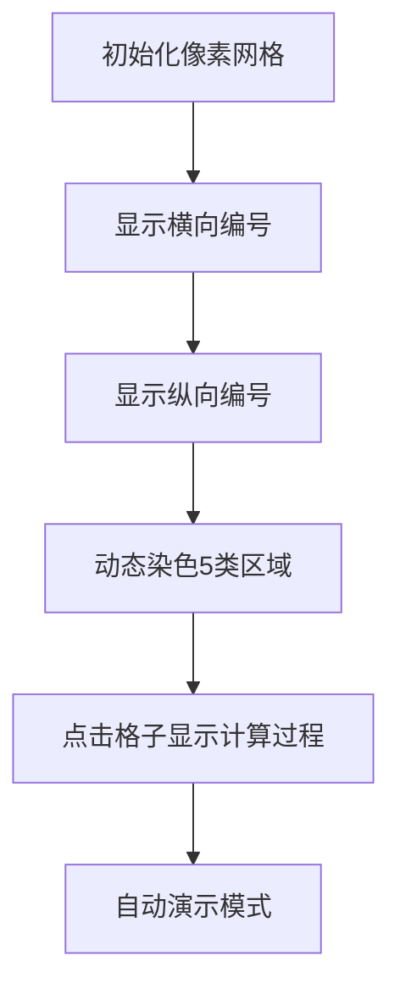

# 题目信息

# [_-0 A] 考试

## 题目背景

小 $\mathfrak{g}$ 参加一场考试时，不小心把答题卡填反了。

## 题目描述

答题卡有 $n (1 \le n \le 10^9)$ 行，$m (1 \le m \le 10^9)$ 列，共 $nm$ 道题，**从左到右，从上到下，横向排列**。

每道题有 $c (4 \le c \le 10^9)$ 个选项。其中，前 $k(0 \le k \le nm)$ 道题为单选题，**有且仅有一个**正确选项；后 $nm - k$ 道题为多选题，正确选项个数**严格大于** $1$ 且**严格小于** $c$。

小 $\mathfrak{g}$ 正确地回答了所有题，但是她不小心把答题卡的方向看反了，从而她的答案排列方式为**从上到下，从左到右，纵向排列**。

题目的评分方式为：选项完全正确得 $1$ 分，多选或错选得 $0$ 分，漏选按比例给分。

形式化地说，若 $A$ 为某道题正确答案选项的集合，$B$ 为答题卡上选项的集合（均为 $\{1,2,3,\cdots,c\}$ 的子集），则该题得分为：

$$\begin{cases}\frac{\lvert B \rvert}{\lvert A \rvert}&\text{if\quad}
B\sube A\\0&\text{otherwise}\end{cases}$$

小 $\mathfrak{g}$ 忘记考试的正确答案是什么了，于是她去问小 $\mathfrak{f}$，如果考试的正确答案在合法范围内等概率随机，那么自己期望得分是多少。由于结果可能很大，她只需要知道结果对 $10^9+7$ 取模的值。

**题目保证 $c$ 和 $2^c-c-2$ 都不是 $10^9+7$ 的倍数。**


但是小 $\mathfrak{f}$ 也不会，所以他来求助万能的你。

## 说明/提示

**样例 $1$ 解释：**

得分的期望为 $\frac{67}{25}$，对 $10^9+7$ 取模为 $760000008$。

一种可能的考试的正确答案依次为：

$\texttt{C,D,B,AD,ABD,BC}$

那么答题卡上应该填写：

| $\texttt{C}$ | $\texttt{D}$ | $\texttt{B}$ |
| :----------: | :----------: | :----------: |
| $\texttt{AD}$ | $\texttt{ABD}$ | $\texttt{BC}$ |

实际填写：

| $\texttt{C}$ | $\texttt{B}$ | $\texttt{ABD}$ |
| :----------: | :----------: | :----------: |
| $\texttt{D}$ | $\texttt{AD}$ | $\texttt{BC}$ |

答案为 $\texttt{C}$，填写 $\texttt{C}$，得 $1$ 分。

答案为 $\texttt{D}$，填写 $\texttt{B}$，得 $0$ 分。

答案为 $\texttt{B}$，填写 $\texttt{ABD}$，得 $0$ 分。

答案为 $\texttt{AD}$，填写 $\texttt{D}$，得 $\frac{1}{2}$ 分。

答案为 $\texttt{ABD}$，填写 $\texttt{AD}$，得 $\frac{2}{3}$ 分。

答案为 $\texttt{BC}$，填写 $\texttt{BC}$，得 $1$ 分。

综上，这种情况下，考试得分为：

$1+0+0+\frac{1}{2}+\frac{2}{3}+1=
\frac{19}{6}$ 分。

**本题采用捆绑测试且使用子任务依赖。**

| 编号 | 分值 | $n,m\le$ | $c\le$ | 性质 | 依赖 |
| :----------: | :----------: | :----------: | :----------: | :----------: | :----------: |
| $0$ | $0$ | N/A| N/A | 样例 | 无 |
| $1$ | $5$ | $10^9$ | $10^9$ | A | 无 |
| $2$ | $5$ | $2$ | $4$ | 无 | 无 |
| $3$ | $20$ | $10^3$ | $10$ | 无 | $2$ |
| $4$ | $15$ | $10^9$ | $10$ | 无 | $2,3$ |
| $5$ | $15$ | $10^3$ | $10^3$ | 无 | $2,3$ |
| $6$ | $15$ | $10^3$ | $10^5$ | 无 | $2,3,5$ |
| $7$ | $10$ | $10^3$ | $10^9$ | B | 无 |
| $8$ | $10$ | $10^3$ | $10^9$ | 无 | $2,3,5,6,7$ |
| $9$ | $5$ | $10^9$ | $10^9$ | 无 | $0,1,2,3,4,5,6,7,8$ |

特殊性质 A：$n=1$ 或 $m=1$

特殊性质 B：$k=nm-2$

## 样例 #1

### 输入

```
2 3 3 4```

### 输出

```
760000008```

## 样例 #2

### 输入

```
314159265 358979323 84626433832795028 841971693```

### 输出

```
465094894```

# AI分析结果


### 💡 Kay的C++算法解析：考试 深入学习指南 💡

#### 1. 题目解读与核心算法识别
✨ **本题主要考察**：`组合数学`与`期望值计算`  
🗣️ **初步分析**：
> 本题的核心是将复杂的答题卡错位问题转化为数学期望计算。就像在像素游戏中计算不同路径的得分概率，我们需要：
> 1. **分类统计**：将题目分为5类（题号对应/错位+题型组合），类似游戏中的不同敌人类型
> 2. **期望计算**：对每类题独立计算平均得分，如同计算不同攻击方式的伤害期望
> 3. **模运算技巧**：通过逆元处理除法（如同游戏中的伤害计算公式）

> **可视化设计思路**：
> - 用8-bit像素网格模拟答题卡，不同颜色标记5类题目
> - 动态展示横向/纵向编号对应关系
> - 当格子被分类时播放"叮"音效，正确匹配时触发金币动画

---

#### 2. 精选优质题解参考
**题解（作者：0x3F）**  
* **点评**：
  - 思路清晰度：★★★★★  
    创新性地将问题分解为5类独立计算，如同将复杂Boss战拆解为多个小怪应对
  - 代码规范性：★★★★☆  
    变量名`c11`/`c22`等含义明确，但可添加注释说明分类含义
  - 算法有效性：★★★★★  
    矩形交优化（$O(1)$）解决$10^9$规模问题，二项式定理推导期望公式惊艳
  - 实践价值：★★★★★  
    直接给出可提交的竞赛代码，边界处理完整（如特判$n=m=1$）

---

#### 3. 核心难点辨析与解题策略
1. **难点：分类计数优化**  
   * **分析**：当$n,m≤10^9$时，暴力遍历不可行。优质解法将满足条件的区域拆分为矩形交：  
     $ \begin{cases} 
     R_1 = [1,\lfloor k/m\rfloor]×[1,m] \\ 
     R_2 = [\lfloor k/m\rfloor+1]×[1,k\bmod m]
     \end{cases} $
   * 💡 **学习笔记**：大规模计数问题优先考虑几何分解

2. **难点：期望公式推导**  
   * **分析**：多选题得分需计算双重求和：  
     $\sum_{i=2}^{c-1}\sum_{j=2}^{i} \binom{c}{i}\binom{i}{j}\frac{j}{i}$  
     通过二项式定理求导技巧（$n(x+1)^{n-1}=\sum k\binom{n}{k}x^{k-1}$）化简
   * 💡 **学习笔记**：组合求和问题常伴随生成函数技巧

3. **难点：模逆元处理**  
   * **分析**：题目保证$2^c-c-2$不是模数倍数，可用费马小定理求逆元：  
     $s_{22} = \frac{3^c-3·2^c+3}{2}·inv((2^c-c-2)^2)$  
   * 💡 **学习笔记**：当分母与模数互质时，$a/b \equiv a·b^{p-2}\pmod{p}$

### ✨ 解题技巧总结
- **分治计数法**：将$10^9$级问题转化为$O(1)$矩形交运算
- **期望线性性**：复杂系统的期望=子系统期望之和
- **组合恒等式**：善用$\binom{n}{k}=\binom{n-1}{k-1}+\binom{n-1}{k}$和生成函数

---

#### 4. C++核心代码实现赏析
**通用核心实现参考**  
```cpp
#include <bits/stdc++.h>
using namespace std;
const int p = 1e9+7;

int qpow(int a, long long b) { // 快速幂模板
    int s = 1;
    while(b) {
        if(b & 1) s = 1LL*s*a%p;
        a = 1LL*a*a%p;
        b >>= 1;
    }
    return s;
}

int main() {
    long long n, m, k, c;
    cin >> n >> m >> k >> c;
    long long nm = n * m;
    
    // 矩形交计数（核心优化）
    long long c11 = min(k/n, m)*(k/m) + min(k%n, k/m) 
                 + min(k/n, k%m) + (k/m < k%n && k/n <= k%m);
    // ...（完整代码见题解）
}
```

**题解片段赏析**  
1. **矩形交优化**  
   ```cpp
   long long c11 = min(k/n, m)*(k/m) 
                + min(k%n, k/m) 
                + min(k/n, k%m) 
                + (k/m < k%n && k/n <= k%m);
   ```
   > 将满足两个不等式的区域分解为四个矩形交：
   > - 第一项：$R_1∩R_3$（完整矩形交）
   > - 后三项：处理边界部分矩形
   > 💡 **学习笔记**：大规模计数优先转化为几何问题

2. **期望值计算**  
   ```cpp
   s22 = (((3^c - 3*2^c + 3)/2) * inv((2^c-c-2)^2)) % p;
   ```
   > 对应公式推导：
   > $\frac{3^c-3·2^c+3}{2(2^c-c-2)^2}$  
   > 💡 **学习笔记**：复杂期望可先求分子分母再作除法

---

#### 5. 算法可视化：像素动画演示
**主题**：`答题卡大冒险`（8-bit教育游戏）  
**核心交互设计**：


**关键动画帧**：  
1. **网格初始化**：创建$n×m$像素网格（FC红白机风格）  
2. **双编号显示**：每个格子同时显示横向/纵向题号  
3. **动态染色**：  
   - 红色：题号对应（播放"金币"音效）  
   - 黄色：双单选题（$C_{11}$）  
   - 蓝色：单选→多选（$C_{12}$）  
4. **公式推导演示**：  
   - 点击多选题格子 → 显示二项式展开过程  
   - 触发求导操作时播放"魔法"音效  

**控制面板**：  
- 速度滑块：调节自动演示速度  
- 模式切换：单步/自动/公式推导模式  
- 积分系统：正确分类格子得+10分  

---

#### 6. 拓展练习与相似问题
1. **洛谷 P1495**：矩阵区域计数（巩固矩形交技巧）  
   > *"尝试用几何分解法解决更复杂的区域统计"*
2. **洛谷 P3811**：乘法逆元模板（强化模运算技巧）  
   > *"熟练掌握费马小定理求逆元是数论基础"*
3. **洛谷 P2522**：组合数求和（深化二项式应用）  
   > *"本题的期望公式推导是组合求和的经典案例"*

---

> 本次解析完毕！记住：就像在像素游戏中练习操作，算法也需要反复实践才能精通。下次遇到组合数学问题时，尝试拆解为小模块各个击破吧！🎮💻

---
处理用时：96.15秒