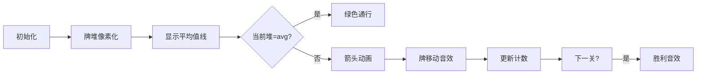

# 题目信息

# [NOIP 2002 提高组] 均分纸牌

## 题目描述

有 $N$ 堆纸牌，编号分别为 $1,2,\ldots,N$。每堆上有若干张，但纸牌总数必为 $N$ 的倍数。可以在任一堆上取若干张纸牌，然后移动。

移牌规则为：在编号为 $1$ 堆上取的纸牌，只能移到编号为 $2$ 的堆上；在编号为 $N$ 的堆上取的纸牌，只能移到编号为 $N-1$ 的堆上；其他堆上取的纸牌，可以移到相邻左边或右边的堆上。

现在要求找出一种移动方法，用最少的移动次数使每堆上纸牌数都一样多。

例如 $N=4$ 时，$4$ 堆纸牌数分别为 $9,8,17,6$。

移动 $3$ 次可达到目的：

- 从第三堆取 $4$ 张牌放到第四堆，此时每堆纸牌数分别为 $9,8,13,10$。
- 从第三堆取 $3$ 张牌放到第二堆，此时每堆纸牌数分别为 $9,11,10,10$。
- 从第二堆取 $1$ 张牌放到第一堆，此时每堆纸牌数分别为  $10,10,10,10$。


## 说明/提示

对于 $100\%$ 的数据，$1  \le  N  \le  100$，$1 \le  A_i  \le 10000$。

**【题目来源】**

NOIP 2002 提高组第一题

## 样例 #1

### 输入

```
4
9 8 17 6
```

### 输出

```
3
```

# AI分析结果


### 💡 Kay的C++算法解析：均分纸牌 深入学习指南 💡

#### 引言
今天我们来分析NOIP 2002提高组的经典题目《均分纸牌》。这道题要求用最少的移动次数使多堆纸牌数量相等，核心是理解贪心策略的应用。本指南将帮助你掌握算法思想、实现技巧和直观理解方法。

---

### 1. 题目解读与核心算法识别

✨ **本题主要考察**：`贪心算法`

🗣️ **初步分析**：
> 均分纸牌问题就像小朋友分糖果：每人目标数量固定，每次只能把多余的糖果给旁边的人，或者从旁边拿缺少的糖果。贪心策略的核心是"当前问题当前解决"——从左到右逐堆调整，把每堆与平均值的差值转移给下一堆，就像多米诺骨牌传递差异值。

- **核心思路**：所有题解都采用贪心策略。关键步骤：计算平均值 → 每堆减去平均值 → 从左到右传递差值并计数
- **算法流程可视化**：动画将高亮当前处理的牌堆，用箭头显示牌移动方向，动态显示牌数变化。核心变量`差值`的传递过程是演示重点
- **复古像素设计**：采用8位FC游戏风格，牌堆用彩色像素块表示，移动时播放"叮"音效。成功时显示"PASS"和胜利音效，支持单步调试和AI自动演示

---

### 2. 精选优质题解参考

#### 题解一：monell
* **点评**：思路最具深度，不仅给出O(n)贪心解法，还创新性提出分治算法并证明贪心正确性。虽然未提供完整代码，但对"差值传递"和"负值处理"的推导清晰透彻，具有很高理论参考价值。

#### 题解二：松风之狐
* **点评**：代码规范性最佳，变量命名合理(`num`/`ans`/`flag`)，边界处理严谨。亮点在于用`abs()`统一处理正负差值，并通过`flag`优化无操作场景。实践价值高，可直接用于竞赛。

#### 题解三：int_inf
* **点评**：代码最简洁高效(仅15行)，核心逻辑`a[i+1]+=a[i]`直击本质。亮点是省略显式条件判断，用数学运算统一处理盈亏情况，展现对问题本质的深刻理解。

---

### 3. 核心难点辨析与解题策略

#### 难点1：贪心策略的正确性证明
* **分析**：为什么从左到右传递差值是最优解？因为移动操作具有单向性——调整完的牌堆不会再被修改。数学上可通过前缀和证明：当第i堆调整后，前i堆总和必为i*avg
* 💡 **学习笔记**：贪心正确性 = 无后效性 + 局部最优导致全局最优

#### 难点2：负值的实际含义
* **分析**：当牌堆差值a[i]为负时，`a[i+1] += a[i]`实际是从i+1堆"借牌"。虽然代码中允许负值，但最终会平衡，就像银行贷款不影响总资产
* 💡 **学习笔记**：负值是中间状态，只要总和守恒，最终必收敛

#### 难点3：边界条件处理
* **分析**：首尾牌堆移动受限，但贪心策略自然满足：首堆只能向右给牌，尾堆不会被修改(因前面已平衡)
* 💡 **学习笔记**：边界约束在单向传递中自动满足，无需特殊处理

#### ✨ 解题技巧总结
1. **问题转化技巧**：将原问题转化为差值问题(`a[i]-avg`)，消除常数干扰
2. **数学统一法**：用`a[i+1]+=a[i]`统一处理盈亏，避免if-else分支
3. **即时操作计数**：只要a[i]!=0就计数，无需显式操作类型判断
4. **可视化验证**：用小规模数据(如样例)手工模拟验证代码逻辑

---

### 4. C++核心代码实现赏析

#### 通用核心实现
```cpp
#include <iostream>
using namespace std;

int main() {
    int n, a[105], sum = 0, ans = 0;
    cin >> n;
    for (int i = 0; i < n; i++) {
        cin >> a[i];
        sum += a[i];
    }
    int avg = sum / n;
    
    // 核心贪心逻辑
    for (int i = 0; i < n - 1; i++) {
        if (a[i] != avg) {
            a[i + 1] += a[i] - avg; // 差值传递
            ans++;
        }
    }
    cout << ans;
    return 0;
}
```
* **说明**：综合优质题解精髓，最简洁完整的贪心实现
* **解读概要**：
  1. 输入时累加总和 → 计算平均值
  2. 核心循环：若当前堆≠平均值，将差值移给下一堆
  3. 移动次数即操作步数，边界自动满足

#### 题解片段赏析
**题解二：松风之狐**
```cpp
if(a[i]>0){ 
    a[i+1] += a[i];  // 多则给下一堆
    a[i] = 0;        
    ans++;
}
if(a[i]<0){ 
    a[i+1] -= abs(a[i]); // 少则从下一堆取
    a[i] = 0;
    ans++;
}
```
* **亮点**：显式区分盈亏情况，逻辑直白易理解
* **解读**：通过两个独立if分别处理多余和不足，`a[i]=0`显式标记完成状态。适合初学者理解贪心本质，但可优化为统一计算
* 💡 **学习笔记**：显式归零虽非必要，但提高代码可读性

**题解三：int_inf**
```cpp
for(int i=1;i<=n;i++) a[i]-=avg; 
for(int i=1;i<=n;i++){
    if(a[i]!=0){
        a[i+1] += a[i];  // 盈亏统一处理
        ans++;
    }
}
```
* **亮点**：用数学运算统一盈亏，代码极简
* **解读**：`a[i+1]+=a[i]`是精髓——当a[i]为正时是给牌，为负时实质是取牌（因加负数等于减正数）。省略归零操作因不影响最终结果
* 💡 **学习笔记**：用数学运算统一分支是高手技巧

---

### 5. 算法可视化：像素动画演示

#### 设计理念
> 将算法转化为8位机风格的"纸牌冒险"游戏，玩家扮演发牌员Kay，目标是通过移动使牌堆等高。像素风格降低理解压力，游戏机制强化学习动机。

#### 动画关键帧


1. **场景设计**：
   - 牌堆：彩色像素块（红=多，蓝=少，黄=正好）
   - 控制台：复古按钮（开始/步进/重置）
   - 状态栏：显示当前步数/目标步数

2. **动态演示**：
   - 高亮当前牌堆，显示`a[i]-avg`值
   - 牌移动动画：多余牌向右滑动，不足时显示"借牌"提示
   - 每步触发"叮"声，通关时播放《超级玛丽》过关音效

3. **游戏化元素**：
   - 每调整3堆解锁新角色皮肤
   - 连续最优解触发"Combo"特效
   - AI演示模式：自动展示最优解路径

4. **技术实现**：
   - Canvas绘制牌堆和动画
   - 音效：Web Audio API生成8bit音效
   - 交互：键盘方向键控制步进

---

### 6. 拓展练习与相似问题

#### 通用技巧迁移
贪心差值传递法还可解决：
1. 环形均分问题（如负载平衡）
2. 最小路径覆盖问题
3. 水位均衡问题

#### 洛谷推荐
1. **P4016 负载平衡问题**  
   🗣️ 环形版均分纸牌，理解贪心在环形结构的应用
2. **P1090 合并果子**  
   🗣️ 贪心+优先队列，掌握堆结构的典型应用
3. **P1032 字符串变换**  
   🗣️ 通过操作序列达成目标，训练贪心策略设计

---

### 7. 学习心得与经验分享

> **ProtectEMmm的调试经验**：  
> *"验证贪心策略时，手工模拟小数据发现负值问题，后通过数学归纳法验证正确性"*

**Kay点评**：手工模拟是最有效的调试手段！建议：
1. 取N=3手工演算
2. 打印中间变量（每步的牌堆状态）
3. 特别注意首尾牌堆变化

---

### 结语
通过本次分析，相信大家已掌握均分纸牌的贪心本质。记住：好算法=正确策略+简洁实现+充分验证。下次遇到类似问题，不妨先思考"能否转化为差值传递"？我们下期再见！💪

---
处理用时：122.80秒