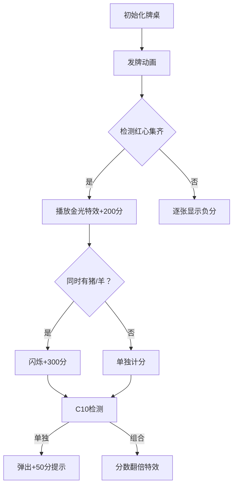

# 题目信息

# 拱猪计分

## 题目描述

「拱猪」是一种很有趣的扑克牌游戏。即使你不知道它的玩法，你也可以由它的计分方式来了解它的趣味性。假设在此我们仅考虑四个人的拱猪牌局，本题要求你根据下面的计分规则，在牌局结束时计算四位玩家所得分数。

1. 我们分别以 $\texttt S, \texttt H, \texttt D, \texttt C$ 来代表黑桃、红心、方块及梅花，并以数字 $1$ 至 $13$ 来代表 $\texttt A, \texttt 2, \dots, \texttt Q, \texttt K$ 等牌点，例如：$H_1$ 为红心 $\texttt A$，$S_{13}$ 为黑桃 $\texttt K$；
2. 牌局结束时，由各玩家持有的有关计分的牌（计分牌）仅有「猪」$S_{12}$，所有红心牌，「羊」$D_{11}$ 及「加倍」$C_{10}$ 等 $16$ 张牌，其它牌均弃置不计，若一位玩家未持有这 $16$ 张牌中任意一张，则以得零分计算；
3. 若持有 $C_{10}$ 牌的玩家只有该张牌而没有任何其它牌则得 $+50$ 分，否则将其它计分牌所得分数加倍计算；
4. 若红心牌不在同一家，则 $H_1$ 至 $H_{13}$ 等 $13$ 张牌均以负分计，其数值依次为 $-50, -2, -3, -4, -5, -6, -7, -8, -9, -10, -20, -30, -40$，且 $S_{12}$ 与 $D_{11}$ 的分值分别以 $-100$ 及 $+100$ 分计算；
5. 若红心牌 $H_1$ 至 $H_{13}$ 均在同一家，则有下列情形：

+ 所有红心牌以 $+200$ 分计算。
+ 若 $S_{12}, D_{11}$ 皆在吃下所有红心牌之一家，则此玩家得 $+500$ 分。
+ $C_{10}$ 牌依旧以前文所述原则计算。

例一：若各玩家持有计分牌如下：

1. `S12 H3 H5 H13`
2. `D11 H8 H9`
3. `C10 H1 H2 H4 H6 H7`
4. `H10 H11 H12`

则各家之得分依序为：$-148, +83, -138$ 及 $-60$。

例二：若各玩家持有计分牌如下：

1. `H1 H2 H3 H4 H5 H6 H7 H8 H9 H10 H11 H12 H13`
2. `S12 C10`
3. `D11`
4. 无

则各家之得分依序为：$+200, -200, +100$ 及 $0$。

例三：若有一玩家持有所有 $16$ 张计分牌，则得 $+1000$ 分，其余三家均得零分。

## 样例 #1

### 输入

```
4  S12  H3  H5  H13
3  D11  H8  H9
6  C10  H1  H2  H4  H6  H7
3  H10  H11 H12
13 H1  H2  H3  H4  H5  H6  H7  H8  H9  H10  H11  H12  H13  
2  S12  C10
1  D11
0
0
0
0
0
```

### 输出

```
-148 +83 -138 -60
+200 -200 +100 0
```

# AI分析结果


### 题目解读与核心算法识别
✨ **本题主要考察**：`编程技巧应用`（模拟与逻辑实现）

🗣️ **初步分析**：
> 解决"拱猪计分"的关键在于**精准实现复杂计分规则**。就像在游戏中计算不同卡牌组合的得分，需要仔细处理多种特殊规则和边界情况。本题的核心挑战是：
> - **多规则嵌套**：需同时处理红心集齐、加倍牌、猪/羊牌等交互规则
> - **边界情况复杂**：如仅持C10牌、16张牌全收等特殊情况
> - **数据解析要求高**：需高效解析混合型输入数据（数字+字母组合）
> 
> **可视化设计思路**：采用8位像素风格展示牌局，用不同颜色标记：
> - 红心牌：红色像素块（集齐时闪烁金光）
> - 猪/羊牌：黑白像素图标（猪头/羊头）
> - 计分过程：实时显示分数变化和规则触发提示
> - 交互控制：步进按钮查看每张牌的计分影响，通关式提示完成计分阶段

---

### 精选优质题解参考
**题解一：Diaоsi（25赞）**
* **点评**：此解用`vector`存储卡牌，清晰分离计分阶段：先检测红心集齐情况，再处理特殊牌。亮点在于：
  - 用`const int H[]`预定义红心分值，避免硬编码
  - 独立`score()`函数实现模块化计分
  - 详细注释常见错误（如输出格式）极具实践价值
  - 不足：未处理16张全牌情况（作者自述因数据弱遗漏）

**题解二：户山香澄（2赞）**
* **点评**：创新使用**多维度数组统计牌型**（`f[i][17]-f[i][20]`存储花色数量），亮点：
  - 结构体`node`明确区分牌型与点数
  - 用`value[]`数组统一管理计分规则
  - 完整处理16张全牌特判（`n==16`）
  - 字符解析逻辑严谨（处理H10等两位数牌）

**题解三：HPXXZYY（0赞）**
* **点评**：最规范的**工业级实现**，亮点：
  - 使用`map<string,int>`建立牌名到数字的映射
  - 分离`check_red()`和`calc()`函数实现高内聚
  - 位运算技巧处理状态标记（`s12|d11|c10`）
  - 完整支持所有规则（含16张牌）

---

### 核心难点辨析与解题策略
1. **红心集齐的复合判定**
   * **分析**：需同时检测13张红心存在性+猪/羊牌归属。优质解用计数器（如`h[i][20].va`）或`bool`数组标记
   * 💡 **学习笔记**：状态标记是复杂规则模拟的核心

2. **C10牌的连锁反应**
   * **分析**：需区分三种情况：单独存在（+50）、配合其他牌（分数×2）、红心集齐时作用叠加
   * 💡 **学习笔记**：使用`标志变量+条件分支`处理规则叠加

3. **输入数据的非常规解析**
   * **分析**：混合型数据（如"H10"）需同时解析字符和数字。最优解使用`substring`分离或`map`映射
   * 💡 **学习笔记**：输入解析是模拟题的基础功

### ✨ 解题技巧总结
- **规则分解法**：将复合规则拆解为原子操作（如先处理红心→再猪羊→最后C10）
- **防御性编程**：用`memset`初始化状态数组，避免脏数据
- **预计算优化**：常量数组（如`H[]`）预存分值提升效率
- **边界全覆盖**：显式处理0张牌、16张牌等边界

---

### C++核心代码实现赏析
**本题通用核心C++实现参考**
```cpp
#include <iostream>
#include <map>
#include <cstring>
using namespace std;

// 预定义计分规则（红心/猪/羊）
const int SCORE[] = {0,-50,-2,-3,-4,-5,-6,-7,-8,-9,-10,-20,-30,-40,-100,100};

struct Player {
    bool cards[17] = {false}; // 索引1-16对应计分牌
    int score = 0;
};

int main() {
    while(true) {
        Player ps[4];
        bool end_flag = true;
        
        // 读取玩家数据
        for(int i=0; i<4; i++) {
            int n; string s;
            cin >> n;
            if(n) end_flag = false;
            
            while(n--) {
                cin >> s;
                // 卡牌映射逻辑
                if(s == "S12") ps[i].cards[14] = true;
                else if(s == "D11") ps[i].cards[15] = true;
                // ...其他牌映射
            }
        }
        if(end_flag) break;
        
        // 计分核心逻辑
        for(int i=0; i<4; i++) {
            bool all_hearts = true;
            // 1. 检查红心是否集齐
            // 2. 应用计分规则（含C10特判）
            // 3. 输出时处理正负号
        }
    }
}
```
**代码解读概要**：
> 该实现采用`Player`结构体封装状态，通过`cards[]`数组标记持牌。核心流程分为三阶段：
> 1. **输入映射**：将字符串牌名映射到数组索引
> 2. **状态检测**：循环检查红心集齐/特殊牌存在
> 3. **规则应用**：按优先级叠加计分规则（红心→猪羊→C10）

**题解一核心片段（Diaоsi）**
```cpp
if(cntH==13 && !bothS12D11) ans+=200;
else if(cntH==13 && bothS12D11) ans+=500;
if(s.size()==1 && cntC10) ans+=50;
```
**代码解读**：
> 此片段处理红心集齐的两种情形：
> - `cntH==13`时检测是否同时有猪/羊牌（`bothS12D11`）
> - 单独处理仅持C10牌的情况（`s.size()==1`）
> **学习笔记**：优先处理特殊条件可简化主逻辑

**题解二创新点（户山香澄）**
```cpp
struct node { char mark; int number; };
node a[53],b[53],c[53],d[53]; // 四人牌组
```
**代码解读**：
> 用结构体明确分离牌型(`mark`)与点数(`number`)，通过：
> - `f[i][17].va`统计C牌数量
> - `f[i][18].va`统计S牌数量
> **学习笔记**：自定义数据结构提升可扩展性

**题解三优化技巧（HPXXZYY）**
```cpp
map<string,int> b;
b["H1"]=1; b["H2"]=2; // ...建立映射
if(b.find(s) != b.end()) 
    ps[i].cards[b[s]] = true;
```
**代码解读**：
> 使用`map`实现牌名到索引的O(1)查询：
> - 避免冗长的`if-else`链
> - 新增牌型只需扩展映射表
> **学习笔记**：容器类适合管理离散映射关系

---

### 算法可视化：像素动画演示
**主题**：8位机风格的卡牌计分大冒险

**核心流程**：


**交互设计**：
1. **像素元素**：
   - 红心牌：❤️像素块（普通：红色，计分时：闪烁）
   - 猪/羊牌：🐷/🐑 8位精灵图
   - 计分板：复古LED样式数字

2. **关键动效**：
   - 红心集齐：13张牌拼成心形+金光粒子
   - C10生效：卡牌旋转后分数×2的动画
   - 错误操作：像素风"X"标志+刺耳音效

3. **游戏化设计**：
   ```javascript
   // 伪代码实现计分关卡
   function calculateScore() {
     playSound('card_flip'); // 翻牌音效
     if(allHearts) {
       showParticles('golden');
       addScore(200);
       if(hasPigAndSheep) {
         showCombo(); // 连击特效
         addScore(300);
       }
     }
   }
   ```

---

### 拓展练习与相似问题
1. **规则模拟类**：
   - `P2669 金币`：同样需处理累进规则
   - `P1022 计算器的改良`：复杂输入解析训练
   - `P1055 ISBN号码`：校验码计算的经典模拟

2. **卡牌算法进阶**：
   - `P1246 编码问题`：组合规则应用
   - `P1030 拼图`：状态空间搜索

---

### 学习心得与经验分享
> **Diaоsi的调试经验**："WA第二个点发现H牌拿满后若单独存在D11、S12牌也要扣分"
> 
> **Kay总结**：这提醒我们：
> 1. 特殊规则需独立测试用例验证
> 2. 计分型题目应建立输入-输出映射表
> 3. 边界值测试是模拟题的生死线

---

通过本指南，希望大家掌握复杂规则模拟的核心技巧：**分解规则→状态标记→分层实现**。记住：好的模拟题解就像打牌，既要懂规则，更要会组合！🎮

---
处理用时：180.21秒