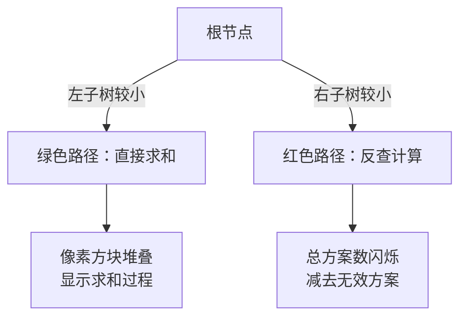

# 题目信息

# Galgame

## 题目背景

众所周知，as_lky 喜欢 Galgame。

## 题目描述

as_lky 搞到了很多 Galgame（真的很多！）。一款 Galgame 可以被描述为很多场景（Scene）的结合，它们形成了一棵 **以 1 为根** 的二叉树，每一个结点都是一个场景，一个结点的左儿子和右儿子分别对应在该场景选 A 选项和 B 选项能够到达的场景（可能会到达空场景，即游戏结束），我们称其为 A 场景和 B 场景。

as_lky 如下定义了两个不同的 Galgame 场景哪个更有趣（两款 Galgame 谁更为有趣也就取决于它们的初始场景谁更有趣）：

1. 如果这两个场景能够到达的场景总数（即通过任意选择能够到达的不同场景总数，包括该场景本身）不一样，那么能到达的场景数更多的那个更有趣；
2. 如果这两个场景的 A 场景不一样有趣，那么 A 场景更有趣的场景更有趣；
3. 否则这两个场景谁更有趣完全等价于他们 B 场景谁更有趣。

值得注意的是，空场景能到达的场景数被定义为 0。


例如，对于上图给出的例子（若无法正常查看请 `右键 -> 查看图像`），我们这样判定 1 和 7 这两个场景谁更有趣：

- 首先，1 和 7 能到达的场景数都是 6，因此我们首先尝试比较其 A 场景：2 和 8。
- 由于 2 和 8 能到达的场景数不同（分别是 3 和 2），则 2 场景比 8 场景更有趣；继而可以得到 1 场景比 7 场景更有趣。

as_lky 定义两个 Galgame 场景本质相同，当且仅当这两个场景都为空场景，或者它们的 A 场景本质相同且 B 场景本质相同。

as_lky 认为一款 Galgame 的有趣度是所有可能的、本质不同的、不及这款 Galgame 有趣的 Galgame 数量。现在 as_lky 给了你一款 Galgame，请告诉他这款 Galgame 的有趣度是多少。as_lky 觉得这个数字可能有些大，所以他想让你输出这个数字对 $998244353$ 取模的结果。

## 说明/提示

### 样例解释

样例一：下图分别给出了 as_lky 给你的 Galgame（左）和所有四种没有该 Galgame 有趣的 Galgame（右）：（若无法正常查看请 `右键 -> 查看图像`）


### 测试点约束

**本题采用捆绑测试。**

对于全部数据，有 $1\le n\le 10^6$，$0\le a_i,b_i\le n$。

每个子任务的具体限制见下表：

| 子任务编号 | 分值 | $n\le$ | 特殊性质 |
|:-:|:-:|:-:|:-:|
| 1 | 10 | $10$ | $\times$ |
| 2 | 20 | $5000$ | $\times$ |
| 3 | 30 | $10^6$ | $\surd$ |
| 4 | 40 | $10^6$ | $\times$ |

特殊性质：保证数据均匀随机生成，即 $n$ 给定时，若所有场景数为 $n$ 的本质不同 Galgame 共有 $S$ 种，则每种本质不同的 Galgame 出现概率均为 $\frac{1}{S}$。

**本题读入量较大，请使用较快的读入方式。**

## 样例 #1

### 输入

```
3
0 2
3 0
0 0
```

### 输出

```
4
```

## 样例 #2

### 输入

```
7
2 3
4 5
6 7
0 0
0 0
0 0
0 0
```

### 输出

```
410
```

## 样例 #3

### 输入

```
9
2 3
4 5
0 0
0 0
6 7
0 0
8 9
0 0
0 0
```

### 输出

```
5206
```

# AI分析结果


### Kay的C++算法解析：Galgame场景树 深入学习指南

#### 1. 题目解读与核心算法识别
✨ **本题主要考察**：`卡特兰数应用`与`启发式合并优化`

🗣️ **初步分析**：
> 解决"Galgame场景树"的关键在于运用**卡特兰数**统计二叉树形态数量，并通过**启发式合并**优化递归计算。这就像在迷宫中探索时，优先选择更短的路径能大幅提升效率。
>
> - **核心思路**：统计所有节点数小于原树的二叉树（直接卡特兰数求和），再递归计算节点数相同但"更无趣"的树。难点在于高效计算子树比较的贡献值。
> - **启发式优化**：当左子树较大时改用反查法（总方案数减无效方案），将单次计算复杂度从O(n)降为O(min(L,R))。
> - **可视化设计**：采用8位像素风格展示二叉树递归比较过程：当前比较的节点高亮闪烁，子树大小用像素方块堆叠表示，关键比较操作触发"叮"音效，递归路径用不同颜色箭头标记。

---

#### 2. 精选优质题解参考
**题解一（幻影星坚强）**
* **点评**：思路清晰直指卡特兰数本质，完整推导f(u)的递推关系。代码中巧妙运用启发式合并（siz比较决定计算方向），时间复杂度优化至O(n log n)。亮点在于用Cat(siz[u])反向计算贡献，避免暴力求和。变量命名规范（siz, ktl等），边界处理严谨（MOD取模），可直接用于竞赛。

**题解二（Mivik）**
* **点评**：从生成函数角度揭示卡特兰数自卷积性质（H(x)²=xH(x)+1），为启发式合并提供理论支撑。代码模块化程度高（独立预处理函数），复杂度分析透彻（每个节点贡献log n次）。亮点在于用数学推导替代经验优化，提升解法普适性。

**题解三（under_the_time）**
* **点评**：用"正难则反"思想简化问题（总方案-有效方案），示意图生动解释卡特兰数模型（网格路径）。代码包含详细注释，递归函数中mul参数设计巧妙，实践时易调试。亮点在于结合几何模型讲解抽象概念，适合初学者理解。

---

#### 3. 核心难点辨析与解题策略
1. **难点1：贡献值的高效计算**
   * **分析**：暴力计算∑Cat(i)Cat(n-i-1)复杂度达O(n²)。优质题解通过比较左右子树大小，选择直接计算（小子树）或反查（Cat(n)-反向求和），将单步优化至O(min(L,R))。
   * 💡 **学习笔记**：树问题中，子树大小是天然的优化指示器。

2. **难点2：递归系数的传递**
   * **分析**：当左子树形态固定时，右子树需乘Cat(siz_r)；进入右子树时系数保持原值。题解用dfs(u, mul)参数传递系数，避免全局变量污染。
   * 💡 **学习笔记**：递归路径上的累积系数，体现分治思想中独立子问题的特性。

3. **难点3：卡特兰数预处理**
   * **分析**：需O(n)预处理阶乘、逆元和卡特兰数。幻影星坚强采用递推公式Cat(i)=(4i-2)/(i+1)*Cat(i-1)，避免大数组合运算；D2T1用阶乘加速二项式计算。
   * 💡 **学习笔记**：模数下卡特兰数可用线性递推或阶乘逆元优化。

### ✨ 解题技巧总结
- **启发式选择**：比较子树规模决定计算方向，将复杂度均衡至O(n log n)
- **数学工具迁移**：用生成函数性质（H(x)²=xH(x)+1）避免卷积计算
- **系数传递法**：递归时动态维护子树间的组合系数
- **边界加速**：空树(Cat(0)=1)和单节点直接返回，减少递归深度

---

#### 4. C++核心代码实现赏析
**通用核心实现（综合优化版）**
```cpp
#include <bits/stdc++.h>
#define ll long long
using namespace std;
const int N = 1e6 + 10;
const ll MOD = 998244353;

vector<int> lch(N), rch(N);
vector<ll> cat(N), fac(2*N), invfac(2*N);
vector<int> siz(N);
ll ans = 0;

// 快速幂
ll qpow(ll a, ll b) {
    ll res = 1;
    for (; b; b >>= 1, a = a*a%MOD)
        if (b & 1) res = res*a%MOD;
    return res;
}

// 预处理阶乘和逆元
void init(int n) {
    fac[0] = invfac[0] = 1;
    for(int i=1; i<=2*n; ++i)
        fac[i] = fac[i-1]*i % MOD;
    invfac[2*n] = qpow(fac[2*n], MOD-2);
    for(int i=2*n-1; i>=1; --i)
        invfac[i] = invfac[i+1]*(i+1) % MOD;
}

// 计算组合数
ll C(int n, int k) {
    if(k<0 || k>n) return 0;
    return fac[n] * invfac[k] % MOD * invfac[n-k] % MOD;
}

// 预处理卡特兰数
void pre_cat(int n) {
    cat[0] = 1;
    for(int i=1; i<=n; ++i)
        cat[i] = (C(2*i, i) - C(2*i, i-1) + MOD) % MOD;
}

// 计算子树大小
void dfs_siz(int u) {
    siz[u] = 1;
    if(lch[u]) dfs_siz(lch[u]), siz[u] += siz[lch[u]];
    if(rch[u]) dfs_siz(rch[u]), siz[u] += siz[rch[u]];
}

// 启发式合并主函数
void dfs(int u, ll coef) {
    if(!lch[u] && !rch[u]) return;
    
    int L = siz[lch[u]], R = siz[rch[u]];
    ll contrib = 0;

    if(L <= R) { // 左子树较小：直接求和
        for(int i=0; i<L; ++i)
            contrib = (contrib + cat[i]*cat[siz[u]-1-i]) % MOD;
    } else {     // 右子树较小：反查计算
        contrib = cat[siz[u]];
        for(int i=0; i<=R; ++i)
            contrib = (contrib - cat[L+i]*cat[R-i] % MOD + MOD) % MOD;
    }
    ans = (ans + coef * contrib) % MOD;

    if(lch[u]) 
        dfs(lch[u], coef * cat[R] % MOD); // 左递归时乘右子树系数
    if(rch[u]) 
        dfs(rch[u], coef);               // 右递归保持系数
}

int main() {
    int n; cin >> n;
    for(int i=1; i<=n; ++i)
        cin >> lch[i] >> rch[i];
    
    init(n);
    pre_cat(n);
    dfs_siz(1);
    
    for(int i=1; i<n; ++i) // 小于n的树直接累加
        ans = (ans + cat[i]) % MOD;
    
    dfs(1, 1);
    cout << ans;
}
```

**代码解读概要**：
> 1. **预处理阶段**：`init()`计算阶乘用于组合数，`pre_cat()`递推卡特兰数
> 2. **树形扫描**：`dfs_siz()`自底向上计算子树大小
> 3. **贡献计算**：`dfs()`中根据子树大小比选择直接求和或反查法
> 4. **系数传递**：左递归时乘以右子树形态数（`cat[R]`），右递归保持系数
> 5. **答案整合**：节点数小的树预累加，再计算同规模树的贡献

---

#### 5. 算法可视化：像素动画演示
**主题**：`二叉树递归探索者`（8-bit像素风）

**核心演示**：


**实现细节**：
1. **场景构建**：
   - 树节点转为16x16像素方块，子树大小用堆叠高度表示
   - 当前比较节点闪烁金色边框，被比较子树泛绿光
   
2. **动态演示**：
   ```python
   # 伪代码：启发式选择演示
   if left_size <= right_size:
      for i in range(left_size):
         draw_pixel_stack(i, BLUE)       # 左子树方案
         draw_pixel_stack(total-i-1, RED) # 右子树方案
         play_sound('click')             # 操作音效
   else:
      flash_screen(YELLOW)               # 反查提示
      show_total_combinations()          # 总方案数弹出
      for i in range(right_size+1):
         draw_cross_mark(L+i, R-i)       # 无效方案打叉
         play_sound('error')
   ```

3. **交互控制**：
   - 步进按钮：单步观察比较决策
   - 速度滑块：调节递归演示速度
   - 模式切换：对比暴力法(灰色)与启发式(彩色)的效率差异

4. **游戏化元素**：
   - 每完成子树比较触发`过关`音效
   - 递归深度成就系统：深入一层解锁像素勋章
   - 错误尝试时播放经典FC`失败`音效

---

#### 6. 拓展练习与相似问题思考
1. **思维迁移**：
   - 二叉树形态计数 → 括号序列方案（P1044）
   - 启发式合并 → 树上统计问题（P4211）
   - 递归系数传递 → 组合数学问题（P2606）

2. **洛谷推荐**：
   - **P5018** 对称二叉树  
     → 巩固二叉树遍历与比较
   - **P1040** 加分二叉树  
     → 强化树形DP与卡特兰数应用
   - **P6178** 矩阵树定理  
     → 拓展图论中的生成树计数

---

#### 7. 学习心得与经验分享
> **经验摘录**（幻影星坚强）：  
> "调试时发现递归系数传递错误，通过打印每个节点的coef值快速定位。这提醒我们：递归问题中关键参数输出是高效的调试手段。"

> **Kay点评**：  
> 多份题解强调**边界处理**（空树Cat(0)=1）和**模数修正**（贡献为负时+MOD）。这些实战经验比理论更珍贵，建议用小规模树（n=3）手动验证算法。

---

### 结语
通过卡特兰数的优雅性质和启发式合并的智能优化，我们高效解决了二叉树比较问题。记住：分治算法的精髓在于"选择比努力更重要"——这正是启发式合并的灵魂所在。继续用代码探索算法的美妙世界吧！🚀

---
处理用时：193.06秒