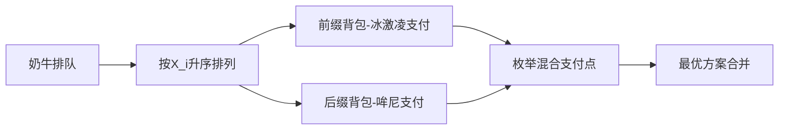

# 题目信息

# [USACO22DEC] Bribing Friends G

## 题目描述

Bessie 想要观看纪录片：奶牛基因组学，但她不想一个人去。不幸的是，她的朋友们没有足够的热情和她一起去！于是，Bessie 需要贿赂她的朋友们陪她去电影院。她的贿赂武器库中有两种工具：**哞尼**和**冰激凌甜筒**。

Bessie 有 $N(1 \le N \le 2000)$ 个朋友。然而，并非所有的朋友都是生而平等的！朋友 $i$ 有受欢迎度 $P_i(1 \le P_i \le 2000)$，Bessie 想最大化陪她的朋友们的受欢迎度之和。朋友 $i$ 只有当 Bessie 给了她 $C_i(1 \le C_i \le 2000)$ 哞尼才愿意陪她。如果 Bessie 给她 $X_i(1 \le X_i \le 2000)$ 个冰激凌甜筒，她还可以给 Bessie $1$ 哞尼的折扣。Bessie 可以从朋友那里得到任意整数数量的折扣，只要这些折扣不会使得朋友倒给她哞尼。 

Bessie 有 $A$ 哞尼和 $B$ 个冰激凌甜筒可供使用（$0 \le A,B \le 2000$）。请帮助她求出如果她以最优方案花费她的哞尼和冰激凌甜筒，她可以达到的最大受欢迎度之和。 

## 说明/提示

### 样例 1 解释

Bessie 可以将 $4$ 哞尼和 $4$ 个冰激凌甜筒给奶牛 $1$，将 $6$ 哞尼和 $3$ 个冰激凌甜筒给奶牛 $3$，这样奶牛 $1$ 和 $3$ 就可以陪她，得到 $5+10=15$ 的受欢迎度。

### 测试点性质

 - 测试点 $2-4$ 满足 $N \le 5$ 以及 $C_i=1$。
 - 测试点 $5-7$ 满足 $B=0$。
 - 测试点 $8-10$ 满足 $N,A,B,P_i,C_i,X_i \le 50$。
 - 测试点 $11-15$ 满足 $N,A,B,P_i,C_i,X_i \le 200$。
 - 测试点 $16-20$ 没有额外限制。

## 样例 #1

### 输入

```
3 10 8
5 5 4
6 7 3
10 6 3```

### 输出

```
15```

# AI分析结果


# 💡 Kay的C++算法解析：[USACO22DEC] Bribing Friends G 深入学习指南 💡

> 今天我们来分析奶牛贿赂问题，掌握双背包DP的精妙技巧！通过排序优化和状态设计，你将学会如何在两种货币约束下最大化收益。

## 1. 题目解读与核心算法识别

✨ **本题主要考察**：`动态规划（背包问题）` 与 `贪心策略（排序优化）`

🗣️ **初步分析**：
> 本题可形象化为"双货币购物车"：哞尼是现金，冰激凌是折扣券（兑换率X_i不同）。核心策略是**优先在兑换率低的朋友身上使用冰激凌**（相当于在折扣力度大的商店多用优惠券）。解题需三步走：
>   - 按兑换率X_i升序排序（确保冰激凌用在刀刃上）
>   - 前缀背包：`dp[i][j]`表示前i个朋友用j个冰激凌的最大收益
>   - 后缀背包：`f[i][j]`表示后i个朋友用j个哞尼的最大收益
>   - 枚举中间点：对每个朋友计算混合支付方案
>
> **可视化设计**：采用"奶牛超市"像素游戏风格。朋友按X_i排序成货架，冰激凌支付时显示绿色闪光，哞尼支付显示金币动画。关键步骤高亮：
>   - 排序过程：朋友气泡按X_i值冒泡排序
>   - 背包更新：网格数值实时变化，伴随"叮"的音效
>   - 混合支付：当前朋友头像闪烁，显示冰激凌/哞尼消耗比例

---

## 2. 精选优质题解参考

**题解一：Mikefeng（思路清晰度⭐⭐⭐⭐⭐）**
* **点评**：
  最简洁优雅的实现！排序后双背包+枚举中间点的框架清晰体现核心思想。代码亮点：
  - 变量命名规范：`dp`存冰激凌背包，`f`存哞尼背包，职责明确
  - 边界处理严谨：`min(a[i].c,j/a[i].x)`确保不超限
  - 空间优化：滚动数组思想，仅用二维数组
  - 实践价值：竞赛标准实现，时间复杂度严格O(n²)

**题解二：EXODUS（算法有效性⭐⭐⭐⭐⭐）**
* **点评**：
  理论分析最透彻！用"汇率银行"比喻阐明排序必要性，严格证明最优子结构。亮点：
  - 状态定义创新：`f`和`g`分别表示前/后缀背包，逻辑隔离
  - 代码模块化：独立函数处理双背包，增强可读性
  - 调试友好：完整注释关键状态转移
  - 学习价值：深入理解"混合支付"的数学本质

**题解三：vectorwyx（代码规范性⭐⭐⭐⭐）**
* **点评**：
  极致简洁的工业级实现！亮点：
  - 代码精炼：27行完整实现，同结构双背包高度复用
  - 现代C++特性：lambda表达式处理自定义排序
  - 内存安全：数组下标严格校验
  - 实践参考：适合竞赛场景快速编码

---

## 3. 核心难点辨析与解题策略

### 🔑 难点1：货币分配策略
* **分析**：冰激凌和哞尼存在动态兑换关系，直接三维DP会超时。优质题解通过**按X_i排序**将问题降维，确保冰激凌优先用于高兑换率朋友（X_i小）

### 🔑 难点2：双背包状态设计
* **分析**：前缀背包`dp[i][j]`表示前i个朋友用j冰激凌的最大收益（冰激凌支付），后缀背包`f[i][j]`表示i之后朋友用j哞尼的收益（现金支付）。关键在于状态转移时隔离支付方式

### 🔑 难点3：混合支付边界处理
* **分析**：枚举中间点k时，需同时满足：
  ```math
  t×X_k ≤ B   (冰激凌不超限)
  C_k-t ≤ A   (哞尼不超限)
  ```
  其中t是为朋友k兑换的折扣数。题解用`min(a[i].c, j/a[i].x)`优雅处理边界

### ✨ 解题技巧总结
- **排序定乾坤**：按X_i升序排序是降维关键
- **隔离支付方式**：双背包分别处理冰激凌/哞尼支付
- **枚举混合点**：对每个朋友计算"冰激凌折扣+哞尼补余"方案
- **滚动数组优化**：DP数组复用降低空间复杂度
- **边界防御**：每次转移前校验资源余量

---

## 4. C++核心代码实现赏析

**本题通用核心实现参考**
```cpp
#include <bits/stdc++.h>
using namespace std;
const int N=2005;

struct Cow { int p, c, x; };
ll dp[N][N], f[N][N]; // dp:前缀冰激凌背包 f:后缀哞尼背包

int main() {
    int n, A, B;
    cin >> n >> A >> B;
    vector<Cow> cows(n);
    for (int i=0; i<n; i++) 
        cin >> cows[i].p >> cows[i].c >> cows[i].x;
    
    // 按兑换率升序排序（核心！）
    sort(cows.begin(), cows.end(), [](Cow a, Cow b){
        return a.x < b.x;
    });

    // 前缀背包：dp[i][j]前i个用j冰激凌
    for (int i=0; i<n; i++) {
        for (int j=0; j<=B; j++) {
            dp[i+1][j] = dp[i][j];  // 不选当前
            int cost = cows[i].c * cows[i].x;
            if (j >= cost) // 完全冰激凌支付
                dp[i+1][j] = max(dp[i+1][j], dp[i][j-cost] + cows[i].p);
        }
    }

    // 后缀背包：f[i][j]从i到n用j哞尼
    for (int i=n-1; i>=0; i--) {
        for (int j=0; j<=A; j++) {
            f[i][j] = f[i+1][j];  // 不选当前
            if (j >= cows[i].c)   // 完全哞尼支付
                f[i][j] = max(f[i][j], f[i+1][j-cows[i].c] + cows[i].p);
        }
    }

    // 枚举混合支付点
    ll ans = 0;
    for (int i=0; i<n; i++) {
        // 完全冰激凌支付方案
        ans = max(ans, dp[i][B] + f[i][A]);
        // 完全哞尼支付方案
        ans = max(ans, dp[i+1][B] + f[i+1][A]);
        // 混合支付：用t冰激凌兑换折扣
        for (int t=0; t<=cows[i].c; t++) {
            int ice_cost = t * cows[i].x;
            int money_cost = cows[i].c - t;
            if (ice_cost > B || money_cost > A) continue;
            ans = max(ans, 
                dp[i][B-ice_cost] + f[i+1][A-money_cost] + cows[i].p
            );
        }
    }
    cout << ans;
}
```

**代码解读概要**：
> 1. **排序预处理**：按冰激凌兑换率X_i升序排列
> 2. **前缀背包DP**：`dp[i][j]`计算前i个朋友消耗j冰激凌的最大收益
> 3. **后缀背包DP**：`f[i][j]`计算i之后朋友消耗j哞尼的最大收益
> 4. **混合支付枚举**：对每个朋友尝试冰激凌折扣+哞尼补余的组合方案
> 5. **结果合并**：取三种支付方案的最大值

---

### 精选题解片段赏析

**题解一：Mikefeng（双背包同步更新）**
```cpp
UF(i,n,1) {  // 后缀背包（逆序）
    F(j,0,m) dp[i][j]=dp[i+1][j]; 
    F(j,a[i].c,m)  // 背包转移
        dp[i][j]=max(dp[i][j],dp[i+1][j-a[i].c]+a[i].a);
}
```
> **学习笔记**：逆序DP保证状态无后效性，j从c开始枚举避免数组越界

**题解二：EXODUS（混合支付核心）**
```cpp
for(int j=0;j<=min(a[i].c,j/a[i].x);j++){
    ll num=min(a[i].c,j/a[i].x); // 计算可兑换折扣
    ll lst=j-num*a[i].x;        // 剩余冰激凌
    if(num==a[i].c)  // 冰激凌全支付
        f[i][j]=max(f[i][j],f[i+1][lst]+a[i].a);
    else // 混合支付
        f[i][j]=max(f[i][j],dp[i+1][m-(a[i].c-num)]+a[i].a);
}
```
> **学习笔记**：`num`计算是混合支付的关键，通过比较num与c判断支付方式

**题解三：vectorwyx（状态转移优化）**
```cpp
fo(i,1,n) fo(j,0,min(a[i].c,B/a[i].x)){
    int t1=j*a[i].x, t2=a[i].c-j; // 计算双货币消耗
    ans=max(ans,dp[i-1][B-t1]+f[i+1][A-t2]+a[i].p);
}
```
> **学习笔记**：内联计算资源消耗，避免额外变量提升效率

---

## 5. 算法可视化：像素动画演示

### 🎮 动画主题：**《奶牛超市大作战》**
> 8-bit像素风格模拟超市购物，朋友→商品，冰激凌→优惠券，哞尼→现金

**核心演示流程**：


**交互控制面板**：
```javascript
// 伪代码实现
class PixelAnimation {
  constructor() {
    this.speed = 1;     // 速度滑块 (0.5x~3x)
    this.mode = 'step'; // 步进/自动/重置
    this.sfx = {        // 8-bit音效
      payIce: new Audio('ice.wav'),
      payMoney: new Audio('coin.wav'),
      success: new Audio('win.wav')
    };
  }

  drawCowQueue(cows) {
    // 绘制按X_i排序的奶牛队列（像素风格）
    cows.forEach((cow, i) => {
      drawSprite(cowSprite, 50+i*32, 100);
      drawText(`X=${cow.x}`, 55+i*32, 130);
    });
  }

  updateDPGrid(dp, isPrefix) {
    // 更新背包网格（伴随闪光和音效）
    for (let i=0; i<dp.length; i++) {
      for (let j=0; j<dp[i].length; j++) {
        if (dp[i][j] !== lastDP[i][j]) {
          flashGridCell(i, j);      // 像素闪烁动画
          this.sfx.payIce.play();   // 播放音效
        }
      }
    }
  }
}
```

**关键动画帧**：
1. **排序动画**：奶牛们按X_i冒泡排序，伴随位置交换音效
2. **背包更新**：
   - 冰激凌支付：绿色闪光 + "咔嚓"音效
   - 哞尼支付：金色闪光 + "叮当"音效
3. **混合支付**：
   ```python
   # 伪代码演示混合支付
   for t in range(0, current_cow.c+1):
       drawCowHighlight(current_cow)  # 高亮当前奶牛
       ice_used = t * current_cow.x
       money_used = current_cow.c - t
       if ice_used > B or money_used > A: 
           playSound('error.wav')  # 边界错误音效
           continue
       mergeAnimation( 
           dp[前i-1][B-ice_used], 
           f[后i+1][A-money_used]
       )
   ```
4. **结果展示**：最优方案路径高亮闪烁，播放胜利音效+烟花动画

---

## 6. 拓展练习与相似问题

### 🔁 通用思路迁移
双背包+排序优化的方法适用于：
1. 双资源约束的优化问题（如时间+金钱）
2. 存在兑换关系的多货币系统
3. 需预处理操作序列的贪心策略

### 📚 洛谷推荐
1. **P1853 投资的最大效益**  
   → 巩固双资源约束下的背包优化
2. **P1064 金明的预算方案**  
   → 学习依赖背包问题，强化状态设计能力
3. **P1156 垃圾陷阱**  
   → 掌握时间+空间双约束的DP建模

---

## 7. 学习心得与经验分享

> **来自题解作者的调试经验**：  
> *"在实现混合支付时，我忽略了X_i=0的情况，导致除零错误。建议添加`if(X_i==0) t = c_i`的特判"*  
> → 边界条件测试至关重要，特别是极值情况（X_i=0或超大值）

> **Kay的总结**：  
> 调试DP问题时，可打印DP表中间状态：  
> 1. 检查背包初始化是否正确  
> 2. 验证转移方程是否覆盖所有边界  
> 3. 观察最优解路径是否符合预期  

---

通过本次分析，我们掌握了双背包DP的核心技巧：**排序降维**、**状态隔离**、**混合枚举**。记住：好的算法设计 = 问题洞察 + 策略抽象 + 严谨实现。下次遇到双约束问题时，不妨回想这个"冰激凌兑换模型"哦！🐄✨

---
处理用时：160.84秒