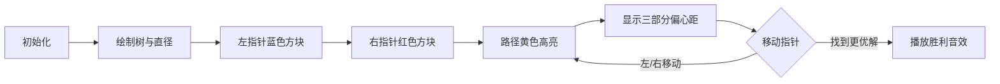

# 题目信息

# [NOIP 2007 提高组] 树网的核

## 题目描述

设 $T=(V,E,W)$ 是一个无圈且连通的无向图（也称为无根树），每条边都有正整数的权，我们称 $T$ 为树网（`treenetwork`），其中 $V$，$E$ 分别表示结点与边的集合，$W$ 表示各边长度的集合，并设 $T$ 有 $n$ 个结点。

路径：树网中任何两结点 $a$，$b$ 都存在唯一的一条简单路径，用 $d(a, b)$ 表示以 $a, b$ 为端点的路径的长度，它是该路径上各边长度之和。我们称 
$d(a, b)$ 为 $a, b$ 两结点间的距离。

$D(v, P)=\min\{d(v, u)\}$, $u$ 为路径 $P$ 上的结点。

树网的直径：树网中最长的路径称为树网的直径。对于给定的树网 $T$，直径不一定是唯一的，但可以证明：各直径的中点（不一定恰好是某个结点，可能在某条边的内部）是唯一的，我们称该点为树网的中心。

偏心距 $\mathrm{ECC}(F)$：树网 $T$ 中距路径 $F$ 最远的结点到路径 $F$ 的距离，即

$$\mathrm{ECC}(F)=\max\{D(v, F),v \in V\}$$

任务：对于给定的树网 $T=(V, E, W)$ 和非负整数 $s$，求一个路径 $F$，他是某直径上的一段路径（该路径两端均为树网中的结点），其长度不超过 $s$（可以等于 $s$），使偏心距 $\mathrm{ECC}(F)$ 最小。我们称这个路径为树网 $T=(V, E, W)$ 的核（`Core`）。必要时，$F$ 可以退化为某个结点。一般来说，在上述定义下，核不一定只有一个，但最小偏心距是唯一的。

下面的图给出了树网的一个实例。图中，$A-B$ 与 $A-C$ 是两条直径，长度均为 $20$。点 $W$ 是树网的中心，$EF$ 边的长度为 $5$。如果指定 $s=11$，则树网的核为路径`DEFG`（也可以取为路径`DEF`），偏心距为 $8$。如果指定 $s=0$（或 $s=1$、$s=2$），则树网的核为结点 $F$，偏心距为 $12$。


## 说明/提示

- 对于 $40\%$ 的数据，保证 $n \le 15$。
- 对于 $70\%$ 的数据，保证 $n \le 80$。
- 对于 $100\%$ 的数据，保证 $2\le n \le 300$，$0\le s\le10^3$，$1 \leq u, v \leq n$，$0 \leq w \leq 10^3$。

NOIP2007 提高组第四题

## 样例 #1

### 输入

```
5 2
1 2 5
2 3 2
2 4 4
2 5 3
```

### 输出

```
5
```

## 样例 #2

### 输入

```
8 6
1 3 2
2 3 2 
3 4 6
4 5 3
4 6 4
4 7 2
7 8 3
```

### 输出

```
5```

# AI分析结果


### 💡 Kay的C++算法解析：树网的核 深入学习指南 💡

#### 1. 题目解读与核心算法识别
✨ **本题主要考察**：树的性质与滑动窗口优化  
🗣️ **初步分析**：
> 解决"树网的核"这道题，关键在于理解**树的直径性质**和**滑动窗口优化技巧**。想象一棵树就像一张蜘蛛网，直径是最长的"骨架"，而核就是骨架上最核心的一段。通过数学证明可以知道：最小偏心距的路径一定在直径上，且偏心距由三部分决定：左端剩余、右端剩余和内部支链最大值。  
> - 核心思路：先求出树的任意一条直径，预处理支链长度，再用双指针在直径上滑动寻找最优路径  
> - 可视化设计：在像素动画中，用黄色高亮直径，蓝色/红色方块表示双指针，路径长度用进度条显示，偏心距的三部分用不同颜色条形图动态展示  
> - 复古元素：采用8-bit像素风格，路径扩展时播放"滴"声，找到更优解时播放"叮"的胜利音效，自动演示模式像贪吃蛇AI一样移动指针  

#### 2. 精选优质题解参考
**题解一 (来源：StudyingFather)**  
* **点评**：此解法从暴力枚举逐步优化到O(n)解法，思路清晰严谨。对树的性质证明尤其出色（如引理2.2证明核必在直径上），代码规范（dia数组存储直径，pres/posts预处理距离），算法有效性高（双指针+全局最大值优化）。实践价值高，边界处理严谨，是竞赛标准解法。  

**题解二 (来源：Mosklia)**  
* **点评**：解法简洁高效，40行实现O(n)最优解。亮点在于利用树的性质（dₖ ≤ 端点距离）省略单调队列，直接用全局最大值。变量命名直观（pre/suf），滑动窗口实现优雅，特别适合竞赛编码。作者提到"时间复杂度达下限"体现深度优化意识。  

**题解三 (来源：天泽龟)**  
* **点评**：提供独特的二分答案视角，详细论证二分单调性和边界处理（下界取支链最大值）。虽然实际效率不如双指针，但对理解问题本质很有帮助。调试心得"智商下降"的幽默提醒了算法选择的权衡。  

#### 3. 核心难点辨析与解题策略
1. **确定核的位置**  
   *分析*：为什么核一定在直径上？反证法说明：若核不在直径上，则直径端点距离会使偏心距更大（引理2.2）  
   💡 **学习笔记**：树网问题优先锁定直径！  

2. **偏心距计算优化**  
   *分析*：偏心距的三部分中，内部支链最大值可全局预计算，而端点距离用前缀和优化。关键突破：dₖ ≤ min(左端距离, 右端距离)  
   💡 **学习笔记**：分离变与不变——支链最大值固定，端点距离随窗口变化  

3. **双指针滑动窗口**  
   *分析*：固定左端点，右指针扩展到s限制边界。移动时同步更新端点距离，O(n)完成扫描  
   💡 **学习笔记**：滑动窗口是区间优化利器  

✨ **解题技巧总结**  
- **问题分解**：直径求解→支链计算→窗口扫描  
- **数据结构选择**：vector存直径，数组存前缀和  
- **边界处理**：s=0时核退化为点，s≥直径时核为整个直径  
- **调试技巧**：可视化直径节点和支链值（cout调试）  

#### 4. C++核心代码实现赏析
**通用核心实现参考**  
*说明*：综合优质题解的最优实现，双指针+全局最大值优化  
```cpp
#include <iostream>
#include <vector>
#include <algorithm>
using namespace std;
const int N = 5e5+5;

struct Edge { int v, w; };
vector<Edge> G[N];
vector<int> dia; // 存储直径节点
int n, s, d[N], fa[N], branch[N], pre[N], suf[N];
bool vis[N];

// 求直径端点
void dfs(int u, int f) {
    fa[u] = f;
    for (auto e : G[u]) if (e.v != f) {
        d[e.v] = d[u] + e.w;
        dfs(e.v, u);
    }
}

int main() {
    cin >> n >> s;
    for (int i=1; i<n; i++) {
        int u, v, w; cin >> u >> v >> w;
        G[u].push_back({v, w}); G[v].push_back({u, w});
    }
    
    // 求直径
    dfs(1, 0);
    int rt = max_element(d+1, d+n+1) - d;
    d[rt] = 0; dfs(rt, 0);
    int ed = max_element(d+1, d+n+1) - d;
    
    // 构建直径序列
    for (int u=ed; u; u=fa[u]) {
        dia.push_back(u); 
        vis[u] = true;
    }
    reverse(dia.begin(), dia.end());
    
    // 预处理前缀/后缀距离
    for (int i=1; i<dia.size(); i++) 
        for (auto e : G[dia[i-1]]) 
            if (e.v == dia[i]) pre[i] = pre[i-1] + e.w;
            
    for (int i=dia.size()-2; i>=0; i--)
        for (auto e : G[dia[i+1]]) 
            if (e.v == dia[i]) suf[i] = suf[i+1] + e.w;
    
    // 求支链最大值
    int max_branch = 0;
    function<void(int,int,int)> dfs_chain = [&](int u, int f, int len) {
        max_branch = max(max_branch, len);
        for (auto e : G[u]) if (e.v != f && !vis[e.v]) 
            dfs_chain(e.v, u, len+e.w);
    };
    for (int u : dia) dfs_chain(u, 0, 0);
    
    // 双指针扫描
    int ans = 1e9;
    for (int l=0, r=0; l<dia.size(); l++) {
        while (r < dia.size() && pre[r]-pre[l] <= s) r++;
        int ecc = max({max_branch, pre[l], suf[r-1]});
        ans = min(ans, ecc);
    }
    cout << ans;
}
```

**题解一片段赏析**  
```cpp
while (r <= cnt && pres[r+1]-pres[l] <= s) r++;
int ecc = max({maxd, pres[l], posts[r]});
```
* **亮点**：三行代码实现核心滑动窗口  
* **代码解读**：  
  > 固定左端点`l`，`while`循环扩展`r`直到路径长度超过`s`。偏心距取三部分最大值：全局支链最大值`maxd`（不变），左端距离`pres[l]`，右端距离`posts[r]`（随窗口变化）。  
* 💡 **学习笔记**：不变与变的分离是优化关键  

#### 5. 算法可视化：像素动画演示  
**设计主题**：8-bit树网探险  
**核心演示**：双指针在直径上滑动，实时计算偏心距  



**关键交互**：  
1. **像素网格**：节点用16x16像素方块，直径边黄色  
2. **控制面板**：  
   - 速度滑块：调节指针移动速度  
   - 单步执行：按步观察指针移动  
   - 自动模式：AI像贪吃蛇自动扫描  
3. **动态显示**：  
   - 当前路径长度：进度条显示s限制  
   - 偏心距三部分：左端(红)/右端(蓝)/支链(绿)条形图  
   - 最优解闪烁：发现更优解时路径变金色  
4. **音效设计**：  
   - 指针移动："滴"声  
   - 超过s限制："嘟"错误音  
   - 更新最优解："叮"胜利音效  

#### 6. 拓展练习与相似问题  
**通用思路迁移**：  
1. 滑动窗口+树直径：解决带约束的树路径优化问题  
2. 二分+树性质：验证型问题如"是否存在偏心距≤k的路径"  

**洛谷推荐**：  
1. **P2491 [SDOI2011]消防**  
   🗣️ 树网的核加强版，数据更大，巩固O(n)解法  
2. **P4408 [NOI2003]逃学的小孩**  
   🗣️ 巧用直径性质求三点距离极值  
3. **P3629 [APIO2010]巡逻**  
   🗣️ 动态维护树的直径，拓展思维  

#### 7. 学习心得与经验分享  
> **StudyingFather的调试经验**："在求支链DFS时，必须标记直径节点`vis[u]=true`，否则会重复访问直径导致错误"  
>   
> **Kay点评**：这个调试点很典型——处理支链时要排除直径干扰。建议：  
> 1. 用独立`vis`数组标记直径节点  
> 2. 写DFS前先画小样例验证  
> 3. 输出中间变量检查支链值  

#### 结语  
通过本次分析，我们掌握了树网问题的核心解法：锁定直径→预处理支链→双指针扫描。记住Kay的秘诀："树网问题，直径是金；滑动窗口，优化随心"。继续加油，下次挑战更高阶的树算法！💪

---
处理用时：217.19秒