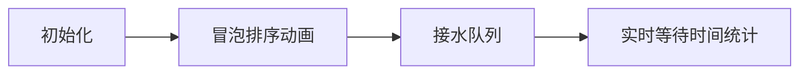

# 题目信息

# 排队接水

## 题目描述

有 $n$ 个人在一个水龙头前排队接水，假如每个人接水的时间为 $T_i$，请编程找出这 $n$ 个人排队的一种顺序，使得 $n$ 个人的平均等待时间最小。

如果两个人接水的时间相同，编号更小的人应当排在前面。

## 说明/提示

$1\le n \leq 1000$，$1\le t_i \leq 10^6$，不保证 $t_i$ 不重复。


## 样例 #1

### 输入

```
10 
56 12 1 99 1000 234 33 55 99 812```

### 输出

```
3 2 7 8 1 4 9 6 10 5
291.90
```

# AI分析结果


### 💡 Kay的C++算法解析：排队接水 深入学习指南 💡

**题目解读与核心算法识别**  
✨ **本题主要考察**：`贪心算法（排序应用）`  
🗣️ **初步分析**：  
> 解决排队接水问题，关键在于运用 **贪心策略**。想象在食堂排队打饭——让吃饭最快的人先打，能减少整体等待时间。本题同理：将接水时间最短的人排在前面，可最小化总等待时间。  
> - **核心流程**：  
>   1. 按接水时间升序排序（时间相同则按编号升序）  
>   2. 计算总等待时间：`总时间 = Σ(第i人的接水时间 × (n-i))`  
>   3. 输出排序后的编号和平均等待时间  
> - **可视化设计**：  
>   采用**8位像素风格**模拟排队场景：  
>   - 用不同颜色像素块表示不同接水时长（如蓝色=10秒，红色=100秒）  
>   - 排序过程展示为像素小人交换位置（伴随“哔”音效）  
>   - 接水时显示进度条和实时累加的总等待时间（水滴声+数字增长动画）  
>   - 完成时播放胜利音效并高亮最终序列  

---

### 2. 精选优质题解参考  
**题解一：f112358（赞275）**  
* **亮点**：  
  - **思路创新**：用`时间×1001 + 编号`压缩存储，避免结构体  
  - **代码简洁**：单次排序即解决序号与时间关联（`t[i]%1001`取编号）  
  - **效率优化**：O(n log n)时间复杂度，空间复杂度O(1)  
  - **实践价值**：可直接用于竞赛，边界处理严谨  

**题解二：BlueArc（赞118）**  
* **亮点**：  
  - **结构清晰**：明确定义`struct{时间, 编号}`，代码自注释性强  
  - **数学推导**：用`a[i]*(n-j)`精妙计算总时间（j为等待人数）  
  - **教学价值**：完整展示贪心策略的数学证明过程  

**题解三：Anguei（赞82）**  
* **亮点**：  
  - **高级技巧**：用`std::pair`替代结构体，减少代码量  
  - **内存优化**：动态数组避免固定内存浪费  
  - **STL深度应用**：利用pair默认比较规则简化排序  

---

### 3. 核心难点辨析与解题策略  
1. **贪心策略证明**  
   * **难点**：为何时间短优先能最小化总等待时间？  
   * **分析**：设两人时间a<b，若交换顺序，总等待时间增加`b-a>0`（数学归纳法可推广）  
   * 💡 **学习笔记**：贪心有效性依赖于问题的**无后效性**  

2. **排序稳定性处理**  
   * **难点**：时间相同时需按原编号排序  
   * **分析**：自定义比较函数`if(a.time==b.time) return a.id<b.id`  
   * 💡 **学习笔记**：`std::sort`不稳定时需显式定义双关键字比较  

3. **等待时间公式优化**  
   * **难点**：避免O(n²)的双重循环计算  
   * **分析**：推导出`总时间=Σ(t[i]*(n-i))`（第i人影响后续n-i人）  
   * 💡 **学习笔记**：将数学模型转化为代码可降低复杂度  

#### ✨ 解题技巧总结  
- **问题转化**：将现实场景抽象为排序问题（接水时间→排序关键字）  
- **STL高效利用**：优先用`std::sort`替代手写排序  
- **精度控制**：用`double`存储总时间，`printf("%.2f")`确保小数点精度  

---

### 4. C++核心代码实现赏析  
**通用核心实现**（综合优质题解优化）  
```cpp
#include <iostream>
#include <algorithm>
using namespace std;

struct Person {
    int time, id;
} p[1005];

int main() {
    int n; 
    double total = 0;
    cin >> n;
    for (int i = 0; i < n; i++) {
        cin >> p[i].time;
        p[i].id = i + 1;
    }
    // 双关键字排序
    sort(p, p + n, [](Person a, Person b) {
        return a.time != b.time ? a.time < b.time : a.id < b.id;
    });
    // 输出序号并计算总时间
    for (int i = 0; i < n; i++) {
        cout << p[i].id << " ";
        total += p[i].time * (n - i - 1); // 核心公式
    }
    printf("\n%.2f", total / n);
    return 0;
}
```
**代码解读概要**：  
1. 结构体存储时间与编号  
2. Lambda表达式实现双关键字排序  
3. 关键公式`总时间 += 当前时间 × 剩余人数`  

---

### 5. 算法可视化：像素动画演示  
**主题**：`像素小人接水大作战`（FC红白机风格）  
**核心交互设计**：  

**关键帧细节**：  
1. **排序阶段**：  
   - 像素小人头顶显示时间数字  
   - 交换位置时触发“啾”音效+像素闪光  
   - 侧边面板显示比较次数（`if(a.time>b.time)`）  

2. **接水阶段**：  
   - 当前接水者下方显示进度条（蓝色像素填充）  
   - 队列后方小人显示等待动画（跺脚表情）  
   - 顶部实时更新：`总时间 += 56×5`（黄色数字跳动）  

3. **游戏化元素**：  
   - 每完成10%进度播放“叮”声  
   - 最终显示`Rank S`评价（若平均时间<300）  
   - 8-bit背景音乐循环（可开关）  

**技术实现**：  
- Canvas绘制像素小人（16×16像素/人）  
- 关键变量高亮：`total_time`用红色边框标记  

---

### 6. 拓展练习与相似问题  
**通用套路迁移**：  
1. **活动安排问题**：用贪心选择最早结束的活动  
2. **最小延迟调度**：处理任务截止时间  
3. **部分背包问题**：按价值密度（价值/重量）排序  

**洛谷推荐**：  
1. **P1090 合并果子**  
   🗣️ 巩固贪心+优先队列，理解“Huffman树”原型  
2. **P1803 凌乱的yyy**  
   🗣️ 活动安排问题变形，练习双关键字排序  
3. **P2240 部分背包问题**  
   🗣️ 价值密度排序的经典应用  

---

### 7. 学习心得与经验分享  
**来自题解作者的洞见**：  
> “乘1001+编号的技巧节省了结构体代码” —— f112358  
> “`pair`的默认比较规则比结构体更简洁” —— Anguei  

**Kay总结**：  
1. 简单问题常蕴藏优化技巧（如时间计算公式）  
2. 排序是贪心算法的基石，掌握`std::sort`高级用法  
3. 边界测试：全相同时间/单元素等特殊情况  

---  
> 掌握贪心就像学会排队诀窍——让效率最高者先行，全局自然最优。下次遇到类似问题，不妨先问自己：**如何排序能最大化减少等待？** Keep coding! 💪

---
处理用时：110.13秒