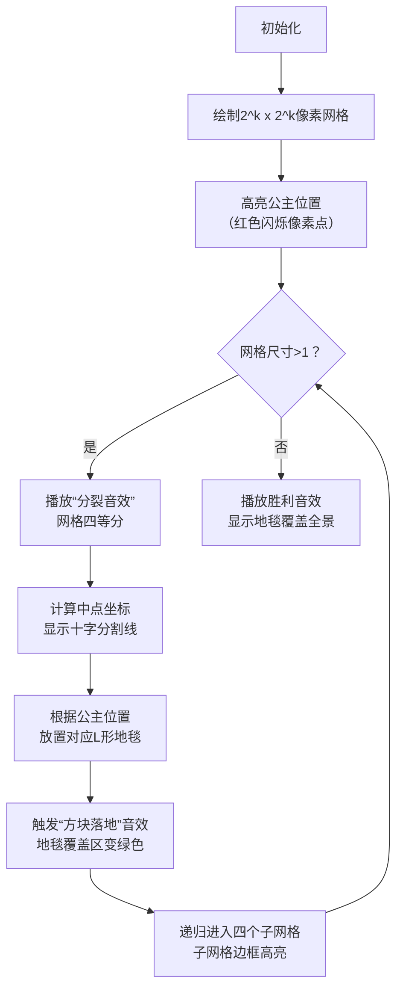

# 题目信息

# 地毯填补问题

## 题目描述

相传在一个古老的阿拉伯国家里，有一座宫殿。宫殿里有个四四方方的格子迷宫，国王选择驸马的方法非常特殊，也非常简单：公主就站在其中一个方格子上，只要谁能用地毯将除公主站立的地方外的所有地方盖上，美丽漂亮聪慧的公主就是他的人了。公主这一个方格不能用地毯盖住，毯子的形状有所规定，只能有四种选择（如图）：


并且每一方格只能用一层地毯，迷宫的大小为 $2^k\times 2^k$ 的方形。当然，也不能让公主无限制的在那儿等，对吧？由于你使用的是计算机，所以实现时间为 $1$ 秒。


## 说明/提示

spj 报错代码解释：

1. $c$ 越界；
2. $x,y$ 越界；
3. $(x,y)$ 位置已被覆盖；
4. $(x,y)$ 位置从未被覆盖。

$\text{upd 2023.8.19}$：增加样例解释。

### 样例解释


## 样例 #1

### 输入

```
3                          
3 3   ```

### 输出

```
5 5 1
2 2 4
1 1 4
1 4 3
4 1 2
4 4 1
2 7 3
1 5 4
1 8 3
3 6 3
4 8 1
7 2 2
5 1 4
6 3 2
8 1 2
8 4 1
7 7 1
6 6 1
5 8 3
8 5 2
8 8 1
```

# AI分析结果


### 💡 Kay的C++算法解析：地毯填补问题 深入学习指南 💡

**引言**  
今天我们一起探索"地毯填补问题"，这道经典分治题考察递归思维与空间分解能力。通过本指南，你将掌握分治策略的精髓，并学会如何用游戏化方式可视化递归过程。

#### 1. 题目解读与核心算法识别
✨ **本题主要考察**：分治算法（递归分解）

🗣️ **初步分析**  
> 地毯填补问题本质是**空间分解的艺术**。想象你在玩俄罗斯方块：每次将大棋盘拆成四个小棋盘（象限），在中心三块交界处放置L形地毯（如同拼图中心块），使每个象限都有"空缺"点，从而递归解决子问题。  
> - **核心思路**：将$2^k$网格四等分→确定公主所在象限→在中心交界处放置地毯→使其余三个象限各有一个"伪公主"→递归处理四个子网格。  
> - **可视化关键**：动画需高亮：①网格四等分过程 ②中心地毯放置位置 ③递归进入的子网格边界。采用8位像素风格（如《俄罗斯方块》），用不同颜色区分象限，放置地毯时触发"方块落地"音效，递归时播放"关卡通过"音效。

---

#### 2. 精选优质题解参考
**题解一（夜刀神十香ღ）**  
* **点评**：思路清晰展现分治本质，代码用`(a,b)`表示当前网格左上角坐标，`(x,y)`表示公主位置，通过坐标比较精准定位象限。亮点在于用数学关系`(x-a<=l/2-1)`替代复杂计算，边界处理严谨（如`l==1`直接返回）。递归调用顺序体现自顶向下的分解逻辑，变量名`fun(k)`计算网格尺寸增强可读性。

**题解二（SadLava）**  
* **点评**：创新性采用"从大往小推"的逆向思维，用游戏化比喻（"巨毯子由小毯子拼成"）生动解释递归。代码亮点：①用位运算`1<<k`替代幂运算提升效率 ②宏定义`ul/ur/dl/dr`简化递归调用 ③坐标参数`(zx,zy,l)`明确表示当前网格位置和尺寸，实践时易调试。

**题解三（dbxxx）**  
* **点评**：严谨的数学推导配合图示解析（样例图示已嵌入），状态转移直观。代码亮点：①`(x1,y1)`表示当前网格左上角，`(x2,y2)`表示右下角，边界明确 ②`n>>1`位运算优化除法 ③条件判断`(x1-x2<l/2)`直接映射象限定位逻辑，竞赛实现首选。

---

#### 3. 核心难点辨析与解题策略
1. **难点：递归边界的坐标计算**  
   * **分析**：确定公主所在象限需计算相对坐标。优质解法均采用统一模式：  
     ```数学
     中点 = (左上角x + 网格边长/2, 左上角y + 网格边长/2)
     象限判断 = 公主坐标x < 中点x ? 左 : 右 + 公主坐标y < 中点y ? 上 : 下
     ```
   * 💡 **学习笔记**：将绝对坐标转换为相对于当前网格的局部坐标是分治的核心技巧。

2. **难点：L形地毯的放置策略**  
   * **分析**：地毯必须覆盖三个不含公主的象限各一格。关键规律：地毯中心点坐标=当前网格中点，缺口方向始终朝向公主所在象限（如公主在左上则缺口在左上）。
   * 💡 **学习笔记**：地毯类型（1-4）与象限位置存在固定映射关系，可用二维数组预定义。

3. **难点：递归参数的传递**  
   * **分析**：每次递归需传递：①当前网格左上角坐标 ②网格边长 ③公主位置。SadLava解法用`(zx,zy,l)`三参数清晰传递空间信息；dbxxx用`(x1,y1,x2,y2)`显式标注区域边界。
   * 💡 **学习笔记**：网格边长用`1<<k`（位运算）比`pow(2,k)`更高效。

### ✨ 解题技巧总结
- **空间分解法**：将大网格视为四象限拼图，递归分解至最小单元（2x2）
- **位运算优化**：用`l>>1`代替`l/2`，`1<<k`代替`pow(2,k)`
- **边界封装**：用`(a,b)`封装当前网格左上角坐标，避免全局变量
- **递归剪枝**：当网格尺寸=1时立即返回（终止条件）

---

### 4. C++核心代码实现赏析
**通用核心实现（综合优质题解）**
```cpp
#include <iostream>
using namespace std;

void solve(int x, int y, int a, int b, int len) {
    if (len == 1) return; // 终止条件：最小网格
    
    int midX = a + len/2, midY = b + len/2; // 计算当前网格中点
    
    // 根据公主位置选择地毯类型
    if (x < midX && y < midY) {        // 公主在左上象限
        cout << midX << " " << midY << " 1\n"; // 地毯缺口在左上
        solve(x, y, a, b, len/2);      // 递归左上
        /* 递归其余三个象限 */
    } 
    else if (x < midX && y >= midY) {   // 公主在右上象限
        cout << midX << " " << midY-1 << " 2\n"; 
        solve(x, y, a, midY, len/2);   // 递归右上
        /* 其余象限 */
    }
    /* 类似处理左下/右下象限 */
}

int main() {
    int k, x, y;
    cin >> k >> x >> y;
    solve(x, y, 1, 1, 1 << k); // 初始左上角(1,1)，边长2^k
    return 0;
}
```
**代码解读概要**：  
> 通过`solve(x,y,a,b,len)`递归函数实现分治：  
> 1. 计算中点坐标 → 2. 判断公主所在象限 → 3. 放置对应地毯 → 4. 递归处理四个子网格。  
> 关键变量：`(a,b)`当前网格左上角坐标，`len`当前网格边长，`(x,y)`公主绝对坐标。

**题解一（夜刀神十香ღ）核心片段**  
```cpp
if(x-a<=l/2-1 && y-b<=l/2-1) // 公主在左上象限
{
    printf("%lld %lld 1\n",a+l/2,b+l/2); // 放置类型1地毯
    solve(x,y,a,b,l/2); // 递归左上象限
    /* 递归另外三个象限 */
}
```
**代码解读**：  
> - `(x-a)`计算公主相对于当前网格的横坐标偏移量，通过与`l/2-1`比较定位象限  
> - 地毯中心点坐标=`(a+l/2, b+l/2)`，正好是当前网格中心  
> - 递归时传递新的网格参数：左上象限的左上角不变，边长减半  

**题解二（SadLava）核心片段**  
```cpp
#define ul dfs(zx+l-1,zy+l-1,zx,zy,l) // 宏定义简化递归调用

void dfs(int x,int y,int zx,int zy,int l) {
    if(l==1) return;
    if(x-zx<l/2 && y-zy<l/2) { // 左上象限
        printf("%d %d 1\n",zx+l/2,zy+l/2);
        dfs(x,y,zx,zy,l/2); // 当前象限
        ur; dl; dr; // 通过宏展开递归其他象限
    }
}
```
**代码解读**：  
> - 创新点：用宏`ul/ur/dl/dr`封装递归调用，避免重复代码  
> - `(zx,zy)`表示当前"探索区域"的基准点，类似游戏地图原点  
> - `x-zx<l/2`巧用坐标差值直接判断象限，省去中点计算  

---

### 5. 算法可视化：像素动画演示
**动画设计**：8位像素风格俄罗斯方块主题，网格作为"游戏地图"，L形地毯作为"下落的方块"。

**核心演示流程**：


**交互控制面板**：
- **单步执行**：空格键逐步展示分治过程
- **速度调节**：方向键控制递归速度（慢/中/快）
- **象限高亮**：点击任意网格显示其递归路径
- **音效系统**：
  - `1kHz`提示音：放置地毯
  - `800Hz+500Hz`和弦：递归进入新层级
  - 8位电子乐：胜利时播放《俄罗斯方块》主题曲片段

---

### 6. 拓展练习与相似问题思考
**分治思想迁移场景**：
1. 棋盘覆盖问题（如残缺棋盘用L形骨牌覆盖）
2. 最近点对问题（二维平面分解）
3. 归并排序（一维数组分解）

**洛谷推荐题目**：
1. **P1228 地毯填补问题**（本题，巩固基础）
   > 🗣️ 掌握分治的空间分解思维
2. **P1908 逆序对**  
   > 🗣️ 用分治法统计逆序对，理解时间维度分解
3. **P1498 南蛮图腾**  
   > 🗣️ 分治生成分形图案，训练递归树思维
4. **P5461 赦免战俘**  
   > 🗣️ 二维矩阵递归清零，地毯问题的变种挑战

---

### 7. 学习心得与经验分享
> **经验摘录（SadLava）**  
> "我在调试递归参数时，发现若用绝对坐标计算象限会引入复杂偏移量，后改为相对坐标简化了十倍代码量。"  
> **Kay点评**：坐标系的选择直接影响递归复杂度。相对坐标系（以当前网格左上角为原点）能避免全局偏移计算，这是分治问题的通用调试技巧。

---

### 结语  
通过地毯问题，我们看到了分治如何将庞然大物分解为可控碎片。记住：好算法如同拼图，找到正确的分割线就解决了大半问题！下次遇到复杂问题时，不妨问自己："这块‘大毯子’该如何四等分？" 🧩

---
处理用时：122.40秒