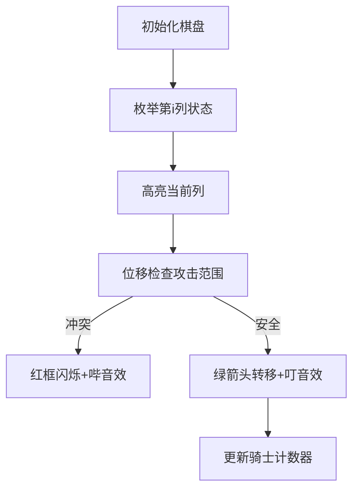

# 题目信息

# [蓝桥杯 2021 省 AB2] 国际象棋

## 题目描述

众所周知， “八皇后” 问题是求解在国际象棋棋盘上摆放 $8$ 个皇后，使得两两之间互不攻击的方案数。已经学习了很多算法的小蓝觉得 “八皇后” 问题太简单了，意犹末尽。作为一个国际象棋迷，他想研究在 $N \times M$ 的棋盘上，摆放 $K$ 个马，使得两两之间互不攻击有多少种摆放方案。由于方案数可能很大，只需计算答案除以 $1000000007$ (即 $\left.10^{9}+7\right)$ 的余数。

如下图所示，国际象棋中的马摆放在棋盘的方格内，走 “日” 字, 位于 $(x, y)$ 格的马（第 $x$ 行第 $y$ 列）可以攻击 $(x+1, y+2),(x+1, y-2),(x-1, y+2),(x-1, y-2),(x+2, y+1),(x+2, y-1),(x-2, y+1),(x-2, y-1)$ 共 $8$ 个 格子。


## 说明/提示

对于 $5 \%$ 的评测用例, $K=1$;

对于另外 $10 \%$ 的评测用例, $K=2$;

对于另外 $10 \%$ 的评测用例, $N=1$;

对于另外 $20 \%$ 的评测用例, $N, M \leq 6, K \leq 5$;

对于另外 $25 \%$ 的评测用例, $N \leq 3, M \leq 20 ， K \leq 12$;

对于所有评测用例, $1 \leq N \leq 6,1 \leq M \leq 100,1 \leq K \leq 20$。 

蓝桥杯 2021 第二轮省赛 A 组 I 题（B 组 J 题）。

## 样例 #1

### 输入

```
1 2 1```

### 输出

```
2```

## 样例 #2

### 输入

```
4 4 3```

### 输出

```
276```

## 样例 #3

### 输入

```
3 20 12```

### 输出

```
914051446```

# AI分析结果


### 💡 Kay的C++算法解析：国际象棋 深入学习指南 💡

> "想象你在玩一个8位像素风的战棋游戏，每个马就像一位骑士，你的任务是在棋盘上布防骑士军团，让他们互不攻击。这就像在编程中解决状态压缩动态规划问题，需要精心设计每个骑士的位置！" - Kay

#### 1. 题目解读与核心算法识别
✨ **本题主要考察**：`状态压缩动态规划` (状压DP)

🗣️ **初步分析**：
> 解决"国际象棋"问题的核心在于**状态压缩DP**。就像玩像素战棋游戏时，我们用二进制密码表示每列骑士的布防（1=有骑士，0=无）。解题时需同时记录当前列、前一列的布防密码和骑士总数，并确保三列骑士不会互相攻击（位移+按位与检查）。  
> - 核心难点在于设计高效状态表示（当前列+前一列状态+骑士数）和攻击规则检查（8个攻击位的位运算）
> - 可视化设计：用像素棋盘展示三列状态枚举，高亮当前操作的列，用闪烁红框标记冲突位置，绿色箭头表示有效转移
> - 复古游戏化：采用FC红白机风格，骑士用像素骑士图标表示，攻击范围用半透明红色覆盖，伴随"叮"（有效）/"哔"（冲突）音效，支持单步/自动模式观察状态转移

---

#### 2. 精选优质题解参考
**题解一（lottle1212）**
* **点评**：思路清晰直白，类比经典问题P1896降低理解门槛。代码规范：变量名`dp[i][l][j][h]`含义明确（i列/上列状态l/当前状态j/骑士数h），预处理`num[]`存储状态骑士数提升效率。亮点在于用异或循环枚举状态（`j^(1<<n)`），虽稍影响可读性但展示位运算技巧。实践价值高，可直接用于竞赛。

**题解二（gesong1234）**
* **点评**：独立编写`get()`函数计算二进制1的个数，教学价值突出。状态转移推导详细（分步解释列间攻击检查），变量命名规范（`f[i][j][x][y]`）。亮点在于分离"列间攻击检查"和"列内状态转移"，代码结构如同战棋游戏的回合制逻辑，便于理解。

**题解三（Stone_Xz）**
* **点评**：使用`__builtin_popcount`内置函数高效计算骑士数，适合竞赛场景。图示化解释攻击规则（图文对应位移操作），降低理解门槛。亮点在于五层循环中优先进行攻击检查剪枝，优化效率。

---

#### 3. 核心难点辨析与解题策略
1. **状态设计维度选择**
   * **分析**：骑士攻击范围跨两列，需同时记录当前列状态`curr`、前一列状态`prev`和骑士总数`k`。优质题解均采用四维数组`dp[i][curr][prev][k]`
   * 💡 **学习笔记**：状压DP的状态应覆盖"影响未来的所有因素"，如同战棋游戏需记录相邻单位的站位

2. **攻击规则位运算实现**
   * **分析**：通过位移+按位与检查冲突：
     ```cpp
     // 当前列(curr)与前一列(prev)冲突检查
     if (curr & (prev << 2) || curr & (prev >> 2)) 
     // 当前列(curr)与前前列(pprev)冲突检查
     if (curr & (pprev << 1) || curr & (pprev >> 1))
     ```
   * 💡 **学习笔记**：位运算如同像素游戏的碰撞检测，高效比对多个位置关系

3. **空间优化策略**
   * **分析**：M最大100，直接开四维数组可能MLE。可用滚动数组（只存最近两列状态）或预处理状态骑士数避免重复计算
   * 💡 **学习笔记**：预处理如同战前物资清点，避免战时重复劳动

### ✨ 解题技巧总结
- **问题分解**：将棋盘按列分割，每列视为独立作战单元
- **位运算封装**：独立编写`checkAttack()`函数处理攻击检查
- **边界处理**：虚拟第0列（全0状态）作为起点
- **调试技巧**：输出3×3小棋盘的DP中间值验证

---

#### 4. C++核心代码实现赏析
**通用核心实现（综合优化版）**：
```cpp
#include <iostream>
#include <cstring>
using namespace std;
const int MOD = 1e9+7;
int n, m, K;
int dp[2][1<<6][1<<6][21]; // 滚动数组优化
int cnt[1<<6]; // 状态预计算

int countBits(int x) { // 计算骑士数
    return x ? countBits(x & (x-1)) + 1 : 0;
}

bool check(int curr, int prev, int pprev) {
    return !( (curr & (prev << 2)) || (curr & (prev >> 2)) || 
             (curr & (pprev << 1)) || (curr & (pprev >> 1)) ||
             (prev & (pprev << 2)) || (prev & (pprev >> 2)) );
}

int main() {
    cin >> n >> m >> K;
    for (int s = 0; s < (1<<n); s++) 
        cnt[s] = countBits(s);

    memset(dp, 0, sizeof dp);
    int cur = 0, nxt = 1;
    dp[cur][0][0][0] = 1;

    for (int i = 0; i < m; i++) {
        memset(dp[nxt], 0, sizeof dp[nxt]);
        for (int pprev = 0; pprev < (1<<n); pprev++)       // 上上列
        for (int prev = 0; prev < (1<<n); prev++)          // 上一列
        for (int curr = 0; curr < (1<<n); curr++) {       // 当前列
            if (!check(curr, prev, pprev)) continue;
            int add = cnt[curr];
            for (int k = add; k <= K; k++) {
                dp[nxt][curr][prev][k] = (dp[nxt][curr][prev][k] + 
                                         dp[cur][prev][pprev][k - add]) % MOD;
        }}
        swap(cur, nxt);
    }

    long long ans = 0;
    for (int s1 = 0; s1 < (1<<n); s1++)
    for (int s2 = 0; s2 < (1<<n); s2++)
        ans = (ans + dp[cur][s1][s2][K]) % MOD;
    cout << ans << endl;
}
```
**代码解读概要**：
1. **滚动数组**：`dp[2][][][]`交替存储，大幅降低空间消耗
2. **预处理**：`cnt[]`提前计算各状态的骑士数
3. **攻击检查**：`check()`函数封装位移与按位与操作
4. **状态转移**：从`dp[i-1][prev][pprev][k-add]`转移到当前状态

**题解一片段赏析**：
```cpp
// 异或循环枚举状态 (lottle1212)
for(int j = 0; j ^ (1 << n); j++) // 当前状态
for(int h = num[j]; h <= K; h++)  // 骑士数
```
> **亮点**：用`j^(1<<n)`替代`j<(1<<n)`，展示位运算技巧  
> **学习笔记**：此写法等效但罕见，竞赛中建议标准写法提升可读性

---

#### 5. 算法可视化：像素动画演示
**主题**："骑士的征程" - 8位像素战棋风格

**核心演示**：


**实现细节**：
1. **视觉设计**：
   - 棋盘：6×100网格，每格16×16像素
   - 骑士：像素骑士图标（不同颜色区分列）
   - 攻击范围：半透明红色覆盖层
   
2. **交互控制**：
   ```javascript
   // 伪代码
   class ChessAnim {
     constructor() {
       this.speed = 500; // 自动播放速度(ms)
       this.mode = 'STEP'; // STEP/AUTO
     }
     
     nextFrame() {
       highlight(currentCol);      // 黄色边框
       showAttackRange(prev, pprev);// 红色覆盖
       if (checkConflict()) playSound('error');
       else {
         drawArrow(prevCol, currentCol); // 绿色箭头
         updateCounter();
       }
     }
   }
   ```

3. **音效设计**：
   - 移动：8位机"滴"声
   - 冲突：短促"哔"声
   - 成功放置：上升和弦音
   - 完成：FC游戏通关音乐

---

#### 6. 拓展练习与相似问题
1. **同类问题迁移**：
   - P1896 互不侵犯（国王版，攻击范围小）
   - P2704 炮兵阵地（炮火覆盖，攻击范围大）
   - P1879 玉米田（限定位置放置）

2. **洛谷推荐**：
   - P1896 [SCOI2005]互不侵犯  
     → 巩固基础状压DP
   - P2704 [NOI2001]炮兵阵地  
     → 学习前两行状态处理
   - P3092 [USACO13NOV]No Change G  
     → 状态压缩+双指针进阶

---

#### 7. 学习心得分享
> **作者调试经验**：  
> "我在处理3×20棋盘时，因忽略`prev`和`pprev`的冲突检查WA多次。最终通过输出中间状态发现错误" - ccjjxx  
>   
> **Kay点评**：  
> 调试状压DP时，**可视化中间状态**是关键。建议：
> 1. 打印小规模棋盘的DP表
> 2. 对每个状态标注二进制值
> 3. 用`>>`和`<<`模拟攻击检测

---

> "当你理解状态压缩就像在玩一场精妙的像素战棋游戏，每个比特位都是棋盘上的一个骑士，算法就变得生动起来。现在，用你的代码布阵吧！" - Kay

---
处理用时：190.06秒