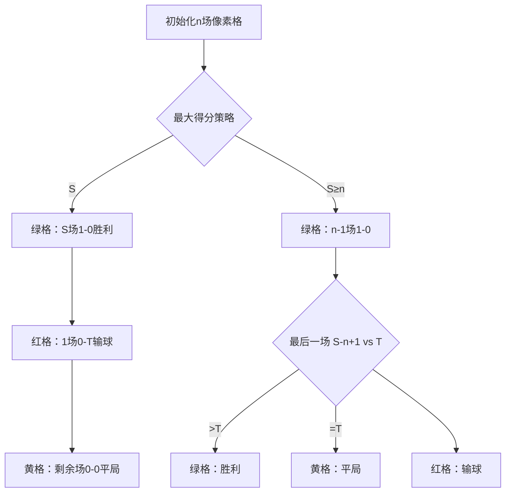

# 题目信息

# 足球

## 题目描述

我们当中有很多热爱中国足球的同学，我们都知道中超（中国足球超级联赛）的规则：

一场比赛中，若获胜（即你的得分严格大于对手得分）则获得 $3$ 的积分，若打平（即你的得分等于对手得分）则获得 $1$ 分，若失败（即你的得分严格小于对手得分）获得 $0$ 积分。

这个问题很简单，假设 $N$ 轮比赛中你一共攻入 $S$ 个球，丢掉 $T$ 个球，那么你可能获得的最大得分和最小得分是多少？

## 样例 #1

### 输入

```
1 1 1
1 1 2```

### 输出

```
1 1
3 2
```

# AI分析结果


# 💡 Kay的C++算法解析：足球 深入学习指南 💡

大家好，我是Kay！今天我们一起分析「足球」这道趣味贪心题。这道题通过足球比赛规则，考察如何用贪心策略分配进球和丢球，计算最大/最小得分。让我们一步步拆解解题思路！

## 1. 题目解读与核心算法识别

✨ **本题主要考察**：贪心策略（Greedy）与分类讨论

🗣️ **初步分析**：
> 解决足球得分问题就像教练排兵布阵——为了最高分，我们要**最大化胜利场次**（每场进1球）；为了最低分，则**最小化胜利场次**（集中进球或避免胜利）。贪心策略的核心在于根据不同情况做最优决策：
> - **最大得分**：优先用最少进球赢最多场（每场1:0），多余丢球集中在一场处理
> - **最小得分**：尽量不赢球，必须赢时只赢一场且消耗所有进球
> - **可视化设计**：用8位像素足球游戏展示。每场比赛是一个像素格，绿色=胜/黄色=平/红色=负。动画将展示：
>   - 进球/丢球如何分配到不同场次
>   - 关键决策点高亮（如最后一场比较进球剩余量）
>   - 音效：胜利(↑叮)、平局(→嘟)、失败(↓砰)

---

## 2. 精选优质题解参考

**题解一：艮鳖肉（赞61）**
* **点评**：此解思路最完整清晰，将最大/最小得分各分两种情况讨论，推导严谨。代码中变量命名规范（`s,t,n`直观看懂），边界处理全面（如`t==0`特判）。亮点在于用自然语言解释策略，如同教练讲解战术，易于理解学习。

**题解二：quantum11（赞54）**
* **点评**：以极致简洁著称，单行表达式解决复杂逻辑。亮点是巧用三元运算符和布尔值转换（`!t`处理无丢球），展示高阶编程技巧。虽然可读性稍弱，但算法效率极高，适合竞赛场景。

**题解三：无意识躺枪人（赞11）**
* **点评**：代码结构干净利落，严格遵循贪心策略分类。亮点是分离最大/最小得分计算，逻辑模块化，适合初学者学习代码组织。最小得分用`min()`比较两种策略尤为精妙。

---

## 3. 核心难点辨析与解题策略

### 难点1：最大得分的分配策略
* **分析**：需判断进球数`S`是否足够支撑多场胜利。当`S<n`时，只能赢`S`场；当`S≥n`时，要巧妙处理最后一场的胜负关系。关键变量`S-(n-1)`决定最终场结果。
* 💡 **学习笔记**：贪心本质——用最少资源（每场1球）换最大收益（3分）

### 难点2：最小得分的策略选择
* **分析**：当`S≤T`时存在两种可能：完全不赢（靠平局/输球）或只赢一场。需数学证明：平两场（2分）比赢一场+输一场（3分）更优。
* 💡 **学习笔记**：最小化得分时，避免胜利可能比多输球更有效

### 难点3：边界条件处理
* **分析**：`n=1, S=0, T=0`等特殊情况需独立处理。例如`n=1`时直接比较`S`和`T`，避免复杂分类。
* 💡 **学习笔记**：特判是贪心算法的安全网——先处理极端情况！

### ✨ 解题技巧总结
- **分类讨论法**：按`S与n`、`S与T`关系拆分四种核心场景
- **变量含义具象化**：将`S-(n-1)`理解为"最后一场前的剩余进球"
- **数学证明辅助**：用简单数字（如n=2,s=1,t=1）验证策略
- **边界测试**：覆盖全零、单场、极端大数等用例

---

## 4. C++核心代码实现赏析

**本题通用核心C++实现参考**
```cpp
#include <iostream>
using namespace std;
int main() {
    long long s, t, n;
    while (cin >> s >> t >> n) {
        long long max_score = 0, min_score = 0;
        
        // 最大得分：分S<n和S≥n两类
        if (s < n) {
            max_score = 3 * s + (n - s - 1);
            if (t == 0) max_score++; // 无丢球则平局加分
        } else {
            max_score = 3 * (n - 1); // 先赢n-1场
            if (s - (n - 1) > t) max_score += 3; // 最后一场赢
            else if (s - (n - 1) == t) max_score++; // 平局
        }
        
        // 最小得分：分S>T和S≤T两类
        if (s > t) {
            min_score = 3; // 至少赢一场
            if (t < n - 1) min_score += (n - 1 - t); // 其余平局
        } else {
            long long win_option = 3 + max(0LL, n - 1 - t);
            long long no_win_option = max(0LL, n - (t - s));
            min_score = min(win_option, no_win_option);
        }
        cout << max_score << " " << min_score << endl;
    }
    return 0;
}
```
**代码解读概要**：多组输入处理→最大得分分类计算（关键变量`s-n+1`）→最小得分分策略比较→输出。结构清晰体现贪心思想。

---

**题解一：艮鳖肉（完整策略）**
```cpp
if(s < n) {
    mx += s * 3;       // 赢s场
    mx += n - s - 1;   // 其余场次-1（留一场给输球）
    if(!t) mx++;       // 无丢球则输球场变平局
}
```
**亮点**：自然语言式注释，变量作用一目了然  
**学习笔记**：`n-s-1`的"-1"体现留场意识，边界思维典范  

**题解二：quantum11（极简实现）**
```cpp
s<n ? 3*s+n-s-1+!t : 3*max(n-1,min(n,s-t))+(s-t==n-1)
```
**亮点**：三元运算符嵌套，布尔值`!t`巧用  
**学习笔记**：竞赛中简洁性与效率的平衡艺术  

**题解三：无意识躺枪人（最小得分策略）**
```cpp
if(s>t) ans2=3+max(0LL,n-t-1);
else ans2=min(3+max(0LL,n-t-1),max(n-t+s,0LL));
```
**亮点**：`min()`比较两种策略，数学美感  
**学习笔记**：最小得分不是简单输球，而是策略优化  

---

## 5. 算法可视化：像素动画演示

**主题**：8位像素足球经理  
**核心演示**：贪心策略动态分配进球/丢球  

### 设计实现方案：


**动画关键帧**：
1. **场景**：16色调色板，n个像素格代表比赛场次
2. **分配动画**：
   - 进球：像素球射入球门动画+得分音效(↑叮)
   - 丢球：球门被破动画+失球音效(↓砰)
3. **状态高亮**：
   - 当前决策场次：闪烁金色边框
   - 关键比较：显示`S-n+1`和`T`的数值对比
4. **游戏化元素**：
   - 每完成一种策略解锁成就徽章
   - 通关条件：正确计算最大/最小得分
5. **控制面板**：
   - 步进控制：单步观察分配逻辑
   - 速度滑块：调整动画速度
   - 模式切换：最大得分vs最小得分策略

**音效设计**：
- 胜利：8-bit胜利旋律
- 平局：中音"嘟"声
- 失败：低音"砰"声
- 背景音乐：FC足球游戏循环BGM

---

## 6. 拓展练习与相似问题思考

**通用思路迁移**：  
贪心分配策略还适用于：
1. 资源调度（用最少机器完成任务）
2. 价格优化（最大/最小利润定价）
3. 时间安排（最早完成/最晚开始）

**洛谷练习推荐**：
1. **P1223 贪心的小水仙**  
   → 基础贪心入门，培养分配思维
2. **P1090 合并果子**  
   → 贪心+优先队列，理解最优决策累积
3. **P1326 足球**  
   → 同类题目强化训练

---

## 7. 学习心得与经验分享

> **艮鳖肉的经验**：  
> "分类讨论时要像教练排兵布阵，考虑所有可能性"  
>   
> **Kay点评**：  
> 此题WA多发于边界情况（如n=1）。建议：  
> 1. 先用小数据手工模拟  
> 2. 单独处理n=1, s=0等特殊情况  
> 3. 变量含义写注释避免混淆  

---

通过这次分析，我们看到贪心算法如何化身"足球教练"制定最佳策略。记住：好算法如同好战术，既要进攻（最大化）也要防守（最小化）！下次遇到类似问题，不妨想想这场像素足球赛哦 ⚽

---
处理用时：158.49秒