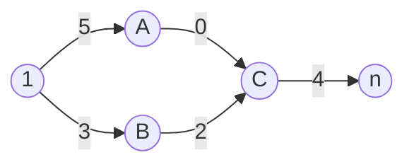

# 题目信息

# [NOIP 2017 提高组] 逛公园

## 题目背景

NOIP2017 D1T3

## 题目描述

策策同学特别喜欢逛公园。公园可以看成一张 $N$ 个点 $M$ 条边构成的有向图，且没有 自环和重边。其中 $1$ 号点是公园的入口，$N$ 号点是公园的出口，每条边有一个非负权值， 代表策策经过这条边所要花的时间。

策策每天都会去逛公园，他总是从 $1$ 号点进去，从 $N$ 号点出来。

策策喜欢新鲜的事物，它不希望有两天逛公园的路线完全一样，同时策策还是一个 特别热爱学习的好孩子，它不希望每天在逛公园这件事上花费太多的时间。如果 $1$ 号点 到 $N$ 号点的最短路长为 $d$，那么策策只会喜欢长度不超过 $d + K$ 的路线。

策策同学想知道总共有多少条满足条件的路线，你能帮帮它吗？

为避免输出过大，答案对 $P$ 取模。

如果有无穷多条合法的路线，请输出 $-1$。


## 说明/提示

【样例解释1】


对于第一组数据，最短路为 $3$。 $1\to 5, 1\to 2\to 4\to 5, 1\to 2\to 3\to 5$ 为 $3$ 条合法路径。


【测试数据与约定】

对于不同的测试点，我们约定各种参数的规模不会超过如下


测试点编号　　|$T$　　　|$N$　　　|$M$　　　|$K$　　　|是否有 $0$ 边
-|-|-|-|-|-
$1$|$5$|$5$|$10$|$0$|否
$2$|$5$|$10^3$|$2\times 10^3$|$0$|否
$3$|$5$|$10^3$|$2\times 10^3$|$50$|否
$4$|$5$|$10^3$|$2\times 10^3$|$50$|否
$5$|$5$|$10^3$|$2\times 10^3$|$50$|否
$6$|$5$|$10^3$|$2\times 10^3$|$50$|是
$7$|$5$|$10^5$|$2\times 10^5$|$0$|否
$8$|$3$|$10^5$|$2\times 10^5$|$50$|否
$9$|$3$|$10^5$|$2\times 10^5$|$50$|是
$10$|$3$|$10^5$|$2\times 10^5$|$50$|是


对于 $100\%$ 的数据，$1 \le P \le 10^9$，$1 \le a_i,b_i \le N$，$0 \le c_i \le 1000$。

数据保证：至少存在一条合法的路线。

---

- 2019.8.30 增加了一组 hack 数据 by @skicean
- 2022.7.21 增加了一组 hack 数据 by @djwj233

## 样例 #1

### 输入

```
2
5 7 2 10
1 2 1
2 4 0
4 5 2
2 3 2
3 4 1
3 5 2
1 5 3
2 2 0 10
1 2 0
2 1 0```

### 输出

```
3
-1

```

# AI分析结果


# 💡 Kay的C++算法解析：[NOIP2017]逛公园 深入学习指南 💡

> 今天我们来分析NOIP2017提高组Day1的压轴题「逛公园」。这道题综合考察了最短路算法、动态规划、零环检测等重要知识点，是训练算法思维的绝佳题目。本指南将帮助你掌握核心解题思路，并通过生动可视化理解算法执行过程。

## 1. 题目解读与核心算法识别

✨ **本题主要考察**：`动态规划结合最短路` + `零环检测`

🗣️ **初步分析**：
> 想象你在一个主题公园规划游玩路线，公园道路构成有向图，每条道路有固定游览时间（边权）。你需要统计从入口(1)到出口(n)所有不超过最短时间+K分钟的路线数量。如果存在时间0的环形道路（零环）且能形成无限循环路线，则输出-1。

- **核心解法**：先Dijkstra计算最短路，再用DP统计"额外时间≤K"的路径数
- **关键难点**：零环检测（可能导致无限合法路径）
- **算法流程**：
  1. Dijkstra计算1→n最短路d[n]
  2. 定义dp[u][k]：从1→u花费d[u]+k时间的路径数
  3. 记忆化搜索反向图，转移时检测零环
- **可视化设计**：
  - 像素风格公园地图：节点=景点，边=道路（0权边红色闪烁）
  - DP状态展示：每个景点显示额外时间k和路径数
  - 零环检测：当访问已标记节点时，环上节点闪烁红光并触发警示音

## 2. 精选优质题解参考

**题解一（JayJessy）**
* **点评**：思路清晰直击核心，代码简洁高效。亮点在于将零环检测与记忆化搜索完美融合：用vis2[u][k]标记递归路径，当重复访问同一状态立即触发零环标志。代码规范性优秀（变量名e1/e2区分正反图），边界处理严谨（nk范围检查）。实践价值高，可直接用于竞赛。

**题解二（2014吕泽龙）**
* **点评**：提供双解法的深度分析，亮点是通过拓扑排序预处理零环，确保DP顺序无后效性。分层图DP设计巧妙（按额外时间k分层），复杂度分析清晰。虽然代码较长，但对零环的处理更系统化，适合想深入理解算法本质的学习者。

**题解三（CJZJC）**
* **点评**：实践指导价值突出，详细列出6大坑点（如DFS前检查额外时间范围）。亮点是反图设计让状态转移更自然，调试心得极具参考性（"k=0需特殊检测"）。代码规范性强，安全防护全面（flg全局零环标志）。

## 3. 核心难点辨析与解题策略

1.  **DP状态设计**
    * **难点**：如何定义状态避免后效性？直接存路径长度会爆炸
    * **解法**：利用K≤50的特性，dp[u][k]表示从1→u花费d[u]+k时间的路径数
    * 💡 **学习笔记**：状态定义应利用问题约束（小参数K），将指数复杂度降为多项式

2.  **零环检测**
    * **难点**：存在0权边构成的环≠一定输出-1，需判断环是否在合法路径上
    * **解法**：记忆化搜索中用inStack[u][k]标记递归路径，重复访问即检测到零环
    * 💡 **学习笔记**：零环检测必须结合路径合法性（d[u]+d_rev[u]≤d[n]+K）

3.  **状态转移实现**
    * **难点**：正图转移需考虑顺序，反图转移更自然
    * **解法**：建反图从n→1反向DP，转移方程：  
      ```nk = d[u]-d[v]+k-w```  
      需满足nk∈[0,K]
    * 💡 **学习笔记**：反向DP常可简化DAG上的状态转移

### ✨ 解题技巧总结
- **拆解问题**：先独立解决最短路计算，再处理路径统计
- **防御性编程**：对nk=d[u]-d[v]+k-w做负值检测
- **多测处理**：全局变量必须完全清空（vis/inStack数组）
- **调试技巧**：构造含零环的测试数据验证检测逻辑

## 4. C++核心代码实现赏析

**本题通用核心C++实现参考**
```cpp
#include <bits/stdc++.h>
using namespace std;
const int N=1e5+5, KMAX=55;

int T,n,m,K,mod,dis[N],dp[N][KMAX];
bool vis[N],inStack[N][KMAX],hasCycle;
vector<pair<int,int>> G[N], rG[N]; // 正图/反图

void dijkstra() {
    memset(dis,0x3f,sizeof(dis));
    memset(vis,0,sizeof(vis));
    priority_queue<pair<int,int>,vector<pair<int,int>>,greater<>> pq;
    pq.push({0,1}); dis[1]=0;
    while(!pq.empty()){
        auto [d,u]=pq.top(); pq.pop();
        if(vis[u]) continue;
        vis[u]=1;
        for(auto [v,w]:G[u])
            if(dis[v]>d+w) 
                pq.push({dis[v]=d+w,v});
    }
}

int dfs(int u,int k){
    if(k<0||k>K) return 0;               // 越界
    if(inStack[u][k]) { hasCycle=1; return 0; } // 零环检测
    if(dp[u][k]!=-1) return dp[u][k];    // 记忆化
    
    inStack[u][k]=1; // 标记递归路径
    dp[u][k]=0;
    for(auto [v,w]:rG[u]){
        int nk=dis[u]+k-w-dis[v]; // 新额外时间
        if(nk<0||nk>K) continue;  // 边界检查
        dp[u][k]=(dp[u][k]+dfs(v,nk))%mod;
        if(hasCycle) break;
    }
    inStack[u][k]=0; // 回溯
    return dp[u][k];
}

int main(){
    ios::sync_with_stdio(0);cin.tie(0);
    cin>>T;
    while(T--){
        // 初始化
        cin>>n>>m>>K>>mod;
        for(int i=1;i<=n;i++){
            G[i].clear(); rG[i].clear();
            memset(dp[i],-1,sizeof(dp[i]));
            memset(inStack[i],0,sizeof(inStack[i]));
        }
        hasCycle=0;
        
        // 建图
        while(m--){
            int u,v,w; cin>>u>>v>>w;
            G[u].push_back({v,w});
            rG[v].push_back({u,w}); // 反图
        }
        
        dijkstra();
        memset(dp[1],-1,sizeof(dp[1]));
        dp[1][0]=1; // 起点状态
        
        int ans=0;
        for(int k=0;k<=K;k++){
            ans=(ans+dfs(n,k))%mod;
            if(hasCycle) break;
        }
        cout<<(hasCycle?-1:ans)<<'\n';
    }
}
```

**代码解读概要**：
1. **Dijkstra预处理**：标准堆优化实现，计算1→所有点最短路
2. **记忆化搜索**：核心是dfs(n,k)从终点反向DP
3. **状态转移**：`nk = dis[u]+k-w-dis[v]` 计算新状态
4. **零环检测**：inStack标记递归路径，重复访问置hasCycle
5. **多测处理**：每次循环清空图数据/DP数组/标记数组

---

**题解片段赏析**：

**题解一核心（JayJessy）**
```cpp
ll dfs(ll u,ll k) {
    if(vis2[u][k]) { flg=1; return 0; }  // 零环检测
    if(~dp[u][k]) return dp[u][k];        // 记忆化
    vis2[u][k]=1;  // 标记访问中
    
    dp[u][k]=0;
    for(auto [v,w]:e2[u]) {               // 遍历反图邻接点
        ll nk=d[u]-d[v]+k-w;             // 计算新状态
        if(nk<0||nk>K) continue;         // 边界检查
        dp[u][k]=(dp[u][k]+dfs(v,nk))%p; // 状态转移
        if(flg) return 0;                // 发现零环快速返回
    }
    vis2[u][k]=0;  // 回溯
    return dp[u][k];
}
```
**学习笔记**：用vis2[u][k]标记递归路径是零环检测的精髓

**题解二核心（2014吕泽龙）**
```cpp
// 拓扑排序判零环
bool Topsort() {
    queue<int> q;
    for(int i=1;i<=n;i++) 
        if(!in[i]) q.push(i);
    
    while(!q.empty()){
        int u=q.front(); q.pop();
        for(auto [v,w]:G[u]){
            if(w!=0) continue;  // 仅处理0权边
            if(--in[v]==0) q.push(v);
        }
    }
    // 检查剩余节点是否构成危险环
    for(int i=1;i<=n;i++)
        if(in[i] && dis1[i]+dis2[i]<=dis1[n]+K) 
            return false;
    return true;
}
```
**学习笔记**：拓扑排序能系统化处理零环，但需额外计算反向最短路

## 5. 算法可视化：像素动画演示

**像素探险家寻路之旅**  
以8位像素风格呈现算法执行过程，仿FC游戏《冒险岛》视觉风格



**动画设计**：
1. **场景初始化**：
   - 节点像素化：入口(绿色)、出口(红色)、普通点(蓝色)
   - 0权边闪烁红光，其他边淡蓝色
   - 控制面板：启动/暂停/步进/调速滑块

2. **Dijkstra阶段**：
   - 节点按最短距离渐变着色（冷色调→暖色调）
   - 当前松弛节点像素闪烁，伴随"滴"声

3. **DP状态转移**：
   - 从终点(n)开始回溯，当前节点像素放大显示
   - 状态转移时显示公式：`nk = d[u]+k-w-d[v]`
   - 合法转移播放清脆音效，非法转移播放低沉音效

4. **零环检测特效**：
   - 递归路径标记为金色光点轨迹
   - 检测到环时：环上节点红色脉冲闪烁，播放警报音
   - 显示警告标语："Zero Cycle Detected!"

5. **游戏化元素**：
   - 每完成一个状态转移+1分
   - 找到新路径时像素烟花庆祝
   - 通关奖励：根据路径数显示星级评价

**技术实现**：
- Canvas绘制节点/边，状态存储在二维数组
- 音效：Web Audio API播放8-bit音效
- 动画循环：requestAnimationFrame控制帧率
- 交互控制：通过按钮触发状态机切换

## 6. 拓展练习与相似问题思考

**通用技巧迁移**：
1. 分层图思想：处理边权有特殊变化的图论问题（如P4568飞行路线）
2. 零环检测：任何带环约束的计数问题（如有限状态自动机）
3. 最短路+DP：带限制的最优路径计数问题

**推荐练习**：
1. [洛谷P1144] 最短路计数（基础版）  
   » 巩固最短路计数思想，无需处理额外长度K

2. [洛谷P4568] 飞行路线（分层图经典）  
   » 学习将特殊操作转化为额外维度

3. [洛谷P3238] 道路堵塞（动态最短路）  
   » 挑战删除边后重新计算最短路的高阶问题

## 7. 学习心得与经验分享

> **作者JayJessy的调试心得**  
> "最初在零环检测时忽略了对起点状态的初始化，导致k=0时误判。这提醒我们：边界条件需要单独验证！"

> **Kay的总结**  
> 本题汇集了图论三大核心：最短路、DP、环检测。关键收获有三点：  
> 1. Dijkstra与DP的协同使用技巧  
> 2. 零环检测的两种实现方式（拓扑排序/递归标记）  
> 3. 状态设计如何利用参数范围降复杂度  
> 记住：多测清空是竞赛基础功，建议封装初始化函数！

通过这道题，大家不仅掌握了算法技术，更体验到「化繁为简」的解题哲学——将复杂问题分解为最短路+DP+环检测三个独立模块处理。继续加油，你也能成为算法高手！💪🏻

---
处理用时：243.06秒