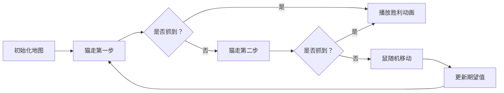

# 题目信息

# [NOI2005] 聪聪与可可

## 题目描述

在一个魔法森林里，住着一只聪明的小猫聪聪和一只可爱的小老鼠可可。虽然灰姑娘非常喜欢她们俩，但是，聪聪终究是一只猫，而可可终究是一只老鼠，同样不变的是，聪聪成天想着要吃掉可可。

一天，聪聪意外得到了一台非常有用的机器，据说是叫 GPS，对可可能准确的定位。有了这台机器，聪聪要吃可可就易如反掌了。于是，聪聪准备马上出发，去找可可。而可怜的可可还不知道大难即将临头，仍在森林里无忧无虑的玩耍。小兔子乖乖听到这件事，马上向灰姑娘报告。灰姑娘决定尽快阻止聪聪，拯救可可，可她不知道还有没有足够的时间。

整个森林可以认为是一个无向图，图中有 $N$ 个美丽的景点，景点从 $1$ 至 $N$ 编号。小动物们都只在景点休息、玩耍。在景点之间有一些路连接。

当聪聪得到 GPS 时，可可正在景点 $M$（$M \le N$）处。以后的每个时间单位，可可都会选择去相邻的景点（可能有多个）中的一个或停留在原景点不动。而去这些地方所发生的概率是相等的。假设有 $P$ 个景点与景点 $M$ 相邻，它们分别是景点 $R$、景点 $S$、……、景点 $Q$，在时刻 $T$ 可可处在景点 $M$，则在 $(T+1)$ 时刻，可可有 $1/(1 +P)$ 的可能在景点 $R$，有 $1/(1 +P)$ 的可能在景点 $S$，……，有 $1/(1 +P)$ 的可能在景点 $Q$，还有$1/(1 +P)$的可能停在景点 $M$。

我们知道，聪聪是很聪明的，所以，当她在景点 $C$ 时，她会选一个更靠近可可的景点，如果这样的景点有多个，她会选一个标号最小的景点。由于聪聪太想吃掉可可了，如果走完第一步以后仍然没吃到可可，她还可以在本段时间内再向可可走近一步。

在每个时间单位，假设聪聪先走，可可后走。在某一时刻，若聪聪和可可位于同一个景点，则可怜的可可就被吃掉了。

灰姑娘想知道，平均情况下，聪聪几步就可能吃到可可。而你需要帮助灰姑娘尽快的找到答案。

## 说明/提示

【样例说明 1】 

开始时，聪聪和可可分别在景点 1 和景点 4。 

第一个时刻，聪聪先走，她向更靠近可可(景点 4)的景点走动，走到景点 2， 然后走到景点 3；假定忽略走路所花时间。 

可可后走，有两种可能： 第一种是走到景点 3，这样聪聪和可可到达同一个景点，可可被吃掉，步数为 $1$，概率为$0.5$。
 
第二种是停在景点 4，不被吃掉。概率为 $0.5$。

到第二个时刻，聪聪向更靠近可可(景点 4)的景点走动，只需要走一步即和 可可在同一景点。因此这种情况下聪聪会在两步吃掉可可。 所以平均的步数是 $1\times 1/2 + 2\times 1/2 =1.5$ 步。

【样例说明 2】

森林如下图所示：


对于 50%的数据，$1≤N≤50$。  
对于所有的数据，$1≤N,E≤1000$。 

## 样例 #1

### 输入

```
4 3 
1 4 
1 2 
2 3 
3 4```

### 输出

```
1.500 
```

## 样例 #2

### 输入

```
9 9 
9 3 
1 2 
2 3 
3 4 
4 5 
3 6 
4 6 
4 7 
7 8 
8 9```

### 输出

```
2.167```

# AI分析结果


# 💡 Kay的C++算法解析：聪聪与可可 深入学习指南 💡

> 欢迎来到猫鼠追逐的魔法森林！今天我将作为算法导师Kay，带大家拆解「聪聪与可可」这道经典期望DP问题。我们将通过像素动画和游戏化设计，直观理解猫鼠的移动策略和期望计算。

## 1. 题目解读与核心算法识别

✨ **本题主要考察**：`期望DP` + `预处理最短路`

🗣️ **初步分析**：
> 想象猫鼠在魔法森林的景点间追逐。猫的移动像精准的GPS导航（总走最短路），而老鼠的移动则像掷骰子（随机漫步）。解题关键在于：
> - **预处理猫的移动策略**：用BFS计算任意两点最短路，确定猫的下一步位置（`nxt[i][j]`）
> - **期望DP计算**：用记忆化搜索（`f[i][j]`）计算猫在i、鼠在j时的期望步数
> - **可视化核心**：在动画中高亮猫的决策路径（红色箭头）、老鼠的随机移动（绿色箭头）及状态转移过程

**复古像素设计**：
- 8-bit风格网格地图，景点转为像素方块
- 猫鼠角色采用经典FC游戏精灵（猫：橘色方块，鼠：灰色方块）
- 音效：猫移动-"叮"，鼠移动-"滴"，抓到-"胜利旋律"

---

## 2. 精选优质题解参考

### 题解一（FREEH，赞49）
* **亮点**  
  - 思路直击核心：清晰拆解为预处理（SPFA最短路 + nxt数组）和期望DP两阶段  
  - 代码规范：变量名`fir/sec`直观表示猫的移动步骤  
  - 边界处理严谨：用`visit`数组避免重复计算  
  - 实践价值：完整处理原地不动概率`1/(p[v]+1)`

### 题解二（Booksnow，赞12）
* **亮点**  
  - 教学性强：用注释详细解释状态转移方程  
  - 效率优化：BFS替代SPFA（无权图更高效）  
  - 代码可读性：`out[y]`明确表示度数，概率计算一目了然  

### 题解三（钱逸凡，赞8）
* **亮点**  
  - 空间优化：链式前向星存图  
  - 结构清晰：分离`spfa()`和`dfs()`函数  
  - 数学严谨：浮点计算显式转型`(double)(t[j]+1)`  

---

## 3. 核心难点辨析与解题策略

### 🔑 关键点1：猫移动策略的预处理
* **难点**：如何确定猫在景点i时，向景点j的最优下一步？  
* **分析**：  
  - 用BFS计算所有点对最短路`dis[i][j]`  
  - 对每个猫位置i和鼠位置j，枚举i的邻居k，选择使`dis[k][j]`最小且编号最小的k作为`nxt[i][j]`  
* 💡 **学习笔记**：`nxt`数组是猫的“决策地图”，需满足最优子结构

### 🔑 关键点2：期望DP的状态转移
* **难点**：如何融合猫的确定性移动和鼠的随机移动？  
* **分析**：  
  ```python
  if 猫鼠同位置: return 0  
  elif 猫两步内可抓鼠: return 1  
  else:  
      猫走两步到位置sec  
      期望 = (dfs(sec,鼠原地) + Σ dfs(sec,鼠邻居)) / (度数+1) + 1  
  ```
* 💡 **学习笔记**：+1代表当前时间步，分母`(deg+1)`包含鼠原地不动的情况

### 🔑 关键点3：记忆化搜索的实现
* **难点**：避免重复计算指数级状态  
* **分析**：  
  - 状态空间O(n²)：用二维数组`f[][]`缓存结果  
  - 终止条件优先级：位置相同 > 两步抓到 > 普通转移  
* 💡 **学习笔记**：记忆化搜索是期望DP的“时光机”，避免重复穿越相同状态

### ✨ 解题技巧总结
- **拆解策略**：将复杂过程分解为预处理（最短路）→ 决策建模（nxt数组）→ 随机过程（期望DP）  
- **逆向思维**：从终止状态倒推期望值（记忆化搜索天然优势）  
- **边界防御**：特别注意`deg[j]+1`包含原地不动情况  
- **调试技巧**：打印小规模`nxt`数组验证决策逻辑  

---

## 4. C++核心代码实现赏析

### 通用核心实现（综合优质题解）
```cpp
#include <iostream>
#include <queue>
#include <cstring>
#include <iomanip>
using namespace std;

const int N = 1005;
vector<int> g[N];  // 邻接表存图
int nxt[N][N], deg[N], dis[N][N];
double f[N][N];
bool vis[N][N];  // 记忆化标记

void bfs(int start) {
    queue<int> q;
    q.push(start);
    dis[start][start] = 0;
    while (!q.empty()) {
        int u = q.front(); q.pop();
        for (int v : g[u]) {
            if (dis[start][v] == -1) {
                dis[start][v] = dis[start][u] + 1;
                q.push(v);
            }
        }
    }
}

double dfs(int cat, int mouse) {
    if (vis[cat][mouse]) return f[cat][mouse];
    vis[cat][mouse] = true;
    
    if (cat == mouse) return f[cat][mouse] = 0.0;  // 终止条件1：抓到
    int first = nxt[cat][mouse];
    int second = nxt[first][mouse];
    if (first == mouse || second == mouse)  // 终止条件2：两步内抓到
        return f[cat][mouse] = 1.0;
    
    // 状态转移：鼠随机移动
    f[cat][mouse] = dfs(second, mouse);  // 鼠原地不动
    for (int neighbor : g[mouse]) 
        f[cat][mouse] += dfs(second, neighbor);
    f[cat][mouse] = f[cat][mouse] / (deg[mouse] + 1) + 1;
    return f[cat][mouse];
}

int main() {
    int n, m, s, t;
    cin >> n >> m >> s >> t;
    memset(dis, -1, sizeof dis);
    memset(nxt, 0x3f, sizeof nxt);
    
    while (m--) {
        int u, v; cin >> u >> v;
        g[u].push_back(v); deg[u]++;
        g[v].push_back(u); deg[v]++;
    }
    
    // 预处理最短路
    for (int i = 1; i <= n; i++) bfs(i);
    
    // 预处理猫的移动策略
    for (int i = 1; i <= n; i++) {
        for (int j = 1; j <= n; j++) {
            if (i == j) continue;
            int min_dis = 1e9, min_node = 1e9;
            for (int neighbor : g[i]) {  // 枚举邻居找最优决策
                if (dis[neighbor][j] < min_dis || 
                   (dis[neighbor][j] == min_dis && neighbor < min_node)) {
                    min_dis = dis[neighbor][j];
                    min_node = neighbor;
                }
            }
            nxt[i][j] = min_node;
        }
    }
    
    cout << fixed << setprecision(3) << dfs(s, t);
}
```

### 代码解读概要
1. **预处理阶段**  
   - `bfs()`计算任意两点最短路（魔法森林的“地形勘探”）  
   - `nxt`数组决策逻辑：猫选择使剩余距离最小且编号最小的邻居  

2. **记忆化搜索**  
   - 终止条件：同位置(0步)或两步内抓到(1步)  
   - 状态转移：猫走两步到`second`后，鼠随机移动的期望加权平均  

3. **概率计算**  
   - 分母`deg[mouse]+1`：包含原地不动的情况  
   - `+1`：当前时间步的代价  

---

## 5. 算法可视化：像素动画演示

### 🎮 动画设计：猫鼠追逐大冒险


### 🖼️ 关键帧说明
1. **场景初始化**  
   - 8-bit网格地图（16x16像素/景点）  
   - 猫/鼠初始位置闪烁（猫：红色，鼠：蓝色）  
   - 状态面板显示当前期望值  

2. **猫移动动画**  
   - **第一步**：猫→`nxt[cat][mouse]`（红色路径箭头）  
   - **第二步**：→`nxt[nxt[cat][mouse]][mouse]`（路径变深红）  
   - 音效：移动时播放FC风格“滴”声  

3. **鼠移动动画**  
   - 随机选择方向（含原地）：绿色箭头指向目标  
   - 概率面板：显示`1/(deg+1)`的骰子动画  

4. **抓取判定**  
   - 成功：猫鼠位置重合爆炸特效 + 胜利音效  
   - 失败：鼠做鬼脸动画 + 沮丧音效  

### 🕹️ 交互控制面板
```markdown
| 按钮        | 功能                  | 音效       |
|-------------|---------------------|------------|
| ▶️/⏸️       | 开始/暂停             | 电子音     |
| ⏩           | 单步执行              | 按键声     |
| 🔄          | 重置动画              | 重置音     |
| 🎚️          | 速度调节滑块          | 无         |
```

---

## 6. 拓展练习与相似问题思考

### 相似问题模式
1. **分层图期望**：鼠的移动转化为状态转移图  
2. **决策+随机组合**：一方最优策略+另一方随机策略  
3. **预处理优化**：n²级预处理支持O(1)决策  

### 洛谷推荐
1. **P4316 绿豆蛙的归宿**  
   → 基础期望DP，练**拓扑序上的期望传播**  
   
2. **P1850 换教室**  
   → 升级版期望DP，掌握**概率加权转移**技巧  
   
3. **P1608 路径统计**  
   → 强化**最短路预处理**能力，熟悉图论与DP结合  

---

## 7. 学习心得与经验分享

> **题解作者经验摘录**  
> *“调试时发现nxt数组未正确处理距离相同取编号最小的情况，导致猫绕远路”* — FREEH

💡 **Kay的总结**：  
1. **调试技巧**：对`nxt`数组打印5x5小样例验证  
2. **思维陷阱**：鼠的原地不动概率易漏算（需`deg+1`）  
3. **优化意识**：BFS > SPFA（无权图）  

> 记住：理解每一次状态转移的物理意义，比写对代码更重要！下次我们将挑战更复杂的随机游走问题，保持好奇，继续前进！🚀

---
处理用时：216.89秒