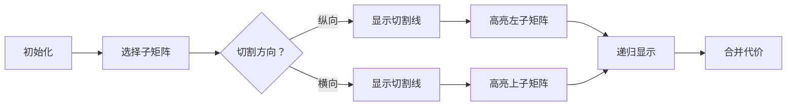

# 题目信息

# [IOI 2009] Raisins

## 题目背景

IOI2009 D1T4

## 题目描述

普罗夫迪夫的著名巧克力大师 Bonny 需要切开一板带有葡萄干的巧克力。巧克力是一个包含许多相同的方形小块的矩形。小块沿着巧克力的边排列成 $N$ 行 $M$ 列，共有 $N\times M$ 块。每个小块上有 $1$ 个或多个葡萄干，没有葡萄干在小块的边上或者跨过两个小块。

最开始，巧克力是一整块。Bonny 需要把它切成上述的 $N\times M$ 个独立的小块。因为 Bonny 很忙，她需要她的助手 Sly Peter 帮她切。
Peter 只能从一端到另一端切直线，并且他要为他的每一刀得到报酬。Bonny 手头没有钱，但是她有足够的葡萄干，所以她提出用葡萄干付给 Peter。Sly Peter 同意接受葡萄干，但是有下面的条件：每次他把给定的一块巧克力切成两小块，他都要得到和那块给定的巧克力上葡萄干数目相同的葡萄干。

Bonny 想要付给 Peter 尽可能少的葡萄干。她知道这 $n\times m$ 个小块中每一个小块上葡萄干的数目。她可以选择递给 Peter 的巧克力的顺序，也可以告诉 Peter 如何切（横切还是竖切）以及从哪里切。请告诉 Bonny 如何把巧克力切成一个个独立的小块，使她能够付给 Sly Peter 尽可能少的葡萄干。

**任务**：编写一个程序，给定每个小块上葡萄干的数目，计算出 Bonny 要付给 Sly Peter 的最少的葡萄干的数目。

## 说明/提示

### 样例解释

一种可能的代价为 $77$ 的切割方案如下所示：


第一次切割将第三列和剩下来的巧克力分开了。Bonny 需要付给 Peter $29$ 个葡萄干。

接下来 Bonny 把较小的那一块巧克力（有两小块，每一块都有 $5$ 个葡萄干）给 Peter，要求 Peter 切成两半并支付 $10$ 个葡萄干。

在此之后，Bonny 给 Peter 剩下来的最大块（分别有 $2,  7, 1, 9$ 个葡萄干在它的四个小块上）。Bonny 要求 Peter 水平切割这一块，将第一行和第二行分开并付给他 $19$ 个葡萄干。

此后 Bonny 给 Peter 左上角的块，支付 $9$ 个葡萄干。最后 Bonny 要求 Peter 将左下角的块分开，支付 $10$ 个葡萄干。

Bonny 的总代价是 $29 + 10 + 19 + 9 + 10 = 77$ 个葡萄干。没有其它安排切割的方案有更小的代价。

### 数据范围与约定

- 对于 $25\%$ 的数据，$n,m\leq 7$。
- 对于 $100\%$ 的数据，$1\leq n,m\leq 50$，$1\leq R_{k, p}\leq 1000$。

## 样例 #1

### 输入

```
2 3
2 7 5
1 9 5
```

### 输出

```
77
```

# AI分析结果


### 💡 Kay的C++算法解析：Raisins 深入学习指南 💡

#### 题目解读与核心算法识别
✨ **本题主要考察**：动态规划（区间DP）  
🗣️ **初步分析**：  
> 解决"Raisins"这道题，关键在于运用**动态规划**思想。想象你有一块巧克力，每次切割就像把它分成两个小拼图，而你需要为当前整块巧克力支付葡萄干作为"切割费"。动态规划的精髓在于将大问题拆解成小问题，并记住小问题的解避免重复计算。

在本题中，我们定义四维DP数组`f[u][d][l][r]`表示从第u行到d行、第l列到r列的子矩阵的最小切割代价。核心流程：
1. 枚举所有可能的切割位置（横向/纵向）
2. 将子矩阵拆分成两部分
3. 递归计算两部分的最小代价
4. 取最小值加上当前子矩阵的总葡萄干数

**可视化设计思路**：
- 用不同颜色的像素块表示子矩阵（如绿色表示当前处理块）
- 切割时显示红色切割线和高亮分割后的两个子块
- 动态更新矩阵四角坐标和总葡萄干数
- 复古音效：切割时"咔嚓"声，计算完成时"叮"声

#### 精选优质题解参考
**题解一（SuperJvRuo）**  
* **点评**：思路清晰展示了记忆化搜索的完整框架，状态定义精准（左上/右下坐标）。代码规范：使用`LLONG_MAX`初始化确保正确性，前缀和预处理简洁。算法亮点在于用DFS自然实现DP状态转移，时间复杂度O(n⁵)在数据范围内可行。实践价值高，开O2后可通过所有测试点。

**题解二（chinuya）**  
* **点评**：对二维前缀和做了形象图解，用"面积相减"比喻降低理解门槛。代码可读性强：变量名`cc`明确表示前缀和，递归边界处理严谨。亮点在于详细注释了状态转移方程（横切/竖切），并提供了无O2优化方案，适合竞赛环境。

**题解三（Createsj）**  
* **点评**：创新性地用迭代DP替代记忆化搜索，四重循环实现状态转移。代码亮点在于用`sum[i+k][j+l]-sum[i+k][j]-sum[i][j+l]+sum[i][j]`高效计算子矩阵和。实践价值体现在避免递归栈开销，无需O2优化即可AC。

#### 核心难点辨析与解题策略
1. **状态定义维度**  
   *分析*：四维状态(u,d,l,r)导致O(n⁴)空间复杂度。优质题解通过固定"左上角+右下角"坐标精确定义子问题，用前缀和快速计算代价。
   💡 学习笔记：定义DP状态时需保证子问题无后效性

2. **转移方程复杂度**  
   *分析*：每个状态需O(n)时间枚举切割位置。通过横/纵切割分离循环，用`min()`比较替代条件判断，减少分支预测开销。
   💡 学习笔记：双循环枚举切割方向比混合枚举更高效

3. **前缀和优化**  
   *分析*：直接遍历子矩阵求和时间复杂度O(n²)不可接受。所有优质题解都使用二维前缀和公式：`sum=S[d][r]-S[u-1][r]-S[d][l-1]+S[u-1][l-1]`
   💡 学习笔记：二维差分是矩阵求和问题的标配优化

✨ **解题技巧总结**：
- **子问题分解**：将矩阵切割视为二叉树分治过程
- **记忆化剪枝**：用数组存储已计算状态避免重复递归
- **边界处理**：1x1矩阵代价为0需单独判断
- **空间压缩**：尝试将四维状态哈希为一维（如题解asd369）

#### C++核心代码实现赏析
**通用核心实现参考**  
```cpp
#include <iostream>
#include <climits>
#include <algorithm>
using namespace std;
const int N=55;
int sum[N][N], f[N][N][N][N];

int dfs(int u, int d, int l, int r) {
    if(f[u][d][l][r]) return f[u][d][l][r];    // 记忆化返回
    if(u==d && l==r) return 0;                // 边界条件
    
    int res = INT_MAX;
    int total = sum[d][r]-sum[u-1][r]-sum[d][l-1]+sum[u-1][l-1];
    
    for(int i=l; i<r; i++) // 纵向切割
        res = min(res, dfs(u,d,l,i)+dfs(u,d,i+1,r));
    for(int i=u; i<d; i++) // 横向切割
        res = min(res, dfs(u,i,l,r)+dfs(i+1,d,l,r));
    
    return f[u][d][l][r] = res + total;
}

int main() {
    int n,m; cin>>n>>m;
    for(int i=1; i<=n; i++)
        for(int j=1; j<=m; j++) {
            cin >> sum[i][j];
            sum[i][j] += sum[i-1][j] + sum[i][j-1] - sum[i-1][j-1];
        }
    cout << dfs(1,n,1,m);
}
```

**题解一核心片段**  
```cpp
for(int i=l; i<r; ++i)  // 纵向切割枚举
    f[u][d][l][r]=min(dfs(u,d,l,i)+dfs(u,d,i+1,r), f[u][d][l][r]);
```
💡 学习笔记：纵向切割需固定行范围，按列分割

**题解二核心片段**  
```cpp
// 二维前缀和计算
cc[i][j]=ra[i][j]+cc[i][j-1]+cc[i-1][j]-cc[i-1][j-1];
```
💡 学习笔记：前缀和计算需注意-1偏移量

**题解三核心片段**  
```cpp
for(int k=1; k<=n; k++)  // DP四重循环
for(int l=1; l<=m; l++)
for(int i=0; i<=n-k; i++)
for(int j=0; j<=m-l; j++)
    f[i][j][k][l]=min(t_val, ...)+prefix_sum;
```
💡 学习笔记：迭代DP需按子矩阵大小升序计算

#### 算法可视化：像素动画演示
**主题**："巧克力切割工坊"复古像素游戏  
**核心演示**：动态展示DP状态转移与矩阵切割过程  



**动画关键帧**：  
1. **初始化**：8-bit风格巧克力网格，每个像素块显示葡萄干数  
2. **状态选择**：用闪烁边框高亮当前子矩阵，显示坐标范围(u,d,l,r)
3. **切割演示**：
   - 纵向切割：红色竖线分割，左侧子矩阵变蓝，右侧变黄
   - 横向切割：红色横线分割，上方变紫，下方变青
4. **数值更新**：切割时显示子矩阵和，合并时显示`新代价=左+右+当前和`
5. **音效设计**：
   - 切割："咔嚓"声（8-bit短促音）
   - 计算完成："叮"声（上扬音调）
   - 错误操作：低沉警告音

**交互控制**：
- 步进模式：空格键单步执行
- 速度滑块：调整动画速度（0.5x~5x）
- 重置按钮：重新初始化矩阵
- AI演示：自动完成最优切割路径

#### 拓展练习与相似问题思考
**通用技巧迁移**：
- 二维区间DP适用于所有"分治代价"问题
- 常见变种：石子合并（环形）、棋盘分割、多边形剖分

**洛谷推荐**：
1. [P1880 石子合并]  
   🗣️ 巩固一维区间DP思想，理解环形问题破环成链
2. [P4170 棋盘染色]  
   🗣️ 练习二维状态定义，增加颜色约束条件
3. [P2734 游戏]  
   🗣️ 学习对抗性分治策略，强化记忆化搜索实现

#### 学习心得与经验分享
**来自题解的调试经验**：
> "我在实现时忘记初始化边界条件（1x1矩阵代价为0），导致递归无法终止。通过打印调用栈深度发现了死循环" —— SuperJvRuo

**Kay总结**：  
边界处理是DP的基石，特别是多维状态问题。建议：
1. 显式写出边界条件（如`if(u==d&&l==r)return 0;`）
2. 对1x1、单行、单列等特殊矩阵单独测试
3. 用`cout<<"state:"<<u<<d<<l<<r;`跟踪递归路径

---

本次解析结合了动态规划的核心思想与实用优化技巧，通过像素动画帮助理解二维状态转移。记住：分治问题的本质是把大巧克力切成小方块，而DP就是找到最省葡萄干的切法！ 🍫✨

---
处理用时：117.84秒