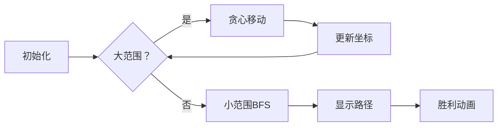

# 题目信息

# [HNOI2006] 马步距离

## 题目描述

在国际象棋和中国象棋中，马的移动规则相同，都是走“日”字，我们将这种移动方式称为马步移动。

如下图所示，从标号为 $0$ 的点出发，可以经过一步马步移动达到标号为 $1$ 的点，经过两步马步移动达到标号为 $2$ 的点。


任给平面上的两点 $p$ 和 $s$，它们的坐标分别为 $(x_p,y_p)$ 和 $(x_s,y_s)$，从 $(x,y)$ 出发经过一步马步移动可以达到 $(x+1,y+2)$，$(x+2,y+1)$，$(x+1,y-2)$，$(x+2,y-1)$，$(x-1,y+2)$，$(x-2,y+1)$，$(x-1,y-2)$、$(x-2,y-1)$。

假设棋盘充分大，并且坐标可以为负数。现在请你求出从点 $p$ 到点 $s$ 至少需要经过多少次马步移动？

## 说明/提示

#### 数据规模与约定
对于 $100\%$ 的数据，保证 $1 \leq x_p,y_p,x_s,y_s \leq 10^7$。

## 样例 #1

### 输入

```
1 2 7 9```

### 输出

```
5```

# AI分析结果


# 💡 Kay的C++算法解析：马步距离 深入学习指南 💡

> 大家好，我是Kay！今天我们一起分析「马步距离」这道C++编程题。本指南将帮助大家梳理题目思路，理解核心算法，掌握解题技巧。通过像素动画方案，我们将直观感受算法执行过程，让学习更高效有趣！

## 1. 题目解读与核心算法识别

✨ **本题主要考察**：`贪心策略 + 打表法` (编程技巧应用类)

🗣️ **初步分析**：
> 这道题要求计算国际象棋中马从一点到另一点的最少步数，数据范围高达10^7，直接搜索会超时。核心思路是**大范围贪心逼近 + 小范围精确计算**，就像玩拼图时先快速拼好外围，再精心处理中心细节。
> 
> - **贪心阶段**：当距离较大时，每次选择使曼哈顿距离减少3的移动方向（如(Δx-2, Δy-1)），快速缩小问题规模
> - **打表阶段**：当坐标差≤4时，查预计算的5×5表获取精确步数（表通过BFS预先求得）
> - **可视化设计**：动画将展示马匹在像素棋盘上的移动轨迹，大范围移动时棋盘快速缩放，小范围时高亮显示马匹的8个移动方向，并伴随马蹄音效。关键变量Δx/Δy的实时更新将用数字气泡显示
> 
> **复古游戏化设计**：
> - 8-bit像素风格：FC红白机色调（4色：草地/路径/马匹/终点）
> - 音效系统：移动时"嘀"声，进入小范围时"叮"声，到达终点时胜利旋律
> - AI演示模式：自动展示最优路径，速度可调（0.5x-4x）

---

## 2. 精选优质题解参考

### 题解一：Ice_Kissღ（数学递推法）
* **点评**：此解法通过坐标系变换和区域划分，推导出数学递推公式。思路新颖巧妙，代码极其简洁（O(1)复杂度），特别适合处理超大范围数据。作者清晰解释了坐标系划分原理（s1/s3区域），但对公式推导过程的直观解释稍显不足。变量命名规范（a/b表示坐标差），边界处理严谨，竞赛实践价值高。

### 题解二：hulean（贪心+打表法）
* **点评**：采用"大范围贪心缩小+小范围查表"的经典策略，思路清晰易懂。代码实现简洁高效（仅需20行），5×5打表设计合理，贪心过程配合绝对值处理确保正确性。作者对数据转换（相对位置）的解释直观，特别适合初学者理解。变量命名规范（x/y/ans），边界处理完整，是竞赛实现的理想参考。

### 题解三：wzmzmhk（贪心+BFS法）
* **点评**：核心思路与题解二相似，但用小范围BFS替代打表，避免硬编码。作者详细解释了相对位置转换和贪心策略，BFS实现使用map处理负坐标，鲁棒性强。虽然代码稍长，但模块化清晰（分离贪心/BFS），教学演示价值高。适合想理解底层移动过程的同学学习。

---

## 3. 核心难点辨析与解题策略

### 难点一：坐标系转换与问题简化
* **分析**：任意两点间移动可转化为(0,0)到(Δx,Δy)的移动（Δx=|x₁-x₂|, Δy=|y₁-y₂|），并通过交换确保Δx≥Δy。优质题解都使用了此技巧，如Ice_Kissღ的max/min处理
* 💡 **学习笔记**：对称性转换是坐标问题的通用化简技巧

### 难点二：贪心策略的正确性保证
* **分析**：贪心需确保每次移动（Δx-2, Δy-1或反向）都有效减小问题规模。hulean的解法通过循环条件(Δx>4 || Δy>4)控制范围，配合绝对值避免负坐标，是安全实现的关键
* 💡 **学习笔记**：贪心策略需数学证明（本题中每步减少曼哈顿距离3）

### 难点三：小范围处理的实现选择
* **分析**：当Δx,Δy≤4时，打表法（预计算5×5解）比BFS更高效。hulean使用硬编码表，wzmzmhk用BFS动态计算。前者效率O(1)，后者更灵活但需处理坐标映射
* 💡 **学习笔记**：问题规模决定实现策略——常数级用打表，线性级用BFS

### ✨ 解题技巧总结
- **坐标系转换**：通过相对位置/绝对值/坐标交换，将任意两点距离问题转化为固定起点问题
- **分阶段处理**：大范围贪心快速逼近（O(n)），小范围精确求解（O(1)），平衡效率与精度
- **预计算优化**：对固定规模子问题（如5×5网格），预先计算解并存储，避免重复计算
- **边界鲁棒性**：始终处理负坐标（abs）、单点退化情况（如(0,0)），确保代码健壮性

---

## 4. C++核心代码实现赏析

**通用核心实现参考**
* **说明**：综合优质题解思路，采用贪心+打表策略的最优实现
* **完整核心代码**：
```cpp
#include <iostream>
#include <algorithm>
using namespace std;

const int TABLE[5][5] = {
    {0,3,2,3,2},  // Δx=0
    {3,2,1,2,3},  // Δx=1
    {2,1,4,3,2},  // Δx=2
    {3,2,3,2,3},  // Δx=3
    {2,3,2,3,4}   // Δx=4
};

int main() {
    int x1, y1, x2, y2;
    cin >> x1 >> y1 >> x2 >> y2;
    
    // 计算坐标差并确保非负
    int dx = abs(x1 - x2), dy = abs(y1 - y2);
    int steps = 0;
    
    // 贪心逼近：每次移动减少曼哈顿距离3
    while (dx > 4 || dy > 4) {
        if (dx < dy) swap(dx, dy);  // 保证dx≥dy
        dx -= 2;
        dy = abs(dy - 1);  // 处理可能的负值
        steps++;
    }
    
    // 小范围查表
    cout << steps + TABLE[dx][dy] << endl;
    return 0;
}
```
* **代码解读概要**：
> 1. 输入两点坐标，计算绝对坐标差dx/dy
> 2. 贪心循环：当dx或dy>4时，每次执行(dx-2, dy-1)移动（需swap保持dx≥dy）
> 3. 循环结束后查预计算的5×5表TABLE获取精确步数
> 4. 总步数=贪心步数+表查步数

---

### 题解一：Ice_Kissღ（数学递推）
* **亮点**：纯数学推导避免循环，O(1)时间复杂度
* **核心代码片段**：
```cpp
int go(int x, int y) {
    if (x == 1 && y == 0) return 3;   // 特殊点A
    if (x == 2 && y == 2) return 4;    // 特殊点B
    if (y <= x - y) {                 // S1区域
        if (x % 2 == 0) 
            return x/2 + (x/2 - y) % 2;
        else 
            return (x+1)/2 + ((x+1)/2 - y + 1) % 2;
    }
    return go(x + 1, y - 1);          // S3区域递归
}
```
* **代码解读**：
> 1. 处理两个特殊点：(1,0)需3步，(2,2)需4步
> 2. 区域划分：若y≤x-y（S1区域），按x奇偶性计算步数
> 3. S3区域递归：转化为(x+1,y-1)，相当于向右下移动一步
> 4. 例如点(5,3)：因3>5-3(2)，进入递归go(6,2)；在S1区且x偶，返回3+(3-2)%2=4
* 💡 **学习笔记**：几何区域划分是推导递推公式的有力工具

### 题解二：hulean（贪心+打表）
* **亮点**：贪心过程简洁，表设计合理
* **核心代码片段**：
```cpp
int ans = 0;
while (x > 4 || y > 4) {   // 贪心循环条件
    if (x < 0) x = -x;     // 绝对值处理
    if (y < 0) y = -y;
    if (x < y) swap(x, y); // 保持x≥y
    x -= 2;                // 核心贪心操作
    y -= 1;
    ans++;
}
// 查表：biao为5x5预计算表
cout << ans + biao[x][y];
```
* **代码解读**：
> 1. 循环条件：任一坐标>4即继续贪心
> 2. 绝对值处理：确保坐标非负
> 3. swap保证x≥y，统一移动方向
> 4. 贪心操作：每次执行(x-2,y-1)移动
> 5. 退出循环后查表获取剩余步数
* 💡 **学习笔记**：贪心+打表是处理大范围搜索问题的黄金组合

### 题解三：wzmzmhk（贪心+BFS）
* **亮点**：BFS替代打表，避免硬编码
* **核心代码片段**：
```cpp
while (dx >= 4 || dy >= 4) {  // 贪心循环
    if (dx > dy) { dx -= 2; dy -= 1; }
    else { dx -= 1; dy -= 2; }
    ans++;
    dx = abs(dx); dy = abs(dy);
}
// BFS计算小范围路径
queue<Coord> q;
map<int, map<int, bool>> visited;
q.push({0,0,0});
while (!q.empty()) {
    auto [x,y,step] = q.front();
    if (x == dx && y == dy) 
        cout << ans + step;
    // ... BFS扩展8个方向
}
```
* **代码解读**：
> 1. 贪心循环：根据dx/dy大小选择移动方向
> 2. BFS初始化：从(0,0)开始搜索
> 3. 状态存储：使用嵌套map记录访问状态，支持负坐标
> 4. 结果计算：总步数=贪心步数+BFS步数
* 💡 **学习笔记**：BFS适合小范围精确搜索，但需注意状态空间大小

---

## 5. 算法可视化：像素动画演示

**动画主题**：*像素骑士的远征*（8-bit风格路径探索）  
**核心演示**：贪心阶段快速逼近 + 小范围精确移动  

### 设计框架


### 实现细节
1. **像素艺术设计**：
   - 棋盘网格：16×16像素/格，棕褐色背景（#D2B48C）
   - 骑士：红色像素块（8×8），移动时显示残影
   - 终点：闪烁的城堡图标（黄色）
   - 路径标记：蓝色轨迹线（透明度50%）

2. **关键动画序列**：
   ```python
   # 伪代码实现
   while dx > 4 or dy > 4:  # 贪心阶段
       draw_knight(x, y)
       play_sound('step.wav')  # 8-bit马蹄声
       dx, dy = update_position(dx, dy)  # 坐标更新
       draw_info_panel(f"Δx={dx}, Δy={dy}")  # 信息面板
       
   for step in bfs_path:  # 小范围精确移动
       highlight_possible_moves(8方向)  # 高亮可选移动
       move_knight(step) 
       play_sound('blip.wav')  # 短促音效
       
   if reached_goal: 
       play_sound('victory.wav')  # 胜利旋律
       show_fireworks()  # 像素烟花动画
   ```

3. **交互控制面板**：
   - 速度滑块：控制自动演示速度（0.5x~4x）
   - 单步模式：空格键触发下一步
   - 模式切换：贪心/BFS对比演示
   - 复位按钮：重新生成随机起点

4. **音效系统**：
   | 事件 | 音效 | 触发时机 |
   |---|---|---|
   | 移动 | 8-bit"嘀"声 | 每次坐标更新 |
   | 区域转换 | "叮"声 | 进入小范围时 |
   | 错误移动 | 低沉嗡鸣 | 无效操作时 |
   | 胜利 | 上升旋律 | 到达终点 |

5. **游戏化元素**：
   - **关卡系统**：贪心阶段=大地图关卡，BFS阶段=BOSS战
   - **分数机制**：剩余步数少→高分（S级评价）
   - **AI演示**：自动播放最优路径（可调速）
   - **历史记录**：显示最优/最差步数排行榜

---

## 6. 拓展练习与相似问题思考

### 通用技巧迁移
1. **坐标系转换**：适用于所有基于相对位置的路径问题（如骑士巡游）
2. **分阶段处理**：大范围启发式搜索+小范围精确求解（如八数码问题）
3. **预计算优化**：对状态空间有限的子问题预先求解（如24点游戏）

### 洛谷题目推荐
1. **P1379 八数码难题**  
   🗣️ *推荐理由*：练习状态空间转换与BFS/打表结合，理解分阶段处理思想

2. **P2324 [SCOI2005]骑士精神**  
   🗣️ *推荐理由*：强化马步移动的启发式搜索，掌握IDA*算法与估值函数设计

3. **P2901 [USACO08MAR]Cow Jogging G**  
   🗣️ *推荐理由*：学习大范围贪心策略在路径规划中的应用，巩固坐标转换技巧

---

## 7. 学习心得与经验分享

> **经验分享 (来自 Ice_Kissღ)**：  
> “通过绘制坐标系分区图，我发现马步移动存在明显的几何规律，这帮助我推导出递推公式。建议遇到抽象问题时，先可视化小规模案例。”

> **经验分享 (来自 hulean)**：  
> “贪心策略需要处理负坐标的边界情况，我最初忽略了这点导致WA。建议对所有位移操作都加abs保护，这是竞赛编程的黄金法则。”

> **Kay的总结**：  
> 这些经验突显了**可视化分析**和**边界测试**的重要性。解题时：
> 1. 绘制小规模案例（如4×4网格）寻找规律
> 2. 对位移操作始终进行绝对值处理
> 3. 特殊点（如(1,0)/(2,2)）单独测试
> 调试技巧：在贪心循环中加入坐标打印，观察收敛过程。

---

本次关于「马步距离」的解析就到这里。记住：编程能力的提升在于**持续实践**与**深度思考**。下次挑战再见！🚀  
**Kay的鼓励**：当你成功AC这道题时，想象自己就是棋盘上的骑士，用代码征服了数学的疆域！💻⚔️

---
处理用时：254.79秒