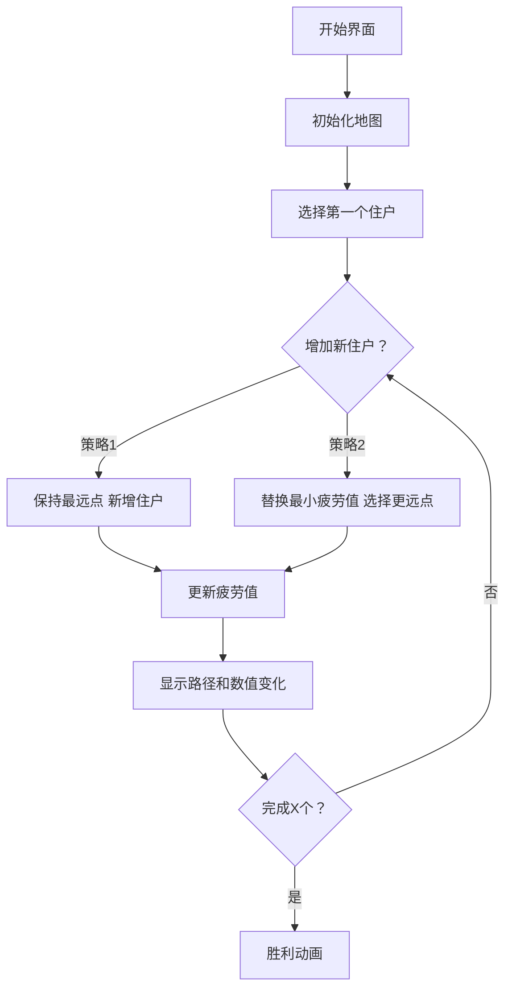

# 题目信息

# [NOIP 2015 普及组] 推销员

## 题目背景

NOIP2015 普及组 T4

## 题目描述

阿明是一名推销员，他奉命到螺丝街推销他们公司的产品。螺丝街是一条死胡同，出口与入口是同一个，街道的一侧是围墙，另一侧是住户。螺丝街一共有 $N$ 家住户，第 $i$ 家住户到入口的距离为 $S_i$ 米。由于同一栋房子里可以有多家住户，所以可能有多家住户与入口的距离相等。阿明会从入口进入，依次向螺丝街的 $X$ 家住户推销产品，然后再原路走出去。

阿明每走 $1$ 米就会积累 $1$ 点疲劳值，向第 $i$ 家住户推销产品会积累 $A_i$ 点疲劳值。阿明是工作狂，他想知道，对于不同的 $X$，在不走多余的路的前提下，他最多可以积累多少点疲劳值。


## 说明/提示

**输入输出样例 1 说明**

$X=1$：向住户 $5$ 推销，往返走路的疲劳值为 $5+5$，推销的疲劳值为 $5$，总疲劳值为 $15$。

$X=2$：向住户 $4,5$ 推销，往返走路的疲劳值为 $5+5$，推销的疲劳值为 $4+5$，总疲劳值为 $5+5+4+5=19$。

$X=3$：向住户 $3,4,5$ 推销，往返走路的疲劳值为 $5+5$，推销的疲劳值 $3+4+5$，总疲劳值为 $5+5+3+4+5=22$。

$X=4$：向住户 $2,3,4,5$ 推销，往返走路的疲劳值为 $5+5$，推销的疲劳值 $2+3+4+5$，总疲劳值 $5+5+2+3+4+5=24$。

$X=5$：向住户 $1,2,3,4,5$ 推销，往返走路的疲劳值为 $5+5$，推销的疲劳值 $1+2+3+4+5$，总疲劳值 $5+5+1+2+3+4+5=25$。


**输入输出样例 2 说明**

$X=1$：向住户 $4$ 推销，往返走路的疲劳值为 $4+4$，推销的疲劳值为 $4$，总疲劳值 $4+4+4=12$。

$X=2$：向住户 $1,4$ 推销，往返走路的疲劳值为 $4+4$，推销的疲劳值为 $5+4$，总疲劳值 $4+4+5+4=17$。

$X=3$：向住户 $1,2,4$ 推销，往返走路的疲劳值为 $4+4$，推销的疲劳值为 $5+4+4$，总疲劳值 $4+4+5+4+4=21$。

$X=4$：向住户 $1,2,3,4$ 推销，往返走路的疲劳值为 $4+4$，推销的疲劳值为 $5+4+3+4$，总疲劳值 $4+4+5+4+3+4=24$。或者向住户 $1,2,4,5$推销，往返走路的疲劳值为 $5+5$，推销的疲劳值为 $5+4+4+1$，总疲劳值 $5+5+5+4+4+1=24$。

$X=5$：向住户 $1,2,3,4,5$ 推销，往返走路的疲劳值为$5+5$，推销的疲劳值为 $5+4+3+4+1$，总疲劳值 $5+5+5+4+3+4+1=27$。

**数据范围**

对于 $20\%$ 的数据，$1 \le N \le20$；  
对于 $40\%$ 的数据，$1\le N \le 100$；  
对于 $60\%$ 的数据，$1 \le N \le 1000$；  
对于 $100\%$ 的数据，$1 \le N \le 100000$。


## 样例 #1

### 输入

```
5
1 2 3 4 5
1 2 3 4 5```

### 输出

```
15
19
22
24
25```

## 样例 #2

### 输入

```
5
1 2 2 4 5
5 4 3 4 1```

### 输出

```
12
17
21
24
27```

# AI分析结果


# 💡 Kay的C++算法解析：推销员 深入学习指南 💡

大家好，我是Kay！今天我们一起分析NOIP2015普及组的经典题目「推销员」。这道题考察如何动态选择住户，使推销过程中的疲劳值最大化。通过本指南，你将掌握贪心算法的核心思想，学会高效预处理技巧，并通过像素动画直观理解算法执行过程。

## 1. 题目解读与核心算法识别

✨ **本题主要考察**：`贪心算法`与`预处理优化`

🗣️ **初步分析**：
> 解决本题的关键在于理解**疲劳值=行走距离×2+推销疲劳值**的双重影响。想象推销员是游戏中的探险家，每次选择住户就像收集金币，但路途越远消耗的"能量"越多。贪心策略的核心是：每一步选择当前能带来最大收益的住户（考虑距离和疲劳值的综合影响）。

- **核心难点**：如何平衡距离和疲劳值？单纯选疲劳值大的住户可能错过距离远但综合收益更高的选择
- **解决方案**：将住户按疲劳值降序排序，预处理三种关键数据：疲劳值前缀和、最大距离×2的前缀值、综合收益（2×距离+疲劳值）的后缀最大值
- **可视化设计**：在像素动画中，用不同颜色表示住户的疲劳值，路径长度用像素距离直观展示。关键步骤高亮显示综合收益计算过程，通过对比两种策略（新增住户vs替换住户）的收益差异

## 2. 精选优质题解参考

以下是综合评估后筛选出的优质题解（思路清晰度≥4星）：

**题解一：Rainy7（赞731）**
* **点评**：该题解通过生动的比喻解释贪心策略（"舍去最小值来走更远"），逻辑推导清晰。代码结构规范：使用结构体排序，预处理前缀和（`sum[]`）、前i个最大距离（`q[]`）和后i个综合最大值（`h[]`）。亮点在于用具体例子（如X=2时选择住户4和5）演示算法过程，边界处理严谨，时间复杂度O(n)高效优美。

**题解二：qhr2023（赞1）**
* **点评**：虽然赞数少，但代码极为精炼（仅15行），将算法本质凝练呈现。核心思路清晰：排序后直接计算两种策略的最大值。变量命名简洁（`sum`/`q`/`h`），空间复杂度优化到位。特别适合掌握基础后追求代码简洁性的学习者，但需一定基础才能完全理解其精妙。

**题解三：CXY07（赞38）**
* **点评**：采用逆向推导（从X=n开始反推）和线段树维护，展示了数据结构在贪心算法中的高级应用。思路新颖但实现较复杂，适合想挑战高阶技巧的学习者。亮点在于完整实现了链表+线段树的动态维护，但实际竞赛中前两个题解的线性解法更优。

---

## 3. 核心难点辨析与解题策略

在解决本题时，大家普遍会遇到三个关键难点：

1.  **关键点1：距离与疲劳值的动态平衡**
    * **分析**：单纯选疲劳值大的住户可能不如选距离远的住户，因为2×距离的增长可能抵消疲劳值的差额。优质题解通过预处理后缀最大值（`h[i] = max(2*s_i + a_i)`）解决此问题
    * 💡 **学习笔记**：贪心不是单一维度最大化，需计算综合收益

2.  **关键点2：X递增时的策略选择**
    * **分析**：增加一个住户时，只有两种策略：①保持原最远点，新增一个疲劳值最大的住户；②替换当前疲劳值最小的住户为更远的住户。数学可证明其他策略不会更优
    * 💡 **学习笔记**：`ans[X] = max( sum[X] + 2*maxS, sum[X-1] + h[i] )`

3.  **关键点3：高效预处理**
    * **分析**：通过O(n)预处理前缀和、前缀最大值、后缀最大值，将每次查询降为O(1)。这是优化动态选择的关键
    * 💡 **学习笔记**：前缀和用于快速计算疲劳值和，后缀最大值避免重复扫描

### ✨ 解题技巧总结
1. **双策略比较法**：永远比较两种策略（新增vs替换）
2. **预处理三件套**：
   ```cpp
   sort(v+1, v+n+1, [](auto a, auto b){return a.a > b.a;}); // 按疲劳值降序
   for(int i=1; i<=n; i++) sum[i] = sum[i-1] + v[i].a;      // 前缀和
   for(int i=1; i<=n; i++) q[i] = max(q[i-1], 2*v[i].s);    // 前缀最大2*s
   for(int i=n; i>=1; i--) h[i] = max(h[i+1], 2*v[i].s+v[i].a);//后缀最大值
   ```
3. **边界处理**：`X=1`时直接用`2*s_i + a_i`最大值，避免越界

---

## 4. C++核心代码实现赏析

**本题通用核心C++实现参考**
* **说明**：综合自Rainy7和qhr2023的题解，最简版本仅需15行
* **完整核心代码**：
```cpp
#include <iostream>
#include <algorithm>
using namespace std;
const int N = 1e5+5;
struct Node { int s, a; } v[N];
int n, sum[N], q[N], h[N];

int main() {
    cin >> n;
    for(int i=1; i<=n; i++) cin >> v[i].s;
    for(int i=1; i<=n; i++) cin >> v[i].a;
    sort(v+1, v+n+1, [](Node a, Node b){ return a.a > b.a; });
    
    for(int i=1; i<=n; i++) sum[i] = sum[i-1] + v[i].a;
    for(int i=1; i<=n; i++) q[i] = max(q[i-1], 2*v[i].s);
    for(int i=n; i>=1; i--) h[i] = max(h[i+1], 2*v[i].s + v[i].a);
    
    for(int i=1; i<=n; i++) 
        cout << max(sum[i] + q[i], sum[i-1] + h[i]) << '\n';
}
```
* **代码解读概要**：
  1. **输入处理**：读入距离`s`和疲劳值`a`
  2. **关键排序**：按疲劳值降序排列（`a`大的在前）
  3. **预处理三件套**：
     - `sum[]`：疲劳值前缀和
     - `q[]`：前i个住户的最大2×距离
     - `h[]`：后i个住户的最大综合值（2×距离+疲劳值）
  4. **双策略比较**：对每个X，取两种策略的最大值

---
**针对优质题解的片段赏析**

**题解一：Rainy7**
* **亮点**：用数学归纳法证明贪心策略的正确性
* **核心代码片段**：
  ```cpp
  for(int i=1; i<=n; i++) 
      printf("%d\n", max(sum[i] + q[i], sum[i-1] + h[i]));
  ```
* **代码解读**：
  > 这行代码是算法核心，`sum[i]+q[i]`代表选择前i个住户（保持原最远点），`sum[i-1]+h[i]`代表替换策略。`h[i]`的后缀最大值确保替换时选到全局最优
  
**题解二：qhr2023**
* **亮点**：极致简洁的变量命名与逻辑压缩
* **核心代码片段**：
  ```cpp
  for(int i=1, s=0, m=0; i<=n; s+=v[i].a, m=max(m,2*v[i].s), i++)
      cout << max(s + m, s - v[i].a + h[i]) << '\n';
  ```
* **代码解读**：
  > 动态维护前缀和`s`和最大距离`m`，避免显式数组。注意`h[i]`仍需预处理，但主循环合并了计算过程，体现了C++的代码压缩艺术

---

## 5. 算法可视化：像素动画演示

**主题**：像素推销员大冒险（复古8-bit风格）  
**核心演示**：贪心策略的动态选择过程  
**设计思路**：采用FC红白机风格，用不同颜色像素块表示住户属性（红色=高疲劳值，蓝色=远距离），通过对比色块变化直观展示决策过程。

### 动画帧步骤说明


1. **场景初始化**（像素风格）：
   - 街道：横向像素网格（每格=10米）
   - 住户：彩色方块（颜色深度∝疲劳值，位置∝距离）
   - 控制面板：8-bit风格按钮（开始/暂停/单步）

2. **关键操作可视化**：
   - **选择住户**：方块闪烁三次+“叮”音效
   - **路径显示**：推销员像素小人沿路径移动，路径颜色随距离变深
   - **数据面板**：实时显示当前疲劳值公式：
     ```
     总疲劳值 = 2×距离 + Σ疲劳值
     ```

3. **双策略对比演示**：
   - 策略1（新增）：绿色路径延伸至新住户，疲劳值增加量显示为绿色数字
   - 策略2（替换）：红色箭头从原最小疲劳值指向新住户，显示差额计算：
     ```
     替换收益 = (2×新距离 + 新疲劳值) - 原最小疲劳值
     ```

4. **交互控制**：
   - 单步执行：按空格键逐步观察
   - 自动演示：滑块调整速度（1x-5x）
   - 模式切换：Tab键切换基础/高级视图（显示/隐藏数据结构）

5. **音效设计**：
   - 选择住户：8-bit短音（音高∝疲劳值）
   - 替换策略：双音效（下降音+上升音）
   - 完成目标：经典FC过关音乐

---

## 6. 拓展练习与相似问题思考

### 通用思路迁移
本题贪心思想可应用于三类问题：
1. **带权重的最优选择**（如P1080国王游戏）
2. **动态维护极值序列**（如P1090合并果子）
3. **时间/距离成本与收益平衡**（如P1223排队接水）

### 推荐练习（洛谷）
1. **P1080 国王游戏**  
   🗣️ 同样需要贪心排序，通过相邻交换法证明排序规则，巩固贪心证明能力
   
2. **P1090 合并果子**  
   🗣️ 练习优先队列实现贪心，理解O(nlogn)与O(n)算法的差异
   
3. **P1223 排队接水**  
   🗣️ 基础贪心排序应用，帮助理解排序在贪心中的核心作用

---

## 7. 学习心得与经验分享

> **来自题解作者的参考经验**：  
> “在解决这个问题时，最初错误地认为只需选择疲劳值最大的住户，忽略了距离的影响。后来通过绘制折线图（X与疲劳值关系）才发现问题本质。这让我意识到：**没有数学证明的贪心都是伪贪心！**”

**Kay的总结**：  
在贪心类问题中，务必通过至少两种方式验证策略：
1. **极端测试**：构造距离极大但疲劳值小的边界用例
2. **数学推导**：用反证法/交换法证明贪心选择性质
3. **动态跟踪**：打印中间状态（如每步选择的住户及其贡献值）

---

本次解析就到这里！记住：**贪心是艺术，证明是科学**。多练习预处理技巧，下次遇到类似问题就能游刃有余。继续加油，我们下次算法冒险再见！💪

---
处理用时：169.10秒