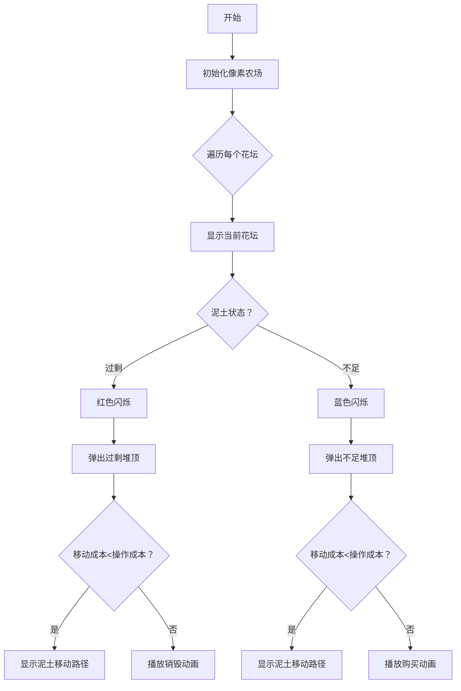

# 题目信息

# [USACO16OPEN] Landscaping P

## 题目背景

*本题与 [2012 年 3 月月赛银组同名题目](/problem/P3049) 在题意上一致，唯一的差别是数据范围。*

## 题目描述

Farmer John 打算修建一座花园，他需要移动不少泥土。

花园由 $N$ 个花坛组成（$1 \leq N \leq 10^5$），其中花坛 $i$ 包含 $A_i$ 单位的泥土。FJ 希望花坛 $i$ 包含 $B_i$ 单位的泥土，保证 $0 \leq A_i,B_i \leq 10$。

为了达到这个目标，他可以做这几件事情：

- 购买一单位的泥土，放在指定的花坛中，费用为 $X$。
- 从任意一个花坛中移走一单位泥土，费用为 $Y$。
- 从花坛 $i$ 运送一单位泥土到花坛 $j$，费用为 $Z|i-j|$。

请你帮 FJ 计算移动泥土的最小开销。

## 说明/提示

按下面的方案，最小花费为 $210$，可以证明不存在开销更小的方案。

- 移除 $4$ 号花坛的一单位泥土，花费 $200$。
- 将 $4$ 号花坛的三单位泥土移到 $1$ 号花坛，花费 $3 \times 3=9$。
- 将 $3$ 号花坛的一单位泥土移到 $2$ 号花坛，花费 $1 \times 1=1$。

## 样例 #1

### 输入

```
4 100 200 1
1 4
2 3
3 2
4 0```

### 输出

```
210```

# AI分析结果


# 💡 Kay的C++算法解析：Landscaping P 深入学习指南 💡

## 1. 题目解读与核心算法识别

✨ **本题主要考察**：`贪心`与`堆优化`  

🗣️ **初步分析**：
> 解决这道花园泥土调整问题，关键在于运用**反悔贪心**策略。想象你是一位快递调度员，需要平衡各站点的包裹数量：有的站点包裹过剩（需运出），有的站点包裹不足（需运入）。你可以选择直接购买/销毁包裹（成本高），或在不同站点间调度包裹（距离成本）。贪心算法让我们每次优先选择**当前最优操作**，而堆数据结构则帮助我们快速找到最优调度方案。当后续出现更优选择时，"反悔机制"允许撤销之前的决策并补偿差价。  

- **核心难点**：泥土调度具有后效性，当前决策会影响后续操作。堆优化（大根堆）高效维护了历史操作的"后悔价值"，使每次反悔操作时间复杂度降至O(log n)。
- **可视化设计**：采用8位像素风格模拟花坛网格，用不同颜色方块表示泥土状态（红色=过剩，蓝色=不足，绿色=平衡）。堆操作可视化：当新花坛处理时，从堆顶弹出最优历史操作时播放"叮"音效，泥土移动时显示像素动画路径。控制面板支持单步执行和调速滑块，帮助理解贪心决策过程。

---

## 2. 精选优质题解参考

**题解一 (来源：lytqwq)**  
* **点评**：此解法思路清晰，完整呈现了反悔贪心框架。核心亮点在于用数学公式 $V_i = \min(X, Z|i-j| - V_j)$ 形式化贪心策略，并通过拆解 $zi - (zj + V_j)$ 揭示堆维护的本质。代码中两个优先队列`ovo`/`ovo2`分别管理泥土过剩/不足状态，`-jZ-V_j`的堆存储方式巧妙利用了STL特性。边界处理严谨，时间复杂度O(10n log n)完全满足要求，是竞赛标准实现。

**题解二 (来源：Usada_Pekora)**  
* **点评**：解法极致简洁，仅用单一循环和两个堆实现核心逻辑。亮点在于统一处理泥土状态（通过`f = a > b`标志），并用`i*z - heap.top() > c[f^1]`精炼地表达反悔条件。代码中`q[f].push(i*z + c[f^1])`实现反悔值存储，变量名`c[0]`/`c[1]`增强了可读性。虽省略部分推导细节，但代码实践价值极高。

**题解三 (来源：AuCloud)**  
* **点评**：提供最完整的理论推导，通过三花坛例子直观展示反悔机制。亮点在于用"当前贡献+i*z"的堆存储策略解释`q2.push(2*z*i - v)`的数学含义。代码严格遵循推导逻辑，每个循环都配有详细注释。特别适合初学者理解反悔贪心的本质，但实际编码时可稍作简化。

---

## 3. 核心难点辨析与解题策略

1.  **贪心策略的后悔机制**  
    * **分析**：传统贪心在泥土调度中失效，因当前移除/购买操作可能被后续更优的移动操作替代。优质题解通过维护"历史操作补偿值"（$zj+V_j$）实现反悔。当新花坛需要泥土时，优先选择补偿值最大的历史操作进行修正，确保全局最优。
    * 💡 **学习笔记**：反悔贪心的核心是量化"撤销历史操作产生的收益"。

2.  **堆的维护与状态表示**  
    * **分析**：必须分开维护泥土过剩(`heap_surplus`)和不足(`heap_deficit`)状态，因为它们的补偿值计算方式不同（过剩时补偿值=$zj+y$，不足时=$zj+x$）。堆中存储$zj+V_j$而非$V_j$，使得新花坛计算$zi - (zj+V_j)$时可直接用堆顶值。
    * 💡 **学习笔记**：堆优化的本质是将O(n)查找优化为O(log n)。

3.  **操作代价的动态平衡**  
    * **分析**：当$zi - heap\_top > X/Y$时，说明跨花坛移动成本已超过直接购买/销毁，此时应终止反悔。该比较确保算法在移动成本$Z$与操作成本$X/Y$间自动选择最优解。
    * 💡 **学习笔记**：贪心决策需同时考虑当前成本与未来收益。

### ✨ 解题技巧总结
- **技巧1 问题分解**：将每单位泥土分离处理，化整为零
- **技巧2 补偿值设计**：用数学形式量化反悔收益
- **技巧3 数据结构选择**：大根堆快速获取最优反悔操作
- **技巧4 边界控制**：比较移动成本与操作成本避免过度反悔

---

## 4. C++核心代码实现赏析

**本题通用核心C++实现参考**
```cpp
#include <queue>
using namespace std;

priority_queue<long long> surplus_heap, deficit_heap;

int main() {
    long long n, x, y, z, ans = 0;
    cin >> n >> x >> y >> z;
    
    for (int i = 1; i <= n; i++) {
        int a, b; cin >> a >> b;
        // 处理多余泥土
        for (int j = a - b; j > 0; j--) {
            long long cost = y;
            if (!deficit_heap.empty() && i*z - deficit_heap.top() < y) {
                cost = i*z - deficit_heap.top();
                deficit_heap.pop();
            }
            surplus_heap.push(i*z + cost);
            ans += cost;
        }
        // 处理不足泥土
        for (int j = b - a; j > 0; j--) {
            long long cost = x;
            if (!surplus_heap.empty() && i*z - surplus_heap.top() < x) {
                cost = i*z - surplus_heap.top();
                surplus_heap.pop();
            }
            deficit_heap.push(i*z + cost);
            ans += cost;
        }
    }
    cout << ans;
}
```

**题解一核心代码片段**
```cpp
for (long long o=1; o<=a[i]-b[i]; o++) {
    V[i]=y;
    if (!ovo.empty() && i*z+ovo.top() < y) {
        V[i] = i*z + ovo.top();
        ovo.pop();
    }
    ovo2.push(-V[i]-i*z); // 存储反悔值
    ans += V[i];
}
```
**学习笔记**：通过`ovo`和`ovo2`双堆分别管理两种状态，`-V[i]-i*z`的存储形式巧妙利用STL的默认大根堆特性。

**题解二核心代码片段**
```cpp
if (q[f^1].empty() || i*z - q[f^1].top() > c[f^1]) 
    ans += c[f^1], q[f].push(i*z + c[f^1]);
else 
    ans += i*z - q[f^1].top(), q[f].push(2*i*z - q[f^1].top());
```
**学习笔记**：位运算`f^1`切换泥土状态，精简实现状态跳转。`2*i*z - top`实现反悔值的二次更新。

---

## 5. 算法可视化：像素动画演示

**主题**："泥土搬运大作战" - 复古农场模拟游戏  
**核心演示**：反悔贪心在花坛间调度泥土的决策过程  



**交互设计**：
1. **像素网格**：10×1花坛网格，每个花坛用32×32像素块表示
   - 泥土量：垂直堆叠的棕色小方块（1单位=4像素高）
   - 状态色框：红色边框=过剩，蓝色边框=不足
2. **堆可视化**：右侧显示两个堆的树状结构，堆顶高亮
3. **动画效果**：
   - 泥土移动：棕色像素块沿花坛间移动，轨迹显示Z|i-j|计算公式
   - 堆操作：弹出堆顶时播放"咔嚓"音效，新元素入堆时显示$zj+V_j$值
4. **游戏化**：
   - 每处理完一个花坛，播放8-bit音阶上升音效
   - 完成全部调度时，农场背景变绿，播放胜利音乐
5. **控制面板**：
   - 速度滑块：调节单步执行速度（0.5x-5x）
   - 堆透视：勾选后显示堆内所有元素的$zj+V_j$值

---

## 6. 拓展练习与相似问题思考

**通用思路迁移**：
1. 延迟决策优化：当当前操作影响后续选择时，用堆维护可反悔的操作
2. 代价平衡：在操作成本与转移成本间寻求最优平衡
3. 状态分离：对相反状态（过剩/不足）独立维护决策集合

**洛谷推荐**：
1. **P3049 [Landscaping S]**  
   🗣️ 本题的弱化版，数据范围更小，适合首次练习反悔贪心
2. **P4597 序列sequence**  
   🗣️ 应用类似堆优化策略平衡序列，强化状态转移理解
3. **P2123 皇后游戏**  
   🗣️ 需要设计更复杂的贪心补偿值，适合进阶练习

---

## 7. 学习心得与经验分享

**参考经验 (来自 wangliu)**：  
> "实现时卡在堆的存储值设计，原以为直接存$V_j$即可，调试发现必须存储$zj+V_j$才能正确比较"  

**点评**：这是反悔贪心的关键洞察！存储$zj+V_j$而非$V_j$，本质是将位置信息$j$编码进补偿值。调试时可添加临时输出：  
```cpp
// 调试示例
cout << "i=" << i << " heap_top=" << heap.top() 
     << " compare_val=" << i*z - heap.top();
```

---

本次解析揭示了反悔贪心的强大威力——通过量化"后悔价值"，我们能在局部决策与全局最优间架起桥梁。记住，好算法如同精耕细作：既要把握当下，也要为未来留有余地。下次挑战见！💪

---
处理用时：118.43秒