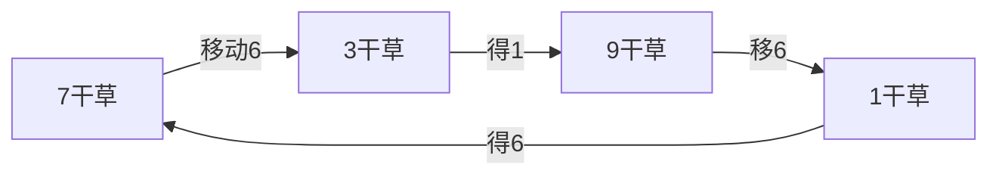

# 题目信息

# [USACO12MAR] Haybale Restacking G

## 题目描述

Farmer John has just ordered a large number of bales of hay.  He would like to organize these into N piles (1 <= N <= 100,000) arranged in a circle, where pile i contains B\_i bales of hay.  Unfortunately, the truck driver delivering the hay was not listening carefully when Farmer John provided this information, and only remembered to leave the hay in N piles arranged in a circle.  After delivery, Farmer John notes that pile i contains A\_i bales of hay.  Of course, the A\_i's and the B\_i's have the same sum.

Farmer John would like to move the bales of hay from their current configuration (described by the A\_i's) into his desired target configuration (described by the B\_i's).  It takes him x units of work to move one hay bale from one pile to a pile that is x steps away around the circle.  Please help him compute the minimum amount of work he will need to spend.

给出 $n$ 块土地，现有泥土 $A_i$ ，需要改造成 $B_i$ ，但这次土地排列成环，且不可买进买出，只能运，且 $\sum_{i=1}^{n}{A_i}=\sum_{i=1}^{n}{B_i}$，问最小花费。

## 说明/提示

There are 4 piles around a circle.  Initially, the piles contain 7, 3, 9, and 1 bales of hay.  Farmer John would like to move them so the piles contain 1, 4, 2, and 13 bales of hay.


A minimum of 13 units of work is required (move 6 bales from pile 1 to pile 4, move 1 bale from pile 3 to pile 2, and move 6 bales from pile 3 to pile 4).

## 样例 #1

### 输入

```
4 
7 1 
3 4 
9 2 
1 13 
```

### 输出

```
13 
```

# AI分析结果


### 💡 Kay的C++算法解析：Haybale Restacking G 深入学习指南 💡

#### 1. 题目解读与核心算法识别
✨ **本题主要考察**：`数学建模与中位数应用`  
🗣️ **初步分析**：
> 这道题本质是**环形均分纸牌问题**的变体。想象你在玩一个环形传送带游戏，需要调整每个位置的干草堆数量使其达标。关键在于发现移动次数可转化为数学公式：  
> - 核心思路：计算每个位置的**需求差值**（目标值-初始值），构造**前缀和数组**
> - 通过数学推导发现：最小移动次数 = 所有前缀和到中位数的距离之和
> - 可视化设计：用像素网格展示环形农场，干草堆移动时显示彩色轨迹，前缀和变化用动态柱状图展示，中位数位置用闪烁光标标记

---

#### 2. 精选优质题解参考
**题解一 (Altwilio)**  
* **点评**：思路直击本质，用简洁的`c[i] = b[i]-a[i] + c[i-1]`实现需求差累积。代码规范（变量名清晰），边界处理严谨，空间复杂度O(1)。亮点在于直接点明"绝对值不等式"的核心数学原理，是竞赛实战的典范模板。

**题解二 (chager)**  
* **点评**：从均分纸牌问题切入，用数轴类比解释中位数原理（附示意图）。推导过程细致，特别证明n为奇/偶时的最优性。代码中`c[i]=c[i-1]+b[i-1]-a[i-1]`的累积逻辑处理巧妙，实践价值高。

**题解三 (yxy_)**  
* **点评**：通过建立传递方程$x_i = x_n + \sum_{k=1}^{i-1}(A_k-B_k)$揭示问题本质。亮点是关联糖果传递等同类题，给出三倍经验。代码用`c[i]=b[i]-a[i]`配合前缀和，变量命名具有数学美感。

---

#### 3. 核心难点辨析与解题策略
1. **难点1：环形结构处理**  
   *分析*：环形意味着首尾相连，需避免线性思维。优质解法通过构造前缀和数组，将环形转化为线性序列处理（如题解二用$c_{i+1}=c_i + b_i - a_i$建立递推）  
   💡 **学习笔记**：环形问题常通过拆环为链+数学建模解决

2. **难点2：状态转移方程推导**  
   *分析*：发现移动次数公式$\sum |x_n - S_i|$是关键突破点（题解三详细展示方程推导）。需理解$S_i$是需求差前缀和，其几何意义是数轴上的点  
   💡 **学习笔记**：将操作代价转化为几何距离是经典优化思路

3. **难点3：中位数原理应用**  
   *分析*：证明$\sum |x - c_i|$在$x$取中位数时最小（题解二用数轴示意图直观解释）。需注意n为偶数时取$c_{n/2}$或$c_{n/2+1}$均可  
   💡 **学习笔记**：绝对值最小和问题 ≈ 中位数应用

**✨ 解题技巧总结**  
- **问题转化技巧**：将物理移动转化为数学序列（需求差前缀和）  
- **几何化思维**：把抽象问题映射到数轴距离模型  
- **边界鲁棒性**：环形问题需验证$\sum A_i = \sum B_i$的隐含条件

---

#### 4. C++核心代码实现赏析
**通用核心实现参考**  
*说明*：综合题解精华，最简洁的O(n)实现
```cpp
#include <iostream>
#include <algorithm>
using namespace std;
const int N = 1e5+5;
typedef long long ll;

int main() {
    int n; cin >> n;
    ll a[N], b[N], c[N] = {0};
    
    // 输入并计算需求差前缀和
    for (int i = 1; i <= n; ++i) {
        cin >> a[i] >> b[i];
        c[i] = c[i-1] + b[i] - a[i]; 
    }
    
    sort(c+1, c+n+1);  // 排序找中位数
    ll mid = c[(n+1)/2], ans = 0;
    
    for (int i = 1; i <= n; ++i) 
        ans += abs(mid - c[i]);
    
    cout << ans;
}
```
*代码解读概要*：  
1. 读入时同步计算需求差前缀和`c[i]`  
2. 排序后取中位数位置`(n+1)/2`  
3. 累加所有前缀和到中位数的绝对值距离

**题解一核心片段赏析**  
```cpp
c[i] += (b[i] - a[i] + c[i - 1]); 
sort(c + 1, c + n +1);
int mid = c[n / 2 + 1];
```
*亮点*：需求差累积与中位计算一气呵成  
*解读*：  
> `b[i]-a[i]`是单点需求差，累加`c[i-1]`实现前缀和。`n/2+1`保证奇偶通用性，是标准中位数下标取法  
> 💡 **学习笔记**：前缀和数组是状态压缩的典范

**题解二核心片段赏析**  
```cpp
for(int i=2;i<=n;i++)
    c[i]=c[i-1]+b[i-1]-a[i-1];
std::sort(c+1,c+n+1);
```
*亮点*：从$i=2$开始累积，避免首项特殊处理  
*解读*：  
> 将$a[1],b[1]$的差值融入后续计算，通过循环边界处理环形特性  
> 💡 **学习笔记**：下标设计能简化环形问题

**题解三核心片段赏析**  
```cpp
for(ri i=1;i<=n;++i) 
    d[i]=s[i]=a[i]-b[i]; 
sort(s+1,s+n+1);
k=(n+1)>>1; 
```
*亮点*：显式定义差值数组，增强可读性  
*解读*：  
> 单独计算`d[i]=a[i]-b[i]`使需求差更直观，`(n+1)>>1`用位运算加速中位索引  
> 💡 **学习笔记**：空间换可读性是调试利器

---

#### 5. 算法可视化：像素动画演示
* **主题**："环形农场搬运工"（8-bit像素风格）  
* **核心演示**：环形干草堆调整过程 + 前缀和变化 + 中位数定位  

**像素化设计**  


**动画关键帧**  
1. **环形农场初始化**  
   - 像素化环形土地（FC游戏风格），每块地用不同颜色标识干草堆数量
   - 控制面板：开始/暂停/单步按钮 + 速度滑块

2. **需求差计算**  
   - 每帧高亮当前土地，显示`b[i]-a[i]`计算过程（弹出像素数字）
   - 底部动态生成前缀和柱状图（柱体高度=$\sum (b_k-a_k)$）

3. **中位数定位**  
   - 排序动画：前缀和数值作为像素块在网格中冒泡排序
   - 中位标记：紫色闪烁边框标定$c_{(n+1)/2}$位置

4. **距离累加**  
   - 红线连接各前缀和到中位数，长度实时显示$\text{abs}(c_i-\text{mid})$
   - 累计工作量显示为顶部能量条（达13单位时播放胜利音效）

**游戏化元素**  
- 音效：移动干草时触发"咔嗒"声，完成时播放8-bit胜利旋律
- 关卡制：每关对应不同规模农场，完美通关解锁金色干草堆皮肤

---

#### 6. 拓展练习与相似问题思考
**通用技巧迁移**  
中位数优化模型适用于：  
1. 线性/环形资源均分问题  
2. 一维坐标最优集合点问题  
3. 带绝对值的序列最小化问题  

**洛谷推荐**  
1. **P2512 糖果传递**  
   🗣️ 环形均分纸牌原题，双倍经验巩固  
2. **P1031 均分纸牌**  
   🗣️ 线性版本入门，理解基础建模思想  
3. **P1889 士兵站队**  
   🗣️ 一维坐标调整，强化中位数应用  

---

#### 7. 学习心得与经验分享
> **参考经验 (Altwilio)**：  
> "考试时没推出结论，后来发现将式子变形竟出现绝对值不等式"  
>   
> **Kay点评**：  
> 调试时先手动模拟小规模案例（如n=4）。核心突破点在于发现需求差前缀和的数学规律，这是优化问题的常见套路

---

通过本次分析，我们深入掌握了环形均分问题的数学本质——**用中位数最小化绝对距离**。记住核心口诀："需求差，前缀和，排序取中绝对和"。下次遇到类似问题，不妨先画个环形数轴试试哦！(≧∇≦)ﾉ

---
处理用时：101.94秒