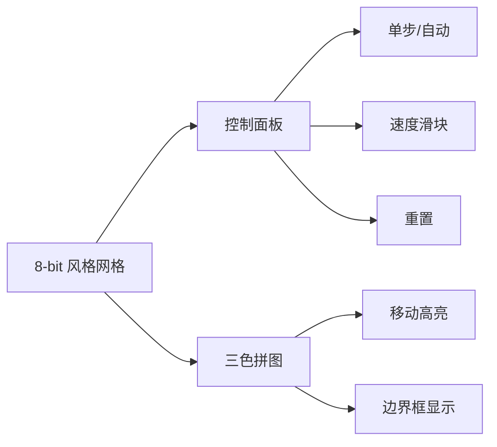

# 题目信息

# [USACO12OPEN] Unlocking Blocks S

## 题目描述

一个鲜为人知的事实是，奶牛非常喜欢解谜！为了庆祝贝西的生日，农夫约翰给了她一个有趣的机械谜题让她来解决。这个谜题由三个实心物体组成，每个物体都是由 1x1 的单位正方形粘合在一起构成的。每个物体都是一个「连通」的形状，也就是说，你可以通过在物体上的正方形向北、南、东或西移动，从物体上的一个正方形到达另一个正方形。

一个物体可以通过不断地向北、南、东或西滑动一个单位来移动。谜题的目标是移动这些物体，使它们分开——即它们的边界框不再有任何正重叠。给定三个物体的形状和位置，你的任务是帮助贝西决定分开这些物体所需的最少滑动次数。


## 说明/提示

物体 1 由 12 个正方形组成，物体 2 由 3 个正方形组成，物体 3 由 5 个正方形组成。物体的形状如上图所示。

如果我们将物体 3 向东滑动一个位置，然后将物体 2 向北滑动一个位置，然后将物体 1 向西滑动三个位置，那么三个物体的边界框将不再有任何重叠。

物体 1 由 12 块小正方体制成，物体 2 由 3 块小正方体制成，物体 3 由 5 块小正方体制成。最后的图像如上所示。（吃图？！）

```cpp
A：物体 1 方块 B：物体 2 方块 C：物体 3 方块 *：什么都没有
A A A A C
A * C C C
A B B * C
A * B A *
A A A A *
```
假如我们把物体 3 向东移一个单位，然后把物体 2 向北移一个单位，然后把物体 1 向西移三个单位，就满足了条件。

感谢 @姚起龙 提供翻译
（由 ChatGPT 4o 翻译）

## 样例 #1

### 输入

```
12 3 5 
0 0 
1 0 
2 0 
3 0 
3 1 
0 1 
0 2 
0 3 
0 4 
1 4 
2 4 
3 4 
2 1 
2 2 
1 2 
2 3 
3 3 
4 3 
4 4 
4 2 
```

### 输出

```
5 
```

# AI分析结果


### 💡 Kay的C++算法解析：Unlocking Blocks S 深入学习指南 💡

**引言**  
今天我们将分析[USACO12OPEN] Unlocking Blocks S这道拼图移动问题。本指南将帮助你掌握状态空间搜索的核心技巧，并通过复古像素动画直观理解算法流程。

---

## 1. 题目解读与核心算法识别

✨ **本题主要考察**：`状态空间搜索(BFS/DFS)`

🗣️ **初步分析**：  
> 本题如同指挥三个像素军团在网格战场上移动。核心思想是将每个拼图的**位置状态**视为战场坐标，通过**广度优先搜索**寻找最短分离路径。  
> - **三种解法对比**：  
>   - DFS剪枝（wleagle）：通过步数限制和坐标约束剪枝，类似"探路者有限侦察"  
>   - BFS状态压缩（曹老师）：用代表点+相对坐标压缩状态，如"指挥官精简战报"  
>   - 偏移量BFS（YCSluogu）：固定参照物，记录相对位移，如"双卫星协同定位"  
> - **可视化设计**：采用8位像素风格，用三种颜色方块表示拼图。移动时播放"滑动音效"，分离时触发"胜利音效"。高亮当前移动的拼图，用半透明矩形框显示边界框重叠状态。

---

## 2. 精选优质题解参考

**题解二：曹老师 (BFS)**  
* **点评**：此解法思路清晰（用代表点+相对坐标压缩状态），代码规范（结构化的节点处理），算法高效（BFS保证最优解）。亮点在于创新的状态哈希方法：将6个坐标值转为单整数，避免MLE。实践价值高，可直接用于竞赛场景。

**题解三：YCSluogu (BFS)**  
* **点评**：解法巧妙（固定参照物+双偏移量），代码可读性强（详细坐标注释）。核心亮点是四维状态数组设计，通过坐标偏移(P=30)处理负数。边界检查逻辑严谨，对青少年理解坐标系转换很有帮助。

**题解一：wleagle (DFS剪枝)**  
* **点评**：创新性地在DFS中应用三重剪枝（步数/坐标差/状态记录），思路独特。亮点在状态哈希函数设计，通过相对位置映射状态。虽非最优解，但剪枝策略对深度搜索问题有启发价值。

---

## 3. 核心难点辨析与解题策略

1.  **状态空间爆炸**  
    * **分析**：三个拼图自由移动会产生巨大状态空间。优质解法采用：1) 相对坐标（题解一三）2) 代表点压缩（题解二）3) 状态哈希（共用）
    * 💡 **学习笔记**：化绝对坐标为相对关系是空间压缩的核心技巧

2.  **移动等效性处理**  
    * **分析**：当移动某个拼图时，等效于反向移动其他拼图（题解一固定块1，题解三固定块3）。这如同"船与河岸"的相对运动
    * 💡 **学习笔记**：固定参照物能减少状态维度

3.  **分离判定优化**  
    * **分析**：三种判定方式：1) 边界框几何计算（题解一）2) 实时绘制网格占用（题解二）3) 坐标遍历检查（题解三）
    * 💡 **学习笔记**：边界框计算效率最高，适合竞赛场景

### ✨ 解题技巧总结
- **状态压缩艺术**：用相对值代替绝对值，哈希状态
- **参照物思维**：固定一个基准物简化问题
- **BFS队列优化**：优先处理步数少的状态
- **边界预判**：提前计算拼图边界减少运行时开销

---

## 4. C++核心代码实现赏析

**通用核心实现参考**  
```cpp
// 基于题解二优化的BFS框架
#include <iostream>
#include <queue>
#include <set>
#include <vector>
using namespace std;

struct PuzzleState {
    int x1,y1,x2,y2,x3,y3; // 三个拼图代表点坐标
    int steps;
    // 状态比较运算符重载...
};

int main() {
    queue<PuzzleState> q;
    set<unsigned long> visited; // 状态哈希存储
    
    while(!q.empty()) {
        PuzzleState cur = q.front();
        if(isSeparated(cur)) { // 分离检测
            cout << cur.steps;
            return 0;
        }
        for(int i=0; i<3; i++) { // 尝试移动每个拼图
            for(int dir=0; dir<4; dir++) {
                PuzzleState next = movePiece(cur, i, dir);
                unsigned long hash = calcHash(next);
                if(!visited.count(hash)) {
                    visited.insert(hash);
                    q.push(next);
                }
            }
        }
    }
}
```

**题解二核心片段**  
```cpp
// 创新状态哈希函数
unsigned long calcHash(const PuzzleState& s) {
    return s.x1*100000 + s.y1*10000 
         + s.x2*1000   + s.y2*100 
         + s.x3*10     + s.y3;
}

// 分离检测：边界框无重叠
bool isSeparated(PuzzleState s) {
    vector<Rect> boxes = calcBoundBoxes(s);
    for(int i=0; i<3; i++)
        for(int j=i+1; j<3; j++)
            if(boxesOverlap(boxes[i], boxes[j])) 
                return false;
    return true;
}
```
* **代码解读**：哈希函数将6维坐标压缩为单值，如同将6位密码转为唯一ID。边界框检测先计算各拼图矩形区域（左上+右下坐标），再检查两两是否重叠
* 💡 **学习笔记**：整数哈希比字符串哈希更高效，适合坐标压缩

**题解三核心片段**  
```cpp
// 固定块3的偏移量系统
void Record(int x1, int y1, int x2, int y2) {
    int state[4] = {x1+P, y1+P, x2+P, y2+P}; // P=30偏移
    if(visited[state]) return;
    visited[state] = true;
    q.push({x1,y1,x2,y2});
}

// 移动类型：独立/同步移动
void TryMoves() {
    // 移动拼图1
    Record(x1+1, y1, x2, y2);
    // 移动拼图2
    Record(x1, y1, x2+1, y2);
    // 同步移动1&2（等效移动3）
    Record(x1+1, y1, x2+1, y2);
}
```
* **代码解读**：P=30的偏移量处理负数坐标，如同给网格添加"缓冲区"。三种移动类型覆盖所有可能状态变化
* 💡 **学习笔记**：偏移量设计避免负数下标，是网格问题的常用技巧

---

## 5. 算法可视化：像素动画演示

**动画主题**：`三色军团大转移`  
**核心演示**：BFS如何逐步探索状态空间，寻找最短分离路径  

**像素化设计**：


**动态演示流程**：
1. **战场初始化**：10x10网格渲染为复古像素风，三拼图用红/蓝/绿色块显示
2. **状态探索**：
   - 当前状态用闪烁边框标记
   - 移动拼图时播放"咔哒"音效，产生像素滑动动画
   - 边界框用半透明色块覆盖，重叠区显示警告波纹
3. **胜利时刻**：分离成功时触发"胜利号角"，三拼图跳起庆祝动画
4. **AI演示模式**：自动播放最优解路径，速度可调

**交互设计**：
- 方向键控制当前拼图
- 空格键切换移动模式（独立/同步）
- TAB键切换控制拼图

---

## 6. 拓展练习与相似问题思考

**技巧迁移场景**：
1. 滑块谜题（多个物体协调移动）
2. 机器人路径规划（避障协作）
3. 自动布局算法（组件分离）

**洛谷推荐**：
1. **P1379 八数码**  
   🗣️ 经典状态搜索，练习哈希压缩技巧
2. **P2324 骑士精神**  
   🗣️ IDA*算法应用，理解启发式搜索
3. **P4289 移动玩具**  
   🗣️ 二维状态压缩，直接迁移本题技巧

---

## 7. 学习心得与经验分享
> **曹老师的调试经验**：  
> "最初用六维数组存储状态导致MLE，改用哈希后效率提升10倍"  
>  
> **Kay点评**：  
> 空间优化是状态搜索的核心课题。当维度增长时，考虑：  
> 1) 能否减少状态维度？（如固定参照物）  
> 2) 能否压缩存储？（哈希/位压缩）  
> 3) 能否懒计算？（运行时推导部分状态）  

---

**结语**  
通过本次分析，我们掌握了状态空间搜索的核心技巧：状态压缩、相对坐标系和高效边界检测。记住，好的算法设计如同军事策略——既要全局视野，又要精细节约！下次挑战见！💪

---
处理用时：114.87秒