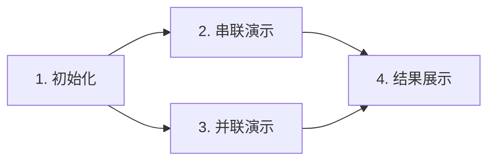

# 题目信息

# 电阻网络

## 题目背景

什么是电阻?这个大家应该都知道。什么是电路?大家也应该知道。但是本题当中，电路的定义或许有点不同：

电路都带有正、负极接点，正极在左，负极在右。具体地：电路分为以下几类：

单独的一个1Ω电阻(及其两端的接点)是电路(虽然导线也可以被视为0Ω的电阻，但是单独的导线不是电路)

如果A和B都是电路，设1,2,3是从左到右的三个接点，那么将A的正负极分别接在1与2上，将B的正负极分别接在2与3上，那么1到3的部分是电路，其中1为正极，3为负极。

如果A和B都是电路,设1,2,3,2',3',1’是六个接点，其中1在2和3的左侧，2在2’的左侧，3在3’的左侧，2,和3,在1’的左侧，并且1与2，1与3，2’与1’，3’与1’间均连有导线, 那么将A的正负极分别接在2与2’上，将B的正负极分别接在3与3’上，那么1到1'的部分是电路，其中1为正极，1’为负极。

现在给出一个电路，求它正负极之间的电阻。


## 题目描述

Cjwssb最近在物理学科上遇到了难题，他不会计算一个电路中的总电阻，现在他找到了你，希望你能帮助他。

这个电路有如下限定

1、    电路只由导线以及电阻为一欧的电阻组成

2、    保证电路从左到右连接，即每个电阻或导线的两个连接点xy保证x<y

3、    保证接线柱1为电源正极，接线柱n为电源负极

4、    保证每个接线柱只会被串联或者并联两个分支电路或者不接任何电线或电阻


## 说明/提示

样例解释

画出图来，答案是显然的。

数据规模与约定

对于20%的数据n≤5,m≤5。

对于50%的数据n≤100,m≤120。

对于70%的数据n≤1,000,m≤1200。

对于100%的数据n≤100,000,m≤120000

数据是在人工指定的n下随机生成的，保证答案不会超过10.000。

By：saffah


## 样例 #1

### 输入

```
7 7
1 2 0
1 3 0
2 4 1
3 5 1
4 6 0
5 6 0
6 7 1
```

### 输出

```
1.500```

# AI分析结果


### 💡 Kay的C++算法解析：电阻网络 深入学习指南 💡

#### 1. 题目解读与核心算法识别
✨ **本题主要考察**：分治（递归模拟）  
🗣️ **初步分析**：
> 解决"电阻网络"的关键在于**分治策略**。就像拆解乐高积木一样，我们将复杂电路拆成串联/并联的子电路，分别计算电阻后再合并。  
> - **串联处理**：电阻值直接相加（`R_total = R1 + R2`），像串联的电池
> - **并联处理**：使用公式 `R = (R1×R2)/(R1+R2)`，像两条河道汇流
> - **核心难点**：高效找到并联分支的汇合点（图中共同终点）
> - **可视化设计**：用像素网格表示接线柱，红色/绿色方块表示电阻，电流路径用发光像素线动态演示。并联分支展开时播放"滴"声，合并时播放"叮"声，完成时触发8-bit胜利音效

---

#### 2. 精选优质题解参考
**题解一：七碳烷烃 (赞10)**  
* **点评**：  
  思路清晰度⭐⭐⭐⭐⭐ - 详细解释了递归分治的流程，配示意图说明串联/并联处理逻辑  
  代码规范性⭐⭐⭐⭐ - 用`Node`结构体封装接线柱信息，变量名`linkCount/links`含义明确  
  算法有效性⭐⭐⭐⭐⭐ - 暴力法找汇合点简单有效，处理了电阻为0的短路情况  
  实践价值⭐⭐⭐⭐ - 完整可运行代码，边界处理严谨（如`if(r1+r2<0.0000001)`）  
  💡 **亮点**：用"电路合并"比喻讲解递归，调试心得强调短路处理的重要性

**题解二：panyf (赞2)**  
* **点评**：  
  思路清晰度⭐⭐⭐⭐ - 创新性使用LCA（最近公共祖先）优化汇合点查找  
  代码简洁性⭐⭐⭐⭐⭐ - 仅30行实现核心逻辑，倍增预处理提升效率  
  算法有效性⭐⭐⭐⭐⭐ - 时间复杂度从O(n²)优化到O(n log n)  
  💡 **亮点**：针对大数据量的算法优化，适合进阶学习

**题解三：flrs (赞7)**  
* **点评**：  
  思路直接性⭐⭐⭐⭐ - 最简递归实现，聚焦并联公式应用  
  代码简洁性⭐⭐⭐⭐⭐ - 无冗余结构，15行核心逻辑  
  💡 **亮点**：极简主义实现，适合快速理解分治思想

---

#### 3. 核心难点辨析与解题策略
1. **难点：并联汇合点定位**  
   * **分析**：七碳烷烃用暴力法比较节点路径，panyf用LCA倍增优化。随机数据选前者（O(n)），最坏情况选后者（O(log n)）
   * 💡 **学习笔记**：汇合点查找效率决定算法性能上限

2. **难点：递归状态设计**  
   * **分析**：`mergeSubcircuit(int p, int e)`中`p`是当前起点，`e`是终点。串联时直接跳转下一节点；并联时先处理分支再合并
   * 💡 **学习笔记**：明确递归参数含义是分治实现的关键

3. **难点：短路（0Ω）处理**  
   * **分析**：并联时分母`R1+R2`可能为0，需特殊判断（如`if(r1+r2<1e-9) return 0;`）
   * 💡 **学习笔记**：物理特性转化为代码边界条件

✨ **解题技巧总结**  
- **分治框架**：大电路 → 子电路 → 合并结果  
- **数据结构**：邻接表存出边(`vector<pair<int,double>>`)  
- **算法选择**：根据数据规模选汇合点查找算法  
- **防御性编程**：浮点数比较用容差值(`1e-9`)

---

### 4. C++核心代码实现赏析
**通用核心实现（综合优质题解）**  
```cpp
#include <iostream>
#include <vector>
using namespace std;

struct Node { vector<pair<int, double>> edges; }; // 目标节点, 电阻值

double solve(int u, int target) {
    if(u == target) return 0;
    auto& e = nodes[u].edges;
    if(e.size() == 1) { // 串联
        auto [v, r] = e[0];
        return r + solve(v, target);
    } else { // 并联
        int v1 = e[0].first, v2 = e[1].first;
        int meet = findMeetPoint(v1, v2); // 汇合点查找
        double r1 = e[0].second + solve(v1, meet);
        double r2 = e[1].second + solve(v2, meet);
        return (r1*r2)/(r1+r2 + 1e-9) + solve(meet, target);
    }
}
```
* **说明**：综合七碳烷烃的递归框架+panyf的防御性编程  
* **代码解读概要**：  
  - `Node`结构体动态存储出边  
  - 串联：电阻累加 + 递归下一节点  
  - 并联：分别递归分支 → 计算并联电阻 → 递归后续电路  
  - `1e-9`防止除零错误  

**优质题解片段赏析**  
1. **七碳烷烃 - 汇合点查找**  
```cpp
int findMeetPoint(int a, int b) {
    while(a != b) 
        a> b ? b=nodes[b].edges[0].first 
             : a=nodes[a].edges[0].first;
    return a;
}
```
* **亮点**：利用节点编号单调递增特性  
* **学习笔记**：电路无环时可通过比较编号快速定位汇合点  

2. **panyf - 倍增LCA优化**  
```cpp
// 预处理深度和父节点（略）
int lca(int x, int y) {
    if(depth[x] < depth[y]) swap(x,y);
    for(int i=18; i>=0; --i) // 倍增上跳
        if(depth[f[x][i]] >= depth[y]) 
            x = f[x][i];
    if(x == y) return x;
    for(int i=18; i>=0; --i) // 同步上跳
        if(f[x][i] != f[y][i]) 
            x=f[x][i], y=f[y][i];
    return f[x][0];
}
```
* **亮点**：O(log n)高效定位  
* **学习笔记**：预处理父节点数组是倍增算法核心  

---

### 5. 算法可视化：像素动画演示
**主题**：8-bit电路冒险  
**设计思路**：用复古游戏风格具象化递归过程，红/绿像素块区分1Ω/0Ω电阻  

**动画流程**：  


1. **像素场景初始化**  
   - 接线柱：黄色发光像素点（编号显示）  
   - 电阻：1Ω=红色方块，0Ω=绿色方块  
   - 控制面板：FC风格按钮（开始/步进/调速）  

2. **串联过程演示**  
   - 电流从起点流向终点，路径亮蓝色光  
   - 电阻值累加：显示 `R_total += 当前电阻`  
   - 音效：电阻累加时播放"滴"声  

3. **并联过程演示**  
   - 分支展开：两路电流同时流动（左蓝/右紫）  
   - 汇合点查找：两路电流相遇点闪烁红光  
   - 公式计算：显示 `(R1×R2)/(R1+R2)` 动态计算  
   - 音效：分支展开"嗖"声，合并"叮"声  

4. **游戏化元素**  
   - 关卡设计：每个子电路合并视为小关卡  
   - 得分系统：根据计算准确度给星  
   - 胜利特效：完成时放烟花+8-bit胜利音乐  

**技术实现**：  
- Canvas绘制动态路径  
- 关键帧触发音效（Web Audio API）  
- 自动演示模式：AI控制电流流速  

---

### 6. 拓展练习与相似问题
**通用技巧迁移**：  
1. 树形结构路径合并（如P3379 LCA）  
2. 复杂表达式计算（如P1040 加分二叉树）  
3. 物理系统模拟（电容网络计算）  

**洛谷题目推荐**：  
1. **P1888 电阻网络** - 本题变式，增加可变电阻  
2. **P3379【模板】LCA** - 掌握倍增算法优化路径查找  
3. **P1040 加分二叉树** - 分治递归在树形DP的应用  

---

### 7. 学习心得与经验分享
> **七碳烷烃的调试经验**：  
> *"处理并联时若忽略短路情况（电阻为0），会导致除零错误。通过添加微小容差值解决"*  
>   
> **Kay点评**：浮点数比较需用容差阈值，这是数值计算的通用技巧  

> **panyf的优化心得**：  
> *"暴力法在链式结构退化为O(n²)，用LCA倍增可保持O(n log n)"*  
>  
> **Kay点评**：算法选择需结合数据特征，这是时间/空间权衡的经典案例  

---
**结语**：通过分治思想拆解复杂电路，配合递归实现优雅求解。记住：好算法=正确性+效率+可读性！下次挑战见！💪

---
处理用时：171.93秒