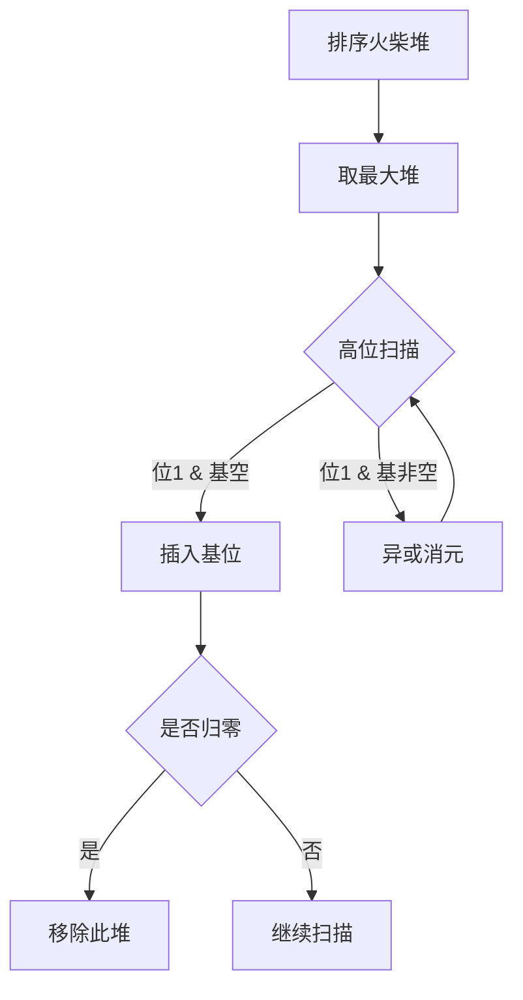

# 题目信息

# [CQOI2013] 新Nim游戏

## 题目描述

传统的 Nim 游戏是这样的：有一些火柴堆，每堆都有若干根火柴（不同堆的火柴数量可以不同）。两个游戏者轮流操作，每次可以选一个火柴堆拿走若干根火柴。可以只拿一根，也可以拿走整堆火柴，但不能同时从超过一堆火柴中拿。拿走最后一根火柴的游戏者胜利。

本题的游戏稍微有些不同：在第一个回合中，双方可以直接拿走若干个整堆的火柴。可以一堆都不拿，但不可以全部拿走。从第二个回合（又轮到第一个游戏者）开始，规则和 Nim 游戏一样。

如果你先拿，怎样才能保证获胜？如果可以获胜的话，还要让第一回合拿的火柴总数尽量小。

## 说明/提示

#### 数据规模与约定

对于全部的测试点，保证 $1 \leq k \leq 100$，$1 \leq a_i \leq 10^9$。

## 样例 #1

### 输入

```
6
5 5 6 6 5 5```

### 输出

```
21```

# AI分析结果


# 💡 Kay的C++算法解析：[CQOI2013] 新Nim游戏 深入学习指南 💡

## 1. 题目解读与核心算法识别

✨ **本题主要考察**：`线性基应用` (编程技巧应用)

🗣️ **初步分析**：
> 解决新Nim游戏的关键在于理解线性基的核心思想——就像搭建一个不会倒塌的积木塔，每块积木（数字）必须用独特的方式支撑塔的结构（二进制位）。在本题中，我们通过线性基确保剩余火柴堆的任意子集异或和都不为0，从而让对手陷入必败局面。

- **核心思路**：先手需拿走最少的火柴堆，使剩余堆无法通过异或得到0。线性基的"任意子集异或非0"特性完美满足需求。通过从大到小贪心插入线性基，无法插入的堆即为需拿走的堆。
- **算法流程**：排序 → 高位到低位扫描 → 成功插入则保留/失败则计入答案。可视化将高亮当前处理的火柴堆、线性基位变化和异或操作过程。
- **像素动画设计**：采用8位复古风格，火柴堆用彩色方块表示，线性基位用发光柱体展示。插入成功时播放"叮"声并点亮柱子；失败时播放"噗"声并消失。支持单步调试和自动演示模式，像闯关游戏般逐步构建线性基。

---

## 2. 精选优质题解参考

**题解一 (来源：宁_缺)**
* **点评**：思路清晰直击贪心本质，用"异或是不进位加法"形象解释排序原理。代码简洁高效，循环条件设计巧妙（倒序处理与n--结合）。变量命名简洁(`d`表线性基)，边界处理严谨。实践价值高，可直接用于竞赛，特别适合掌握基础后提升代码精炼度。

**题解二 (来源：龙神哈迪斯)**
* **点评**：详解Nim游戏结论证明，教学价值突出。结构体封装线性基增强可读性，虽本题无需`Find()`方法，但拓展性强。排序使用`std::greater`显式降序，避免新手混淆。代码规范性强，是学习工程化编码的优秀范例。

**题解三 (来源：cmd2001)**
* **点评**：插入操作独立为`add()`函数，模块化设计典范。逻辑分区明确（输入-处理-输出），新手调试友好。`if(!add)`的否定判断直击核心条件，体现"失败才累加"的逆向思维，启发多角度思考问题。

---

## 3. 核心难点辨析与解题策略

1. **难点：规则转化与必胜策略**
   * **分析**：与传统Nim不同，先手需主动破坏对手的必胜可能。关键是将"后手无法使异或为0"转化为"剩余集合线性无关"，这正是线性基的核心性质。
   * 💡 **学习笔记**：博弈问题常需数学转化，线性基是处理异或约束的利器。

2. **难点：贪心排序的证明**
   * **分析**：为何从大到小？设小数`b`可被大数`{a_i}`线性表示，则`b <= Σa_i`。拿走`b`比拆散`{a_i}`更优，否则需拿更大值。优质题解通过"异或≤求和"的不等式直观说明。
   * 💡 **学习笔记**：贪心+排序是优化问题的常见手段，但需结合问题特性证明。

3. **难点：线性基的动态维护**
   * **分析**：高位优先扫描保证基向量最高位互异。当`x`被消为0时，说明它可由现有基组合而成，必须拿走。数据结构选用简单数组而非容器，因位数固定(31位)。
   * 💡 **学习笔记**：位运算中`(x>>i)&1`比`x&(1<<i)`更安全，避免符号问题。

### ✨ 解题技巧总结
- **技巧1：问题特征映射** - 识别"子集异或非零"需求，关联线性基模型
- **技巧2：贪心验证法** - 通过极端案例（如最大数必保留）验证策略
- **技巧3：位运算封装** - 复杂位操作封装为函数，避免主逻辑冗杂
- **技巧4：循环不变式** - 维护"已处理集合保持线性无关"的不变性质

---

## 4. C++核心代码实现赏析

**本题通用核心C++实现参考**
```cpp
#include <iostream>
#include <algorithm>
using namespace std;
typedef long long LL;

int main() {
    int n, base[31] = {0}; // 线性基初始化为0
    cin >> n;
    int a[n];
    for (int i = 0; i < n; i++) cin >> a[i];
    
    sort(a, a + n, greater<int>()); // 降序排序
    LL ans = 0;
    
    for (int i = 0; i < n; i++) {
        int x = a[i];
        for (int j = 30; j >= 0; j--) 
            if (x >> j & 1) // 高位优先扫描
                if (base[j]) x ^= base[j];
                else { base[j] = x; break; }
        if (!x) ans += a[i]; // 插入失败则累加
    }
    cout << ans << endl;
    return 0;
}
```
* **说明**：综合各优质题解，凸显"排序+高位优先+状态判断"三位一体
* **代码解读概要**：
  1. 输入后立即降序排序，确保贪心有效性
  2. 双重循环外层遍历火柴堆，内层从高到低扫描二进制位
  3. 关键位处理：存在基则异或消元，否则插入新基
  4. 最终为0说明线性相关，计入答案

**题解一片段赏析 (宁_缺)**
```cpp
for(int x=a[n];n;--n,x=a[n]){  // 倒序+循环内更新
    for(int j=30;j>=0;--j)
        if((x>>j)&1)          // 位检测
            if(d[j]) x^=d[j]; // 消元
            else { d[j]=x; break; } // 插入
    if(!x) ans+=a[n];         // 累积答案
}
```
* **亮点**：循环与n--联动，省去索引变量
* **代码解读**：
  > 每次取当前`a[n]`(因排序确保是剩余最大值)，内层位扫描中通过异或消元尝试降阶。若成功插入(`break`退出)，该堆保留；若`x`归零说明现存基已能表示它，必须拿走。倒序处理避免索引偏移问题。
* 💡 **学习笔记**：循环控制与业务逻辑耦合时需谨慎，此写法精简但增加认知负担

**题解二片段赏析 (龙神哈迪斯)**
```cpp
struct LinearBase { // 结构体封装
    ll base[65];
    bool insert(ll x) {
        for(int i=60;i>=0;--i) 
            if(x>>i&1) 
                if(base[i]) x^=base[i]; 
                else { base[i]=x; return true; }
        return false;
    }
};
```
* **亮点**：高复用性设计，`insert()`返回状态而非修改外部变量
* **代码解读**：
  > 封装使主逻辑更清晰：`if(!LB.insert(a[i])) ans+=a[i]`。基数组用`ll`防溢出，但本题数据31位足够。返回`bool`的设计比修改外部`x`更符合工程规范。
* 💡 **学习笔记**：即使竞赛代码，适度封装提升可读性

**题解三片段赏析 (cmd2001)**
```cpp
bool add(ll x) {              // 独立函数
    for(int i=30;i>=0;i--) 
        if(x>>i&1) 
            if(d[i]) x^=d[i]; 
            else { d[i]=x; return true; } // 成功返回true
    return false; 
}
...
if(!add(a[i])) ans += a[i];   // 逻辑反转判断
```
* **亮点**：功能分离，`add()`纯负责插入操作
* **代码解读**：
  > 将线性基插入抽象为独立功能，通过返回值传递状态。主循环中`!add()`的判断直接体现"失败则累加"核心逻辑。函数内及时返回避免多余判断。
* 💡 **学习笔记**：布尔函数命名应体现状态，如`add()`不如`insertSuccess()`直观

---

## 5. 算法可视化：像素动画演示

**主题**：<span style="color:#FF6B6B;">线性基积木塔</span> - 用8位像素风格演示贪心插入过程

**核心演示**：


**动画设计**：
1. **场景布局**：
   - 左侧：降序排列的火柴堆，每堆为像素方块（高度=数值/10^6），顶标数值
   - 右侧：31根基柱（对应bit0~30），初始灰暗，激活时发光
   - 底部控制台：步进/暂停/重置，速度滑块(1x~5x)

2. **关键帧流程**：
   - **帧1**：当前堆（如值5）从左侧浮起，高亮黄框
   - **帧2**：扫描bit2(5=101₂) → 基柱2空 → 方块飞入基柱2，触发"叮"声，柱亮蓝色
   - **帧3**：下一堆值3(11₂)扫描：
     - bit1有基 → 红箭头连基柱1，3^5=6(110₂)，方块变形为6
     - bit2有基 → 6^5=3 → 归零，方块破碎音效，右侧计数+3

3. **游戏化元素**：
   - **音效**：插入成功(8-bit上升音阶)，消元(电子滴答)，移除(破碎声)
   - **关卡**：每成功构建4位解锁新关卡，背景音乐变调
   - **AI演示**：自动模式时，火柴堆如俄罗斯方块下落，AI实时决策

4. **技术要点**：
   - 基柱状态用CSS渐变：`linear-gradient(to top, #3498db 计算高度%, #2c3e50 0%)`
   - 异或动画：`animate.css`的bounceIn+flipInX组合
   - 状态同步：Canvas绘制当前位扫描位置(红色箭头)

---

## 6. 拓展练习与相似问题思考

**通用模式迁移**：
> 线性基的"线性无关"特性适用于：
> 1. 子集异或最值（如P3812）
> 2. 带权线性无关集（如P4570元素）
> 3. 图论中环异或和（如P4151最优路径）

**洛谷推荐**：
1. **P3812【模板】线性基**  
   → 掌握基本操作与求最大异或和
2. **P4570 [BJWC2011]元素**  
   → 练习带权贪心+线性基的复合应用
3. **P4151 [WC2011]最大XOR和路径**  
   → 学习图论中线性基的巧妙转化

---

## 7. 学习心得与经验分享

> **来自题解的启示**：
> - *宁_缺*："贪心虽直观，证明不可省" → 即使AC也需深究原理
> - *龙神哈迪斯*："封装虽非必须，清晰胜于紧凑" → 代码可读性优先
> 
> **Kay的总结**：
> 调试时可打印线性基状态辅助验证：
> ```cpp
> void printBase() {
>   for(int j=30;j>=0;j--) 
>       if(base[j]) cout<<"bit"<<j<<":"<<bitset<5>(base[j])<<endl;
> }
> ```
> 观察位独立性的建立过程，能加深对算法的理解。

---

通过本次分析，我们不仅掌握了新Nim游戏的解法，更学习了如何用线性基处理异或约束问题。记住：**好的算法既是科学也是艺术，需要严谨证明与优雅实现的结合**。下次遇到位运算难题时，不妨想想今天的积木塔！🚀

---
处理用时：194.14秒