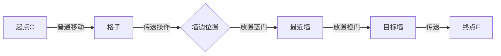

# 题目信息

# [COCI 2017/2018 #3] Portal

## 题目描述

本任务的主角 Chell 必须解决 GLaDOS 提出的新谜题。

Chell 处于一个房间中，该房间的布局可以表示为一个 N 行 M 列的矩阵。每个格子可以是以下几种之一：

- 障碍格子 - 其中有一面墙（用 '#' 表示），
- Chell 的起始位置（用 'C' 表示），
- Chell 必须到达以解决谜题的格子（用 'F' 表示），或者
- 空格子（用 '.' 表示）。

Chell 携带一个所谓的传送枪，可以用来在墙上创建传送门。

在每次移动中，她可以执行以下操作之一：
- 向相邻的格子移动，方向可以是上、下、左或右（她不能移动到有墙的格子）。此移动耗时一个单位时间。
- 通过转向一个方向（不一定是相邻的）朝墙射击来在墙上创建一个传送门。传送门只会在被击中的墙的一侧创建。在任何时刻，**最多只能有两个传送门是激活的**。如果在已有两个激活传送门的情况下创建新的传送门，最早创建的那个将消失。不能在已有传送门的位置创建新的传送门。此操作耗时可忽略不计，即零时间。
- 如果她在一个与墙相邻的格子并且墙的这一侧有传送门，她可以进入传送门并从另一个传送门出来到一个非障碍格子。此操作在有两个激活传送门时才可能，并且耗时一个单位时间。

Chell 想知道解决谜题的最少时间，即到达标记为 'F' 的格子的时间。

**请注意**：房间的四周总是有墙，并且字母 'C' 和 'F' 在矩阵中只出现一次。

## 说明/提示

在总分的 50% 的测试用例中，将满足 4 ≤ N, M ≤ 15。

**第二个测试用例的说明**：

该谜题可以在 8 步内解决，如下图所示。

在第一步中，我们转向左侧墙壁，射击并创建一个传送门，该传送门出现在第 3 行第 1 列（坐标 (3,1)）的墙的右侧。

在第二步中，我们从墙的上侧在坐标 (6,2) 创建一个传送门。

在第三步中，我们进入坐标 (3,1) 的传送门并在坐标 (5,2) 出口——一个有第二个传送门的非障碍格子。

在第四步中，我们向右转并从墙的左侧在坐标 (5,7) 创建一个传送门。由于已经有两个传送门，位于 (3,1) 的传送门消失。

在第五步中，我们进入坐标 (6,2) 的传送门并在坐标 (5,6) 出口。

在第六步中，我们从墙的下侧在坐标 (1,6) 创建一个新传送门，使得坐标 (6,2) 的传送门消失。

在第七步中，我们进入坐标 (5,7) 的传送门并在坐标 (2,6) 出口。最后，在第八步中，我们向右移动一格以结束游戏。

第 1、2、4 和 6 步中的传送门创建耗时为零，而其余移动耗时一个单位时间，因此解决谜题总共需要 4 个单位时间。


题面翻译由 ChatGPT-4o 提供。

## 样例 #1

### 输入

```
4 4
####
#.F#
#C.#
####
```

### 输出

```
2```

## 样例 #2

### 输入

```
6 8
########
#.##..F#
#C.##..#
#..#...#
#.....##
########
```

### 输出

```
4```

## 样例 #3

### 输入

```
4 5
#####
#C#.#
###F#
#####
```

### 输出

```
nemoguce
```

# AI分析结果


# 💡 Kay的C++算法解析：Portal 深入学习指南 💡

## 1. 题目解读与核心算法识别

✨ **本题主要考察**：`图论最短路` + `状态设计优化`

🗣️ **初步分析**：
> 解决"Portal"这道题，关键在于将复杂的传送操作转化为标准最短路问题。想象你在一个像素迷宫中探险，传送门就像游戏中的"快捷通道"，需要巧妙放置才能快速到达终点。核心思路如下：
> - **预处理**：计算每个点四个方向到墙的距离（类似扫描迷宫获取地图信息）
> - **状态设计**：每个网格位置都是图节点，传送门作为特殊边（传送门是连接非相邻节点的"捷径"）
> - **难点突破**：传送操作代价 = 到最近墙的距离（放置第一个门） + 1（传送动作）
> 
> 可视化设计思路：
> - 像素网格中，用高亮色块显示当前探索位置
> - 传送时绘制蓝色/橙色传送门动画，显示路径折线
> - 实时显示当前点四个方向的墙距离（数字标签）
> - 复古游戏风格：8-bit音效（移动脚步声、传送门射击声、传送音效）

---

## 2. 精选优质题解参考

**题解一（作者：iiiiiiiiiiiiiiiiiii）**
* **点评**：思路清晰展现了传送操作的核心逻辑——将传送拆解为"找最近墙+传送"两个步骤。代码中预处理部分简洁高效（O(n²)完成四个方向扫描），SPFA实现直接融入传送状态转移。亮点在于用`minn`变量巧妙处理传送代价，且边界处理严谨（如墙距离为-1时的判断）。变量命名规范（`dis`/`vis`），实践参考价值高。

**题解二（作者：stoorz）**
* **点评**：采用分层建图思想，将传送操作转化为显式边。亮点在于多源BFS预处理墙距离（从所有墙反向扩散），使传送代价计算更直观。代码规范（结构体封装坐标），使用Dijkstra更稳定。虽然建图部分稍复杂，但对理解图论模型很有帮助。

**题解三（作者：Perta）**
* **点评**：提供最完整的预处理实现，递推计算四个方向墙位置的方式极具启发性（如左方向扫描：当前点左墙位置=左侧点的左墙位置）。代码可读性强（详细注释），Dijkstra实现标准，空间优化尝试（坐标压缩）值得学习。

---

## 3. 核心难点辨析与解题策略

1.  **难点：墙距离的高效预处理**
    * **分析**：优质题解采用动态规划思想——以左方向为例：若左邻是墙则距离=0，否则继承左邻距离+1。类似扫描完成四个方向，时间复杂度O(nm)
    * 💡 **学习笔记**："方向扫描法"是网格图预处理的核心技巧

2.  **难点：传送操作的状态转移**
    * **分析**：传送不是简单移动，需同时考虑：1) 起点到最近墙的路径 2) 目标墙选择。题解1用`minn`取三个非目标方向最小值作为代价，题解2则转化为显式边
    * 💡 **学习笔记**：复杂操作可拆解为"预处理+最短路扩展"

3.  **难点：代码实现易错点**
    * **分析**：边界处理（如四周隐式墙）、状态重复更新（Dijkstra优于BFS）、坐标转换（题解2的com函数）
    * 💡 **学习笔记**：使用`0x3f3f3f3f`初始化距离数组，优先队列避免重复状态

### ✨ 解题技巧总结
- **技巧1：方向扫描预处理** - 对四个方向独立扫描，用递推关系计算墙距离
- **技巧2：状态转移优化** - 传送操作统一转化为"当前代价+min_wall_distance+1"
- **技巧3：调试辅助** - 打印墙距离矩阵（见题解1的debug注释），可视化验证预处理

---

## 4. C++核心代码实现赏析

**本题通用核心C++实现参考**
* **说明**：综合题解1的预处理思路与题解2的Dijkstra实现，优化边界处理
* **完整核心代码**：
```cpp
#include <bits/stdc++.h>
using namespace std;
const int N=505, INF=0x3f3f3f3f, dx[]={-1,1,0,0}, dy[]={0,0,-1,1};
char grid[N][N];
int n,m, sx,sy,ex,ey, dis[N][N], wall[4][N][N]; // 0:up,1:down,2:left,3:right

struct Node {
    int x,y,d;
    bool operator<(const Node& o) const { return d > o.d; }
};

void preprocess() {
    for(int j=1;j<=m;++j) 
        for(int i=1;i<=n;++i) 
            wall[0][i][j] = (grid[i][j]=='#') ? 0 : (i==1?INF:wall[0][i-1][j]+1);
    
    for(int j=1;j<=m;++j) 
        for(int i=n;i>=1;--i) 
            wall[1][i][j] = (grid[i][j]=='#') ? 0 : (i==n?INF:wall[1][i+1][j]+1);
    
    for(int i=1;i<=n;++i) 
        for(int j=1;j<=m;++j) 
            wall[2][i][j] = (grid[i][j]=='#') ? 0 : (j==1?INF:wall[2][i][j-1]+1);
    
    for(int i=1;i<=n;++i) 
        for(int j=m;j>=1;--j) 
            wall[3][i][j] = (grid[i][j]=='#') ? 0 : (j==m?INF:wall[3][i][j+1]+1);
}

void dijkstra() {
    memset(dis,0x3f,sizeof(dis));
    priority_queue<Node> pq;
    pq.push({sx,sy,0}); dis[sx][sy]=0;
    
    while(!pq.empty()) {
        Node u=pq.top(); pq.pop();
        if(u.d != dis[u.x][u.y]) continue;
        
        // 普通移动
        for(int i=0;i<4;++i) {
            int nx=u.x+dx[i], ny=u.y+dy[i];
            if(nx<1||nx>n||ny<1||ny>m||grid[nx][ny]=='#') continue;
            if(dis[nx][ny] > u.d+1) {
                dis[nx][ny] = u.d+1;
                pq.push({nx,ny,u.d+1});
            }
        }
        
        // 传送移动
        int min_cost = min({wall[0][u.x][u.y], wall[1][u.x][u.y], 
                          wall[2][u.x][u.y], wall[3][u.x][u.y]}) + 1;
        
        for(int i=0;i<4;++i) {
            if(wall[i][u.x][u.y] >= INF) continue;
            int nx = u.x + dx[i]*(wall[i][u.x][u.y]-1);
            int ny = u.y + dy[i]*(wall[i][u.x][u.y]-1);
            if(nx<1||nx>n||ny<1||ny>m) continue;
            if(dis[nx][ny] > u.d+min_cost) {
                dis[nx][ny] = u.d+min_cost;
                pq.push({nx,ny,u.d+min_cost});
            }
        }
    }
}

int main() {
    cin>>n>>m;
    for(int i=1;i<=n;++i) {
        cin>>(grid[i]+1);
        for(int j=1;j<=m;++j) {
            if(grid[i][j]=='C') sx=i,sy=j;
            if(grid[i][j]=='F') ex=i,ey=j;
        }
    }
    preprocess();
    dijkstra();
    if(dis[ex][ey]>=INF) cout<<"nemoguce";
    else cout<<dis[ex][ey];
    return 0;
}
```
* **代码解读概要**：
  > 1. **预处理**：通过四次方向扫描，计算每个点到四个方向墙的步数
  > 2. **Dijkstra核心**：优先队列处理两种移动：
  >    - 普通移动：向相邻格子扩展（代价+1）
  >    - 传送移动：计算到最近墙的代价`min_cost`，更新四个墙边位置
  > 3. **边界处理**：用`INF`标记无效位置，跳过越界点

**题解一核心片段赏析**
```cpp
// 预处理右方向（题解1）
for(int i=1;i<=n;i++) 
    for(int j=m;j;j--) 
        if(ch[i][j]=='#') b[i][j][0]=-1;
        else b[i][j][0]=b[i][j+1][0]+1;

// 传送操作（题解1）
int minn=INF;
for(int j=0;j<4;j++) 
    if(i!=j) minn=min(minn,b[f.x][f.y][j]); 
minn += dis[f.x][f.y] + 1; // 总代价
```
* **亮点**：简洁的方向预处理与代价计算
* **学习笔记**：`minn`取非当前方向的最小值，体现"最近墙"思想

**题解二核心片段赏析**
```cpp
// 多源BFS求墙距离（题解2）
queue<int> q;
for(int i=1;i<=n;i++) for(int j=1;j<=m;j++) 
    if(map[i][j]) q.push(com(i,j)), d[i][j]=1;  // 从所有墙开始

while(q.size()) {
    int u=q.front(); q.pop();
    int x=(u-1)/m+1, y=(u-1)%m+1; // 坐标解码
    for(int i=1;i<=4;i++) {
        int xx=x+dx[i], yy=y+dy[i];
        if(!d[xx][yy] && map[xx][yy]=='.') {
            d[xx][yy]=d[x][y]+1;
            q.push(com(xx,yy));
        }
    }
}
```
* **亮点**：反向BFS求最近墙距离
* **学习笔记**：多源BFS是计算最近距离的通用方法

---

## 5. 算法可视化：像素动画演示

### 动画演示主题
**"像素迷宫传送门"** - 融合复古游戏元素（类似塞尔达传说）

### 核心演示内容


### 动画帧步骤
1. **场景初始化**（8-bit像素风）
   - 深灰色墙块（#），浅灰可走区（.），红色起点（C），绿色终点（F）
   - 控制面板：开始/暂停/单步/速度滑块

2. **普通移动演示**
   - 像素小人沿路径移动，足迹显示绿色轨迹
   - 音效：每次移动播放"嘀"声（FC游戏脚步声）

3. **传送操作演示**
   ```python
   # 伪代码演示关键帧
   while 当前点 != 终点:
        if 选择传送:
            高亮当前点 → 计算最近墙方向（蓝色箭头）
            小人移动至蓝墙（路径显示虚线）→ 射击音效
            高亮目标墙（橙色箭头）→ 射击音效
            小人进入蓝门 → 传送音效 + 粒子特效
            从橙门出现 → 显示坐标更新
   ```

4. **动态信息显示**
   - 当前格子显示四方向墙距离（上：3, 下：INF, 左：1, 右：2）
   - 状态栏：已用时间 = 移动步数 + 传送次数

5. **游戏化元素**
   - 成功传送：+10分（像素字体显示）
   - 到达终点：播放胜利音效 + 烟花动画
   - 背景音乐：8-bit循环BGM

---

## 6. 拓展练习与相似问题思考

### 通用思路迁移
传送门思想可用于解决：
1. 网格图状态转移优化问题
2. 存在"跳跃"操作的路径规划（如：骑士传送）
3. 分层图问题中的跨层转移

### 练习推荐（洛谷）
1. **P3659 [USACO17FEB]Why Did the Cow Cross the Road I G**  
   → 巩固传送门思想在最短路的应用
   
2. **P1825 [USACO11OPEN]Corn Maze S**  
   → 学习多类型传送门的BFS实现

3. **P6742 [COCI2014-2015#1] Zabava**  
   → 训练传送门问题的变形思维

---

## 7. 学习心得与经验分享

> **来自题解作者的调试经验**：  
> "我在处理墙距时卡了很久，后来发现边界处理错误（没考虑四周隐式墙），通过打印5×5子网格的墙距矩阵才定位问题"

**Kay的总结**：  
1. **调试技巧**：对复杂预处理，输出子网格验证（如5×5区域的墙距）
2. **边界陷阱**：数组开505×505而非500×500（防越界）
3. **算法选择**：网格较大时优选Dijkstra，避免SPFA退化

---

通过本次分析，我们深入理解了Portal问题的核心思想——将复杂操作转化为图论模型。记住：好的算法设计就像放置传送门，找到问题的最优路径！下次探险再见！💪

---
处理用时：320.08秒