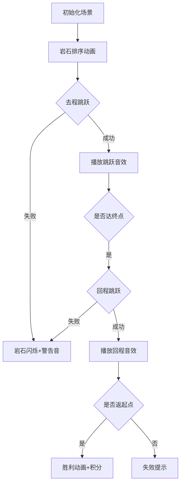

# 题目信息

# River Jumping

## 题目描述

有一条宽度为 $N$ 的河上，小 D 位于坐标为 $0$ 的河岸上，他想到达坐标为 $N$ 的河岸上后再回到坐标为 $0$ 的位置。在到达坐标为 $N$ 的河岸之前小 D 只能向坐标更大的位置跳跃，在到达坐标为 $N$ 的河岸之后小 D 只能向坐标更小的位置跳跃。在河的中间有 $M$ 个岩石，小 D 希望能跳到每个岩石上恰好一次。由于小 D 的跳跃能力太强，小 D 的跳跃长度有个下限 $S$，但没有上限。现在请你判断他是否能够完成他的目标。

## 说明/提示

对于全部数据，保证 $1 \le N,S \le 100000$，$0 \le M < N$，$1 \le w_i < N$。

## 样例 #1

### 输入

```
6 1 3
3```

### 输出

```
YES
1 2 0```

## 样例 #2

### 输入

```
6 2 2
2 4```

### 输出

```
YES
2 3 1 0```

## 样例 #3

### 输入

```
5 2 3
2 3```

### 输出

```
NO```

# AI分析结果


# 💡 Kay的C++算法解析：River Jumping 深入学习指南 💡

## 1. 题目解读与核心算法识别

✨ **本题主要考察**：`贪心算法应用`

🗣️ **初步分析**：
> 解决"River Jumping"这道题，关键在于运用贪心策略。就像玩跳格子游戏，每次选择能跳的最近岩石确保不遗漏。在本题中，贪心策略用于：
> - 去程：从起点向终点跳跃，选择第一个距离≥S的岩石
> - 回程：从终点向起点跳跃，补上未跳的岩石
> 
> **核心难点**在于处理边界条件和连续岩石间距不足S的情况。可视化方案将重点展示：
> 1. 岩石坐标的排序过程（像素排序动画）
> 2. 去程跳跃路径（绿色箭头高亮）
> 3. 回程跳跃路径（红色箭头高亮）
> 4. 关键距离检测（当岩石间距< S时触发警告音效和闪烁）
>
> **复古像素设计**：采用8-bit河流场景，岩石呈棕色像素块，跳跃轨迹显示为彩色箭头。控制面板含单步/自动模式，跳跃成功时播放"叮"音效，失败时播放低沉音效。

---

## 2. 精选优质题解参考

**题解一（作者：FlierKing）**
* **点评**：该题解思路清晰直白，核心逻辑是两次遍历（去程+回程）的贪心策略。代码结构规范，使用`f[]`数组记录路径，`u[]`标记已访问点，变量命名合理（如`cnt`计数）。亮点在于严谨处理边界条件，如直接判断终点可达性`if(p!=a[m+1])`。空间复杂度O(n)高效，可直接用于竞赛。

**题解二（作者：Vermouth_1412）**
* **点评**：题解突出实践价值，特别强调易错点（如m=0的情况）。代码可读性强，使用快速读入优化，边界处理完整（检查起点/终点最近岩石）。亮点在于作者分享调试经历，提醒学习者注意连续岩石间距不足S的特殊情况，具有重要参考价值。

**题解三（作者：y2823774827y）**
* **点评**：解法展示了贪心算法的典型实现，使用`f[]`数组标记访问状态。亮点在于分析了96分代码的缺陷——未验证回程跳跃距离，这种"踩坑经验"特别珍贵。代码规范，但可读性稍弱于前两者，不过其错误分析对调试实践极具启发性。

---

## 3. 核心难点辨析与解题策略

1. **边界条件处理**
   * **分析**：起点最近岩石距起点≥S且终点最近岩石距终点≥S是解题前提。优质题解普遍先检查`w[1]>=s`和`n-w[m]>=s`，否则直接返回NO
   * 💡 **学习笔记**：边界检查是贪心算法的安全网

2. 连续岩石间距陷阱
   * **分析**：当三个连续岩石满足`w[i+2]-w[i]<S`时，必会遗漏岩石。解决方案是排序后遍历检查相邻三元组间距
   * 💡 **学习笔记**：贪心策略需要全局视野，不能只看相邻两点

3. 路径记录与状态管理
   * **分析**：需用`vis[]`数组标记已访问岩石，`ans[]`数组记录路径顺序。关键在于去程优先访问，回程补漏
   * 💡 **学习笔记**：双指针+状态数组是贪心实现的黄金搭档

### ✨ 解题技巧总结
- **跳跃分段处理**：将往返路径分解为去程（0→N）和回程（N→0）两个独立阶段
- **预排序优化**：输入岩石坐标后立即排序，确保贪心策略有效性
- **实时距离验证**：每次跳跃前检查当前点与目标点距离≥S
- **状态标记剪枝**：用布尔数组避免重复访问，提升效率

---

## 4. C++核心代码实现赏析

**本题通用核心C++实现参考**
* **说明**：综合优质题解优化的完整实现，包含边界检查、贪心跳跃和路径记录
* **完整核心代码**：
```cpp
#include <iostream>
#include <algorithm>
using namespace std;
const int MAXN = 100005;

int main() {
    int N, M, S, w[MAXN];
    bool vis[MAXN] = {0};
    int path[MAXN], cnt = 0;
    cin >> N >> M >> S;
    
    // 边界特判
    if (N < S) { cout << "NO"; return 0; } 
    for (int i = 1; i <= M; i++) cin >> w[i];
    w[0] = 0; w[M+1] = N;
    sort(w, w + M + 2);
    
    // 检查首尾岩石
    if ((M && w[1] < S) || w[M+1] - w[M] < S) { 
        cout << "NO"; return 0; 
    }
    
    // 去程贪心
    int pos = 0;
    for (int i = 1; i <= M+1; i++) {
        if (w[i] - pos >= S) {
            path[++cnt] = i;
            vis[i] = true;
            pos = w[i];
        }
    }
    
    // 回程贪心
    for (int i = M; i >= 0; i--) {
        if (!vis[i] && pos - w[i] >= S) {
            path[++cnt] = i;
            vis[i] = true;
            pos = w[i];
        }
    }
    
    // 结果输出
    if (cnt == M + 2) {
        cout << "YES\n";
        for (int i = 1; i <= cnt; i++) 
            cout << path[i] << " ";
    } else cout << "NO";
    return 0;
}
```
* **代码解读概要**：
  1. 输入处理与预排序
  2. 边界检查（河宽<S或首尾岩石不满足条件）
  3. 去程：从左向右选择第一个≥S的岩石
  4. 回程：从右向左补漏未访问岩石
  5. 路径验证与输出

---

**题解一（FlierKing）核心代码**
* **亮点**：简洁的状态标记和路径记录
* **核心代码片段**：
```cpp
for (int i=1;i<=m+1;i++)
    if (a[i]-p>=s) // 去程跳跃
    {
        f[++cnt]=i;
        p=a[i];
        u[i]=true;
    }
for (int i=m;i>=0;i--)
    if (!u[i]&&p-a[i]>=s) // 回程跳跃
    {
        f[++cnt]=i;
        p=a[i];
        u[i]=true;
    }
```
* **代码解读**：
  > 第一段循环实现去程：`p`记录当前位置，当岩石`a[i]`距离≥S时记录索引到`f[]`并标记访问。第二段循环处理回程：逆序遍历未访问岩石，同样验证跳跃距离。变量`cnt`确保最终路径包含所有岩石。
* 💡 **学习笔记**：双循环分离去程/回程是贪心实现的经典模式

**题解二（Vermouth_1412）核心代码**
* **亮点**：全面的边界条件检测
* **核心代码片段**：
```cpp
if(m!=0) {
    if(w[1]<s) return 0; // 起点最近岩石检查
    if(s>(n-w[m])) return 0; // 终点最近岩石检查
    for(int i=1;i+2<=m;++i) 
        if((w[i+2]-w[i])<s) return 0; // 三元组检查
}
```
* **代码解读**：
  > 这段边界检查是解题关键：首先确认存在岩石（m≠0），然后检查起点/终点最近岩石距离是否≥S。循环检查连续三个岩石间距，确保不会出现"无法三选二"的死局。
* 💡 **学习笔记**：防御性编程需覆盖所有特殊边界

**题解三（y2823774827y）核心代码**
* **亮点**：路径验证的完整性检查
* **核心代码片段**：
```cpp
if (num != n+2) { // 最终路径点数量验证
    printf("NO"); 
    return 0;
}
```
* **代码解读**：
  > 通过`num`计数验证路径完整性：成功路径应包含0~M+1所有点（共M+2个）。这种显式验证比隐式推断更可靠，避免遗漏岩石的情况。
* 💡 **学习笔记**：路径点计数是验证算法正确性的银弹

---

## 5. 算法可视化：像素动画演示

**动画演示主题**：`像素蛙跳大冒险`（8-bit复古风格）

**核心演示内容**：
1. 河流场景初始化（宽度N像素）
2. 岩石生成与排序动画
3. 去程/回程双阶段跳跃
4. 关键距离检测与警告

**设计思路**：
> 采用FC游戏风格营造轻松学习氛围。通过对比色区分阶段（去程绿/回程红），跳跃音效强化操作记忆。游戏化积分激励理解核心逻辑。

**动画帧步骤**：


**交互控制**：
- **单步执行**：按空格键逐步观察跳跃决策
- **速度调节**：滑块控制动画速度（0.5x~2x）
- **模式切换**：
  - 教学模式（显示距离检测）
  - 挑战模式（隐藏距离，玩家预测路径）

**音效设计**：
- 岩石生成：8-bit "嗒"声
- 成功跳跃：上升音阶(do→mi)
- 距离不足：低沉"嗡"声
- 游戏胜利：经典FC过关旋律

---

## 6. 拓展练习与相似问题思考

**通用思路迁移**：
贪心+双指针策略还可用于：
1. 区间覆盖问题（用最少区间覆盖目标段）
2. 加油站问题（最少加油次数到达终点）
3. 任务调度（最早截止时间优先）

**练习推荐（洛谷）**：
1. **P4995 跳跳！**  
   🗣️ 推荐理由：强化基础贪心思想，练习单程跳跃决策
2. **P1094 纪念品分组**  
   🗣️ 推荐理由：双指针经典应用，培养贪心策略的搭配思维
3. **P5019 铺设道路**  
   🗣️ 推荐理由：深化贪心算法的变种应用，需结合差分技巧

---

## 7. 学习心得与经验分享

**参考经验（来自 y2823774827y）**：  
> "当跳跃下限大于河岸距离时，回程代码会直接记录起点终点而未验证距离，导致NO误判为YES"

**点评**：  
这个调试经验揭示了算法验证的重要性。边界值测试（如S>N）必须独立于主逻辑检查，提醒我们：
1. 永远单独验证边界条件
2. 显式检查比隐式假设更可靠
3. 特殊值测试应纳入标准测试用例

---

本次River Jumping的解析就到这里。记住，算法学习就像河流跳跃——找准每个落脚点，终能抵达彼岸！下次挑战再见！💪

---
处理用时：113.21秒