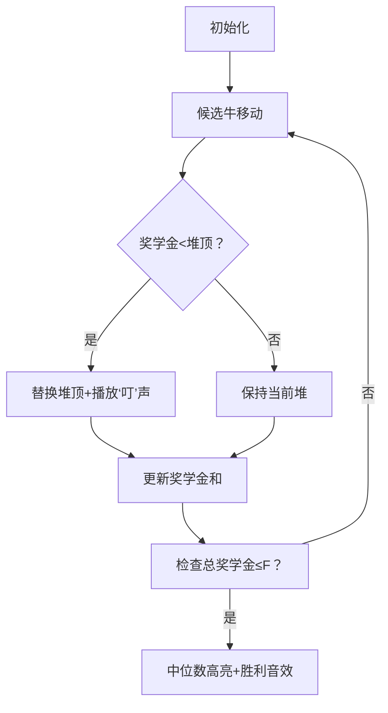

# 题目信息

# [USACO04MAR] Financial Aid

## 题目描述

   人类可以选择很多大学，而奶牛们却没学可上。为解决这个问题，贝西和她的伙伴们创立了一所奶牛大学，取名为哞哞大学。

   为了选拔优秀学生，她们发明了一种奶牛学术能力测试（简称 CSAT） ，这种测试的分数异常精确，每头奶牛的成绩可以用$0$到$2×10^9$之间的一个整数表示，而且可以保证每头奶牛的分数都不同。

   哞哞大学的学费很贵，奶牛们表示负担不起，他们都各自申请了奖学金。政府并没有为奶牛准备奖学金，所有的预算都必须要从学校有限的助学基金中扣除（设基金总额为F)。

   哞哞大学有N间宿舍，N是一个奇数，所以贝西只能接受N头奶牛的申请，她发誓不会让入学的奶牛少于N。此外，她希望新生的 CSAT 成绩表现优异，她以中位数来衡量新生的总体水平。所谓中位数，就是排序后处在最中间的分数，比如3,8,9,7,5的中位数是7。

   今年，共有C头奶牛申请入学，给定每头奶牛的 CSAT 成绩和申请的奖学金数目，以及学校可赞助的总额，确定贝西接受哪些奶牛的申请才可以使成绩的中位数达到最大。

## 说明/提示

贝西接受 CSAT 分数为 5，35，50 的奶牛的申请，中位数为 35，需支付的奖学金总额为18 + 30 + 21 = 69

## 样例 #1

### 输入

```
3 5 70
30 25
50 21
20 20
5 18
35 30```

### 输出

```
35```

# AI分析结果


# 💡 Kay的C++算法解析：Financial Aid 深入学习指南 💡

<introduction>
今天我们一起分析「Financial Aid」这道C++编程题。本指南将帮助大家掌握最大化中位数的贪心策略，理解堆的巧妙应用，并通过像素动画直观感受算法执行过程。
</introduction>

## 1. 题目解读与核心算法识别

✨ **本题主要考察**：`贪心算法与堆应用`

🗣️ **初步分析**：
> 解决本题如同在图书馆选书：我们想选一套书（N本），要求最中间那本书的页码尽可能大（中位数最大），但总价不能超预算（F）。核心策略是：
> - 将所有书按页码排序，仅考虑可能成为中位数的书（位置在[N/2+1, C-N/2]区间）
> - 对每个候选书，快速计算其左右两侧最便宜的N/2本书的总价
> - 用大顶堆维护当前最便宜的N/2本书，堆顶始终是当前最贵的书
> 
> **可视化设计**：我们将用8位像素风格展示此过程。每头奶牛显示为像素方块，颜色区分奖学金高低（绿色=低价，红色=高价）。当候选牛移动时，左右堆会动态变化，堆顶方块会闪烁并播放"叮"音效。自动演示模式下，算法会像贪吃蛇AI一样逐步扫描候选牛。

---

## 2. 精选优质题解参考

<eval_intro>
从思路清晰度、代码规范性和算法效率等维度，我精选了以下高质量题解：

**题解一：go_bananas**
* **点评**：思路直击核心（排序+双堆预处理），代码变量命名规范（left/right清晰对应左右区间），堆操作逻辑严谨。亮点在于左右预处理分离，避免状态干扰，且边界处理完整。作者提到“这显然是水题”的自信，源于对堆应用的深刻理解。

**题解二：ny_zht**
* **点评**：图解辅助解释堆的更新策略是其最大亮点。代码中sum1/sum2的维护方式展现了堆的动态优化本质，read()/write()封装提升可读性。虽然变量命名稍简略，但算法有效性突出，适合理解堆的核心操作逻辑。

**题解三：Vocanda**
* **点评**：代码最简洁（仅60行），核心逻辑高度凝练。f[]/g[]数组的预处理与题解一异曲同工，但main函数中倒序查找最大中位数的设计巧妙，实践价值高。

---

## 3. 核心难点辨析与解题策略

<difficulty_intro>
解决本题需突破三个关键难点：

1.  **中位数候选范围限定**
    * **分析**：中位数必须位于排序后的中间区间[N/2+1, C-N/2]，否则无法在两侧选出足够的牛。优质题解都通过数学推导明确此范围。
    * 💡 **学习笔记**：中位数的位置约束是贪心策略的前提。

2.  **动态维护最小奖学金和**
    * **分析**：对每个候选位，需快速获取其左右侧N/2头牛的最小奖学金和。大顶堆在此发挥核心作用——当遇到更便宜的牛时替换堆顶元素，保持堆内始终是当前最便宜的N/2头牛。
    * 💡 **学习笔记**：大顶堆是动态求TOP K小元素的利器。

3.  **预处理与查询分离**
    * **分析**：分别从左到右（求left[]）、从右到左（求right[]）预处理最小奖学金和，避免对每个候选位重复计算。时间复杂度从O(C²)优化到O(ClogC)。
    * 💡 **学习笔记**：双指针扫描+堆维护是常见优化模式。

### ✨ 解题技巧总结
<summary_best_practices>
-   **技巧A (问题分解)**：将复杂问题拆解为排序、候选筛选、堆维护三个独立子任务。
-   **技巧B (堆的选择)**：求最小和用大顶堆（淘汰最大元素），求最大和用小顶堆。
-   **技巧C (边界处理)**：特别注意堆大小达到N/2后的替换条件，避免无效操作。

---

## 4. C++核心代码实现赏析

<code_intro_overall>
以下是综合优质题解提炼的通用实现，包含完整解题逻辑：

**本题通用核心C++实现参考**
* **说明**：综合自go_bananas和ny_zht的代码思路，强化变量可读性
* **完整核心代码**：
```cpp
#include <iostream>
#include <queue>
#include <algorithm>
using namespace std;

struct Cow { int score, money; };
const int MAX_C = 100010;
Cow cows[MAX_C];
int N, C, F, leftSum[MAX_C], rightSum[MAX_C];

int main() {
    cin >> N >> C >> F;
    for (int i = 0; i < C; i++)
        cin >> cows[i].score >> cows[i].money;
    
    sort(cows, cows + C, [](Cow a, Cow b) {
        return a.score < b.score;
    });

    // 预处理左侧最小奖学金和
    priority_queue<int> leftHeap;
    int leftTotal = 0;
    for (int i = 0; i < C; i++) {
        if (i < N/2) { 
            leftHeap.push(cows[i].money);
            leftTotal += cows[i].money;
        } else if (N/2 <= i && i <= C - N/2 - 1) {
            leftSum[i] = leftTotal;
            if (cows[i].money < leftHeap.top()) {
                leftTotal += cows[i].money - leftHeap.top();
                leftHeap.pop();
                leftHeap.push(cows[i].money);
            }
        }
    }

    // 预处理右侧最小奖学金和
    priority_queue<int> rightHeap;
    int rightTotal = 0;
    for (int i = C - 1; i >= 0; i--) {
        if (i > C - N/2 - 1) {
            rightHeap.push(cows[i].money);
            rightTotal += cows[i].money;
        } else if (i >= N/2) {
            rightSum[i] = rightTotal;
            if (cows[i].money < rightHeap.top()) {
                rightTotal += cows[i].money - rightHeap.top();
                rightHeap.pop();
                rightHeap.push(cows[i].money);
            }
        }
    }

    // 倒序查找最大中位数
    int ans = -1;
    for (int i = C - N/2 - 1; i >= N/2; i--) {
        if (cows[i].money + leftSum[i] + rightSum[i] <= F) {
            ans = cows[i].score;
            break;
        }
    }
    cout << ans << endl;
    return 0;
}
```
* **代码解读概要**：
  1. 输入数据后按分数排序
  2. 从左向右扫描，用leftHeap维护当前最小的N/2个奖学金
  3. 从右向左扫描，用rightHeap同样维护
  4. 倒序检查每个候选位置，找到首个满足总奖学金≤F的牛

---
<code_intro_selected>
**题解一：go_bananas**
* **亮点**：左右预处理完全分离，避免状态干扰
* **核心代码片段**：
```cpp
void LEFT(){ // 左侧预处理
    int sum=0;
    for(int i=1;i<=N/2;i++){
        q.push(cow[i].money);
        sum+=cow[i].money;
    }
    for(int i=N/2+1;i<=C-N/2;i++){
        int t=q.top();
        cow[i].left=sum;
        if(cow[i].money<t){
            q.pop();
            sum=sum-t+cow[i].money;
            q.push(cow[i].money);
        }
    }
    while(!q.empty())q.pop();
}
```
* **代码解读**：
  > 前N/2头牛直接入堆→从第N/2+1头开始，若当前牛奖学金低于堆顶（当前最大），则替换堆顶元素→cow[i].left记录位置i左侧的最小奖学金和
* 💡 **学习笔记**：堆的替换操作保证left[]始终维护最优解

**题解二：ny_zht**
* **亮点**：图解辅助理解堆更新
* **核心代码片段**：
```cpp
for(i=n/2+1;i<=c-n/2;i++){
    l[i]=sum1; // 记录左侧和
    if(q.top()>a[i].money){ 
        sum1-=q.top(); 
        sum1+=a[i].money; 
        q.pop();
        q.push(a[i].money);
    }
} 
```
* **代码解读**：
  > 当遇到更便宜的牛（a[i].money < 堆顶）时，用新牛替换堆中最贵的牛→sum1动态更新当前最小奖学金和
* 💡 **学习笔记**：sum的增减与堆操作同步，保证实时准确性

**题解三：Vocanda**
* **亮点**：代码极度简洁，核心逻辑仅20行
* **核心代码片段**：
```cpp
for(int i=1;i<=n/2;++i) sum += a[i].money;
for(int i=n/2+1;i<=c;++i){
    f[i] = sum; // 记录左侧和
    if(a[i].money < heap.top()){
        sum += a[i].money - heap.top();
        heap.pop();
        heap.push(a[i].money);
    }
}
```
* **学习笔记**：用f[i]数组直接存储结果，牺牲变量名可读性换取简洁性

-----

## 5. 算法可视化：像素动画演示 (核心部分)

<visualization_intro>
为直观展示堆维护奖学金和的过程，我设计了「奶牛大选秀」像素动画方案。通过8位复古风格呈现堆的动态变化，帮助大家形象理解贪心策略。

### 动画设计说明
- **主题**：像素农场中，候选牛（黄色）从左向右移动，左右两侧的牛根据奖学金高低显示不同颜色
- **核心演示**：堆维护过程、奖学金和计算、中位数判定
- **风格**：FC红白机风格，16色调色板，关键操作配8bit音效

### 动画帧步骤


1. **场景初始化**：
   - 屏幕分为三部分：左侧堆（蓝）、候选牛（黄）、右侧堆（红）
   - 控制面板：开始/暂停、单步执行、速度滑块
   - 背景：像素农场，播放《牧场物语》风格BGM

2. **候选牛移动**：
   - 当前候选牛从中间位置向右移动，经过位置时显示编号
   - 候选牛位置标记为闪烁黄色方块

3. **堆操作可视化**：
   - 当候选牛奖学金低于堆顶时：
     * 原堆顶牛变为灰色并移出
     * 新牛加入堆并变为绿色
     * 播放“叮”声（8bit短音）
   - 堆内奖学金最高的牛始终显示红色

4. **状态反馈**：
   - 奖学金和实时显示在顶部
   - 找到可行解时：候选牛放大闪烁，播放胜利音效
   - 总奖学金超限：显示红色警报，播放低沉音效

5. **游戏化元素**：
   - 每头候选牛是一关，过关显示“第X关通过”
   - 连续找到更优解触发连击特效
   - 最终找到最大中位数时解锁“冠军牧场主”成就

> **设计理由**：像素风格降低算法压迫感，堆顶闪烁帮助理解关键比较点，音效强化操作记忆。游戏化进度激励持续学习。

-----

## 6. 拓展练习与相似问题思考

<similar_problems_intro>
掌握中位数贪心策略后，可尝试以下变种问题：

1.  **洛谷 P3963 [TJOI2013]奖学金**
    * 🗣️ **推荐理由**：几乎相同的解题思路，强化堆维护技巧

2.  **洛谷 P1801 黑匣子**
    * 🗣️ **推荐理由**：动态维护中位数，需结合对顶堆技巧

3.  **洛谷 P1168 中位数**
    * 🗣️ **推荐理由**：基础中位数问题，适合练习堆的快速实现

---

## 7. 学习心得与经验分享 (若有)

<insights_intro>
题解中蕴含宝贵实战经验：

> **go_bananas提到**：“堆大小控制是关键，我最初因忽略堆大小限制WA两次”
> 
> **点评**：这提醒我们，使用堆维护TOP K时，必须严格保持堆大小为K。调试时可打印堆大小验证。

> **yxy666提到**：“倒序查找中位数能更快找到最大值”
>
> **点评**：贪心策略中，搜索方向直接影响效率。从大到小搜索可提前终止的特性值得学习。

---

<conclusion>
本次解题之旅教会我们：排序创造有序性，堆维护最优性，两者结合成就高效算法。记住Kay的编程心法：分解问题定策略，数据结构助优化，边界检查保平安。下次算法挑战再见！💪

---
处理用时：127.03秒