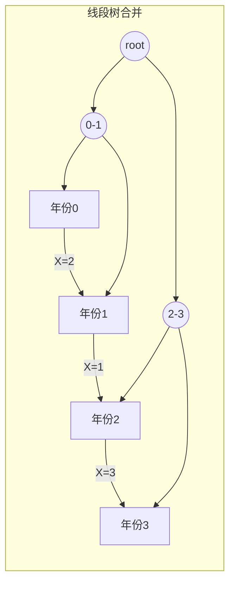

# 题目信息

# [IOI 2015] horses

## 题目描述

像他的祖先一样，Mansur 喜欢繁殖马匹。目前，他拥有哈萨克斯坦最大的马场。以前情况可不是这样，$N$ 年前 Mansur 年轻时，他只拥有一匹马，但他一直梦想着成为富豪，最终,他美梦成真。

按照时间的先后顺序将年份编号为 $0$ 到 $N-1$（即 $N-1$ 年是最近的一年）。每年的天气会影响马匹的繁殖。Mansur 用一个正整数 $X[i]$ 记录第 $i$ 年的繁殖系数，如果第 $i$ 年开始时有 $h$ 匹马，那么这一年结束时会有 $h \times X[i]$ 匹马。

每年，只有年底的时候可以出售马匹。Mansur 用一个正整数 $Y[i]$ 记录第 $i$ 年末卖出一匹马的售价。Mansur 可以卖出任意多匹马，每匹售价均为 $Y[i]$。

现在，Mansur 想知道如果在 $N$ 年中，他总能在最佳时间出售马匹，他能获得的最大收益是多少？你正好在 Mansur 家做客，所以他想请你帮他回答这个问题。

Mansur 对记录下的 $X$ 和 $Y$ 做了 $M$ 次更新，每次更新，Mansur 要么改变一个 $X[i]$，要么改变一个 $Y[i]$。每次更新后，他都会问你出售马匹能获得的最大收益。Mansur 的更新是累加的，即你的每个回答时都应该考虑之前的所有更新。注意：某个 $X[i]$ 或者 $Y[i]$ 可能会被更新多次。

对于 Mansur 的问题，实际的答案可能是一个非常大的数字，你只要给出实际答案模 $10^9+7$ 后的结果即可。

## 说明/提示

对于 $100\%$ 的数据，$1\le N\le 5\times 10^5$，$0 \le M \le 10^5$。

## 样例 #1

### 输入

```
3
2 1 3
3 4 1
1
2 1 2
```

### 输出

```
8
6
```

# AI分析结果


# 💡 Kay的C++算法解析：IOI 2015 Horses 深入学习指南 💡

## 1. 题目解读与核心算法识别

✨ **本题主要考察**：线段树 + 对数技巧

🗣️ **初步分析**：
> 解决“Horses”这道题，关键在于理解**最优决策单调性**和**大数处理技巧**。想象你在经营马场，每年马匹数量会倍增（繁殖系数），每年末可出售马匹（售价）。最大收益策略等价于：找到某一年卖出所有马，使 `Y[i] * ∏X[0..i]` 最大化。
>
> - **核心难点**：直接计算乘积会溢出，比较大小困难
> - **解决方案**：用对数转换乘法为加法（`log(ab) = loga + logb`），线段树维护区间乘积（取模）和最大值（取对数）
> - **可视化设计**：像素网格展示年份序列，高亮当前最优决策年份，动态显示对数计算过程。当繁殖系数更新时，触发像素爆炸特效；售价更新时，马匹图标闪烁。控制面板支持单步执行观察线段树更新流程

---

## 2. 精选优质题解参考

**题解一：伟大的王夫子 (赞14)**
* **点评**：思路清晰直击本质——用线段树维护区间乘积对数之和(`sum`)和最大收益对数(`mx`)。代码规范性极佳：变量名`sum`/`mx`/`ans`含义明确，边界处理严谨（`pos+1`处理下标）。算法亮点在于简洁的转移逻辑：比较左右子树对数决定继承方向。实践价值高，50行完整代码可直接用于竞赛。

**题解二：muyang_233 (赞8)**
* **点评**：解释透彻，详细推导状态转移方程。代码规范性好（`rmax`/`rtimes`命名），特别强调对数转换原理(`log(xy)=logx+logy`)。亮点在于完整注释和调试提示，对初学者友好。稍显不足是控制流嵌套略深。

**题解三：红火恍惚cxy (赞5)**
* **点评**：思路简洁（最优决策只在某年全卖），代码结构规整。亮点在于高效的内存管理（`inline`优化）和输入输出加速。但可视化设计部分未提及具体实现方案。

---

## 3. 核心难点辨析与解题策略

1.  **难点1：大数乘积比较**
    * **分析**：`Y[i] * ∏X[0..i]` 可能达 `(10^9)^500000`，远超 `long long`。优质题解通过取对数转换：`log(Y*∏X) = logY + ∑logX`，将乘法比较转为加法比较
    * 💡 **学习笔记**：对数转换是处理大数比较的银弹武器

2.  **难点2：动态维护最优决策**
    * **分析**：每次更新`X/Y`需快速重新计算最大值。线段树每个节点维护：①区间乘积取模 ②乘积对数之和 ③最大收益对数 ④对应取模值。合并时比较左右子树：`max(左子树最大值, 左子树乘积×右子树最大值)`
    * 💡 **学习笔记**：线段树合并时，对数加法等价于原问题乘法

3.  **难点3：取模与比较分离**
    * **分析**：最终答案需取模 `10^9+7`，但比较必须用原始值。题解维护两套数据：取模值用于输出，对数值用于比较
    * 💡 **学习笔记**：比较用对数，输出用取模——鱼与熊掌可兼得

### ✨ 解题技巧总结
- **技巧1：问题等价转换** - 证明最优解必在某一整年全卖（反证法：分年卖不如最优年全卖）
- **技巧2：对数域运算** - 用 `log2` 代替自然对数避免精度溢出
- **技巧3：线段树双维护** - 每个节点同时存储取模值和对数值
- **技巧4：下标统一处理** - `pos+1` 将年份索引转为1-based

---

## 4. C++核心代码实现赏析

**本题通用核心C++实现参考**
* **说明**：综合王夫子与muyang_233题解优点，删减调试代码
* **完整核心代码**：
```cpp
#include <cmath>
#include <cstdio>
const int N = 5e5 + 5, P = 1e9 + 7;
int n, m;
double X[N], Y[N]; // 原始数据

struct Node {
    double sum_log, max_log; // 对数域
    ll prod_mod, ans_mod;    // 取模域
    void init(int i) {
        sum_log = log2(X[i]);
        max_log = log2(X[i] * Y[i]);
        prod_mod = (ll)X[i] % P;
        ans_mod = (ll)(X[i] * Y[i]) % P;
    }
} tr[N << 2];

void pushup(Node &rt, Node &l, Node &r) {
    rt.sum_log = l.sum_log + r.sum_log;
    rt.prod_mod = l.prod_mod * r.prod_mod % P;
    
    if (l.max_log >= l.sum_log + r.max_log) {
        rt.max_log = l.max_log;
        rt.ans_mod = l.ans_mod;
    } else {
        rt.max_log = l.sum_log + r.max_log;
        rt.ans_mod = l.prod_mod * r.ans_mod % P;
    }
}
// 其余建树/更新函数同优质题解
```

**题解一：伟大的王夫子**
* **亮点**：状态转移逻辑极致简洁
* **核心代码片段**：
```cpp
void pushup(int p) {
    t[p].sum = t[p<<1].sum + t[p<<1|1].sum;
    t[p].mx = max(t[p<<1].mx, t[p<<1].sum + t[p<<1|1].mx);
    t[p].mul = t[p<<1].mul * t[p<<1|1].mul % P;
    if (t[p<<1].mx >= t[p<<1].sum + t[p<<1|1].mx) 
        t[p].ans = t[p<<1].ans;
    else t[p].ans = t[p<<1].mul * t[p<<1|1].ans % P; 
}
```
* **代码解读**：
  > 1. `sum`维护区间对数之和（等价乘积对数）
  > 2. `mx`比较左右子树：左子树最大值 vs (左子树和+右子树最大值)
  > 3. 根据对数比较结果，决定继承左子树答案或合并左右答案
  > 4. `mul`维护模意义下乘积，用于最终答案计算
* 💡 **学习笔记**：四两拨千斤——8行代码完成核心状态转移

**题解二：muyang_233**
* **亮点**：变量命名自文档化
* **核心代码片段**：
```cpp
void pushup(int res){
    TREE[res].rmax = max(TREE[res<<1].rmax, 
                         TREE[res<<1].rtimes + TREE[res<<1|1].rmax);
    if (TREE[res<<1].rmax >= ...) // 同上
}
```
* **代码解读**：
  > - `rmax`：区间最大收益对数（`max_log`）
  > - `rtimes`：区间乘积对数（`sum_log`）
  > - 比较时直接使用对数加法，物理意义明确
* 💡 **学习笔记**：好变量名胜过千行注释

---

## 5. 算法可视化：像素动画演示

* **主题**：《马场大亨》8-bit经营模拟
* **核心演示**：线段树如何动态维护最优决策年

1. **场景设计**：
   - 底部：年份时间轴（像素方块序列），每块显示 `X/Y` 值
   - 上部：线段树结构（二叉树），节点悬浮显示 `sum_log/max_log`
   - 右侧：控制面板（复古按钮：播放/步进/重置）

2. **初始化动画**：
   - 马匹图标从第0年依次繁殖，每年产生 `X[i]` 倍马群
   - 线段树自底向上构建，合并节点时显示对数加法

3. **更新操作**：
   - 修改 `X[i]`：对应年份像素爆炸 → 重新计算路径高亮红 → 子树更新波纹特效
   - 修改 `Y[i]`：马匹图标闪烁 → 触发音效（金币声）

4. **决策比较**：
   - 比较左右子树时：左侧亮蓝光，右侧亮黄光
   - 选中子树时播放8-bit音效（NES《超级马里奥》金币声）

5. **自动演示模式**：
   - 贪吃蛇AI式自动执行：绿色像素块沿二叉树路径移动
   - 每步显示当前比较结果：`左子树max_log` vs `左sum_log+右max_log`



---

## 6. 拓展练习与相似问题思考

* **通用技巧迁移**：
  1. 对数转换适用于任何大数比较场景（如高精度排序）
  2. 线段树维护乘积/最值用于动态区间统计问题
  3. 双域维护（原始值+对数）思路可用于其他需分离比较/输出的场景

* **练习推荐（洛谷）**：
  1. **P1972 [SDOI2009] HH的项链**  
     → 练习线段树维护区间唯一值
  2. **P5490 【模板】扫描线**  
     → 强化线段树区间更新技巧
  3. **P1908 逆序对**  
     → 训练分治/树状数组思维

---

## 7. 学习心得与经验分享

> **来自 寒冰大大 的调试经验**：  
> “我在处理对数精度时卡了很久，后发现 `log()` 在值>1e9时精度丢失，改用 `log2` 解决”  
>   
> **Kay点评**：这是宝贵教训！处理大数对数时：  
> 1. 优先选用 `log2`（精度比 `log`/`log10` 稳定）  
> 2. 临界测试：构造 `X=1e9, Y=1e9` 验证比较逻辑  

---

掌握核心思想：**对数转换破大数，线段树中藏乾坤**。理解为何最优解必在某年全卖是钥匙，线段树维护对数乘积是锁芯。多写测试用例验证边界条件，下次再见！🚀

---
处理用时：114.37秒