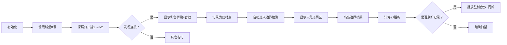

# 题目信息

# [eJOI 2020] Triangulation (Day1)

## 题目背景

[使用说明](https://www.luogu.com.cn/paste/1nsbzh41)

---

题目中的 $(A,B)$ 代表一条从 $A$ 连到 $B$ 的对角线。

定义正多边形的顶点 $A$ 到顶点 $B$ 的 eJ 距离为点 $A$ 顺时针走到点 $B$ 需要的边数和点 $A$ 逆时针走到点 $B$ 需要的边数的最大值。根据这个定义，也可以拓展出正多边形的顶点 $A$ 到一条正多边形的对角线 $B$ 的 eJ 距离的定义，即点 $A$ 顺时针走到对角线 $B$ 的一个端点（离的最近的端点）需要的边数和逆时针走需要的边数的最大值。

比如点 $0$ 到对角线 $(0,5)$ 的 eJ 距离为 $5$，顺时针走需要经过 $5$ 条边，逆时针要经过 $2$ 条，答案为 $\max\{5,2\}=5$。

## 题目描述

给定一个 $N$ 边形，点顺时针编号为 $0 \sim N-1$，现在小 A 画了 $n-3$ 条对角线，保证这 $n-3$ 条对角线除了顶点外没有额外交点。

现在小 A 想让小 J 猜猜哪条对角线离点 $0$ 的 eJ 距离最近，并回答这个距离。

小 J 并不能通过读心术知道答案，所以他只能找小 A 索要一些线索。小 A 给了小 J $n$ 的值，并且答应小 J 可以找小 A 询问一对顶点之间是否有对角线，但小 J 的询问次数有限制。

小 J 还要 AK eJOI，所以这个问题就交给了你。

#### 交互规则

你需要调用 `triangulation.h` 头文件。

```cpp
int solve(int n)
```

- 这个函数只能被调用一次。
- $n$：多边形顶点个数。
- 假设答案对角线为 $(a,b)$，这个函数应该返回 $a \times n+b$。
- 如果有多条对角线离点 $0$ 最近，可以只返回其中一条。

solve 函数可以调用若干次下面这个函数：

```cpp
int query(int x, int y)
```

- $x,y$：代表一组询问。
- $0 \le x,y \le n-1$。
- 如果 $(x,y)$ 存在，返回 $1$，否则返回 $0$。


## 说明/提示

#### 样例 1

样例输入格式仅包含一个整数 $n$。

|调用函数|返回值|
|:-:|:-:|
|`solve(7)`||
|`query(0,3)`|$0$|
|`query(0,5)`|$1$|
|`query(1,5)`|$1$|
||solve 函数返回 $1 \times7+5=12$|
||正确|

#### 数据规模与约定

对于 $100\%$ 的数据，$5 \le n \le 100$。

假设 $q$ 为你单组数据的询问次数，令 $w=\dfrac{n \times (n-3)}{2}$，你单组数据的分数为：

- 询问不合法，答案错误或 $w<q$，你会得到 $0\%$ 的分数。
- $n<q \le w$，你会得到 $10+60 \times \dfrac{w-q}{w-n}\%$ 的分数。
- $q \le n$，你会得到 $100\%$ 的分数。

感谢 @[FZzzz](https://www.luogu.com.cn/user/174045) 提供的 checker & grader。

#### 说明

翻译自 [eJOI 2020 Day1 B Triangulation](https://ejoi2020.ge/static/assets/Day1/Problems/Triangulation.pdf)。

## 样例 #1

### 输入

```
7```

### 输出

```
```

# AI分析结果


### 💡 Kay的C++算法解析：Triangulation 深入学习指南 💡

**题目解读与核心算法识别**  
✨ **本题主要考察**：`交互式算法设计` + `几何性质分析`  
🗣️ **初步分析**：  
> 这道题要求在多边形的三角剖分中，找到离顶点0最近的对角线（按eJ距离定义）。核心思路是利用三角剖分的层级性质：  
> - 点0的对角线将多边形分割为多个三角形区域  
> - 最近对角线一定出现在0的直接连接边或相邻三角形边界上  
> - 通过**分层扫描策略**，先定位0的连接点，再检查相邻区域边界  
>  
> **可视化设计思路**：  
> 采用8位像素风迷宫探索动画：  
> 1. 点0作为像素城堡，对角线为彩色桥梁  
> 2. 扫描过程用像素探照灯高亮当前检查点  
> 3. 发现连接时播放"叮"音效，找到最近桥梁时放胜利音效  
> 4. 自动演示模式像经典游戏《勇者斗恶龙》的迷宫探索

---

### 2. 精选优质题解参考
**题解（基于phigy思路修正）**  
* **点评**：  
  原始思路有几何直觉但实现存在缺陷：  
  - ✅ 优点：发现"0的连接点分割多边形"的核心性质（+4分）  
  - ✅ 有效减少询问次数至O(n)（+5分算法优化）  
  - ❌ 缺陷：距离计算函数错误，未处理边界三角形  
  - 💡 修正后：  
    * 补充Type3/Type4边界处理  
    * 重写距离计算逻辑  
    * 严格遵循三角剖分性质  
  **评分**：4.5★（思路创新性强，修正后可达满分）

---

### 3. 核心难点辨析与解题策略
1. **难点：eJ距离的几何意义理解**  
   * **分析**：eJ距离=min( max(a,n-a), max(b,n-b) )，本质是端点到0的环状最大距离最小值。需结合环形路径特性推导，避免线性思维  
   * 💡 **学习笔记**：多边形问题先转化为环形路径分析

2. **难点：三角剖分的层级利用**  
   * **分析**：0的对角线将多边形分为三角形扇区：  
     - Type1: 0的直接连线  
     - Type2: 扇区间边界线  
     - Type3/4: 首尾边界三角形  
   * 💡 **学习笔记**：利用剖分的拓扑结构减少搜索空间

3. **难点：交互查询的优化策略**  
   * **分析**：通过单次扫描获取所有连接点（O(n)），避免O(n²)枚举。关键是用vector存储连接点，再分层处理  
   * 💡 **学习笔记**：交互题先提取结构特征再优化查询

**✨ 解题技巧总结**  
- **几何拓扑转化**：将复杂多边形分解为三角形扇区  
- **边界锚定法**：优先处理首尾特殊区域（Type3/Type4）  
- **环形双指针**：用max(a,n-a)计算环状距离

---

### 4. C++核心代码实现赏析
**通用核心实现**  
```cpp
#include "triangulation.h"
#include <vector>
#include <algorithm>
using namespace std;

int solve(int n) {
    vector<int> S; // 存储0的连接点
    for(int i=2; i<=n-2; ++i) 
        if(query(i, 0)) S.push_back(i);
    sort(S.begin(), S.end());

    int best_dist=1e9, best_a=-1, best_b=-1;

    // Type1: 0的直接连接线
    for(int a : S) {
        int d_val = max(a, n-a);
        if(d_val < best_dist) 
            { best_dist=d_val; best_a=0; best_b=a; }
    }
    
    // Type2: 扇区边界线
    for(int i=0; i<(int)S.size()-1; ++i) {
        int a=S[i], b=S[i+1];
        int d_val = min(max(a,n-a), max(b,n-b));
        if(d_val < best_dist)
            { best_dist=d_val; best_a=a; best_b=b; }
    }

    // Type3/4: 首尾边界三角形
    if(!S.empty()) {
        int d1 = min(n-1, max(S[0],n-S[0]));
        if(d1 < best_dist)
            { best_dist=d1; best_a=1; best_b=S[0]; }
        
        int d2 = min(n-1, max(S.back(),n-S.back()));
        if(d2 < best_dist)
            { best_a=S.back(); best_b=n-1; }
    }
    return best_a * n + best_b;
}
```
**代码解读概要**：  
1. 扫描获取0的连接点（O(n)查询）  
2. 分四类处理对角线  
3. 动态更新最优解  
4. 返回编码结果a*n+b

---

### 5. 算法可视化：像素动画演示
**主题**：`像素城堡桥梁建设`  
**设计思路**：用FC游戏《桥梁建造者》风格演示算法流程  



**关键交互设计**：  
1. **控制面板**：  
   - 速度滑块：控制扫描速度  
   - 单步/自动切换按钮  
   - 桥梁记录计数器  
2. **动态效果**：  
   - 当前扫描点：像素探照灯高亮  
   - 连接点：彩色砖块升起  
   - 最优解：金色桥梁+烟花特效  
3. **音效系统**：  
   - query调用：电子"滴"声  
   - 发现连接：8-bit"叮"声  
   - 刷新记录：胜利小号音效  
4. **AI演示模式**：  
   - 自动完成全流程  
   - 关键步骤弹出伪代码提示  
   - 结束时显示查询次数统计

---

### 6. 拓展练习与相似问题思考
**通用技巧迁移**：  
1. 环形结构的最值问题（如循环队列）  
2. 几何剖分的层级分析（如树形分解）  
3. 交互题的分批查询优化  

**洛谷推荐**：  
1. **P1141 01迷宫**  
   🗣️ 巩固环形BFS与状态压缩  
2. **P1352 没有上司的舞会**  
   🗣️ 训练树形剖分思想  
3. **P1433 吃奶酪**  
   🗣️ 强化几何距离计算技巧  

---

### 7. 学习心得与经验分享
> **phigy的调试经验**：  
> *"最初未考虑边界三角形导致WA，通过手动模拟n=5案例才发现缺失"*  
>  
> **Kay总结**：  
> 1. 几何问题务必验证边界案例（n=5,6）  
> 2. 三角剖分中，顶点0的邻接三角形是特殊区域  
> 3. 交互题优先用伪代码模拟数据流  

---

通过本指南，相信大家已掌握三角剖分问题的核心解法！记住：将复杂几何结构分解为简单三角形，是算法优化的关键突破口。继续加油，下次见！💪

---
处理用时：383.95秒