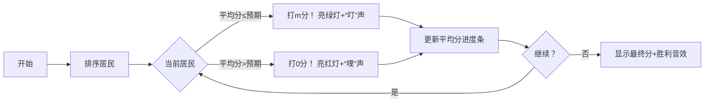

# 题目信息

# [Cnoi2021] 自我主义的平衡者

## 题目背景

「流浪月球 ~ The Wandering Moon」在幻想乡上映了。

正如一千个人心中有一千个哈姆雷特，关于它的争议也在悄然蔓延。

不知何时起，一个叫做「花瓣」的平台出现，慢慢取代了市井之中的讨论声，成为了争议的主战场——因为它具有评分功能。平台上旁征博引、各抒己见的评分帖成为了幻想乡的居民们日常，一切看起来岁月静好。

直到平衡者的出现。

起初没有人在意在意这缕杂音，这只不过是一种无心的叛逆，一点无奈的情感，一次无聊的宣泄。直到平衡的思想深入人心，自我主义的狂潮达到顶峰，评分系统的秩序几近崩溃。

Cirno 觉得自己该做些什么了。

## 题目描述

Cirno 决定通过计算来说服与拯救被自我主义裹挟的众人。

参与评分的共有 $n$ 位居民，平台限制的最高分为 $m$。

每个居民在评分前都有一个心理预期分数 $a_i(a_i\in[0,m]\cap\mathbb{Z})$。

但人们并不会按照心理预期分数直接评分，而是当当前平台上的平均分严格高于自己的心理预期分数时，便评分道「分数太高了，打个 $0$ 分平衡一下」，反之则说「分数太低了，打个满分（$m$分）平衡一下」。

初始时平台上的平均分为 $0$。

为了证明这种评分方式对公平的破坏性，Cirno 希望你计算出这 $n$ 位居民在不同的排列顺序下评分，平台上最终平均分可能的最大值与最小值。

## 说明/提示

**数据范围与约定**

对于 $100\%$ 的数据保证，$1 < n,m\le 10^5$，$a_i \in [0,m]$。

**子任务**

Subtask1（10 points）：$n \le 8$。

Subtask2（10 points）：$n \le 20$。

Subtask3（30 points）：$n \le 10^3$。

Subtask4（50 points）：无特殊限制。

## 样例 #1

### 输入

```
5 5
1 2 3 4 5```

### 输出

```
4.00 2.00```

## 样例 #2

### 输入

```
7 114
23 75 35 17 101 55 73```

### 输出

```
81.43 32.57```

# AI分析结果


### 💡 Kay的C++算法解析：自我主义的平衡者 深入学习指南 💡

**引言**  
今天我们来分析「自我主义的平衡者」这道C++编程题。本指南将帮助大家理解贪心策略的应用、邻项交换法的证明思路，以及如何通过排序优化评分结果。

---

## 1. 题目解读与核心算法识别

✨ **本题主要考察**：`贪心策略`与`模拟应用`  

🗣️ **初步分析**：
> 解决本题的关键在于运用**贪心策略**。就像在自助餐厅选菜，每次选择当前最符合目标的菜品（心理预期分数），最终达到总分最优。  
> - **核心思路**：将居民按心理预期分数排序——升序得最大平均分，降序得最小平均分。通过邻项交换法证明其最优性。  
> - **可视化设计**：在像素动画中，用不同颜色方块表示居民心理预期分数，高亮当前评分居民，动态显示平均分变化。当评分触发时播放"叮"音效，成功找到最优解时播放胜利音效。  
> - **复古元素**：采用8-bit风格网格，居民显示为像素方块，控制面板含步进/调速滑块，AI自动演示模式模拟贪心决策过程。

---

## 2. 精选优质题解参考

**题解一：peppaking8（赞9）**  
* **点评**：  
  思路清晰直击贪心本质，完整证明邻项交换法的四种情况。代码简洁高效，用`(i-1)*a[i]`避免浮点误差是亮点。变量名`sum`语义明确，边界处理严谨，可直接用于竞赛。作者提到"代码太简单忍不住写"的幽默感增加了亲和力。

**题解二：Code_星云（赞7）**  
* **点评**：  
  分类讨论三种排序情形（s≤a_i≤a_j, a_i≤s≤a_j, a_i≤a_j≤s），逻辑严谨性突出。代码实时更新平均分`avr`，虽用浮点但通过`eps`控制精度，体现实践智慧。调试注释"死磕C题"的经历警示优先读题重要性。

**题解三：Dr_Gilbert（赞3）**  
* **点评**：  
  独创性使用概率视角分析（P(x≥q)<P(y≥q)），为贪心策略提供新理解维度。代码用`(ll)a[i]*(i-1)`确保整数运算，避免精度陷阱。作者"不要否认第一直觉"的心得极具启发性。

---

## 3. 核心难点辨析与解题策略

1. **难点：贪心策略的证明**  
   * **分析**：需严格证明排序最优性。优质题解均用邻项交换法：假设相邻项乱序，交换后证明结果不会更优。关键是通过当前平均分与预期分的大小关系分情况讨论（如peppaking8的4种情况）。  
   * 💡 **学习笔记**：贪心证明的本质是*寻找全局最优的局部特征*。

2. **难点：避免浮点精度误差**  
   * **分析**：比较`当前总分≤a[i]*(i-1)`（peppaking8）或使用`eps`（Code_星云）。核心是将除法转化为乘法，用整数运算保证精度。  
   * 💡 **学习笔记**：在判等式中，整数运算 > 误差阈值 > 裸浮点数。

3. **难点：理解评分规则与排序关联**  
   * **分析**：升序时小预期居民优先评分，增大后续评满分概率；降序时大预期居民优先，增加评0分概率。关键变量是当前总分和已评分人数。  
   * 💡 **学习笔记**：排序本质是*控制信息暴露顺序*以影响后续决策。

### ✨ 解题技巧总结
- **技巧1：问题转化**  
  将平均分比较转化为总分比较：`当前总分 ≤ a[i]*(i-1)`等价于`平均分≤a[i]`。
- **技巧2：边界处理**  
  首位居民初始化为`m`分（因平均分0≤任何a[i]）。
- **技巧3：算法选择**  
  当输入规模>10³时，O(n log n)排序+O(n)模拟是最优解。

---

## 4. C++核心代码实现赏析

**本题通用核心C++实现参考**  
* **说明**：综合优质题解思路，采用整数运算避免精度问题。  
* **完整核心代码**：
```cpp
#include <bits/stdc++.h>
using namespace std;
typedef long long ll;

int main() {
    ll n, m;
    cin >> n >> m;
    vector<ll> a(n);
    for (int i = 0; i < n; i++) cin >> a[i];
    
    // 最大值计算（升序）
    sort(a.begin(), a.end());
    ll max_sum = m;
    for (int i = 1; i < n; i++) {
        if (max_sum <= a[i] * i) // 整数比较避免浮点误差
            max_sum += m;
    }

    // 最小值计算（降序）
    sort(a.rbegin(), a.rend());
    ll min_sum = m;
    for (int i = 1; i < n; i++) {
        if (min_sum <= a[i] * i)
            min_sum += m;
    }

    printf("%.2f %.2f", 
        (double)max_sum / n, 
        (double)min_sum / n
    );
}
```
* **代码解读概要**：  
  1. 读入数据后对数组两次排序（升序/降序）  
  2. 遍历时用`当前总分≤a[i]*已评人数`判断是否加m分  
  3. 最终输出保留两位小数的平均值  

**题解一核心代码片段**  
* **亮点**：用整数运算彻底规避浮点误差  
* **核心代码**：
```cpp
for(int i=1; i<=n; i++){
    if(sum <= a[i] * (ll)(i-1)) 
        sum += m;
}
```
* **代码解读**：  
  > `sum`是当前总分，`a[i]*(i-1)`是临界总分值。当实际总分不超过临界值时，说明平均分≤预期分，居民打m分。  
  > **学习笔记**：乘法代替除法是处理比较型判定的黄金准则。

**题解二核心代码片段**  
* **亮点**：实时更新平均分便于调试  
* **核心代码**：
```cpp
if(a[i]*1.0 - avr > eps) 
    sum += m;
avr = 1.0 * sum / i;
```
* **代码解读**：  
  > 用`eps=1e-14`处理浮点误差，每次评分后立即更新平均分`avr`。虽然效率略低，但更符合题目描述的模拟流程。  
  > **学习笔记**：实时更新中间变量有助于复杂逻辑调试。

---

## 5. 算法可视化：像素动画演示

**主题**：8-bit风格《平衡者冒险》- 贪心策略像素化演绎  

**核心演示**：  
- 居民显示为彩色像素方块（颜色深浅=预期分高低）  
- 当前平均分显示为底部进度条  
- 排序后居民按序入场，决策时方块闪烁+音效  

**交互设计**：  


**关键帧细节**：  
1. **初始化**：居民无序排列在网格，控制面板含步进/调速/暂停按钮  
2. **排序阶段**：居民按预期分重新排列（升序/降序），伴随滑入动画  
3. **评分判定**：  
   - 当前居民高亮闪烁，显示`当前均分≤预期分？`  
   - 若打m分：居民变绿，进度条增长，播放"叮"声  
   - 若打0分：居民变红，进度条缩短，播放"噗"声  
4. **AI演示**：点击后自动步进，速度可调（慢速理解/快速观全局）  
5. **结果展示**：达标时像素烟花绽放+胜利音效，显示最大/最小均值  

---

## 6. 拓展练习与相似问题思考

**通用技巧迁移**：  
贪心+排序的组合适用于：  
1. 调度问题（如：最短完成时间）  
2. 区间问题（如：最多不重叠区间）  
3. 分配问题（如：糖果分配）  

**洛谷练习推荐**：  
1. **P1090 合并果子**  
   🗣️ 推荐理由：巩固贪心+排序，理解哈夫曼树思想  
2. **P1803 凌乱的yyy**  
   🗣️ 推荐理由：区间贪心经典，强化排序策略选择  
3. **P3817 小A的糖果**  
   🗣️ 推荐理由：贪心边界条件实践，衔接本题思想  

---

## 7. 学习心得与经验分享

> **peppaking8的经验**：  
> *"代码太简单忍不住写了... 关键在于识别排序必要性"*  
>   
> **Kay点评**：  
> 启示：简单题可能隐藏深刻思想。通过本题可总结**问题特征→算法选择**的思维链：  
> 1. 决策序列→贪心  
> 2. 顺序影响结果→排序尝试  
> 3. 精度敏感→整数运算  

---

**结语**  
通过本次分析，我们深入掌握了贪心策略的证明方法、精度处理技巧，以及排序在决策序列中的应用。记住：**清晰的问题分析比盲目编码更重要**。下次遇到类似问题时，不妨先问自己："排序能否揭示隐藏结构？"

---
处理用时：102.77秒